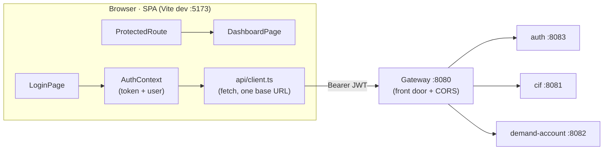

# Step 29 · Frontend pt.1 — React + TypeScript + Vite Foundations (login & routing)
### Phase F — Full-Stack Frontend 🔵 · Step 29 of 67 · 🎬 opens Phase F

> *The backend is done through Phase E; now the bank gets a face. Step 29 lays the **frontend foundations**: a
> **React + TypeScript + Vite** SPA that talks to the **gateway** (the single front door), with **client-side
> routing**, a **login/auth flow** against the auth service (the JWT you built in Step 16), and a **route
> guard**. We make the gateway genuinely the one front door (it now fronts `auth` too, with CORS), and we test
> the SPA with **Vitest + Testing Library**. This is a deliberate stack shift — JVM → Node/TypeScript.*

---

<a id="toc"></a>
## 🧭 The Six Movements of This Step

| | Movement | What happens |
|---|---|---|
| **A** | [🧭 Orient](#orient) | 30-second overview · skip-test · cheat card · why it matters · before you start |
| **B** | [🧠 Understand](#understand) | SPA + Vite/ESM · client-side routing · the auth flow (JWT, context, guard) · the gateway as front door |
| **C** | [🛠️ Build](#build) | scaffold Vite+React+TS · the API client · AuthContext · routes + guard · login page · gateway auth route + CORS · tests |
| **D** | [🔬 Prove](#prove) | the Verification Log — build/lint/test green; §12.3 break the guard; gateway CORS preflight; real output |
| **E** | [🎓 Apply](#apply) | go deeper · interview prep · your-turn challenges |
| **F** | [🏆 Review](#review) | troubleshooting (jsdom localStorage, CORS) · resources · recap, flashcards & what's next |

---

<a id="orient"></a>

# A · 🧭 Orient

## 📋 This Step in 30 Seconds

| | |
|---|---|
| **Title** | React + TypeScript + Vite foundations — routing, calling the gateway, and the login/auth flow |
| **Step** | 29 of 67 · **Phase F — Full-Stack Frontend** 🔵 · **opens Phase F** |
| **Effort** | ≈ 16 hours focused. A stack shift (JVM → Node/TS) + a new build tool (Vite) + the auth flow. |
| **What you'll run this step** | **Node 22 + npm** for the SPA (`npm install/build/lint/test` — no Docker). To see it live end-to-end you also run the **gateway + auth** (JVM); a real browser flow is the one thing the course's sandbox can't self-verify. |
| **Buildable artifact** | `frontend/` — a Vite + React 19 + TS SPA: a typed **API client** (base URL = the gateway), an **AuthContext** (JWT login/logout, persisted), **react-router** routes with a **`ProtectedRoute`** guard, a **LoginPage** + **DashboardPage**, and **Vitest + Testing Library** tests. Plus the **gateway** now fronts `auth` (`/api/auth/**`) with **CORS**. `step-29-start == step-28-end`. |
| **Verification tier** | 🔴 **Full** — a new app + a gateway (build) change. `npm run build` + `npm run lint` + `npm test` green; the gateway's new route + CORS tested; a §12.3 (break the guard → a test fails); full `./mvnw verify` still green; clean-room `npm ci`. |
| **Depends on** | **[Step 16](../step-16/lesson.md)** (the auth service / JWT login), **[Step 15](../step-15/lesson.md)** (the gateway), **[Step 18](../step-18/lesson.md)** (CORS posture). |

By the end you'll **scaffold a Vite React-TS app**, **route** client-side, implement a **JWT login flow** with a **route guard**, call an API through a typed client, and **test** components/routes with Vitest + Testing Library.

### ⏭️ Can You Skip This Step? (5-minute self-check)

If you can confidently do **all** of this, skim 🛠️ Build and jump to **[Step 30 — state, data & forms](../step-30/lesson.md)**.

- [ ] I can scaffold and explain a **Vite + React + TypeScript** project (dev server, build, why Vite is fast).
- [ ] I can set up **client-side routing** (public vs protected routes) and a **route guard**.
- [ ] I can implement a **JWT login flow**: call the API, store the token, attach it, expose auth via context.
- [ ] I can test a component and a route with **Vitest + Testing Library** (and mock the API).
- [ ] I can explain why the SPA talks to **one origin (the gateway)** and what **CORS** is doing.

> [!TIP]
> Not 100%? Stay. "Walk me through your auth flow on the frontend" and "how do you protect routes / store a JWT" are standard full-stack interview questions — you'll have built it.

## 📇 Cheat Card

> **What this step delivers (one sentence):** a React+TS SPA that logs in against the gateway-fronted auth service, stores the JWT, and guards routes — built and tested with Vite + Vitest.

**Key commands** (run in `frontend/`; or `npm --prefix frontend <script>`):

```bash
npm install            # one-time; writes package-lock.json (the version pin)
npm run dev            # Vite dev server on http://localhost:5173
npm run build          # tsc typecheck + vite production build → dist/
npm run lint           # ESLint (the SPA's quality gate)
npm test               # Vitest + Testing Library
bash steps/step-29/smoke.sh
```

**The headline — one origin, a guarded route, a JWT in context:**

```
  Browser (SPA :5173) ──fetch──> Gateway (:8080, single front door + CORS)
     LoginPage → AuthContext.login()  → POST /api/auth/login  → {token, expiresInSeconds}
     (token saved) → GET /api/auth/me → {username, roles}     → DashboardPage
     ProtectedRoute: no token? → <Navigate to="/login">
```

**The one sentence to remember:** *The SPA holds the JWT in an AuthContext (persisted), sends it to the gateway as `Authorization: Bearer …`, and a `ProtectedRoute` redirects anyone without a token to /login.*

## 🎯 Why This Matters

A backend without a UI is invisible to most stakeholders. The frontend is where auth, routing, and API integration become real — and "show me how you handle login and protected routes in React" is a near-universal full-stack interview question. Vite + TypeScript + Testing Library is the modern default stack, and wiring the SPA to a single gateway origin (with CORS) is exactly how real systems are structured.

## ✅ What You'll Be Able to Do

- Scaffold and build a Vite + React + TypeScript SPA.
- Implement client-side routing with a protected-route guard.
- Build a JWT login flow (typed API client + auth context + persistence).
- Test components and routes with Vitest + Testing Library.

## 🧰 Before You Start

- **Prereqs:** Node 22 + npm (`node -v`, `npm -v`). The bank's `auth` + `gateway` build green (`git describe` → `step-28-end`). No Docker for the SPA itself.
- **Connects to what you know:** the SPA calls the **auth** service (Step 16's JWT) through the **gateway** (Step 15); CORS echoes Step 18's deny-by-default posture.
- **Depends on:** Steps **16, 15, 18**.

---

<a id="understand"></a>

# B · 🧠 Understand

## 🧠 The Big Idea — a single-page app served by Vite, talking to one front door

A **single-page app (SPA)** loads one HTML shell + a JS bundle; **client-side routing** swaps views without full
page reloads, and data comes from API calls. **Vite** is the build tool: in dev it serves your source as native
**ES modules** (no bundling → near-instant start and hot updates); for production it bundles with Rollup/esbuild.
**TypeScript** gives you types across the whole app (the API responses, the auth state) — the frontend
counterpart to the type-safety you rely on in Java.

The SPA talks to **one origin — the gateway** (Step 15), which routes to `auth`, `cif`, and `demand-account`
behind it. One origin means one base URL and one CORS policy, instead of the browser juggling four.



## 🧩 Pattern Spotlight — the auth flow (context + guard)

1. **LoginPage** collects credentials and calls `AuthContext.login()`.
2. **AuthContext** calls `POST /api/auth/login` → gets `{token, expiresInSeconds}`, saves the token
   (`localStorage`, so a refresh stays signed in), then `GET /api/auth/me` for the username/roles.
3. **ProtectedRoute** reads `isAuthenticated` from context; no token → `<Navigate to="/login" replace />`.
4. Authenticated API calls attach `Authorization: Bearer <token>`.

Context is React's built-in dependency injection — one provider at the top, any component reads it via the
`useAuth()` hook. (This is the same "depend on an abstraction, inject it" idea as Spring's DI.)

## 🌱 Under the Hood: why the gateway needed two changes

The gateway already routed `/cif/**` and `/bank/**`, but **not** auth — and had **no CORS**. For the SPA we
added:
- an **`auth` route**: `Path=/api/auth/**` → the auth service, with **no `StripPrefix`** (auth's own paths
  already start with `/api/auth`, so stripping would break them);
- a **`CorsFilter`** (deny-by-default, `app.security.cors.allowed-origins`) so the browser's preflight from
  `http://localhost:5173` is answered with `Access-Control-Allow-Origin` (and any other origin gets 403).

## 🛡️ Security Lens: where do you put a JWT?

We store the JWT in `localStorage` — simplest to teach, but **readable by any script on the page, so it's
exposed to XSS**. The hardened alternatives (an **httpOnly cookie** the JS can't read, or an **in-memory** access
token + a refresh-token rotation) come in **Step 32**. The CORS allow-list is **deny-by-default** (Step 18): only
the origins you name can call the gateway from a browser.

## 🕰️ Then vs. Now

- **Build tooling:** Create-React-App (Webpack, slow) → **Vite** (native ESM in dev, esbuild/Rollup for prod).
- **Routing:** react-router's APIs evolved; v7 uses `<Routes>/<Route>` (and data routers) — we use the simple
  declarative form for foundations.
- **React:** function components + hooks (since 16.8); React 19 adds more, but the foundations here are stable.
- **Testing:** Enzyme → **Testing Library** (test what the user sees/does, not internals) + **Vitest** (Vite-native,
  Jest-compatible API).

---

# B→C bridge: 🌳 files we'll touch

```
frontend/
  package.json · tsconfig.json · vite.config.ts · eslint.config.js · index.html · .env.example
  src/
    main.tsx                  BrowserRouter → AuthProvider → App
    App.tsx                   the route table (/login public, / protected)
    api/client.ts             typed fetch wrapper (one base URL = the gateway) + login/getCurrentUser
    auth/AuthContext.tsx      JWT state, login()/logout(), useAuth() — persisted in localStorage
    auth/ProtectedRoute.tsx   redirect to /login when unauthenticated
    pages/LoginPage.tsx       the sign-in form
    pages/DashboardPage.tsx   the protected landing page (greets the user)
    test/setup.ts             jest-dom matchers + a localStorage shim
    **/*.test.ts(x)           Vitest + Testing Library
gateway/  (+ auth route /api/auth/**, + GatewayCorsConfig CorsFilter)
```

<a id="build"></a>

# C · 🛠️ Let's Build It — Step by Step

## 📦 Your Starting Point

`step-29-start == step-28-end`. The backend is complete through Phase E. There is no `frontend/` yet; the gateway fronts cif + demand-account but not auth.

## Sub-step 1 — scaffold Vite + React + TypeScript

🎯 Create `frontend/` with `package.json` (React 19, react-router-dom 7; dev-deps Vite 6, Vitest, Testing Library, ESLint 9, typescript-eslint), `tsconfig.json` (strict), `vite.config.ts` (React plugin + Vitest jsdom), `index.html`, `eslint.config.js`. Then `npm install` (writes `package-lock.json` — the real version pin; `npm ci` reproduces it).

🔮 **Predict:** why does `npm install` commit a `package-lock.json` even though `package.json` already lists versions? <details><summary>Answer</summary>`package.json` uses ranges (`^19.1.0`); the **lockfile pins the exact resolved versions of the whole tree** (incl. transitive deps) so every machine + CI builds identical bits. "Pinned, never latest" (§12.6) = commit the lockfile.</details>

## Sub-step 2 — the typed API client (one base URL = the gateway)

🎯 `src/api/client.ts`: a `fetch` wrapper using `VITE_API_BASE_URL` (default the gateway `:8080`), with `login(username,password) → {token, expiresInSeconds}` and `getCurrentUser(token) → {username, roles}` — matched exactly to the auth contract. Throws `ApiError(status)` on non-OK.

## Sub-step 3 — AuthContext + the route guard

🎯 `src/auth/AuthContext.tsx`: holds `token`+`user`, `login()` (calls the API, persists the token in `localStorage`, fetches `/me`), `logout()`, and a `useAuth()` hook. `src/auth/ProtectedRoute.tsx`: `if (!isAuthenticated) return <Navigate to="/login" replace/>`.

## Sub-step 4 — pages + the route table

🎯 `LoginPage` (controlled form → `login()` → `navigate('/')`, shows an error on failure), `DashboardPage` (greets `user.username`/roles, logout button). `App.tsx` wires `/login` (public), `/` (protected), `*` → home. `main.tsx`: `BrowserRouter → AuthProvider → App`.

## Sub-step 5 — make the gateway the single front door

🎯 Add the `auth` route (`/api/auth/**`, no StripPrefix) to `gateway/application.yml` and a `GatewayCorsConfig` `CorsFilter` (deny-by-default, `app.security.cors.allowed-origins`, dev default `http://localhost:5173`). Extend `GatewayRoutingTest`: auth routes without stripping; an allowed-origin preflight gets `Access-Control-Allow-Origin`; a disallowed origin gets 403.

## Sub-step 6 — test the SPA (Vitest + Testing Library)

🎯 `client.test.ts` (stub `fetch` → assert request shape), `LoginPage.test.tsx` (mock `api/client` → assert form wiring + error UX), `ProtectedRoute.test.tsx` (drive auth via `localStorage` → redirect vs render).

⚠️ **Pitfall (we hit it):** jsdom's `localStorage` getter throws for an opaque origin, so Vitest leaves the global `undefined` (and your app breaks in tests). Fix: install a tiny in-memory `localStorage` in `src/test/setup.ts`.

🔬 **Break-it (the §12.3 proof):** disable the guard (`if (false && !isAuthenticated)`) → the "redirects to /login" test fails (it renders the protected content). Put it back.

💾 **Commit:** `feat(frontend): Step 29 React+TS+Vite SPA — login/auth flow + routing; gateway fronts auth + CORS`

## 🎮 Play With It

```bash
# Terminal 1 — backend (the SPA's front door + auth). From the repo root:
APP_CORS_ALLOWED_ORIGINS=http://localhost:5173 ./mvnw -pl services/auth spring-boot:run   # :8083
./mvnw -pl gateway spring-boot:run                                                          # :8080 (new shell)
# Terminal 2 — the SPA:
npm --prefix frontend run dev      # open http://localhost:5173 → sign in as alice / password
```

🧪 **Little experiments:** sign in as `alice`/`password` then `admin`/`admin123` — the dashboard shows different roles. Open DevTools → Application → Local Storage: see `bab.token`. Delete it, refresh: you're bounced to `/login` (the guard). Stop the gateway and try to log in: the error message appears.

> [!NOTE]
> The **live browser** flow is the one thing this course's sandbox can't self-verify (no browser). Everything else — build, lint, the component/route tests, and the gateway's CORS preflight — is verified with real output below (§12.8 honesty).

## 🏁 The Finished Result

`step-29-end`: a working React+TS SPA with login, routing, and a guard, talking to the gateway; the gateway is the single front door (auth + CORS). **✅ Definition of Done:** `npm run build`, `npm run lint`, `npm test` green; the gateway tests pass; `./mvnw verify` green; `bash steps/step-29/smoke.sh` passes; committed/tagged `step-29-end`.

---

<a id="prove"></a>

# D · 🔬 Prove It Works — Verification Log

> **Tier: 🔴 Full** (new app + gateway/build change). Real pasted output. The SPA needs no Docker; the full
> `./mvnw verify` does (existing integration tests). A live *browser* flow is verify-adjacent (§12.8).

**1 · `npm install` — reproducible deps (lockfile committed):**

```
added 289 packages, and audited 290 packages in 2m
found 0 vulnerabilities
```

**2 · `npm run build` — TypeScript typecheck + Vite production build:**

```
> tsc && vite build
vite v6.4.3 building for production...
✓ 46 modules transformed.
dist/index.html                   0.40 kB
dist/assets/index-*.css           0.60 kB
dist/assets/index-*.js          234.72 kB │ gzip: 75.15 kB
✓ built in 931ms
```

**3 · `npm test` — Vitest + Testing Library (7 tests, no Docker):**

```
✓ src/api/client.test.ts (3 tests)
✓ src/auth/ProtectedRoute.test.tsx (2 tests)
✓ src/pages/LoginPage.test.tsx (2 tests)
 Test Files  3 passed (3)
      Tests  7 passed (7)
```

**4 · `npm run lint` — the SPA's quality gate:**

```
✖ 1 problem (0 errors, 1 warning)   # react-refresh DX hint on AuthContext.tsx — benign; lint exits 0
```

**5 · Gateway — the new auth route + CORS (headless, no Docker):**

```
[INFO] Tests run: 4, Failures: 0, Errors: 0, Skipped: 0 -- in com.buildabank.gateway.GatewayRoutingTest
```
covering: routes-to-downstream (StripPrefix), **routes `/api/auth/me` WITHOUT stripping**, **CORS preflight from
`http://localhost:5173` → `Access-Control-Allow-Origin: http://localhost:5173`**, and **a disallowed origin → 403**.

**6 · §12.3 Mutation sanity-check — prove the guard test means something.** Disabled the guard
(`if (false && !isAuthenticated)`) and re-ran:

```
× ProtectedRoute > redirects to /login when there is no token
  → Unable to find an element with the text: Login page    [rendered "Secret area" instead]
 Tests  1 failed | 6 passed (7)
```
→ With the guard off, the protected content rendered for an unauthenticated user — the test caught it. **Reverted** → 7/7 green.

**7 · `smoke.sh`** — `bash steps/step-29/smoke.sh` runs the SPA build + lint + tests and the gateway route/CORS test → `✅ Step 29 smoke test PASSED`.

**8 · Build** — full-repo `./mvnw verify` → BUILD SUCCESS (14 modules; gateway change included; quality gates green). Clean-room: fresh clone + `npm ci` + build + test green.

**§12.8 honesty:** the **live browser** cross-origin flow can't run in this sandbox (no browser) — verified instead by the headless CORS preflight test + the component/route tests. The JWT lives in `localStorage` (XSS-exposed) — a teaching simplification hardened in Step 32. One benign ESLint `react-refresh` warning remains (DX-only; lint exits 0).

---

<a id="apply"></a>

# E · 🎓 Apply

## 🚀 Go Deeper (Optional)

<details><summary>Why is Vite's dev server so fast?</summary>In dev it doesn't bundle — it serves your source as native ES modules and lets the browser request them on demand, transpiling each file with esbuild (Go, very fast). Only what's imported is processed; HMR swaps a single module. Production still bundles (Rollup) for fewer requests + tree-shaking.</details>

<details><summary>localStorage vs httpOnly cookie vs in-memory for the JWT</summary>localStorage: survives refresh, simple — but any injected script can read it (XSS). httpOnly cookie: JS can't read it (XSS-safe for the token) but you must defend CSRF and set SameSite. In-memory: safest from XSS exfiltration but lost on refresh → pair with a refresh-token rotation. Step 32 implements refresh + guards; the choice is a real trade-off, not a default.</details>

<details><summary>Why one origin (the gateway) instead of calling each service?</summary>One base URL, one CORS policy, one place for cross-cutting concerns (auth, rate limits, headers). The browser otherwise needs a CORS handshake with every service. This is the BFF/API-gateway pattern (Step 15) paying off for the UI.</details>

## 💼 Interview Prep

1. **Walk me through your frontend auth flow.** *Login posts credentials → JWT; store it (localStorage here, with the XSS caveat); expose auth via context; attach `Bearer` to API calls; a ProtectedRoute redirects unauthenticated users. /me resolves the current user.* **(Common.)**
2. **How do you protect a route in React Router?** *A guard component reads auth state from context and either renders the children or `<Navigate to="/login" replace/>`. `replace` so Back doesn't re-enter the guard.*
3. **Where do you store a JWT and why?** *Trade-off: localStorage (simple, XSS-exposed) vs httpOnly cookie (XSS-safe, CSRF to handle) vs in-memory + refresh token (safest, lost on refresh). State the threat model.*
4. **What is CORS and why did the gateway need it?** *Browsers block cross-origin requests unless the server opts in via `Access-Control-Allow-Origin`. The SPA (:5173) and gateway (:8080) are different origins, so the gateway must allow the SPA's origin (deny-by-default).*
5. **(Gotcha) Why does Vite commit a lockfile if package.json has versions?** *package.json has ranges; the lockfile pins exact resolved versions of the whole tree for reproducible `npm ci`.*

## 🏋️ Your Turn: Practice & Challenges

- **Quick:** add a `roles` check to `ProtectedRoute` (a `requiredRole` prop) and a test that a USER is redirected from an admin-only route.
- **Quick:** add a `client.test.ts` case asserting `getCurrentUser` throws `ApiError(401)` on an expired token.
- 🎯 **Stretch (reference solution in `solutions/step-29/`):** add an Axios-free request interceptor that auto-attaches the token from `AuthContext` to every call (so pages don't pass it manually), with a test that the header is present.

---

<a id="review"></a>

# F · 🏆 Review

## 🩺 Stuck? Troubleshooting & Fixes

- **Tests fail with `Cannot read properties of undefined (reading 'clear')` / `localStorage is not defined`.** jsdom's localStorage getter throws for an opaque origin → Vitest leaves the global undefined. Install an in-memory `localStorage` in `src/test/setup.ts` (this lesson does).
- **Browser console: `... has been blocked by CORS policy`.** The gateway isn't allowing your origin. Start it with `APP_CORS_ALLOWED_ORIGINS=http://localhost:5173` (or check `GatewayCorsConfig`).
- **Login returns 404 at the gateway.** The gateway needs the `auth` route (`/api/auth/**`, no StripPrefix) — and the auth service must be running on :8083.
- **`npm run build` fails on a type error.** That's `tsc` doing its job — fix the type; the build won't ship broken types.
- **ESLint `react-refresh` warning on AuthContext.** Benign (DX-only); lint still exits 0. Split the hook into its own file if you want it gone.
- **Reset:** `git checkout step-29-end` then `npm --prefix frontend ci`.

## 📚 Learn More & Glossary

- Vite guide; React docs (you-might-not-need-an-effect, hooks); React Router docs; Testing Library (guiding principles); Vitest docs; MDN on CORS and Web Storage.
- **Glossary:** *SPA*, *Vite / ESM dev server*, *client-side routing*, *route guard*, *React context*, *JWT / Bearer*, *CORS / preflight*, *Vitest / jsdom*, *Testing Library*, *lockfile / `npm ci`*.

## 🏆 Recap & Study Notes

**(a) Key points:** A **Vite + React + TypeScript** SPA with **client-side routing** and a **JWT login flow**:
`LoginPage` → `AuthContext.login()` → the gateway's `/api/auth/login` → store the token → `/me` →
`DashboardPage`; a **`ProtectedRoute`** redirects unauthenticated users. The SPA talks to **one origin — the
gateway**, which we extended to front `auth` (no StripPrefix) with **deny-by-default CORS**. Tested with
**Vitest + Testing Library** (API mocked; MSW in Step 31). The JWT in `localStorage` is a teaching simplification
(XSS-exposed), hardened in Step 32.

**(b) Key terms:** SPA, Vite, ESM dev server, client-side routing, route guard, React context, JWT/Bearer, CORS/preflight, Vitest, Testing Library, lockfile.

**(c) 🧠 Test Yourself:** ① Why is Vite's dev server fast? ② How does ProtectedRoute work? ③ Where do you store a JWT and the trade-off? ④ Why does the SPA use one origin? ⑤ How did you prove the guard test is meaningful? <details><summary>Answers</summary>① Native ESM in dev (no bundling), esbuild transpile, per-module HMR. ② Reads auth from context; renders children or `<Navigate to="/login" replace/>`. ③ localStorage (simple, XSS-exposed) vs httpOnly cookie vs in-memory+refresh — threat-model-dependent. ④ One base URL + one CORS policy + cross-cutting concerns at the gateway. ⑤ Disabled the guard → the redirect test failed (rendered protected content) → reverted.</details>

**(d) 🔗 How this connects:** consumes the **auth** (16) + **gateway** (15) backend with the **CORS** posture from 18. **Next: Step 30** — TanStack Query (data fetching/caching), React Hook Form + Zod (forms/validation), and live WebSocket updates; then Step 31 (Playwright E2E + MSW + a11y/i18n) and Step 32 (token refresh, bundling, Dockerize + serve via the gateway).

**(e) 🏆 Résumé line:** *"Built a React + TypeScript (Vite) SPA with a JWT login flow, protected routing, and a typed API client against a Spring Cloud Gateway front door — tested with Vitest + Testing Library."*

**(f) ✅ You can now:** scaffold a Vite React-TS app · route client-side with a guard · implement a JWT login flow · test components/routes · reason about CORS and token storage.

**(g) 🃏 Flashcards** appended to `docs/flashcards.md` · 🔁 revisit token storage at Step 32 (hardening) and CORS whenever you add an origin.

**(h) ✍️ One-line reflection:** *Which part of the auth flow would break first under XSS — and what would Step 32's hardening change?*

**(i)** 🎉 The bank has a face. Next: real data, forms, and live updates.
