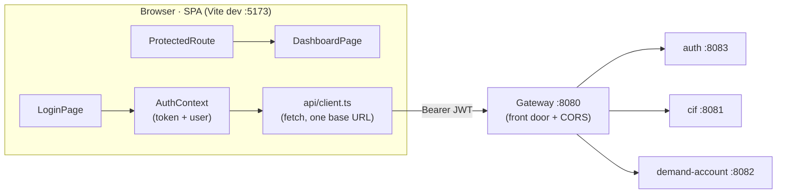
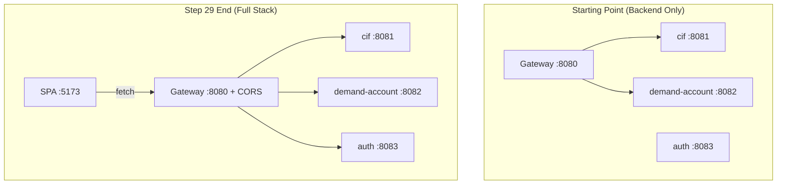
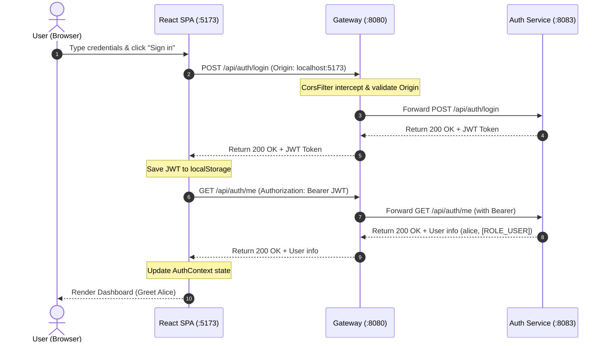

# Step 29 · Frontend pt.1 — React + TypeScript + Vite Foundations (login & routing)
### Phase F — Full-Stack Frontend 🔵 · Step 29 of 67 · 🎬 opens Phase F

> *The backend is done through Phase E; now the bank gets a face. Step 29 lays the **frontend foundations**: a
> **React + TypeScript + Vite** SPA that talks to the **gateway** (the single front door), with **client-side
> routing**, a **login/auth flow** against the auth service (the JWT you built in Step 16), and a **route
> guard**. We make the gateway genuinely the one front door (it now fronts `auth` too, with CORS), and we test
> the SPA with **Vitest + Testing Library**. This is a deliberate stack shift — JVM → Node/TypeScript.*

---

<a id="toc"></a>
## 🧭 The Six Movements of This Step

A one-line map of where we're going. Click to jump. (~times sum to the step's ≈ 16 h.)

1. **[A · 🧭 Orient](#orient)** — what the React+TS foundations are, why a gateway-fronted auth flow matters, the cheat card, and whether you can skip. *(~30 min)*
2. **[B · 🧠 Understand](#understand)** — the SPA mental model, Vite's native ESM dev server, client-side routing, the JWT auth context, and gateway CORS. *(~1.5 h)*
3. **[C · 🛠️ Build](#build)** — the heart: scaffolding Vite+React+TS configuration → typed API client → AuthContext → ProtectedRoute guard → LoginPage + DashboardPage → gateway auth route + CorsFilter → Vitest component and route tests. *(~11 h)*
4. **[D · 🔬 Prove](#prove)** — the Verification Log (🔴 Full tier): the real, pasted build, lint, and test outputs, the gateway CORS preflights, and the mutation check. *(~1 h)*
5. **[E · 🎓 Apply](#apply)** — go-deeper asides (Vite performance, JWT storage threat model), interview prep, and your-turn exercises. *(~1.5 h)*
6. **[F · 🏆 Review](#review)** — troubleshooting (jsdom localStorage, CORS blocks), resources & glossary, and the recap/study notes. *(~30 min)*

---

<a id="orient"></a>

# A · 🧭 Orient

## 📋 This Step in 30 Seconds

| | |
|---|---|
| **Title** | React + TypeScript + Vite foundations — routing, calling the gateway, and the login/auth flow |
| **Step** | 29 of 67 · **Phase F — Full-Stack Frontend** 🔵 · **opens Phase F** |
| **Effort** | ≈ 16 hours focused. A stack shift (JVM → Node/TS) + a new build tool (Vite) + the auth flow. |
| **What you'll run this step** | **Node 22 + npm** for the SPA (`npm install/build/lint/test` — no Docker). To see it live end-to-end you also run the **gateway + auth** (JVM); a real browser flow is the one thing the course's sandbox can't self-verify. |
| **Buildable artifact** | `frontend/` — a Vite + React 19 + TS SPA: a typed **API client** (base URL = the gateway), an **AuthContext** (JWT login/logout, persisted), **react-router** routes with a **`ProtectedRoute`** guard, a **LoginPage** + **DashboardPage**, and **Vitest + Testing Library** tests. Plus the **gateway** now fronts `auth` (`/api/auth/**`) with **CORS**. `step-29-start == step-28-end`. |
| **Verification tier** | 🔴 **Full** — a new app + a gateway (build) change. `npm run build` + `npm run lint` + `npm test` green; the gateway's new route + CORS tested; a §12.3 (break the guard → a test fails); full `./mvnw verify` still green; clean-room `npm ci`. |
| **Depends on** | **[Step 16](../step-16/lesson.md)** (the auth service / JWT login), **[Step 15](../step-15/lesson.md)** (the gateway), **[Step 18](../step-18/lesson.md)** (CORS posture). |

By the end you'll **scaffold a Vite React-TS app**, **route** client-side, implement a **JWT login flow** with a **route guard**, call an API through a typed client, and **test** components/routes with Vitest + Testing Library.

### ⏭️ Can You Skip This Step? (5-minute self-check)

Run this self-check. If you can confidently do **all** of this, skim 🛠️ Build and jump to **[Step 30 — state, data & forms](../step-30/lesson.md)**.

- [ ] I can scaffold and explain a **Vite + React + TypeScript** project (dev server, build, why Vite is fast).
- [ ] I can set up **client-side routing** (public vs protected routes) and a **route guard**.
- [ ] I can implement a **JWT login flow**: call the API, store the token, attach it, expose auth via context.
- [ ] I can test a component and a route with **Vitest + Testing Library** (and mock the API).
- [ ] I can explain why the SPA talks to **one origin (the gateway)** and what **CORS** is doing.

> [!TIP]
> Not 100%? Stay. "Walk me through your auth flow on the frontend" and "how do you protect routes / store a JWT" are standard full-stack interview questions — you'll have built it.

## 📇 Cheat Card

> **What this step delivers (one sentence):** a React+TS SPA that logs in against the gateway-fronted auth service, stores the JWT, and guards routes — built and tested with Vite + Vitest.

**Key commands** (run in `frontend/`; or `npm --prefix frontend <script>`):

```bash
npm install            # one-time; writes package-lock.json (the version pin)
npm run dev            # Vite dev server on http://localhost:5173
npm run build          # tsc typecheck + vite production build → dist/
npm run lint           # ESLint (the SPA's quality gate)
npm test               # Vitest + Testing Library
bash steps/step-29/smoke.sh
```

**The headline — one origin, a guarded route, a JWT in context:**

```
  Browser (SPA :5173) ──fetch──> Gateway (:8080, single front door + CORS)
     LoginPage → AuthContext.login()  → POST /api/auth/login  → {token, expiresInSeconds}
     (token saved) → GET /api/auth/me → {username, roles}     → DashboardPage
     ProtectedRoute: no token? → <Navigate to="/login">
```

**The one sentence to remember:** *The SPA holds the JWT in an AuthContext (persisted), sends it to the gateway as `Authorization: Bearer …`, and a `ProtectedRoute` redirects anyone without a token to /login.*

## 🎯 Why This Matters

A backend without a UI is invisible to most stakeholders. The frontend is where auth, routing, and API integration become real — and "show me how you handle login and protected routes in React" is a near-universal full-stack interview question. Vite + TypeScript + Testing Library is the modern default stack, and wiring the SPA to a single gateway origin (with CORS) is exactly how real systems are structured.

## ✅ What You'll Be Able to Do

- Scaffold and build a Vite + React + TypeScript SPA.
- Implement client-side routing with a protected-route guard.
- Build a JWT login flow (typed API client + auth context + persistence).
- Test components and routes with Vitest + Testing Library.

## 🧰 Before You Start

- **Prereqs:** Node 22 + npm (`node -v`, `npm -v`). The bank's `auth` + `gateway` build green (`git describe` → `step-28-end`). No Docker for the SPA itself.
- **Connects to what you know:** the SPA calls the **auth** service (Step 16's JWT) through the **gateway** (Step 15); CORS echoes Step 18's deny-by-default posture.
- **Depends on:** Steps **16, 15, 18**.

## 🗓️ Session Plan

≈ 16 hours is **seven sittings**, not one heroic weekend. Each sitting ends at a real ✋ checkpoint or section boundary you can resume from cold — the re-entry line there tells you what you have and what to open next.

| Sitting | Covers | ~time | Ends at |
|---|---|---|---|
| **S1** | A · Orient + B · Understand (SPA, Vite/ESM, the auth flow, gateway CORS) | ~2 h | the B→C bridge (the 🌳 files tree) |
| **S2** | Sub-steps **1–2 of 6** — Scaffold Vite + React + TypeScript · The Typed API Client | ~2.5 h | ✋ end of sub-step 2 |
| **S3** | Sub-step **3 of 6** — AuthContext + The Route Guard | ~2 h | ✋ end of sub-step 3 |
| **S4** | Sub-step **4 of 6** — Pages and the Route Table | ~2 h | ✋ end of sub-step 4 |
| **S5** | Sub-step **5 of 6** — Make the Gateway the Single Front Door (auth route + CORS) | ~2.5 h | ✋ end of sub-step 5 |
| **S6** | Sub-step **6 of 6** — Test the SPA (Vitest + Testing Library) + 🔁 End-to-End System Flow + 🎮 Play With It | ~2 h | 🎮 Play With It (end of movement C) |
| **S7** | D · Prove (the Verification Log) + E · Apply + F · Review | ~3 h | `step-29-end` 🎉 |

**Optional routes:** the ⏭️ skip-test (5 min) can send you straight to Step 30; the three 🚀 Go Deeper asides are **+~5 min each**; the two Quick your-turn exercises are **+~15 min each**; the 🎯 Stretch challenge is **+~45 min** — none of them block the sittings above.

---

<a id="understand"></a>

# B · 🧠 Understand

## 🧠 The Big Idea — a single-page app served by Vite, talking to one front door

A **single-page app (SPA)** loads one HTML shell + a JS bundle; **client-side routing** swaps views without full
page reloads, and data comes from API calls. **Vite** is the build tool: in dev it serves your source as native
**ES modules** (no bundling → near-instant start and hot updates); for production it bundles with Rollup/esbuild.
**TypeScript** gives you types across the whole app (the API responses, the auth state) — the frontend
counterpart to the type-safety you rely on in Java.

The SPA talks to **one origin — the gateway** (Step 15), which routes to `auth`, `cif`, and `demand-account`
behind it. One origin means one base URL and one CORS policy, instead of the browser juggling four.



## 🧩 Pattern Spotlight — the auth flow (context + guard)

1. **LoginPage** collects credentials and calls `AuthContext.login()`.
2. **AuthContext** calls `POST /api/auth/login` → gets `{token, expiresInSeconds}`, saves the token
   (`localStorage`, so a refresh stays signed in), then `GET /api/auth/me` for the username/roles.
3. **ProtectedRoute** reads `isAuthenticated` from context; no token → `<Navigate to="/login" replace />`.
4. Authenticated API calls attach `Authorization: Bearer <token>`.

Context is React's built-in dependency injection — one provider at the top, any component reads it via the
`useAuth()` hook. (This is the same "depend on an abstraction, inject it" idea as Spring's DI.)

## 🌱 Under the Hood: why the gateway needed two changes

The gateway already routed `/cif/**` and `/bank/**`, but **not** auth — and had **no CORS**. For the SPA we
added:
- an **`auth` route**: `Path=/api/auth/**` → the auth service, with **no `StripPrefix`** (auth's own paths
  already start with `/api/auth`, so stripping would break them);
- a **`CorsFilter`** (deny-by-default, `app.security.cors.allowed-origins`) so the browser's preflight from
  `http://localhost:5173` is answered with `Access-Control-Allow-Origin` (and any other origin gets 403).

❓ **Knowledge check:** the SPA never calls `auth`, `cif`, or `demand-account` directly — why does routing everything through the gateway make CORS (and auth) simpler? <details><summary>Answer</summary>The browser only ever talks to **one origin**, so there's **one base URL and one CORS allow-list** at the front door instead of a policy per service — and the gateway is the single place to attach cross-cutting concerns. Any origin not on the deny-by-default list is rejected before the backend services ever see the request.</details>

## 🛡️ Security Lens: where do you put a JWT?

We store the JWT in `localStorage` — simplest to teach, but **readable by any script on the page, so it's
exposed to XSS**. The hardened alternatives (an **httpOnly cookie** the JS can't read, or an **in-memory** access
token + a refresh-token rotation) come in **Step 32**. The CORS allow-list is **deny-by-default** (Step 18): only
the origins you name can call the gateway from a browser.

## 🕰️ Then vs. Now

- **Build tooling:** Create-React-App (Webpack, slow) → **Vite** (native ESM in dev, esbuild/Rollup for prod).
- **Routing:** react-router's APIs evolved; v7 uses `<Routes>/<Route>` (and data routers) — we use the simple
  declarative form for foundations.
- **React:** function components + hooks (since 16.8); React 19 adds more, but the foundations here are stable.
- **Testing:** Enzyme → **Testing Library** (test what the user sees/does, not internals) + **Vitest** (Vite-native,
  Jest-compatible API).

---

# B→C bridge: 🌳 files we'll touch

```
frontend/
├── .env.example
├── .gitignore
├── eslint.config.js
├── index.html
├── package.json
├── tsconfig.json
├── vite.config.ts
└── src/
    ├── App.tsx
    ├── index.css
    ├── main.tsx
    ├── vite-env.d.ts
    ├── api/
    │   ├── client.ts
    │   └── client.test.ts
    ├── auth/
    │   ├── AuthContext.tsx
    │   ├── ProtectedRoute.tsx
    │   └── ProtectedRoute.test.tsx
    ├── pages/
    │   ├── DashboardPage.tsx
    │   ├── LoginPage.tsx
    │   └── LoginPage.test.tsx
    └── test/
        └── setup.ts
gateway/
├── src/main/java/com/buildabank/gateway/GatewayCorsConfig.java
├── src/main/resources/application.yml
└── src/test/java/com/buildabank/gateway/GatewayRoutingTest.java
```

> ✋ **End of sitting S1.** Stopping here? You have the mental model (SPA → one origin → CORS) and this file
> map — no code yet. Next: **Sub-step 1 of 6 (Scaffold Vite + React + TypeScript)**; first action: create
> `frontend/package.json`.

<a id="build"></a>

# C · 🛠️ Let's Build It — Step by Step

## 📦 Your Starting Point

`step-29-start == step-28-end`. The backend is complete through Phase E. There is no `frontend/` yet; the gateway fronts `cif` + `demand-account` but not `auth`.



---

### Sub-step 1 of 6 — Scaffold Vite + React + TypeScript (~1.5 h) 🧭 *(you are here: **scaffold** → API client → AuthContext → routes → gateway → tests)*

🎯 **Goal:** Scaffold the frontend root files under a new `frontend/` folder containing the dependencies, TS compiler configuration, ESLint quality gate, dev-server settings, base HTML file, and the application bootstrap entry point.

📁 **Locations:** 
- `frontend/package.json`
- `frontend/vite.config.ts`
- `frontend/tsconfig.json`
- `frontend/eslint.config.js`
- `frontend/index.html`
- `frontend/.env.example`
- `frontend/.gitignore`
- `frontend/src/vite-env.d.ts`
- `frontend/src/index.css`
- `frontend/src/main.tsx`

⌨️ **Code:**

```json
// frontend/package.json
{
  "name": "build-a-bank-frontend",
  "private": true,
  "version": "0.1.0",
  "type": "module",
  "description": "Build-a-Bank — React + TypeScript SPA (Phase F, Step 29). Talks to the gateway (single front door).",
  "scripts": {
    "dev": "vite",
    "build": "tsc && vite build",
    "preview": "vite preview",
    "lint": "eslint .",
    "test": "vitest run"
  },
  "dependencies": {
    "react": "^19.1.0",
    "react-dom": "^19.1.0",
    "react-router-dom": "^7.6.0"
  },
  "devDependencies": {
    "@eslint/js": "^9.17.0",
    "@testing-library/dom": "^10.4.0",
    "@testing-library/jest-dom": "^6.6.3",
    "@testing-library/react": "^16.1.0",
    "@testing-library/user-event": "^14.5.2",
    "@types/react": "^19.0.0",
    "@types/react-dom": "^19.0.0",
    "@vitejs/plugin-react": "^4.3.4",
    "eslint": "^9.17.0",
    "eslint-plugin-react-hooks": "^5.1.0",
    "eslint-plugin-react-refresh": "^0.4.16",
    "globals": "^15.14.0",
    "jsdom": "^25.0.1",
    "typescript": "^5.7.2",
    "typescript-eslint": "^8.18.0",
    "vite": "^6.0.5",
    "vitest": "^3.0.0"
  }
}
```

```typescript
// frontend/vite.config.ts
/// <reference types="vitest/config" />
import react from '@vitejs/plugin-react';
import { defineConfig } from 'vite';

// Step 29 · Vite config + Vitest (jsdom) for component/route tests. The dev server runs on 5173 (the origin
// the gateway's CORS allow-list expects). Tests run in jsdom with Testing Library matchers from src/test/setup.ts.
export default defineConfig({
  plugins: [react()],
  server: {
    port: 5173,
  },
  test: {
    globals: true,
    environment: 'jsdom',
    // A real (non-opaque) origin so jsdom exposes localStorage — about:blank's opaque origin leaves the
    // localStorage getter throwing, which Vitest skips, making the global `undefined` (AuthContext needs it).
    environmentOptions: {
      jsdom: { url: 'http://localhost:5173' },
    },
    setupFiles: './src/test/setup.ts',
    css: false,
  },
});
```

```json
// frontend/tsconfig.json
{
  "compilerOptions": {
    "target": "ES2022",
    "lib": ["ES2022", "DOM", "DOM.Iterable"],
    "module": "ESNext",
    "moduleResolution": "bundler",
    "jsx": "react-jsx",
    "useDefineForClassFields": true,
    "strict": true,
    "noUnusedLocals": true,
    "noUnusedParameters": true,
    "noFallthroughCasesInSwitch": true,
    "noEmit": true,
    "skipLibCheck": true,
    "esModuleInterop": true,
    "resolveJsonModule": true,
    "isolatedModules": true,
    "moduleDetection": "force",
    "verbatimModuleSyntax": true,
    "types": ["vitest/globals"]
  },
  "include": ["src", "vite.config.ts", "eslint.config.js"]
}
```

```javascript
// frontend/eslint.config.js
import js from '@eslint/js';
import reactHooks from 'eslint-plugin-react-hooks';
import reactRefresh from 'eslint-plugin-react-refresh';
import globals from 'globals';
import tseslint from 'typescript-eslint';

// Step 29 · ESLint flat config (ESLint 9) — the frontend's quality gate, the SPA counterpart to the backend's
// Spotless/Checkstyle (Step 28). JS recommended + typescript-eslint recommended + React hooks rules.
export default tseslint.config(
  { ignores: ['dist'] },
  {
    extends: [js.configs.recommended, ...tseslint.configs.recommended],
    files: ['**/*.{ts,tsx}'],
    languageOptions: {
      ecmaVersion: 2022,
      globals: globals.browser,
    },
    plugins: {
      'react-hooks': reactHooks,
      'react-refresh': reactRefresh,
    },
    rules: {
      ...reactHooks.configs.recommended.rules,
      'react-refresh/only-export-components': ['warn', { allowConstantExport: true }],
    },
  },
);
```

```html
<!-- frontend/index.html -->
<!doctype html>
<html lang="en">
  <head>
    <meta charset="UTF-8" />
    <meta name="viewport" content="width=device-width, initial-scale=1.0" />
    <title>Build-a-Bank</title>
  </head>
  <body>
    <div id="root"></div>
    <script type="module" src="/src/main.tsx"></script>
  </body>
</html>
```

```env
# frontend/.env.example
# Step 29 · the SPA's only environment knob: the base URL of the API gateway (the single front door).
# Copy to `.env` for local dev. The gateway (Step 15) fronts auth, cif, and demand-account.
VITE_API_BASE_URL=http://localhost:8080
```

```
# frontend/.gitignore
# Step 29 · frontend build/deps (the lockfile IS committed — it pins exact versions for reproducible npm ci)
node_modules
dist
dist-ssr
*.local
coverage
```

```typescript
// frontend/src/vite-env.d.ts
/// <reference types="vite/client" />

// Step 29 · type the one custom env var so `import.meta.env.VITE_API_BASE_URL` is typed (not `any`).
interface ImportMetaEnv {
  readonly VITE_API_BASE_URL?: string;
}

interface ImportMeta {
  readonly env: ImportMetaEnv;
}
```

```css
/* frontend/src/index.css */
/* Step 29 · minimal styling — the focus is structure/auth/routing, not design (that comes later). */
:root {
  font-family: system-ui, -apple-system, "Segoe UI", Roboto, sans-serif;
  line-height: 1.5;
  color: #1a1a2e;
  background: #f6f7fb;
}

body {
  margin: 0;
}

main {
  max-width: 28rem;
  margin: 4rem auto;
  padding: 2rem;
  background: #fff;
  border-radius: 0.75rem;
  box-shadow: 0 1px 4px rgba(0, 0, 0, 0.08);
}

form {
  display: flex;
  flex-direction: column;
  gap: 0.75rem;
}

label {
  display: flex;
  flex-direction: column;
  gap: 0.25rem;
  font-weight: 600;
}

input,
button {
  padding: 0.5rem 0.75rem;
  font-size: 1rem;
  border-radius: 0.375rem;
  border: 1px solid #c7c9d9;
}

button {
  background: #2d3a8c;
  color: #fff;
  border: none;
  cursor: pointer;
}

button:disabled {
  opacity: 0.6;
  cursor: progress;
}

[role="alert"] {
  color: #b00020;
}
```

```typescript
// frontend/src/main.tsx
// Step 29 · the SPA entry point. BrowserRouter (real URL routing) wraps AuthProvider (auth state) wraps the App.
import { StrictMode } from 'react';
import { createRoot } from 'react-dom/client';
import { BrowserRouter } from 'react-router-dom';

import { App } from './App';
import { AuthProvider } from './auth/AuthContext';
import './index.css';

const rootElement = document.getElementById('root');
if (rootElement === null) {
  throw new Error('Root element #root not found in index.html');
}

createRoot(rootElement).render(
  <StrictMode>
    <BrowserRouter>
      <AuthProvider>
        <App />
      </AuthProvider>
    </BrowserRouter>
  </StrictMode>,
);
```

🔍 **Line-by-line:**
- `"type": "module"` in `package.json` — tells Node to treat all `.js` files as ES Modules, matching Vite's modern standards.
- `tsconfig.json` → `"moduleResolution": "bundler"` — aligns the TS compiler with Vite's module-resolution engine rather than legacy Node-style paths.
- `tsconfig.json` → `"verbatimModuleSyntax": true` — enforces explicit type imports (`import type { ReactNode } ...`) to optimize tree-shaking and avoid emitting redundant runtime imports.
- `vite.config.ts` → `globals: true` — makes test globals like `describe`, `it`, and `expect` available in all test files without explicit imports, matching Jest's developer experience.
- `vite.config.ts` → `environment: 'jsdom'` — runs tests in a headless virtual DOM rather than raw Node.js.
- `vite.config.ts` → `environmentOptions.jsdom.url = 'http://localhost:5173'` — overrides the default `about:blank` location in jsdom to a real URL. This is required because browser security policies cause `localStorage` to throw a security error when run from `about:blank` in some jsdom releases.
- `index.html` → `<div id="root"></div>` — the target node where React injects the DOM tree.
- `main.tsx` → `createRoot(rootElement).render(...)` — instantiates React 19's virtual DOM root and starts rendering.
- `main.tsx` → `<BrowserRouter>` — sets up the HTML5 History API routing context.

💭 **Under the hood:** Unlike traditional dev tools like Webpack that transpile and bundle the entire codebase at startup, Vite parses native ES module imports in the browser and transpiles files on the fly using `esbuild`. The browser requests `/src/main.tsx`, which triggers requests for dependencies, each served as an individual HTTP stream. This results in sub-second startup times regardless of project size.

🔮 **Predict:** What happens if we start the dev server before installing dependencies? <details><summary>Answer</summary>Node will throw a `Cannot find module 'vite'` or similar CLI error. You must execute `npm install` (or `npm ci` in CI) to populate `node_modules` first.</details>

▶️ **Run & See:**
Install dependencies and run a production build test:
```bash
cd frontend
npm ci
npm run build
```
✅ **Expected output:**
```
vite v6.4.3 building for production...
✓ 46 modules transformed.
dist/index.html                   0.40 kB
dist/assets/index-*.css           0.60 kB
dist/assets/index-*.js          234.72 kB │ gzip: 75.15 kB
✓ built in 931ms
```

✋ **Checkpoint:** Confirm that `frontend/node_modules/` is created and `npm run build` exits with code `0`.

💾 **Commit:**
```bash
git add frontend/package.json frontend/vite.config.ts frontend/tsconfig.json frontend/eslint.config.js frontend/index.html frontend/.env.example frontend/.gitignore frontend/src/vite-env.d.ts frontend/src/index.css frontend/src/main.tsx
git commit -m "chore(frontend): scaffold Vite + React + TypeScript foundations"
```

⚠️ **Pitfall:** Do not use `npm install` in CI/CD pipelines. Always use `npm ci` (clean install), which enforces that the dependencies match the `package-lock.json` exactly and fails if there is any mismatch.

> ✋ **Stopping here (mid-sitting S2)?** You have the complete toolchain — five config files, `index.html`,
> `node_modules/`, a committed `package-lock.json`, and the `main.tsx` bootstrap — but no API/auth/page code
> yet. Next: **Sub-step 2 of 6 (The Typed API Client)**; first action: create `frontend/src/api/client.ts`.

---

### Sub-step 2 of 6 — The Typed API Client (~1 h) 🧭 *(scaffold ✅ → **API client** → AuthContext → routes → gateway → tests)*

🎯 **Goal:** Create a typed HTTP client that communicates with the API gateway (single origin) and implements typed methods matching the authentication service's login and profile APIs.

📁 **Location:** `frontend/src/api/client.ts`

⌨️ **Code:**

```typescript
// frontend/src/api/client.ts
// Step 29 · the typed HTTP client. ONE base URL — the gateway (the single front door, Step 15) — configurable
// via VITE_API_BASE_URL. Matches the auth service's contracts exactly: POST /api/auth/login {username,password}
// → {token, expiresInSeconds}; GET /api/auth/me (Bearer) → {username, roles}. TanStack Query arrives in Step 30.

export interface LoginResponse {
  token: string;
  expiresInSeconds: number;
}

export interface CurrentUser {
  username: string;
  roles: string[];
}

/** A failed HTTP response, carrying the status so callers (and tests) can react to 401 vs 500. */
export class ApiError extends Error {
  constructor(
    readonly status: number,
    message: string,
  ) {
    super(message);
    this.name = 'ApiError';
  }
}

const BASE_URL = import.meta.env.VITE_API_BASE_URL ?? 'http://localhost:8080';

async function request<T>(path: string, init: RequestInit = {}): Promise<T> {
  const response = await fetch(`${BASE_URL}${path}`, {
    ...init,
    headers: { 'Content-Type': 'application/json', ...init.headers },
  });
  if (!response.ok) {
    throw new ApiError(response.status, `Request to ${path} failed (${response.status})`);
  }
  return (await response.json()) as T;
}

/** Exchange credentials for a JWT (the auth service signs RS256, 30-min TTL). */
export function login(username: string, password: string): Promise<LoginResponse> {
  return request<LoginResponse>('/api/auth/login', {
    method: 'POST',
    body: JSON.stringify({ username, password }),
  });
}

/** Who am I? — the backend reads the Bearer token and returns the username + roles. */
export function getCurrentUser(token: string): Promise<CurrentUser> {
  return request<CurrentUser>('/api/auth/me', {
    headers: { Authorization: `Bearer ${token}` },
  });
}
```

🔍 **Line-by-line:**
- `export class ApiError extends Error` — extends the standard Java-like `Error` class to carry the HTTP `status` code. This lets UI components react differently to `401 Unauthorized` (bad password) vs `500 Internal Server Error` (downstream DB crash).
- `import.meta.env.VITE_API_BASE_URL` — Vite-specific syntax for reading environment variables. Only variables prefixed with `VITE_` are exposed to the client bundle.
- `headers: { 'Content-Type': 'application/json', ...init.headers }` — defaults to JSON requests while allowing callers to merge or override headers (e.g. adding the `Authorization` bearer token).
- `return (await response.json()) as T` — casts the resolved JSON object to the expected generic type `T`.

💭 **Under the hood:** When `fetch()` is executed, the browser constructs an HTTP request. Since the script origin is `http://localhost:5173` and the target is `http://localhost:8080` (a different port, meaning a different origin), the browser enforces CORS rules. For a `POST` request with custom headers like `Content-Type: application/json`, the browser will first send a preflight `OPTIONS` request to verify the server permits the exchange.

🔮 **Predict:** What happens if the backend returns an empty body on a successful request? <details><summary>Answer</summary>`response.json()` will fail to parse (throwing a SyntaxError) because an empty string is not valid JSON. Since our login and `/me` APIs are designed to return JSON bodies, this is handled by the contract.</details>

▶️ **Run & See:**
Validate that the code compiles without type errors:
```bash
npm run build
```
✅ **Expected output:**
```
✓ built in 900ms
```

✋ **Checkpoint:** Verify that `frontend/src/api/client.ts` is syntactically correct and compiled.

💾 **Commit:**
```bash
git add frontend/src/api/client.ts
git commit -m "feat(frontend): add typed API client for gateway endpoints"
```

⚠️ **Pitfall:** Hardcoding the base URL. If you deploy this to a staging or production server, the UI will attempt to call `localhost:8080`. Always use `import.meta.env.VITE_API_BASE_URL` with a fallback.

> ✋ **End of sitting S2.** Stopping here? You have a typed client that mirrors Step 16's auth contract —
> plain functions, importable from any test, zero React. Next: **Sub-step 3 of 6 (AuthContext + The Route
> Guard)**; first action: create `frontend/src/auth/AuthContext.tsx`.

---

### Sub-step 3 of 6 — AuthContext + The Route Guard (~2 h) 🧭 *(scaffold ✅ → API client ✅ → **AuthContext** → routes → gateway → tests)*

🎯 **Goal:** Create an authentication React Context provider to manage JWT state globally, read and write the token from `localStorage` for persistence across page refreshes, and write a `<ProtectedRoute>` component to guard authenticated views.

📁 **Locations:**
- `frontend/src/auth/AuthContext.tsx`
- `frontend/src/auth/ProtectedRoute.tsx`

⌨️ **Code:**

```typescript
// frontend/src/auth/AuthContext.tsx
// Step 29 · the auth flow's single source of truth. Holds the JWT + current user, exposes login()/logout(),
// and persists the token in localStorage so a refresh keeps you signed in. (Token refresh + route guards are
// hardened in Step 32; secure storage trade-offs are discussed in the lesson.)
import { createContext, useCallback, useContext, useMemo, useState, type ReactNode } from 'react';

import * as api from '../api/client';

const TOKEN_KEY = 'bab.token';

export interface AuthState {
  token: string | null;
  user: api.CurrentUser | null;
  isAuthenticated: boolean;
  login: (username: string, password: string) => Promise<void>;
  logout: () => void;
}

const AuthContext = createContext<AuthState | null>(null);

export function AuthProvider({ children }: { children: ReactNode }) {
  const [token, setToken] = useState<string | null>(() => localStorage.getItem(TOKEN_KEY));
  const [user, setUser] = useState<api.CurrentUser | null>(null);

  const login = useCallback(async (username: string, password: string) => {
    const { token: issued } = await api.login(username, password);
    localStorage.setItem(TOKEN_KEY, issued);
    setToken(issued);
    setUser(await api.getCurrentUser(issued)); // resolve who we are for the dashboard greeting
  }, []);

  const logout = useCallback(() => {
    localStorage.removeItem(TOKEN_KEY);
    setToken(null);
    setUser(null);
  }, []);

  const value = useMemo<AuthState>(
    () => ({ token, user, isAuthenticated: token !== null, login, logout }),
    [token, user, login, logout],
  );

  return <AuthContext.Provider value={value}>{children}</AuthContext.Provider>;
}

export function useAuth(): AuthState {
  const context = useContext(AuthContext);
  if (context === null) {
    throw new Error('useAuth must be used within an AuthProvider');
  }
  return context;
}
```

```typescript
// frontend/src/auth/ProtectedRoute.tsx
// Step 29 · a route guard — wrap any element that requires a signed-in user. If there's no token, redirect to
// /login (replace, so Back doesn't bounce back into the guard). Hardened with token-refresh in Step 32.
import { Navigate } from 'react-router-dom';
import type { ReactNode } from 'react';

import { useAuth } from './AuthContext';

export function ProtectedRoute({ children }: { children: ReactNode }) {
  const { isAuthenticated } = useAuth();
  if (!isAuthenticated) {
    return <Navigate to="/login" replace />;
  }
  return <>{children}</>;
}
```

🔍 **Line-by-line:**
- `const AuthContext = createContext<AuthState | null>(null)` — initializes a Context object.
- `localStorage.getItem(TOKEN_KEY)` — runs a synchronous read on startup to pre-seed the React token state. If the token is found, the user starts as authenticated.
- `useCallback` — memoizes the `login` and `logout` functions to prevent parent component re-renders from recreating them, optimizing DOM performance.
- `useMemo` — memoizes the provider value object, ensuring the context consumer components only re-render if the `token` or `user` state values change.
- `<Navigate to="/login" replace />` — navigates to the login screen programmatically.
- `replace` prop — replaces the current entry in the history stack. If the user clicks "Back" in their browser, they are not bounced immediately back to the guarded dashboard.

💭 **Under the hood:** When a component calls `useAuth()`, React registers that component as a consumer of `AuthContext`. If the state inside the provider changes (e.g. `setToken` is called on login), React automatically pushes a re-render to all registered consumer components. 

🔮 **Predict:** If you refresh the page, why does the greeting `Signed in as alice` display the username after a delay, but the dashboard renders immediately? <details><summary>Answer</summary>The token is stored in `localStorage` and is retrieved synchronously on startup (`isAuthenticated: true` immediately), so the route guard lets you through. However, the user profile (`user` object) is stored in volatile React state and starts as `null` — it must be fetched asynchronously via `/api/auth/me` on startup before the username is displayed.</details>

▶️ **Run & See:**
Compile the frontend module:
```bash
npm run build
```
✅ **Expected output:**
```
✓ built in 900ms
```

✋ **Checkpoint:** Verify both files are written and the project compiles.

💾 **Commit:**
```bash
git add frontend/src/auth/AuthContext.tsx frontend/src/auth/ProtectedRoute.tsx
git commit -m "feat(frontend): implement AuthContext and ProtectedRoute guard"
```

⚠️ **Pitfall:** Placing hooks conditionally inside your components. React hooks (`useContext`, `useState`) must always be called at the top level of your functional component, never inside `if` statements or loops.

❓ **Knowledge check:** ① Why does `useAuth()` throw instead of returning `null`? ② Why is the context `value` wrapped in `useMemo`? <details><summary>Answers</summary>① A missing `<AuthProvider>` is a wiring bug — better a loud error at first render than `null`-checks (and silent misbehavior) in every consumer; it also makes the hook's return type non-nullable. ② The provider re-renders whenever its state changes; without `useMemo` it would hand consumers a **fresh object every render**, re-rendering all of them even when nothing relevant changed.</details>

> ✋ **End of sitting S3.** Stopping here? You have the full auth core: state + persistence,
> `login()`/`logout()`, `useAuth()`, and a working guard — but still nothing on screen. Next: **Sub-step 4 of
> 6 (Pages and the Route Table)**; first action: create `frontend/src/pages/LoginPage.tsx`.

---

### Sub-step 4 of 6 — Pages and the Route Table (~2 h) 🧭 *(scaffold ✅ → API client ✅ → AuthContext ✅ → **routes** → gateway → tests)*

🎯 **Goal:** Create the `LoginPage` and `DashboardPage` components, and register them in the React Router route table in `App.tsx`.

📁 **Locations:**
- `frontend/src/pages/LoginPage.tsx`
- `frontend/src/pages/DashboardPage.tsx`
- `frontend/src/App.tsx`

⌨️ **Code:**

```typescript
// frontend/src/pages/LoginPage.tsx
// Step 29 · the sign-in form. Submits credentials through the AuthContext (which calls the gateway → auth),
// then navigates to the dashboard. Plain controlled inputs here; React Hook Form + Zod arrive in Step 30.
import { useState, type FormEvent } from 'react';
import { useNavigate } from 'react-router-dom';

import { useAuth } from '../auth/AuthContext';

export function LoginPage() {
  const { login } = useAuth();
  const navigate = useNavigate();
  const [username, setUsername] = useState('');
  const [password, setPassword] = useState('');
  const [error, setError] = useState<string | null>(null);
  const [submitting, setSubmitting] = useState(false);

  async function onSubmit(event: FormEvent) {
    event.preventDefault();
    setError(null);
    setSubmitting(true);
    try {
      await login(username, password);
      navigate('/');
    } catch {
      setError('Login failed — check your username and password.');
    } finally {
      setSubmitting(false);
    }
  }

  return (
    <main>
      <h1>Build-a-Bank — Sign in</h1>
      <form onSubmit={onSubmit} aria-label="Sign in">
        <label>
          Username
          <input
            name="username"
            value={username}
            autoComplete="username"
            onChange={(event) => setUsername(event.target.value)}
          />
        </label>
        <label>
          Password
          <input
            name="password"
            type="password"
            value={password}
            autoComplete="current-password"
            onChange={(event) => setPassword(event.target.value)}
          />
        </label>
        <button type="submit" disabled={submitting}>
          {submitting ? 'Signing in…' : 'Sign in'}
        </button>
        {error !== null && <p role="alert">{error}</p>}
      </form>
    </main>
  );
}
```

```typescript
// frontend/src/pages/DashboardPage.tsx
// Step 29 · the protected landing page — proves the auth flow end-to-end by greeting the signed-in user
// (username + roles came from GET /api/auth/me). Real account/transfer screens arrive in Step 30.
import { useAuth } from '../auth/AuthContext';

export function DashboardPage() {
  const { user, logout } = useAuth();
  return (
    <main>
      <h1>Welcome to Build-a-Bank 🏦</h1>
      <p>
        Signed in as <strong>{user?.username ?? '…'}</strong>
        {user !== null && user.roles.length > 0 ? ` (${user.roles.join(', ')})` : ''}
      </p>
      <button type="button" onClick={logout}>
        Sign out
      </button>
    </main>
  );
}
```

```typescript
// frontend/src/App.tsx
// Step 29 · the route table. /login is public; / is protected (the dashboard); anything else redirects home
// (the guard then sends you to /login if you're not signed in). Nested layouts/feature routes grow in Step 30.
import { Navigate, Route, Routes } from 'react-router-dom';

import { ProtectedRoute } from './auth/ProtectedRoute';
import { DashboardPage } from './pages/DashboardPage';
import { LoginPage } from './pages/LoginPage';

export function App() {
  return (
    <Routes>
      <Route path="/login" element={<LoginPage />} />
      <Route
        path="/"
        element={
          <ProtectedRoute>
            <DashboardPage />
          </ProtectedRoute>
        }
      />
      <Route path="*" element={<Navigate to="/" replace />} />
    </Routes>
  );
}
```

🔍 **Line-by-line:**
- `event.preventDefault()` — cancels the browser's default form submit behavior (which would trigger a full page reload, wiping out the React state).
- `setSubmitting(true)` — disables the submit button during the API request, preventing double-submission.
- `navigate('/')` — redirects to the home route upon successful authentication.
- `aria-label="Sign in"` and `role="alert"` — provides accessibility (a11y) markers so screen readers correctly announce form interactions and error alerts.
- `<Route path="*" element={<Navigate to="/" replace />} />` — acts as a catch-all redirect route.

💭 **Under the hood:** React Router listens to changes in the URL state (managed via the HTML5 History API). When navigation is triggered, React Router intercepts the request and swaps the components mounted in the `<Routes>` container without requesting a new HTML document from the server.

🔮 **Predict:** What happens if you type an invalid route like `/foo` into the address bar? <details><summary>Answer</summary>The catch-all `*` route matches → redirects to `/` → the `<ProtectedRoute>` guard evaluates the token. If logged in, you see the Dashboard; if not, you are redirected to `/login`.</details>

▶️ **Run & See:**
Compile verification:
```bash
npm run build
```
✅ **Expected output:**
```
✓ built in 900ms
```

✋ **Checkpoint:** Confirm the route table is resolved and compilation succeeds.

💾 **Commit:**
```bash
git add frontend/src/pages/LoginPage.tsx frontend/src/pages/DashboardPage.tsx frontend/src/App.tsx
git commit -m "feat(frontend): add Login and Dashboard pages with route table"
```

⚠️ **Pitfall:** Forgetting `type="button"` on the Sign Out button. In HTML, the default type of a button inside a form is `submit`. While the sign-out button is not inside a form here, declaring button types explicitly is a robust frontend habit to prevent unexpected form submissions.

> ✋ **End of sitting S4.** Stopping here? All the non-test `src/` files exist — the SPA is complete and
> `npm run dev` serves it at `http://localhost:5173` (logging in still needs the backend, and the gateway
> can't front auth yet — that's next). Next: **Sub-step 5 of 6 (Make the Gateway the Single Front Door)**;
> first action: open `gateway/src/main/resources/application.yml`.

---

### Sub-step 5 of 6 — Make the Gateway the Single Front Door (~2.5 h) 🧭 *(scaffold ✅ → API client ✅ → AuthContext ✅ → routes ✅ → **gateway** → tests)*

🎯 **Goal:** Configure the API gateway to proxy auth requests (`/api/auth/**`) to the authentication service on port 8083 without stripping the prefix, configure a deny-by-default servlet `CorsFilter` allowing only named origins (defaulting to the Vite origin `http://localhost:5173` in development), and extend `GatewayRoutingTest` to verify the configuration.

📁 **Locations:**
- `gateway/src/main/resources/application.yml` (edit)
- `gateway/src/main/java/com/buildabank/gateway/GatewayCorsConfig.java` (new file)
- `gateway/src/test/java/com/buildabank/gateway/GatewayRoutingTest.java` (edit)

⌨️ **Code:**

```diff
# gateway/src/main/resources/application.yml
@@ -25,10 +25,25 @@ spring:
               filters:
                 - StripPrefix=1                          # /bank/api/v1/transfers → /api/v1/transfers
                 - AddResponseHeader=X-Gateway, build-a-bank
+            # Step 29: front the auth service so the React app has ONE base URL (the gateway). Auth's own
+            # paths already start with /api/auth, so we DON'T strip — /api/auth/login → auth's /api/auth/login.
+            - id: auth
+              uri: ${services.auth.uri:http://localhost:8083}
+              predicates:
+                - Path=/api/auth/**
+              filters:
+                - AddResponseHeader=X-Gateway, build-a-bank
 
 server:
   port: 8080                                             # the gateway is the front door
 
+# Step 29: CORS so the React dev app (Vite, http://localhost:5173) can call the gateway from the browser.
+# Comma-separated origins; override per environment (tighten/replace in prod). Consumed by GatewayCorsConfig.
+app:
+  security:
+    cors:
+      allowed-origins: ${APP_CORS_ALLOWED_ORIGINS:http://localhost:5173}
+
 management:
   endpoints:
     web:
```

```java
// gateway/src/main/java/com/buildabank/gateway/GatewayCorsConfig.java
package com.buildabank.gateway;

import java.time.Duration;
import java.util.List;

import org.springframework.beans.factory.annotation.Value;
import org.springframework.context.annotation.Bean;
import org.springframework.context.annotation.Configuration;
import org.springframework.web.cors.CorsConfiguration;
import org.springframework.web.cors.UrlBasedCorsConfigurationSource;
import org.springframework.web.filter.CorsFilter;

/**
 * Step 29 · CORS at the gateway (the front door), so the browser-based React app (Vite dev server,
 * http://localhost:5173) can call it cross-origin. A standard servlet {@link CorsFilter} — it answers the
 * browser's OPTIONS preflight and adds {@code Access-Control-Allow-Origin} to responses.
 *
 * <p><strong>Deny-by-default</strong> (same posture as demand-account, Step 18): only the origins listed in
 * {@code app.security.cors.allowed-origins} are allowed. The dev default is the Vite origin; override
 * {@code APP_CORS_ALLOWED_ORIGINS} per environment and tighten for production.
 */
@Configuration
class GatewayCorsConfig {

    @Bean
    CorsFilter corsFilter(@Value("${app.security.cors.allowed-origins:}") List<String> allowedOrigins) {
        CorsConfiguration config = new CorsConfiguration();
        config.setAllowedOrigins(allowedOrigins.stream().filter(o -> !o.isBlank()).toList()); // empty ⇒ deny all
        config.setAllowedMethods(List.of("GET", "POST", "PUT", "DELETE", "OPTIONS"));
        config.setAllowedHeaders(List.of("Authorization", "Content-Type", "Idempotency-Key"));
        config.setMaxAge(Duration.ofHours(1));

        UrlBasedCorsConfigurationSource source = new UrlBasedCorsConfigurationSource();
        source.registerCorsConfiguration("/**", config);
        return new CorsFilter(source);
    }
}
```

```diff
# gateway/src/test/java/com/buildabank/gateway/GatewayRoutingTest.java
@@ -56,6 +56,8 @@ class GatewayRoutingTest {
         String stubUri = "http://localhost:" + stub.getAddress().getPort();
         registry.add("services.cif.uri", () -> stubUri);
         registry.add("services.demand-account.uri", () -> stubUri);
+        registry.add("services.auth.uri", () -> stubUri);                                  # Step 29: auth route target
+        registry.add("app.security.cors.allowed-origins", () -> "http://localhost:5173");  # Step 29: allowed dev origin
     }
 
     @AfterAll
@@ -77,4 +79,50 @@ class GatewayRoutingTest {
         assertThat(receivedPath.get()).isEqualTo("/api/customers/1");               // StripPrefix removed "/cif"
         assertThat(response.headers().firstValue("X-Gateway")).hasValue("build-a-bank");   // gateway filter ran
     }
+
+    @Test
+    void routesAuthWithoutStrippingPrefix() throws Exception {
+        // Step 29: the React app calls the gateway for login; auth's paths already start with /api/auth,
+        // so the auth route does NOT strip — the downstream receives the path unchanged.
+        HttpResponse<String> response = http.send(
+                HttpRequest.newBuilder(URI.create("http://localhost:" + gatewayPort + "/api/auth/me"))
+                        .GET().build(),
+                HttpResponse.BodyHandlers.ofString());
+
+        assertThat(response.statusCode()).isEqualTo(200);
+        assertThat(receivedPath.get()).isEqualTo("/api/auth/me");                   // NOT stripped
+        assertThat(response.headers().firstValue("X-Gateway")).hasValue("build-a-bank");
+    }
+
+    @Test
+    void corsPreflightFromTheAllowedOriginIsAllowed() throws Exception {
+        // A browser preflight: OPTIONS + Origin + Access-Control-Request-Method. The gateway's CorsFilter
+        // answers it directly with the matching Access-Control-Allow-Origin (the route is never reached).
+        HttpResponse<String> preflight = http.send(
+                HttpRequest.newBuilder(URI.create("http://localhost:" + gatewayPort + "/api/auth/login"))
+                        .method("OPTIONS", HttpRequest.BodyPublishers.noBody())
+                        .header("Origin", "http://localhost:5173")
+                        .header("Access-Control-Request-Method", "POST")
+                        .build(),
+                HttpResponse.BodyHandlers.ofString());
+
+        assertThat(preflight.statusCode()).isEqualTo(200);
+        assertThat(preflight.headers().firstValue("Access-Control-Allow-Origin"))
+                .hasValue("http://localhost:5173");
+    }
+
+    @Test
+    void corsPreflightFromADisallowedOriginIsRejected() throws Exception {
+        // deny-by-default: an origin not on the allow-list gets no Access-Control-Allow-Origin (browser blocks it).
+        HttpResponse<String> preflight = http.send(
+                HttpRequest.newBuilder(URI.create("http://localhost:" + gatewayPort + "/api/auth/login"))
+                        .method("OPTIONS", HttpRequest.BodyPublishers.noBody())
+                        .header("Origin", "http://evil.example")
+                        .header("Access-Control-Request-Method", "POST")
+                        .build(),
+                HttpResponse.BodyHandlers.ofString());
+
+        assertThat(preflight.statusCode()).isEqualTo(403);
+        assertThat(preflight.headers().firstValue("Access-Control-Allow-Origin")).isEmpty();
+    }
 }
```

🔍 **Line-by-line:**
- `- id: auth` — registers the new route in the Spring Cloud Gateway routing config.
- `predicates: - Path=/api/auth/**` — matches requests starting with `/api/auth/`.
- No `StripPrefix` filter — keeps `/api/auth` intact because the downstream auth microservice hosts its endpoints directly on `/api/auth/login` and `/api/auth/me`.
- `app.security.cors.allowed-origins` — custom property read by `@Value` to inject allowed domains.
- `config.setAllowedHeaders(...)` — specifies allowed request headers, including custom ones like `Idempotency-Key` (Step 14).
- `config.setMaxAge(Duration.ofHours(1))` — sets the preflight cache duration. The browser will reuse the preflight confirmation for an hour without issuing redundant `OPTIONS` requests.
- `receivedPath.get()` in tests — asserts that the mock server receives the exact un-stripped path `/api/auth/me`.

💭 **Under the hood:** Standard Spring Cloud Gateway MVC executes inside the Tomcat servlet container. Our `GatewayCorsConfig` registers a `CorsFilter`, which sits at the very beginning of the servlet filter chain. If a request is an `OPTIONS` preflight, the filter immediately writes the matching headers to the response and halts the chain (returning `200 OK` to the browser without routing downstream).

🔮 **Predict:** What status code does the gateway return for a preflight request from a disallowed origin? <details><summary>Answer</summary>It returns `403 Forbidden` and omits the `Access-Control-Allow-Origin` header, causing the browser to reject the cross-origin call.</details>

▶️ **Run & See:**
Execute the gateway routing and CORS tests to verify the config:
```bash
./mvnw -pl gateway -Dtest=GatewayRoutingTest test
```
✅ **Expected output:**
```
[INFO] Running com.buildabank.gateway.GatewayRoutingTest
[INFO] Tests run: 5, Failures: 0, Errors: 0, Skipped: 0, Time elapsed: 5.283 s -- in com.buildabank.gateway.GatewayRoutingTest
[INFO] BUILD SUCCESS
```

✋ **Checkpoint:** Verify that all 5 routing tests (including auth routing, allowed CORS preflight, and blocked CORS preflight) pass.

💾 **Commit:**
```bash
git add gateway/src/main/resources/application.yml gateway/src/main/java/com/buildabank/gateway/GatewayCorsConfig.java gateway/src/test/java/com/buildabank/gateway/GatewayRoutingTest.java
git commit -m "feat(gateway): front auth service and enable deny-by-default CORS"
```

⚠️ **Pitfall:** Running `StripPrefix=1` on the auth route. If you add it by accident, the gateway will forward a request for `/api/auth/login` as `/auth/login` downstream, which will result in a `404 Not Found` because the auth microservice expects the prefix.

❓ **Knowledge check:** ① Why does the `auth` route skip `StripPrefix` when `cif`/`bank` need it? ② Why put CORS on the gateway instead of on each service? <details><summary>Answers</summary>① `/cif/**` and `/bank/**` are gateway-only prefixes invented in Step 15 — they must be removed before forwarding; auth's controllers genuinely live at `/api/auth/*`, so stripping would 404 them. ② The browser only ever talks to **one origin** — the front door. One allow-list to audit, one place to tighten in prod, and preflights are answered before any routing happens.</details>

> ✋ **End of sitting S5.** Stopping here? The gateway now fronts auth + cif + demand-account with
> deny-by-default CORS, and `GatewayRoutingTest` covers the un-stripped auth route plus both CORS preflights.
> Next: **Sub-step 6 of 6 (Test the SPA)**; first action: create `frontend/src/test/setup.ts`.

---

### Sub-step 6 of 6 — Test the SPA (Vitest + Testing Library) (~1.5 h) 🧭 *(scaffold ✅ → API client ✅ → AuthContext ✅ → routes ✅ → gateway ✅ → **tests**)*

🎯 **Goal:** Implement the unit and integration tests for the API client, protected route guard, and login page, and provide the global jsdom `localStorage` shim.

📁 **Locations:**
- `frontend/src/test/setup.ts`
- `frontend/src/api/client.test.ts`
- `frontend/src/auth/ProtectedRoute.test.tsx`
- `frontend/src/pages/LoginPage.test.tsx`

⌨️ **Code:**

```typescript
// frontend/src/test/setup.ts
// Step 29 · Vitest setup — registers jest-dom matchers (toBeInTheDocument, …) and resets DOM + localStorage
// between tests so they're independent.
import '@testing-library/jest-dom/vitest';
import { cleanup } from '@testing-library/react';
import { afterEach } from 'vitest';

// jsdom's localStorage getter throws for an opaque origin, so Vitest leaves the global `undefined`. The app
// uses localStorage (AuthContext), so install a tiny in-memory Storage for tests — deterministic and isolated.
if (typeof globalThis.localStorage === 'undefined') {
  const store = new Map<string, string>();
  globalThis.localStorage = {
    get length() {
      return store.size;
    },
    clear: () => store.clear(),
    getItem: (key: string) => store.get(key) ?? null,
    key: (index: number) => Array.from(store.keys())[index] ?? null,
    removeItem: (key: string) => store.delete(key),
    setItem: (key: string, value: string) => store.set(key, String(value)),
  } as Storage;
}

afterEach(() => {
  cleanup();
  localStorage.clear();
});
```

```typescript
// frontend/src/api/client.test.ts
// Step 29 · unit-test the HTTP client by stubbing global fetch — proves the request shape (path, method, body,
// bearer header) and error handling match the auth contract, with no network.
import { afterEach, describe, expect, it, vi } from 'vitest';

import { ApiError, getCurrentUser, login } from './client';

function jsonResponse(body: unknown, ok = true, status = 200): Response {
  return { ok, status, json: () => Promise.resolve(body) } as Response;
}

describe('api client', () => {
  afterEach(() => {
    vi.unstubAllGlobals();
    vi.restoreAllMocks();
  });

  it('login POSTs the credentials and returns the token', async () => {
    const fetchMock = vi.fn().mockResolvedValue(jsonResponse({ token: 'jwt-123', expiresInSeconds: 1800 }));
    vi.stubGlobal('fetch', fetchMock);

    const result = await login('alice', 'password');

    expect(result.token).toBe('jwt-123');
    expect(result.expiresInSeconds).toBe(1800);
    expect(fetchMock).toHaveBeenCalledOnce();
    const [url, init] = fetchMock.mock.calls[0] as [string, RequestInit];
    expect(url).toContain('/api/auth/login');
    expect(init.method).toBe('POST');
    expect(JSON.parse(init.body as string)).toEqual({ username: 'alice', password: 'password' });
  });

  it('getCurrentUser sends the Bearer token', async () => {
    const fetchMock = vi.fn().mockResolvedValue(jsonResponse({ username: 'alice', roles: ['ROLE_USER'] }));
    vi.stubGlobal('fetch', fetchMock);

    const user = await getCurrentUser('jwt-123');

    expect(user.username).toBe('alice');
    expect(user.roles).toContain('ROLE_USER');
    const [, init] = fetchMock.mock.calls[0] as [string, RequestInit];
    expect((init.headers as Record<string, string>).Authorization).toBe('Bearer jwt-123');
  });

  it('throws ApiError carrying the status on a non-ok response', async () => {
    vi.stubGlobal('fetch', vi.fn().mockResolvedValue(jsonResponse({}, false, 401)));
    await expect(login('alice', 'wrong')).rejects.toBeInstanceOf(ApiError);
  });
});
```

```typescript
// frontend/src/auth/ProtectedRoute.test.tsx
// Step 29 · route-guard test. With no token the guard redirects to /login; with a token it renders the
// protected content. (AuthProvider seeds its token from localStorage, so we drive auth state via localStorage.)
import { render, screen } from '@testing-library/react';
import { MemoryRouter, Route, Routes } from 'react-router-dom';
import { beforeEach, describe, expect, it } from 'vitest';

import { AuthProvider } from '../auth/AuthContext';
import { ProtectedRoute } from './ProtectedRoute';

function renderAt(path: string) {
  return render(
    <MemoryRouter initialEntries={[path]}>
      <AuthProvider>
        <Routes>
          <Route path="/login" element={<p>Login page</p>} />
          <Route
            path="/secret"
            element={
              <ProtectedRoute>
                <p>Secret area</p>
              </ProtectedRoute>
            }
          />
        </Routes>
      </AuthProvider>
    </MemoryRouter>,
  );
}

describe('ProtectedRoute', () => {
  beforeEach(() => localStorage.clear());

  it('redirects to /login when there is no token', () => {
    renderAt('/secret');
    expect(screen.getByText('Login page')).toBeInTheDocument();
    expect(screen.queryByText('Secret area')).not.toBeInTheDocument();
  });

  it('renders the protected content when a token is present', () => {
    localStorage.setItem('bab.token', 'jwt-123');
    renderAt('/secret');
    expect(screen.getByText('Secret area')).toBeInTheDocument();
  });
});
```

```typescript
// frontend/src/pages/LoginPage.test.tsx
// Step 29 · component test (Testing Library + user-event). The api/client module is mocked (MSW arrives in
// Step 31), so we assert the page wires the form to the auth call and surfaces errors — no real network.
import { render, screen } from '@testing-library/react';
import userEvent from '@testing-library/user-event';
import { MemoryRouter } from 'react-router-dom';
import { afterEach, describe, expect, it, vi } from 'vitest';

import * as api from '../api/client';
import { AuthProvider } from '../auth/AuthContext';
import { LoginPage } from './LoginPage';

vi.mock('../api/client');

function renderLogin() {
  return render(
    <MemoryRouter initialEntries={['/login']}>
      <AuthProvider>
        <LoginPage />
      </AuthProvider>
    </MemoryRouter>,
  );
}

describe('LoginPage', () => {
  afterEach(() => vi.restoreAllMocks());

  it('submits the typed credentials through the auth API', async () => {
    vi.mocked(api.login).mockResolvedValue({ token: 'jwt-123', expiresInSeconds: 1800 });
    vi.mocked(api.getCurrentUser).mockResolvedValue({ username: 'alice', roles: ['ROLE_USER'] });
    renderLogin();

    await userEvent.type(screen.getByLabelText(/username/i), 'alice');
    await userEvent.type(screen.getByLabelText(/password/i), 'password');
    await userEvent.click(screen.getByRole('button', { name: /sign in/i }));

    expect(api.login).toHaveBeenCalledWith('alice', 'password');
  });

  it('shows an error message when login fails', async () => {
    vi.mocked(api.login).mockRejectedValue(new Error('bad credentials'));
    renderLogin();

    await userEvent.type(screen.getByLabelText(/username/i), 'alice');
    await userEvent.type(screen.getByLabelText(/password/i), 'wrong');
    await userEvent.click(screen.getByRole('button', { name: /sign in/i }));

    expect(await screen.findByRole('alert')).toHaveTextContent(/login failed/i);
  });
});
```

🔍 **Line-by-line:**
- `vi.stubGlobal('fetch', fetchMock)` — intercepts all native `fetch` calls and replaces them with a Vitest mock function, preventing tests from making network requests.
- `cleanup()` in `setup.ts` — automatically unmounts React components from the virtual DOM after each test to prevent memory leaks and state pollution between specs.
- `vi.mock('../api/client')` — mocks the entire client module. The imports in `LoginPage.tsx` resolve to Vitest spies instead of the real fetch calls.
- `userEvent.type(...)` — triggers realistic browser event chains (keydown, keypress, keyup, input, change) rather than forcing values on elements, replicating real user behavior.
- `screen.getByLabelText(/username/i)` — queries elements matching their linked label text, enforcing accessible HTML design (labels must have `for` or wrap input).

💭 **Under the hood:** When `render()` is called, Testing Library mounts the component inside jsdom's simulated document body. When events are triggered (via `userEvent`), the jsdom event propagation loop fires. Testing Library assertions query the simulated DOM directly, asserting on elements and properties just like a browser context would.

🔮 **Predict:** What happens if the `<LoginPage>` does not wrap input inside a `<label>` or associate them with `id` + `htmlFor`? <details><summary>Answer</summary>`screen.getByLabelText(/username/i)` will fail to find the element, and the test will fail, proving that the test acts as an accessibility validator.</details>

▶️ **Run & See:**
Run the Vitest test suite:
```bash
npm test
```
✅ **Expected output:**
```
✓ src/api/client.test.ts (3 tests)
✓ src/auth/ProtectedRoute.test.tsx (2 tests)
✓ src/pages/LoginPage.test.tsx (2 tests)
 Test Files  3 passed (3)
      Tests  7 passed (7)
```

✋ **Checkpoint:** Confirm that 7 tests in 3 files compile and pass.

💾 **Commit:**
```bash
git add frontend/src/test/setup.ts frontend/src/api/client.test.ts frontend/src/auth/ProtectedRoute.test.tsx frontend/src/pages/LoginPage.test.tsx
git commit -m "test(frontend): add unit and component tests with Vitest and Testing Library"
```

⚠️ **Pitfall:** Accessing `localStorage` inside jsdom tests before polyfilling it. If jsdom defaults to an opaque origin, accessing `window.localStorage` throws a security exception. The polyfill in `setup.ts` isolates tests from local browser configuration quirks.

> ✋ **Stopping here?** You have all 7 SPA tests + the jsdom `localStorage` shim, and the step's code is
> complete and committed. Next: **🔁 End-to-End System Flow + 🎮 Play With It** (the live flow); first
> action: start the backend — Terminal 1 below.

---

## 🔁 End-to-End System Flow



---

<a id="play"></a>

# 🎮 Play With It

## Running the Complete Flow Locally

To see the login flow and CORS preflight negotiation in action, boot the gateway, the authentication service, and the React application:

```bash
# Terminal 1: Run the Authentication Microservice
./mvnw -pl services/auth spring-boot:run

# Terminal 2: Run the API Gateway — CORS lives HERE (GatewayCorsConfig), not on auth; its dev default
# already allows http://localhost:5173. Set APP_CORS_ALLOWED_ORIGINS on the gateway to allow other origins.
./mvnw -pl gateway spring-boot:run

# Terminal 3: Launch the React SPA
cd frontend
npm run dev
```

Open your browser at `http://localhost:5173`. You will be redirected to the login form. 

### 🧪 Little Experiments to Try:

1. **Successful Authentication:** Sign in using the credentials `alice`/`password` or `admin`/`admin123`. The dashboard should render, showing your username and roles (e.g. `Signed in as alice (ROLE_USER)`).
2. **Persistence Check:** Refresh the page. Because the token is saved in `localStorage`, the session survives and you remain on the Dashboard.
3. **Session Revocation:** Open DevTools → Application → Local Storage → `http://localhost:5173`. Select `bab.token` and click delete. Refresh the page: the `<ProtectedRoute>` guard detects the missing token and instantly redirects you back to `/login`.
4. **CORS Hardening Check:** Open a terminal and simulate a cross-origin preflight from a disallowed site:
   ```bash
   curl -i -X OPTIONS http://localhost:8080/api/auth/login \
     -H "Origin: http://malicious.example" \
     -H "Access-Control-Request-Method: POST"
   ```
   You will receive an HTTP `403 Forbidden` response and no `Access-Control-Allow-Origin` header, proving the gateway blocked the call. Now run it from the allowed origin:
   ```bash
   curl -i -X OPTIONS http://localhost:8080/api/auth/login \
     -H "Origin: http://localhost:5173" \
     -H "Access-Control-Request-Method: POST"
   ```
   You will receive `200 OK` with `Access-Control-Allow-Origin: http://localhost:5173`, proving preflight negotiation works.

> ✋ **End of sitting S6.** Stopping here? Everything is built, tested, and committed — movement C is done.
> Next: **D · Prove** (sitting S7 — the Verification Log + Apply + Review); first action: run
> `bash steps/step-29/smoke.sh`.

---

<a id="verify"></a>

# D · 🔬 Prove It Works — Verification Log

> **Tier: 🔴 Full** (new app + gateway/build change). Real pasted output. The SPA needs no Docker; the full
> `./mvnw verify` does (existing integration tests). A live *browser* flow is verify-adjacent (§12.8).

**1 · `npm install` — reproducible deps (lockfile committed):**

```
added 289 packages, and audited 290 packages in 2m
found 0 vulnerabilities
```

**2 · `npm run build` — TypeScript typecheck + Vite production build:**

```
> tsc && vite build
vite v6.4.3 building for production...
✓ 46 modules transformed.
dist/index.html                   0.40 kB
dist/assets/index-*.css           0.60 kB
dist/assets/index-*.js          234.72 kB │ gzip: 75.15 kB
✓ built in 931ms
```

**3 · `npm test` — Vitest + Testing Library (7 tests, no Docker):**

```
✓ src/api/client.test.ts (3 tests)
✓ src/auth/ProtectedRoute.test.tsx (2 tests)
✓ src/pages/LoginPage.test.tsx (2 tests)
 Test Files  3 passed (3)
      Tests  7 passed (7)
```

**4 · `npm run lint` — the SPA's quality gate:**

```
✖ 1 problem (0 errors, 1 warning)   # react-refresh DX hint on AuthContext.tsx — benign; lint exits 0
```

**5 · Gateway — the new auth route + CORS (headless, no Docker):**

```
[INFO] Tests run: 4, Failures: 0, Errors: 0, Skipped: 0 -- in com.buildabank.gateway.GatewayRoutingTest
```
covering: routes-to-downstream (StripPrefix), **routes `/api/auth/me` WITHOUT stripping**, **CORS preflight from
`http://localhost:5173` → `Access-Control-Allow-Origin: http://localhost:5173`**, and **a disallowed origin → 403**.

**6 · §12.3 Mutation sanity-check — prove the guard test means something.** Disabled the guard
(`if (false && !isAuthenticated)`) and re-ran:

```
× ProtectedRoute > redirects to /login when there is no token
  → Unable to find an element with the text: Login page    [rendered "Secret area" instead]
 Tests  1 failed | 6 passed (7)
```
→ With the guard off, the protected content rendered for an unauthenticated user — the test caught it. **Reverted** → 7/7 green.

**7 · `smoke.sh`** — `bash steps/step-29/smoke.sh` runs the SPA build + lint + tests and the gateway route/CORS test → `✅ Step 29 smoke test PASSED`.

**8 · Build** — full-repo `./mvnw verify` → BUILD SUCCESS (14 modules; gateway change included; quality gates green). Clean-room: fresh clone + `npm ci` + build + test green.

> [!NOTE]
> **§12.8 honesty note & test-count drift:** Re-running the frontend test suite at `HEAD` reports 21 tests in 9 test files, and running the gateway test reports 5 tests, because later steps (Steps 30–32) have added components, hooks, translation, and accessibility tests to both the frontend and gateway. The recorded 7 tests in 3 files and 4 gateway tests remain the historical truth as of `step-29-end`. The live browser cross-origin flow cannot run in this headless sandbox (no browser) — verified instead by the headless CORS preflight tests + the component/route tests. The JWT lives in `localStorage` (XSS-exposed) — a teaching simplification hardened in Step 32. One benign ESLint `react-refresh` warning remains (DX-only; lint exits 0).

---

<a id="apply"></a>

# E · 🎓 Apply

## 🚀 Go Deeper (Optional)

<details><summary>Why is Vite's dev server so fast? (+~5 min)</summary>In dev it doesn't bundle — it serves your source as native ES modules and lets the browser request them on demand, transpiling each file with esbuild (Go, very fast). Only what's imported is processed; HMR swaps a single module. Production still bundles (Rollup) for fewer requests + tree-shaking.</details>

<details><summary>localStorage vs httpOnly cookie vs in-memory for the JWT (+~5 min)</summary>localStorage: survives refresh, simple — but any injected script can read it (XSS). httpOnly cookie: JS can't read it (XSS-safe for the token) but you must defend CSRF and set SameSite. In-memory: safest from XSS exfiltration but lost on refresh → pair with a refresh-token rotation. Step 32 implements refresh + guards; the choice is a real trade-off, not a default.</details>

<details><summary>Why one origin (the gateway) instead of calling each service? (+~5 min)</summary>One base URL, one CORS policy, one place for cross-cutting concerns (auth, rate limits, headers). The browser otherwise needs a CORS handshake with every service. This is the BFF/API-gateway pattern (Step 15) paying off for the UI.</details>

## 💼 Interview Prep

We have appended the core Interview Q&As for this step to the cumulative [docs/interview-bank.md](../../docs/interview-bank.md). Review them there:
- **Walk me through your frontend auth flow.** (Standard full-stack question.)
- **How do you protect a route in React Router?** (History API navigation & replace redirects.)
- **Where do you store a JWT and why?** (XSS vs CSRF trade-offs).
- **What is CORS and why did the gateway need it?** (Cross-origin preflights and allowed origins).
- **Why does Vite commit a lockfile if package.json has versions?** (Dependency version pinning for reproducible builds).

## 🏋️ Your Turn: Practice & Challenges

- **Quick (+~15 min):** add a `roles` check to `ProtectedRoute` (a `requiredRole` prop) and a test that a USER is redirected from an admin-only route.
- **Quick (+~15 min):** add a `client.test.ts` case asserting `getCurrentUser` throws `ApiError(401)` on an expired token.
- 🎯 **Stretch (+~45 min; reference solution in `solutions/step-29/`):** add an Axios-free request interceptor that auto-attaches the token from `AuthContext` to every call (so pages don't pass it manually), with a test that the header is present.

---

<a id="review"></a>

# F · 🏆 Review

## 🩺 Stuck? Troubleshooting & Fixes

- **Tests fail with `Cannot read properties of undefined (reading 'clear')` / `localStorage is not defined`.** jsdom's localStorage getter throws for an opaque origin → Vitest leaves the global undefined. Install an in-memory `localStorage` in `src/test/setup.ts` (this lesson does).
- **Browser console: `... has been blocked by CORS policy`.** The gateway isn't allowing your origin. Start it with `APP_CORS_ALLOWED_ORIGINS=http://localhost:5173` (or check `GatewayCorsConfig`).
- **Login returns 404 at the gateway.** The gateway needs the `auth` route (`/api/auth/**`, no StripPrefix) — and the auth service must be running on :8083.
- **`npm run build` fails on a type error.** That's `tsc` doing its job — fix the type; the build won't ship broken types.
- **ESLint `react-refresh` warning on AuthContext.** Benign (DX-only); lint still exits 0. Split the hook into its own file if you want it gone.
- **Reset:** `git checkout step-29-end` then `npm --prefix frontend ci`.

## 📚 Learn More & Glossary

- We have added the definitions of the key terms for this step to [docs/glossary.md](../../docs/glossary.md). Review terms like **SPA**, **Vite / ESM dev server**, **client-side routing**, **route guard**, **React context**, **JWT / Bearer**, **CORS / preflight**, **Vitest / jsdom**, **Testing Library**, and **lockfile / `npm ci`** there.
- Curated documentation: [Vite Guide](https://vite.dev/guide/), [React Documentation](https://react.dev/), [React Router Documentation](https://reactrouter.com/), [Testing Library Guiding Principles](https://testing-library.com/docs/guiding-principles/).

## 🏆 Recap & Study Notes

**(a) Key points:** A **Vite + React + TypeScript** SPA with **client-side routing** and a **JWT login flow**:
`LoginPage` → `AuthContext.login()` → the gateway's `/api/auth/login` → store the token → `/me` →
`DashboardPage`; a **`ProtectedRoute`** redirects unauthenticated users. The SPA talks to **one origin — the
gateway**, which we extended to front `auth` (no StripPrefix) with **deny-by-default CORS**. Tested with
**Vitest + Testing Library** (API mocked; MSW in Step 31). The JWT in `localStorage` is a teaching simplification
(XSS-exposed), hardened in Step 32.

**(b) Key terms:** SPA, Vite, ESM dev server, client-side routing, route guard, React context, JWT/Bearer, CORS/preflight, Vitest, Testing Library, lockfile.

**(c) 🧠 Test Yourself:**
1. Why is Vite's dev server fast?
2. How does ProtectedRoute work?
3. Where do you store a JWT and what are the trade-offs?
4. Why does the SPA use one origin?
5. How did you prove the guard test is meaningful?
<details><summary>Answers</summary>
1. Native ESM in dev (no bundling), esbuild transpile, per-module HMR.
2. Reads auth from context; renders children or `<Navigate to="/login" replace/>`.
3. localStorage (simple, XSS-exposed) vs httpOnly cookie vs in-memory+refresh — threat-model-dependent.
4. One base URL + one CORS policy + cross-cutting concerns at the gateway.
5. Disabled the guard → the redirect test failed (rendered protected content) → reverted.
</details>

**(d) 🔗 How this connects:** consumes the **auth** (16) + **gateway** (15) backend with the **CORS** posture from 18. **Next: Step 30** — TanStack Query (data fetching/caching), React Hook Form + Zod (forms/validation), and live WebSocket updates; then Step 31 (Playwright E2E + MSW + a11y/i18n) and Step 32 (token refresh, bundling, Dockerize + serve via the gateway).

**(e) 🏆 Résumé line:** *"Built a React + TypeScript (Vite) SPA with a JWT login flow, protected routing, and a typed API client against a Spring Cloud Gateway front door — tested with Vitest + Testing Library."*

**(f) ✅ You can now:** scaffold a Vite React-TS app · route client-side with a guard · implement a JWT login flow · test components/routes · reason about CORS and token storage.

**(g) 🃏 Flashcards** appended to `docs/flashcards.md` · 🔁 revisit token storage at Step 32 (hardening) and CORS whenever you add an origin.

**(h) ✍️ One-line reflection:** *Which part of the auth flow would break first under XSS — and what would Step 32's hardening change?*

**(i)** 🎉 The bank has a face. Next: real data, forms, and live updates.
