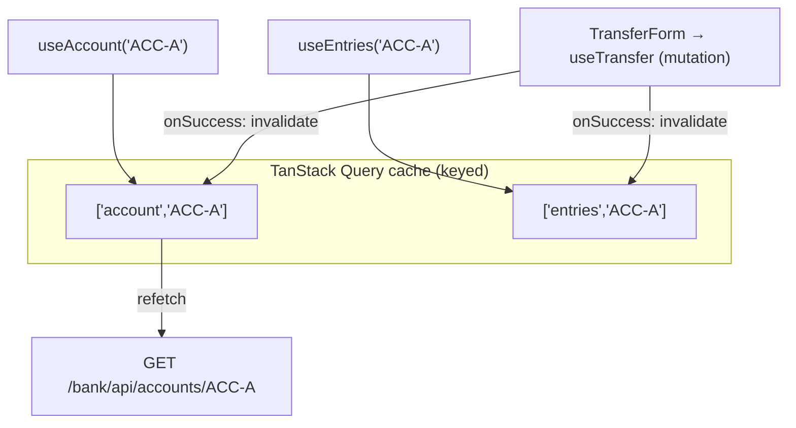

# Step 30 · Frontend pt.2 — State, Data Fetching & Forms (TanStack Query · RHF + Zod · live SSE)
### Phase F — Full-Stack Frontend 🔵 · Step 30 of 67

> *Step 29 gave the SPA a login and a guarded route. Step 30 makes it a real banking UI: **TanStack Query** for
> server state (the account balance + ledger, with caching, loading/error, and automatic refetch), **React Hook
> Form + Zod** for a validated transfer form (firing an idempotent mutation), and **Server-Sent Events** for a
> live notification feed — all through the gateway, now the single front door for four services.*

---

<a id="toc"></a>
## 🧭 The Six Movements of This Step

| | Movement | What happens |
|---|---|---|
| **A** | [🧭 Orient](#orient) | 30-second overview · skip-test · cheat card · why it matters · before you start |
| **B** | [🧠 Understand](#understand) | server vs UI state · TanStack Query (cache/invalidation) · RHF + Zod · SSE vs WebSocket |
| **C** | [🛠️ Build](#build) | the data hooks · AccountPanel · the Zod transfer form + mutation · the SSE hook · the gateway notification route |
| **D** | [🔬 Prove](#prove) | the Verification Log — build/lint/15 tests; §12.3 break the schema; gateway 5 routes; real output |
| **E** | [🎓 Apply](#apply) | go deeper · interview prep · your-turn challenges |
| **F** | [🏆 Review](#review) | troubleshooting (EventSource in jsdom, coerce types) · resources · recap, flashcards & what's next |

---

<a id="orient"></a>

# A · 🧭 Orient

## 📋 This Step in 30 Seconds

| | |
|---|---|
| **Title** | Server-state data fetching (TanStack Query), validated forms (React Hook Form + Zod), and live SSE updates |
| **Step** | 30 of 67 · **Phase F — Full-Stack Frontend** 🔵 |
| **Effort** | ≈ 16 hours focused. Three big frontend libraries + a gateway route for the SSE stream. |
| **What you'll run this step** | **Node + npm** for the SPA (`npm build/lint/test` — no Docker). Live end-to-end also needs the gateway + auth + demand-account + notification (JVM) running; the live browser flow is the one thing the sandbox can't self-verify. |
| **Buildable artifact** | `frontend/` gains: TanStack Query hooks (`useAccount`, `useEntries`, `useTransfer`), `AccountPanel` (balance + ledger with loading/error), a `TransferForm` (RHF + Zod → idempotent mutation that invalidates the cache), and `useNotificationStream`/`LiveNotifications` (SSE). The **gateway** now also fronts the notification stream (`/notifications/**`). `step-30-start == step-29-end`. |
| **Verification tier** | 🟠 **Standard** (frontend feature work + a small gateway route; no money/security behaviour change in the backend). `npm run build` + `lint` + `test` (15) green; gateway routing (5) green; a §12.3 (break the Zod schema → a test fails); full `./mvnw verify` green. |
| **Depends on** | **[Step 29](../step-29/lesson.md)** (the SPA + AuthContext + gateway/CORS), **[Step 14](../step-14/lesson.md)** (pagination + idempotency), **[Step 20](../step-20/lesson.md)** (the SSE stream), **[Step 21](../step-21/lesson.md)** (Idempotency-Key). |

By the end you'll **fetch + cache server data with TanStack Query**, **build a validated form with RHF + Zod**, **invalidate queries from a mutation**, and **stream live updates over SSE**.

### ⏭️ Can You Skip This Step? (5-minute self-check)

If you can confidently do **all** of this, skim 🛠️ Build and jump to **[Step 31 — testing & accessibility](../step-31/lesson.md)**.

- [ ] I can explain **server state vs UI state** and why TanStack Query (not `useEffect` + `useState`) owns the former.
- [ ] I can write a **query** and a **mutation**, and **invalidate** queries on success so views refetch.
- [ ] I can build a form with **React Hook Form + Zod** (schema validation, typed values, field errors).
- [ ] I can consume **Server-Sent Events** with `EventSource`, and say when SSE beats WebSocket.
- [ ] I can render **loading / error / data** states for every async view.

> [!TIP]
> Not 100%? Stay. "How do you cache and invalidate server data in React?" and "how do you validate a form?" are standard front-end interview questions — you'll have built both against a real banking API.

## 📇 Cheat Card

> **What this step delivers (one sentence):** a dashboard that reads account data (cached), submits an idempotent transfer (form-validated, cache-invalidating), and shows live transfer events over SSE — all via the gateway.

**Key commands** (in `frontend/`):

```bash
npm run dev      # Vite dev server :5173
npm run build    # tsc + vite
npm run lint     # ESLint
npm test         # Vitest + Testing Library (15 tests)
bash steps/step-30/smoke.sh
```

**The headline — query, mutate, invalidate, stream:**

```
  useAccount/useEntries ─► GET /bank/api/accounts/ACC-A           (cached; loading/error/data)
  TransferForm (RHF+Zod) ─► useTransfer ─► POST /bank/api/v1/transfers (Idempotency-Key)
       on success → invalidate ['account'] + ['entries'] → balance & history refetch
  useNotificationStream ─► EventSource /notifications/api/notifications/stream (event: transfer)
```

**The one sentence to remember:** *Queries read+cache server state; a mutation changes it and **invalidates** the affected queries so they refetch — and one-way live updates come from SSE, not WebSocket.*

## 🎯 Why This Matters

Hand-rolling data fetching with `useEffect`/`useState` leads to stale data, race conditions, and duplicated loading/error code. **TanStack Query** is the industry default for server state — caching, dedup, refetch, invalidation. **React Hook Form + Zod** is the default for typed, validated forms. And **SSE** is the simplest real-time channel for server→client push. These three are exactly what interviewers probe and what real React banking UIs use.

## ✅ What You'll Be Able to Do

- Fetch, cache, and invalidate server data with TanStack Query.
- Build a validated, typed form with React Hook Form + Zod.
- Render loading/error/data states consistently.
- Stream live updates with SSE through the gateway.

## 🧰 Before You Start

- **Prereqs:** Node 22 + npm; the Step-29 `frontend/` builds (`git describe` → `step-29-end`). No Docker for the SPA.
- **Connects to what you know:** consumes demand-account's paginated ledger (Step 14), idempotent transfer + Idempotency-Key (Steps 14/21), and the notification SSE stream (Step 20) — all behind the gateway (Step 29).
- **Depends on:** Steps **29, 14, 20, 21**.

---

<a id="understand"></a>

# B · 🧠 Understand

## 🧠 The Big Idea — server state is not UI state

Most frontend bugs around data come from treating **server state** (data that lives on the server, shared, can go
stale) like **UI state** (local, ephemeral — a form field, a toggle). **TanStack Query** manages server state
properly: it caches by a **query key**, dedupes concurrent requests, tracks `isLoading`/`isError`/`data`, and
**refetches** when you tell it the data changed. You don't store fetched data in `useState` or fetch in
`useEffect` — you declare a query and read its result.



## 🧩 Pattern Spotlight — mutation + invalidation (the cache-coherence trick)

A **query** reads; a **mutation** writes. After a transfer succeeds, the balance and ledger on screen are stale.
Rather than manually re-fetching, the mutation's `onSuccess` calls `queryClient.invalidateQueries({ queryKey:
['account'] })` (and `['entries']`) — TanStack marks every matching query stale and refetches the ones on screen.
One line keeps the whole UI coherent. The transfer also sends a fresh **Idempotency-Key** (Step 21) so a retry
never double-pays.

## 🌱 Under the Hood: React Hook Form + Zod

**React Hook Form** keeps inputs *uncontrolled* (via `register`) for performance and handles submission. **Zod**
defines a schema that is *both* the validator *and* the TypeScript type (`z.infer`). `@hookform/resolvers/zod`
glues them: on submit, RHF runs the schema; failures populate `formState.errors`. We use
`z.coerce.number().positive()` because a number `<input>` yields a *string* — coerce converts it, then validates,
in one place. Letting `useForm` **infer** its types from the resolver sidesteps the coerce input/output type
friction.

## 🛡️ Security Lens & 🧵 Thread-safety note

The transfer hits a **JWT-protected** endpoint (`/bank/**`); the API client attaches `Authorization: Bearer` from
`AuthContext`. The **Idempotency-Key** prevents a double-submit (network retry / impatient user) from moving money
twice. ProblemDetail bodies (e.g. 422 "Insufficient funds") are parsed and shown — never a raw stack trace.

## 🕰️ Then vs. Now — SSE vs WebSocket

- **WebSocket** — full-duplex (both directions), a single TCP upgrade; right for chat, collaborative editing.
- **SSE** — one-way **server→client** over plain HTTP, with **automatic reconnection** and simple `text/event-stream`
  framing; right for notifications, live tickers, progress. The bank's notifications are one-way, so SSE is the
  simpler fit (and what the backend built in Step 20). Caveat: `EventSource` can't send custom headers (e.g.
  `Authorization`) — fine here (notifications aren't user-scoped); for authed streams you'd pass a token in the URL
  or use a WebSocket.

---

# B→C bridge: 🌳 files we'll touch

```
frontend/src/
  accounts/queries.ts        useAccount · useEntries (queries) · useTransfer (mutation + invalidation)
  accounts/AccountPanel.tsx  balance + ledger, loading/error/data
  accounts/TransferForm.tsx  React Hook Form + Zod → useTransfer (Idempotency-Key)
  notifications/useNotificationStream.ts   EventSource hook (subscribe to `transfer`)
  notifications/LiveNotifications.tsx      renders the live feed
  api/client.ts              + getAccount · listEntries · transfer (ProblemDetail-aware errors)
  pages/DashboardPage.tsx    composes the above; main.tsx adds QueryClientProvider
  test/renderWithProviders.tsx  QueryClient + Router + Auth wrapper for tests
gateway/  (+ /notifications/** route → notification:8084)
```

<a id="build"></a>

# C · 🛠️ Let's Build It — Step by Step

## 📦 Your Starting Point

`step-30-start == step-29-end`: the SPA logs in + guards routes; the gateway fronts auth/cif/demand-account.

## Sub-step 1 — install the libraries

🎯 `npm install @tanstack/react-query react-hook-form zod @hookform/resolvers` (lockfile pins them). Wrap the app in `<QueryClientProvider>` in `main.tsx`.

## Sub-step 2 — the query/mutation hooks

🎯 `accounts/queries.ts`: `useAccount`/`useEntries` (queries keyed by account, **enabled** only with a token); `useTransfer` (mutation; `onSuccess` invalidates `['account']` + `['entries']`). The token comes from `useAuth()`.

🔮 **Predict:** after a successful transfer, what makes the balance on screen update — do we re-fetch manually? <details><summary>Answer</summary>No — the mutation's `onSuccess` **invalidates** the account/entries queries; TanStack refetches the ones currently rendered. Declarative cache coherence.</details>

## Sub-step 3 — AccountPanel (loading / error / data)

🎯 `AccountPanel` reads both queries and renders the three states. Money is shown as `CURRENCY 0.00`; DEBIT/CREDIT entries listed newest-first.

## Sub-step 4 — the transfer form (RHF + Zod)

🎯 `TransferForm`: a Zod schema (`from`/`to` required, `amount` positive via `z.coerce.number().positive()`); `useForm` with `zodResolver`; field errors as `role="alert"`; submit fires `useTransfer` with `crypto.randomUUID()` as the Idempotency-Key.

⚠️ **Pitfall:** a number `<input>` gives a *string* — without `z.coerce.number()` your `amount` validates as a string and your positivity check misbehaves. And typing `useForm<z.infer<…>>` explicitly can fight the coerce input/output types; let `useForm` infer from the resolver.

## Sub-step 5 — live updates over SSE

🎯 `useNotificationStream` opens one `EventSource` to `/notifications/api/notifications/stream`, listens for `transfer` events, and accumulates the latest. `LiveNotifications` renders them with a connection dot. Add the **gateway** `/notifications/**` route so it's the same origin.

⚠️ **Pitfall:** jsdom has no `EventSource` — tests need a stub (we install a no-op in `setup.ts` and a controllable one in the hook test).

🔬 **Break-it (the §12.3 proof):** drop the `to: z.string().min(1, …)` rule → the "blocks an invalid submit" test fails (no required-error shown). Put it back.

💾 **Commit:** `feat(frontend): Step 30 TanStack Query + RHF/Zod transfer + SSE live updates; gateway fronts notifications`

## 🎮 Play With It

```bash
# Backend (one shell each), from the repo root — note the CORS env for demand-account:
APP_CORS_ALLOWED_ORIGINS=http://localhost:5173 ./mvnw -pl services/auth spring-boot:run             # :8083
APP_CORS_ALLOWED_ORIGINS=http://localhost:5173 ./mvnw -pl services/demand-account spring-boot:run    # :8082 (needs Postgres+Redis)
./mvnw -pl services/notification spring-boot:run                                                      # :8084 (needs Redpanda)
./mvnw -pl gateway spring-boot:run                                                                    # :8080
npm --prefix frontend run dev    # :5173 — sign in as alice/password
# In the UI: create ACC-A/ACC-B (or via curl, see the contracts), then transfer ACC-A→ACC-B and watch the balance refresh + a live notification arrive.
```

🧪 **Little experiments:** transfer more than the balance → the form shows the 422 "Insufficient funds" detail. Submit twice fast → the Idempotency-Key means one movement. Open two browser tabs → both get the live SSE notification.

## 🏁 The Finished Result

`step-30-end`: a dashboard that reads cached account data, submits validated idempotent transfers (auto-refreshing the view), and shows live SSE notifications. **✅ Definition of Done:** `npm run build`/`lint`/`test` green; gateway routes green; `./mvnw verify` green; `bash steps/step-30/smoke.sh` passes; committed/tagged `step-30-end`.

---

<a id="prove"></a>

# D · 🔬 Prove It Works — Verification Log

> **Tier: 🟠 Standard.** Real pasted output. The SPA needs no Docker; full `./mvnw verify` does. A live *browser*
> flow is verify-adjacent (no browser in sandbox) — §12.8.

**1 · `npm run build` — tsc strict typecheck + Vite build:**

```
> tsc && vite build
vite v6.4.3 building for production...
✓ 111 modules transformed.
dist/assets/index-*.js   364.13 kB │ gzip: 111.78 kB
✓ built in 1.28s
```

**2 · `npm test` — Vitest + Testing Library (15 tests, no Docker):**

```
✓ src/api/client.test.ts (6 tests)
✓ src/notifications/useNotificationStream.test.ts (1 test)
✓ src/auth/ProtectedRoute.test.tsx (2 tests)
✓ src/accounts/AccountPanel.test.tsx (2 tests)
✓ src/accounts/TransferForm.test.tsx (2 tests)
✓ src/pages/LoginPage.test.tsx (2 tests)
 Test Files  6 passed (6)
      Tests  15 passed (15)
```
Covering: the client's request shapes (Bearer, `/bank` prefix, Idempotency-Key) + ProblemDetail parsing; AccountPanel loading→data + error; the Zod transfer form (block invalid / submit valid with a UUID key); the SSE hook accumulating a pushed `transfer` event.

**3 · `npm run lint`:** `✖ 1 problem (0 errors, 1 warning)` — the benign `react-refresh` hint on `AuthContext.tsx`; lint exits 0.

**4 · Gateway — now fronts the notification stream too (headless, no Docker):**

```
[INFO] Tests run: 5, Failures: 0, Errors: 0, Skipped: 0 -- in com.buildabank.gateway.GatewayRoutingTest
```
adding: **routes `/notifications/api/notifications/stream` (StripPrefix) → notification's `/api/notifications/stream`**.

**5 · §12.3 Mutation sanity-check — prove the validation test means something.** Dropped the `to` required rule
(`to: z.string()`):

```
× TransferForm > blocks an invalid submit and shows validation errors (API not called)
  → Unable to find an element with the text: /to account is required/i
 Tests  1 failed | 14 passed (15)
```
→ Without the rule, no required-error renders — the test caught it. **Reverted** → 15/15 green.

**6 · `smoke.sh`** — `bash steps/step-30/smoke.sh` runs the SPA build + lint + 15 tests + the gateway routing test → `✅ Step 30 smoke test PASSED`.

**7 · Build** — full-repo `./mvnw verify` → BUILD SUCCESS (14 modules; gateway notification route included; gates green).

**§12.8 honesty:** the **live browser** flow — incl. SSE *streaming* through the servlet gateway (which may buffer)
and demand-account's deny-by-default CORS — is verify-adjacent (no browser). Verified instead by the
controllable-`EventSource` unit test + the gateway routing test. No account↔user mapping yet (a typed
account-number selector). JWT still in localStorage (hardened Step 32). One benign ESLint warning remains.

---

<a id="apply"></a>

# E · 🎓 Apply

## 🚀 Go Deeper (Optional)

<details><summary>Why invalidate instead of manually setting the cache?</summary>`invalidateQueries` marks data stale and refetches the truth from the server — simple and always correct. `setQueryData` (optimistic update) is faster (no round-trip) but you must roll back on error and risk drift. For money, refetching the authoritative balance is the safer default; optimistic updates are a Step-31+ refinement.</details>

<details><summary>Query keys & cache granularity</summary>We key by `['account', accountNumber]` and invalidate by the `['account']` prefix (matches all accounts). Finer keys = finer invalidation. Keys should encode every input that changes the result (here the account number; later, filters/pagination).</details>

<details><summary>Authenticating an SSE stream</summary>`EventSource` can't set headers, so you can't send a Bearer token. Options: make the stream non-sensitive (our case), pass a short-lived token as a query param, or use a WebSocket (which can authenticate in its handshake). Don't put a long-lived JWT in a URL (it leaks to logs).</details>

## 💼 Interview Prep

1. **Server state vs UI state — why a library?** *Server state is shared, async, and goes stale; TanStack Query gives caching, dedup, loading/error, and invalidation so you don't hand-roll (and get bugs) with useEffect/useState.* **(Common.)**
2. **How do you keep the UI consistent after a mutation?** *The mutation's `onSuccess` invalidates the affected query keys; TanStack refetches the on-screen queries. Optionally optimistic-update with rollback.*
3. **Why Zod with React Hook Form?** *One schema is both the runtime validator and the static type (`z.infer`); the resolver runs it on submit. DRY + type-safe.*
4. **SSE vs WebSocket?** *SSE = one-way server→client over HTTP with auto-reconnect (notifications/tickers); WebSocket = full-duplex (chat). SSE can't send custom headers.*
5. **(Gotcha) Your amount validation passed a string — why, and the fix?** *A number input yields a string; validate with `z.coerce.number().positive()` (coerce then check), and let `useForm` infer types from the resolver.*

## 🏋️ Your Turn: Practice & Challenges

- **Quick:** add an **optimistic update** to `useTransfer` (decrement the balance immediately, roll back on error) and a test for the rollback.
- **Quick:** add a `useEntries` "load more" (pagination) — bump the `page` and merge, or use `useInfiniteQuery`.
- 🎯 **Stretch (reference solution in `solutions/step-30/`):** add a `useQuery` for the auth `/me` and show a global header; add a Zod schema for "open account" with a second form, invalidating the account query on success.

---

<a id="review"></a>

# F · 🏆 Review

## 🩺 Stuck? Troubleshooting & Fixes

- **Test crashes: `EventSource is not defined`.** jsdom doesn't implement it — install a stub in `src/test/setup.ts` (no-op) and a controllable one in the SSE hook test (this lesson does both).
- **`amount` validates as a string / NaN.** Use `z.coerce.number().positive()` (not `z.number()` with a raw string input), and don't over-type `useForm` — infer from the resolver.
- **Balance doesn't refresh after a transfer.** The mutation's `onSuccess` must `invalidateQueries({ queryKey: ['account'] })` (and `['entries']`); check the query keys match.
- **Live notifications never arrive (browser).** The gateway must route `/notifications/**`; the notification service must be up; SSE through a servlet gateway may buffer — for a demo, hit notification directly or disable response buffering.
- **CORS error calling `/bank/**`.** Start demand-account with `APP_CORS_ALLOWED_ORIGINS=http://localhost:5173`.
- **Reset:** `git checkout step-30-end` then `npm --prefix frontend ci`.

## 📚 Learn More & Glossary

- TanStack Query docs (queries, mutations, query invalidation); React Hook Form docs; Zod docs; MDN Server-Sent Events / `EventSource`.
- **Glossary:** *server state vs UI state*, *query / mutation*, *query key*, *invalidation*, *staleness*, *React Hook Form / `register`*, *Zod / `z.infer` / resolver*, *coerce*, *SSE / `EventSource` / `text/event-stream`*, *Idempotency-Key*.

## 🏆 Recap & Study Notes

**(a) Key points:** **TanStack Query** owns server state — `useAccount`/`useEntries` cache the balance + ledger
(loading/error/data); `useTransfer` is a mutation that, on success, **invalidates** `['account']`/`['entries']` so
the UI refetches. The **transfer form** uses **React Hook Form + Zod** (one typed schema; `z.coerce.number()` for
the numeric input) and sends a fresh **Idempotency-Key**. **Live updates** come from **SSE** (`EventSource` →
`transfer` events), routed through the gateway (now the single front door for four services). ProblemDetail bodies
surface as human messages.

**(b) Key terms:** server vs UI state, query, mutation, query key, invalidation, React Hook Form, Zod, resolver, coerce, SSE, EventSource, Idempotency-Key.

**(c) 🧠 Test Yourself:** ① Server vs UI state? ② How does a mutation keep the UI fresh? ③ Why coerce in the Zod amount? ④ SSE vs WebSocket? ⑤ How did you prove the validation test is meaningful? <details><summary>Answers</summary>① Server = shared/async/stale (query cache); UI = local/ephemeral (React state). ② `onSuccess` invalidates the affected query keys → refetch. ③ A number input yields a string; coerce converts then validates. ④ SSE one-way+auto-reconnect (no custom headers); WebSocket full-duplex. ⑤ Dropped the `to` required rule → the test failed (no error rendered) → reverted.</details>

**(d) 🔗 How this connects:** builds on Step 29's SPA + gateway; consumes Step 14 pagination/idempotency, Step 20 SSE, Step 21 Idempotency-Key. **Next: Step 31** — deeper Testing Library + **Playwright E2E** + **MSW** (network mocking) + accessibility + i18n/multi-currency; then Step 32 (token refresh, route-guard hardening, bundle/perf, Dockerize + serve via the gateway).

**(e) 🏆 Résumé line:** *"Built a React data layer with TanStack Query (caching + invalidation), validated forms with React Hook Form + Zod, and live SSE updates against a banking API behind a single gateway."*

**(f) ✅ You can now:** fetch/cache/invalidate server data · build validated typed forms · render loading/error/data · stream live updates with SSE.

**(g) 🃏 Flashcards** appended to `docs/flashcards.md` · 🔁 revisit invalidation + optimistic updates at Step 31, and token storage at Step 32.

**(h) ✍️ One-line reflection:** *Which on-screen value would users most notice going stale — and is it invalidated after every mutation that affects it?*

**(i)** 🎉 The bank's UI now reads, writes, and reacts in real time. Next: lock it down with E2E tests, accessibility, and i18n.
