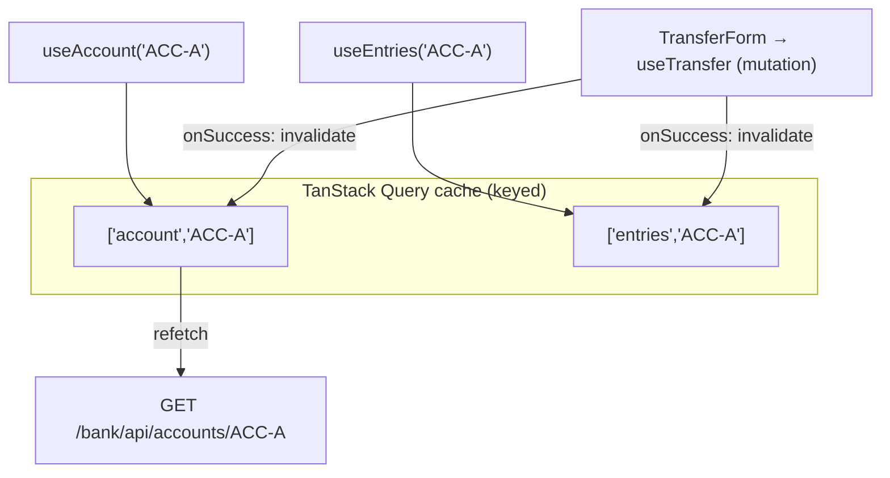

# Step 30 · Frontend pt.2 — State, Data Fetching & Forms (TanStack Query · RHF + Zod · live SSE)
### Phase F — Full-Stack Frontend 🔵 · Step 30 of 67

> *Step 29 gave the SPA a login and a guarded route. Step 30 makes it a real banking UI: **TanStack Query** for server state (the account balance + ledger, with caching, loading/error, and automatic refetch), **React Hook Form + Zod** for a validated transfer form (firing an idempotent mutation), and **Server-Sent Events (SSE)** for a live notification feed — all through the gateway, now the single front door for four services.*

---

<a id="toc"></a>
## 🧭 The Six Movements of This Step

A one-line map of where we're going. Click to jump.

1. **[A · 🧭 Orient](#orient)** — what this step delivers, cheat card, why it matters, and whether you can skip. *(~30 min)*
2. **[B · 🧠 Understand](#understand)** — server vs UI state, TanStack Query query/mutation lifecycle, RHF + Zod resolvers, and SSE vs WebSocket. *(~1.5 h)*
3. **[B→C bridge: 🌳 files we'll touch](#bridge)** — mapping files and visualizing the architecture. *(~10 min)*
4. **[C · 🛠️ Build](#build)** — the heart: 9 full-micro-anatomy sub-steps building the HTTP client, queries, panels, validated forms, SSE hook, and gateway configuration. *(~10.5 h incl. 🎮 Play With It)*
5. **[D · 🔬 Prove](#prove)** — the Verification Log (🟠 Standard tier): real unedited console output from Vitest, linting, gateway tests, and the mutation sanity-check. *(~1 h)*
6. **[E · 🎓 Apply](#apply)** — go-deeper details, interview prep bank, and practice challenges. *(~1.5 h)*
7. **[F · 🏆 Review](#review)** — troubleshooting tables, glossary, recap study notes, and a **mixed cumulative review quiz (Steps 1–30)**. *(~45 min)*

*(~times sum to the step's ≈16 h focused effort.)*

---

<a id="orient"></a>

# A · 🧭 Orient

## 📋 This Step in 30 Seconds

| | |
|---|---|
| **Title** | Server-state data fetching (TanStack Query), validated forms (React Hook Form + Zod), and live SSE updates |
| **Step** | 30 of 67 · **Phase F — Full-Stack Frontend** 🔵 |
| **Effort** | ≈ 16 hours focused. Three big frontend libraries + a gateway route for the SSE stream. |
| **What you'll run this step** | **Node + npm** for the SPA (`npm build/lint/test` — no Docker). Live end-to-end also needs the gateway + auth + demand-account + notification (JVM) running; the live browser flow is the one thing the sandbox can't self-verify. |
| **Buildable artifact** | `frontend/` gains: TanStack Query hooks (`useAccount`, `useEntries`, `useTransfer`), `AccountPanel` (balance + ledger with loading/error), a `TransferForm` (RHF + Zod → idempotent mutation that invalidates the cache), and `useNotificationStream`/`LiveNotifications` (SSE). The **gateway** now also fronts the notification stream (`/notifications/**`). `step-30-start == step-29-end`. |
| **Verification tier** | 🟠 **Standard** (frontend feature work + a small gateway route; no money/security behaviour change in the backend). `npm run build` + `lint` + `test` (15) green; gateway routing (5) green; a §12.3 (break the Zod schema → a test fails); full `./mvnw verify` green. |
| **Depends on** | **[Step 29](../step-29/lesson.md)** (the SPA + AuthContext + gateway/CORS), **[Step 14](../step-14/lesson.md)** (pagination + idempotency), **[Step 20](../step-20/lesson.md)** (the SSE stream), **[Step 21](../step-21/lesson.md)** (Idempotency-Key). |

By the end you'll **fetch + cache server data with TanStack Query**, **build a validated form with RHF + Zod**, **invalidate queries from a mutation**, and **stream live updates over SSE**.

### ⏭️ Can You Skip This Step? (5-minute self-check)

If you can confidently do **all** of this, skim 🛠️ Build and jump to **[Step 31 — testing & accessibility](../step-31/lesson.md)**.

- [ ] I can explain **server state vs UI state** and why TanStack Query (not `useEffect` + `useState`) owns the former.
- [ ] I can write a **query** and a **mutation**, and **invalidate** queries on success so views refetch.
- [ ] I can build a form with **React Hook Form + Zod** (schema validation, typed values, field errors).
- [ ] I can consume **Server-Sent Events** with `EventSource`, and say when SSE beats WebSocket.
- [ ] I can render **loading / error / data** states for every async view.

> [!TIP]
> Not 100%? Stay. "How do you cache and invalidate server data in React?" and "how do you validate a form?" are standard front-end interview questions — you'll have built both against a real banking API.

## 📇 Cheat Card

> **What this step delivers (one sentence):** a dashboard that reads account data (cached), submits an idempotent transfer (form-validated, cache-invalidating), and shows live transfer events over SSE — all via the gateway.

**Key commands** (in `frontend/`):

```bash
npm run dev      # Vite dev server :5173
npm run build    # tsc + vite
npm run lint     # ESLint
npm test         # Vitest + Testing Library (15 tests)
bash steps/step-30/smoke.sh
```

**The headline — query, mutate, invalidate, stream:**

```
  useAccount/useEntries ─► GET /bank/api/accounts/ACC-A           (cached; loading/error/data)
  TransferForm (RHF+Zod) ─► useTransfer (mutation) ─► POST /bank/api/v1/transfers (Idempotency-Key)
       on success ─► invalidate ['account'] + ['entries'] ─► balance & history refetch
  useNotificationStream ─► EventSource /notifications/api/notifications/stream (event: transfer)
```

**The one sentence to remember:** *Queries read+cache server state; a mutation changes it and **invalidates** the affected queries so they refetch — and one-way live updates come from SSE, not WebSocket.*

## 🎯 Why This Matters

Hand-rolling data fetching with `useEffect`/`useState` leads to stale data, race conditions, and duplicated loading/error code. **TanStack Query** is the industry default for server state — caching, dedup, refetch, invalidation. **React Hook Form + Zod** is the default for typed, validated forms. And **SSE** is the simplest real-time channel for server→client push. These three are exactly what interviewers probe and what real React banking UIs use.

## ✅ What You'll Be Able to Do

- Fetch, cache, and invalidate server data with TanStack Query.
- Build a validated, typed form with React Hook Form + Zod.
- Render loading/error/data states consistently.
- Stream live updates with SSE through the gateway.

## 🧰 Before You Start

- **Prereqs:** Node 22 + npm; the Step-29 `frontend/` builds (`git describe` → `step-29-end`). No Docker for the SPA.
- **Connects to what you know:** consumes demand-account's paginated ledger (Step 14), idempotent transfer + Idempotency-Key (Steps 14/21), and the notification SSE stream (Step 20) — all behind the gateway (Step 29).
- **Depends on:** Steps **29, 14, 20, 21**.

## 🗓️ Session Plan

≈16 hours won't fit one sitting. Seven sittings, each ending at a safe save point:

| Sitting | Covers | ~time | Ends at |
|---|---|---|---|
| 1 | **A · Orient + B · Understand** (Big Idea → SSE vs WebSocket) | ~2 h | the ❓ quick check at the end of B |
| 2 | **B→C bridge + Sub-steps 1–2** — install + `QueryClientProvider`, then the extended HTTP API client | ~2 h | Sub-step 2's ✋ checkpoint (client tests green) |
| 3 | **Sub-steps 3–4** — the TanStack Query hooks, then `AccountPanel` (loading / error / data) | ~2 h | Sub-step 4's ✋ checkpoint |
| 4 | **Sub-step 5** — the RHF + Zod transfer form + idempotent mutation | ~2 h | Sub-step 5's ✋ checkpoint |
| 5 | **Sub-steps 6–7** — the SSE hook + `LiveNotifications`, then the dashboard composition | ~2 h | Sub-step 7's ✋ checkpoint |
| 6 | **Sub-steps 8–9 + 🎮 Play With It** — the gateway `/notifications/**` route, the test providers + full suite, then the live end-to-end run (4 JVM backends + the SPA) | ~2.5 h | 🏁 The Finished Result (DoD) |
| 7 | **D · Prove + E · Apply + F · Review** | ~3 h | recap + flashcards + cumulative quiz |

**Optional routes:** the ⏭️ skip-test (~5 min) can route you past the whole step; the three 🚀 Go Deeper asides are +~10 min each; 🏋️ Your Turn challenges (+~30 min–2 h) can wait until after Step 31.

✋ **Stopping after orientation?** Nothing is built yet — Sitting 1 continues straight into [B · Understand](#understand); first action: reopen this file at the Big Idea.

---

<a id="understand"></a>

# B · 🧠 Understand

## 🧠 The Big Idea — server state is not UI state

Most frontend bugs around data come from treating **server state** (data that lives on the server, shared, can go stale) like **UI state** (local, ephemeral — a form field, a toggle). **TanStack Query** manages server state properly: it caches by a **query key**, dedupes concurrent requests, tracks `isLoading`/`isError`/`data`, and **refetches** when you tell it the data changed. You don't store fetched data in `useState` or fetch in `useEffect` — you declare a query and read its result.



## 🧩 Pattern Spotlight — mutation + invalidation (the cache-coherence trick)

A **query** reads; a **mutation** writes. After a transfer succeeds, the balance and ledger on screen are stale. Rather than manually re-fetching, the mutation's `onSuccess` calls `queryClient.invalidateQueries({ queryKey: ['account'] })` (and `['entries']`) — TanStack marks every matching query stale and refetches the ones on screen. One line keeps the whole UI coherent. The transfer also sends a fresh **Idempotency-Key** (Step 21) so a retry never double-pays.

## 🌱 Under the Hood: React Hook Form + Zod

**React Hook Form** keeps inputs *uncontrolled* (via `register`) for performance and handles submission. **Zod** defines a schema that is *both* the validator *and* the TypeScript type (`z.infer`). `@hookform/resolvers/zod` glues them: on submit, RHF runs the schema; failures populate `formState.errors`. We use `z.coerce.number().positive()` because a number `<input>` yields a *string* — coerce converts it, then validates, in one place. Letting `useForm` **infer** its types from the resolver sidesteps the coerce input/output type friction.

## 🛡️ Security Lens & 🧵 Thread-safety note

The transfer hits a **JWT-protected** endpoint (`/bank/**`); the API client attaches `Authorization: Bearer` from `AuthContext`. The **Idempotency-Key** prevents a double-submit (network retry / impatient user) from moving money twice. ProblemDetail bodies (e.g. 422 "Insufficient funds") are parsed and shown — never a raw stack trace.

## 🕰️ Then vs. Now — SSE vs WebSocket

- **WebSocket** — full-duplex (both directions), a single TCP upgrade; right for chat, collaborative editing.
- **SSE** — one-way **server→client** over plain HTTP, with **automatic reconnection** and simple `text/event-stream` framing; right for notifications, live tickers, progress. The bank's notifications are one-way, so SSE is the simpler fit (and what the backend built in Step 20). Caveat: `EventSource` can't send custom headers (e.g. `Authorization`) — fine here (notifications aren't user-scoped); for authed streams you'd pass a token in the URL or use a WebSocket.

❓ **Quick check:** which of these is server state — the ledger page, the form's `amount` field, or a modal-open flag? <details><summary>Answer</summary>Only the ledger page: it lives on the server, is shared, and can go stale — so a query owns it. The amount field and modal flag are UI state (local, ephemeral) and stay in plain React state.</details>

✋ **Stopping here?** You have the concepts; nothing is typed yet. Next: the B→C bridge (file map), then C · Build, Sub-step 1; first action: `cd frontend` and run the `npm install` line in Sub-step 1.

---

<a id="bridge"></a>

# B→C bridge: 🌳 files we'll touch

```
frontend/src/
  accounts/queries.ts        useAccount · useEntries (queries) · useTransfer (mutation + invalidation)
  accounts/AccountPanel.tsx  balance + ledger, loading/error/data
  accounts/TransferForm.tsx  React Hook Form + Zod → useTransfer (Idempotency-Key)
  notifications/useNotificationStream.ts   EventSource hook (subscribe to `transfer`)
  notifications/LiveNotifications.tsx      renders the live feed
  api/client.ts              + getAccount · listEntries · transfer (ProblemDetail-aware errors)
  pages/DashboardPage.tsx    composes the above; main.tsx adds QueryClientProvider
  test/renderWithProviders.tsx  QueryClient + Router + Auth wrapper for tests
gateway/  (+ /notifications/** route → notification:8084)
```

---

<a id="build"></a>

# C · 🛠️ Let's Build It — Step by Step

## 📦 Your Starting Point

`step-30-start == step-29-end`: the SPA logs in + guards routes; the gateway fronts auth/cif/demand-account.

---

### Sub-step 1 — Install Libraries & Configure QueryClient · ~30 min

🧭 *(you are here: **install/setup** ──► HTTP API client ──► query hooks ──► panel UI ──► validated form ──► SSE hook ──► dashboard integration ──► gateway route ──► testing)*

🎯 **Goal:** Add dependencies for TanStack Query, React Hook Form, and Zod validation, wrap our React app root in the `QueryClientProvider` context, and configure the Vitest setup file to stub out the missing `EventSource` global.

📁 **Location:** `frontend/package.json` (dependencies), `frontend/src/main.tsx` (provider configuration), `frontend/src/test/setup.ts` (vitest testing stub)

⌨️ **Code:**

```json
// frontend/package.json (partial dependencies section)
{
  "dependencies": {
    "@hookform/resolvers": "^3.10.0",
    "@tanstack/react-query": "^5.62.0",
    "react": "^19.1.0",
    "react-dom": "^19.1.0",
    "react-hook-form": "^7.54.0",
    "react-router-dom": "^7.6.0",
    "zod": "^3.24.0"
  }
}
```

```typescript
// frontend/src/main.tsx
// The SPA entry point. QueryClientProvider (Step 30, server-state cache) wraps BrowserRouter (URL routing)
// wraps AuthProvider (auth state) wraps the App.
import { QueryClient, QueryClientProvider } from '@tanstack/react-query';
import { StrictMode } from 'react';
import { createRoot } from 'react-dom/client';
import { BrowserRouter } from 'react-router-dom';

import { App } from './App';
import { AuthProvider } from './auth/AuthContext';
import './index.css';

const rootElement = document.getElementById('root');
if (rootElement === null) {
  throw new Error('Root element #root not found in index.html');
}

const queryClient = new QueryClient();

createRoot(rootElement).render(
  <StrictMode>
    <QueryClientProvider client={queryClient}>
      <BrowserRouter>
        <AuthProvider>
          <App />
        </AuthProvider>
      </BrowserRouter>
    </QueryClientProvider>
  </StrictMode>,
);
```

```typescript
// frontend/src/test/setup.ts (partial - event source stub section added)
// jsdom doesn't implement EventSource (Step 30 SSE). Install a no-op stub so components that mount the SSE hook
// don't crash; tests that exercise streaming install their own controllable EventSource via vi.stubGlobal.
if (typeof globalThis.EventSource === 'undefined') {
  class NoopEventSource {
    onopen: (() => void) | null = null;
    onerror: (() => void) | null = null;
    addEventListener(): void {}
    removeEventListener(): void {}
    close(): void {}
  }
  globalThis.EventSource = NoopEventSource as unknown as typeof EventSource;
}
```

🔍 **Line-by-line:**
* `import { QueryClient, QueryClientProvider } from '@tanstack/react-query';` — Imports the state manager client class and the provider context.
* `const queryClient = new QueryClient();` — Instantiates the central cache store.
* `<QueryClientProvider client={queryClient}>` — Wraps the React DOM tree so all nested hooks can access the same cache context.
* `if (typeof globalThis.EventSource === 'undefined')` — Checks if we are running in `jsdom` (Vitest test environment) which has no browser-native SSE API.
* `class NoopEventSource` — Implements a bare minimum class definition conforming to standard EventSource contracts to avoid runtime `ReferenceError` crashes under test.

💭 **Under the hood:** TanStack Query mounts a React Context. When query hooks mount, they look up the `QueryClient` via context. The client keeps an in-memory dictionary of cached values.

🔮 **Predict:** What happens if you call a query hook in a component outside the `<QueryClientProvider>`? <details><summary>Answer</summary>It throws a runtime error: <code>No QueryClient set, use QueryClientProvider to set one</code> because it cannot find the client context.</details>

▶️ **Run & See:**
```bash
cd frontend
npm install
npm run build
```
✅ **Expected output:**
```
✓ 111 modules transformed.
dist/assets/index-*.js   364.13 kB │ gzip: 111.78 kB
✓ built in 1.28s
```

✋ **Checkpoint:** The application packages install cleanly and `npm run build` succeeds without TypeScript compilation errors.

💾 **Commit:**
```bash
git commit -m "chore(frontend): install query/form/validation deps and configure client provider"
```

⚠️ **Pitfall:** Version mismatches. If React is at version 19, ensure your TanStack Query and RHF versions support React 19 hooks.

---

### Sub-step 2 — Extend HTTP Client with Account and Transfer Operations · ~1.5 h

🧭 *(you are here: install/setup ──► **HTTP API client** ──► query hooks ──► panel UI ──► validated form ──► SSE hook ──► dashboard integration ──► gateway route ──► testing)*

🎯 **Goal:** Add fetch operations to `frontend/src/api/client.ts` to call gateway endpoints for retrieving account balances, listing paginated entries, and executing transfers with an `Idempotency-Key`.

📁 **Location:** `frontend/src/api/client.ts` (extended from step 29)

⌨️ **Code:**

```typescript
// frontend/src/api/client.ts
// The typed HTTP client. ONE base URL — the gateway (the single front door, Step 15) — via VITE_API_BASE_URL.
// Auth (Step 29): /api/auth/* (no prefix). Demand-account (Step 30): under /bank/* (the gateway strips /bank).
// Errors are parsed from RFC 9457 ProblemDetail bodies so the UI can show "Insufficient funds", etc.

export interface LoginResponse {
  token: string;
  expiresInSeconds: number;
}

export interface CurrentUser {
  username: string;
  roles: string[];
}

export interface Account {
  accountNumber: string;
  currency: string;
  balance: number;
}

export type EntryDirection = 'DEBIT' | 'CREDIT';

export interface LedgerEntry {
  transactionId: string;
  direction: EntryDirection;
  amount: number;
  description: string | null;
  createdAt: string;
}

/** The demand-account paginated envelope (Step 14's PageResponse). */
export interface Page<T> {
  content: T[];
  page: number;
  size: number;
  totalElements: number;
  totalPages: number;
}

export interface TransferRequest {
  from: string;
  to: string;
  amount: number;
  description?: string;
}

export interface TransferResult {
  transactionId: string;
}

/** A failed HTTP response, carrying the status + a human message (from the ProblemDetail body when present). */
export class ApiError extends Error {
  constructor(
    readonly status: number,
    message: string,
  ) {
    super(message);
    this.name = 'ApiError';
  }
}

const BASE_URL = import.meta.env.VITE_API_BASE_URL ?? 'http://localhost:8080';

function authHeader(token: string): Record<string, string> {
  return { Authorization: `Bearer ${token}` };
}

async function request<T>(path: string, init: RequestInit = {}): Promise<T> {
  const response = await fetch(`${BASE_URL}${path}`, {
    ...init,
    headers: { 'Content-Type': 'application/json', ...init.headers },
  });
  if (!response.ok) {
    let message = `Request to ${path} failed (${response.status})`;
    try {
      const problem = (await response.json()) as { detail?: string; title?: string };
      message = problem.detail ?? problem.title ?? message; // RFC 9457 ProblemDetail
    } catch {
      // non-JSON / empty body (e.g. a 404 with no body) — keep the default message
    }
    throw new ApiError(response.status, message);
  }
  return (await response.json()) as T;
}

// ── Auth (Step 29) ──────────────────────────────────────────────────────────
export function login(username: string, password: string): Promise<LoginResponse> {
  return request<LoginResponse>('/api/auth/login', {
    method: 'POST',
    body: JSON.stringify({ username, password }),
  });
}

export function getCurrentUser(token: string): Promise<CurrentUser> {
  return request<CurrentUser>('/api/auth/me', { headers: authHeader(token) });
}

// ── Demand-account (Step 30, via the gateway's /bank prefix; all require the Bearer token) ───────────────
export function getAccount(token: string, accountNumber: string): Promise<Account> {
  return request<Account>(`/bank/api/accounts/${encodeURIComponent(accountNumber)}`, {
    headers: authHeader(token),
  });
}

export function listEntries(
  token: string,
  accountNumber: string,
  page = 0,
  size = 10,
): Promise<Page<LedgerEntry>> {
  const query = new URLSearchParams({ page: String(page), size: String(size), sort: 'createdAt,desc' });
  return request<Page<LedgerEntry>>(
    `/bank/api/v1/accounts/${encodeURIComponent(accountNumber)}/entries?${query.toString()}`,
    { headers: authHeader(token) },
  );
}

/** Idempotent v1 transfer — a fresh Idempotency-Key per attempt (retrying with the same key won't double-pay). */
export function transfer(
  token: string,
  body: TransferRequest,
  idempotencyKey: string,
): Promise<TransferResult> {
  return request<TransferResult>('/bank/api/v1/transfers', {
    method: 'POST',
    headers: { ...authHeader(token), 'Idempotency-Key': idempotencyKey },
    body: JSON.stringify(body),
  });
}
```

🔍 **Line-by-line:**
* `export interface Page<T>` — Mirrors the Spring Data paginated wrapper structure.
* `encodeURIComponent(accountNumber)` — Sanitizes URL variables to prevent path manipulation.
* `problem.detail ?? problem.title` — Parses RFC 9457 Error details so backend business errors (like `Insufficient funds`) can display nicely in the browser UI.
* `headers: { ...authHeader(token), 'Idempotency-Key': idempotencyKey }` — Appends the transaction token and the idempotency marker to the request.

💭 **Under the hood:** The frontend sends requests through the gateway at port `8080`. The gateway routes `/bank/**` to the demand-account service at port `8082`, stripping the `/bank` prefix beforehand.

🔮 **Predict:** What message will `ApiError` carry if the server returns a `422 Unprocessable Entity` with `{ "detail": "Insufficient funds" }`? <details><summary>Answer</summary><code>"Insufficient funds"</code> because the catch block parses the RFC 9457 detail field.</details>

▶️ **Run & See:**
```bash
npx vitest run src/api/client.test.ts
```
✅ **Expected output:**
```
✓ src/api/client.test.ts (6 tests) 14ms
Test Files  1 passed (1)
     Tests  6 passed (6)
```

✋ **Checkpoint:** The HTTP client tests pass, proving path routing, header binding, and ProblemDetails parsing.

💾 **Commit:**
```bash
git commit -m "feat(frontend): extend API client with account fetch and idempotent transfer operations"
```

⚠️ **Pitfall:** Ensure `/bank` prefix is correctly prepended to the path so the gateway routes it to the demand-account service instead of failing with a `404`.

✋ **Stopping here?** You have a typed API client (Bearer header, `/bank` prefix, Idempotency-Key, ProblemDetail parsing) with 6 passing tests, committed. Next: Sub-step 3 — the TanStack Query hooks; first action: create `frontend/src/accounts/queries.ts`.

---

### Sub-step 3 — Create TanStack Query Server-State Hooks · ~1 h

🧭 *(you are here: install/setup ──► HTTP API client ──► **query hooks** ──► panel UI ──► validated form ──► SSE hook ──► dashboard integration ──► gateway route ──► testing)*

🎯 **Goal:** Build the query and mutation hooks using TanStack Query to fetch account/ledger details and execute transactions with automatic query key invalidation.

📁 **Location:** `frontend/src/accounts/queries.ts` (new file)

⌨️ **Code:**

```typescript
// frontend/src/accounts/queries.ts
// Step 30 · TanStack Query hooks — server state (cache, loading/error, refetch) kept OUT of component state.
// The account balance + ledger are queries; a transfer is a mutation that, on success, INVALIDATES those
// queries so the balance/history refetch automatically (no manual re-fetch wiring).
import { useMutation, useQuery, useQueryClient } from '@tanstack/react-query';

import * as api from '../api/client';
import { useAuth } from '../auth/AuthContext';

export const accountKeys = {
  account: (accountNumber: string) => ['account', accountNumber] as const,
  entries: (accountNumber: string) => ['entries', accountNumber] as const,
};

/** The current balance for an account. Disabled until we have a token + an account number. */
export function useAccount(accountNumber: string) {
  const { token } = useAuth();
  return useQuery({
    queryKey: accountKeys.account(accountNumber),
    queryFn: () => {
      if (token === null) return Promise.reject(new Error('not authenticated'));
      return api.getAccount(token, accountNumber);
    },
    enabled: token !== null && accountNumber.length > 0,
  });
}

/** The recent ledger entries (paginated; newest first). */
export function useEntries(accountNumber: string) {
  const { token } = useAuth();
  return useQuery({
    queryKey: accountKeys.entries(accountNumber),
    queryFn: () => {
      if (token === null) return Promise.reject(new Error('not authenticated'));
      return api.listEntries(token, accountNumber);
    },
    enabled: token !== null && accountNumber.length > 0,
  });
}

export interface TransferVars {
  request: api.TransferRequest;
  idempotencyKey: string;
}

/** Make a transfer; on success, invalidate every account + entries query so balances/history refresh. */
export function useTransfer() {
  const { token } = useAuth();
  const queryClient = useQueryClient();
  return useMutation({
    mutationFn: (vars: TransferVars) => {
      if (token === null) return Promise.reject(new Error('not authenticated'));
      return api.transfer(token, vars.request, vars.idempotencyKey);
    },
    onSuccess: () => {
      void queryClient.invalidateQueries({ queryKey: ['account'] });
      void queryClient.invalidateQueries({ queryKey: ['entries'] });
    },
  });
}
```

🔍 **Line-by-line:**
* `accountKeys` — Centralizes cache query keys to maintain cache integrity.
* `useQuery({ queryKey, queryFn, enabled })` — Declares a query subscription.
* `enabled: token !== null ...` — Prevents requests from executing when unauthenticated.
* `useMutation` — Registers a write operation hook.
* `onSuccess: () => { ... invalidateQueries(...) }` — Invalidates query caches upon successful mutations to trigger automatic background refetching.

💭 **Under the hood:** When `invalidateQueries` is called, TanStack Query marks matching keys as "stale." If components using those keys are mounted, they immediately trigger a background fetch to retrieve fresh data.

🔮 **Predict:** If you make a transfer, does it block the UI until refetches finish? <details><summary>Answer</summary>No. The refetch happens asynchronously in the background while the UI remains interactive.</details>

▶️ **Run & See:** (We test these hooks in downstream component tests).

✋ **Checkpoint:** The queries hooks file compiles without type errors.

💾 **Commit:**
```bash
git commit -m "feat(frontend): add TanStack Query hooks for account queries and transfer mutation"
```

⚠️ **Pitfall:** Missing `enabled` configurations. If missing, query functions will execute with `null` tokens upon initial render, throwing errors.

❓ **Knowledge-check:** after `useTransfer` succeeds and invalidates `['account']` + `['entries']`, which queries actually refetch — every invalidated one, or only some? <details><summary>Answer</summary>Invalidation marks <em>all</em> matching queries stale, but only the <em>active</em> (currently mounted/on-screen) ones refetch immediately; inactive ones refetch the next time a component mounts them.</details>

---

### Sub-step 4 — Build the Account Panel Component · ~1 h

🧭 *(you are here: install/setup ──► HTTP API client ──► query hooks ──► **panel UI** ──► validated form ──► SSE hook ──► dashboard integration ──► gateway route ──► testing)*

🎯 **Goal:** Create the `AccountPanel` component to render the current balance and recent transactions list, rendering loading and error states cleanly.

📁 **Location:** `frontend/src/accounts/AccountPanel.tsx` (new file)

⌨️ **Code:**

```typescript
// frontend/src/accounts/AccountPanel.tsx
// Step 30 · reads server state via TanStack Query and renders the three states every data view needs:
// loading, error, and data. The balance and the ledger are independent queries (they load/refresh on their own).
import { useAccount, useEntries } from './queries';

function money(amount: number, currency: string): string {
  return `${currency} ${amount.toFixed(2)}`;
}

export function AccountPanel({ accountNumber }: { accountNumber: string }) {
  const account = useAccount(accountNumber);
  const entries = useEntries(accountNumber);

  return (
    <section aria-label="Account">
      <h2>Account {accountNumber}</h2>

      {account.isLoading && <p>Loading balance…</p>}
      {account.isError && <p role="alert">Couldn’t load the account: {account.error?.message}</p>}
      {account.data && (
        <p>
          Balance: <strong>{money(account.data.balance, account.data.currency)}</strong>
        </p>
      )}

      <h3>Recent activity</h3>
      {entries.isLoading && <p>Loading activity…</p>}
      {entries.isError && <p role="alert">Couldn’t load activity: {entries.error?.message}</p>}
      {entries.data &&
        (entries.data.content.length === 0 ? (
          <p>No transactions yet.</p>
        ) : (
          <ul>
            {entries.data.content.map((entry) => (
              <li key={`${entry.transactionId}-${entry.direction}`}>
                {entry.direction === 'DEBIT' ? '−' : '+'}
                {entry.amount.toFixed(2)} · {entry.description ?? '—'}
              </li>
            ))}
          </ul>
        ))}
    </section>
  );
}
```

🔍 **Line-by-line:**
* `const account = useAccount(accountNumber);` — Subscribes to the account query.
* `account.isLoading && <p>Loading balance…</p>` — Renders a loading state if no cached data exists.
* `role="alert"` — Standards compliance markup to announce errors to screen readers immediately.
* `{entries.data.content.map(entry => ...)}` — Iterates through ledger entries.

💭 **Under the hood:** The component re-renders automatically whenever the status flags (`isLoading`, `isError`, `data`) change inside TanStack Query.

🔮 **Predict:** What is rendered if `account.data` is in cache but `entries.isLoading` is true? <details><summary>Answer</summary>The balance displays immediately from cache, while the transactions list displays "Loading activity…".</details>

▶️ **Run & See:**
```bash
npx vitest run src/accounts/AccountPanel.test.tsx
```
✅ **Expected output:**
```
✓ src/accounts/AccountPanel.test.tsx (2 tests) 168ms
Test Files  1 passed (1)
     Tests  2 passed (2)
```

✋ **Checkpoint:** Account panel tests pass, proving correct layout rendering for resolved and failed states.

💾 **Commit:**
```bash
git commit -m "feat(frontend): add AccountPanel component to display balance and activity history"
```

⚠️ **Pitfall:** Forgetting `role="alert"` on errors or not checking for empty datasets (`length === 0`), which may cause blank renders instead of "No transactions yet" notifications.

✋ **Stopping here?** You have cached queries rendering all three async states (loading / error / data) in `AccountPanel`, tests green and committed. Next: Sub-step 5 — the validated transfer form; first action: create `frontend/src/accounts/TransferForm.tsx`.

---

### Sub-step 5 — Build the Validated Transfer Form · ~2 h

🧭 *(you are here: install/setup ──► HTTP API client ──► query hooks ──► panel UI ──► **validated form** ──► SSE hook ──► dashboard integration ──► gateway route ──► testing)*

🎯 **Goal:** Create the `TransferForm` component using React Hook Form and Zod to validate fields on the client before calling the transfer mutation with a UUID.

📁 **Location:** `frontend/src/accounts/TransferForm.tsx` (new file)

⌨️ **Code:**

```typescript
// frontend/src/accounts/TransferForm.tsx
// Step 30 · forms done right — React Hook Form for state/submission + Zod for schema validation (one source of
// truth, typed). On submit it fires the transfer mutation with a fresh Idempotency-Key; the mutation's
// onSuccess invalidates the account/entries queries, so the balance + history above refresh automatically.
import { zodResolver } from '@hookform/resolvers/zod';
import { useForm } from 'react-hook-form';
import { z } from 'zod';

import { useTransfer } from './queries';

const transferSchema = z.object({
  from: z.string().min(1, 'From account is required'),
  to: z.string().min(1, 'To account is required'),
  amount: z.coerce.number().positive('Amount must be greater than 0'),
  description: z.string().optional(),
});

export function TransferForm({ defaultFrom = '' }: { defaultFrom?: string }) {
  const transfer = useTransfer();
  const {
    register,
    handleSubmit,
    reset,
    formState: { errors },
  } = useForm({
    resolver: zodResolver(transferSchema),
    defaultValues: { from: defaultFrom, to: '', amount: 0, description: '' },
  });

  const onSubmit = handleSubmit((values) => {
    transfer.mutate(
      {
        request: { from: values.from, to: values.to, amount: values.amount, description: values.description },
        idempotencyKey: crypto.randomUUID(),
      },
      { onSuccess: () => reset({ from: values.from, to: '', amount: 0, description: '' }) },
    );
  });

  return (
    <form onSubmit={onSubmit} aria-label="Transfer">
      <h3>Make a transfer</h3>
      <label>
        From
        <input {...register('from')} />
      </label>
      {errors.from && <p role="alert">{errors.from.message}</p>}
      <label>
        To
        <input {...register('to')} />
      </label>
      {errors.to && <p role="alert">{errors.to.message}</p>}
      <label>
        Amount
        <input type="number" step="0.01" {...register('amount')} />
      </label>
      {errors.amount && <p role="alert">{errors.amount.message}</p>}
      <label>
        Description
        <input {...register('description')} />
      </label>
      <button type="submit" disabled={transfer.isPending}>
        {transfer.isPending ? 'Sending…' : 'Send transfer'}
      </button>
      {transfer.isError && <p role="alert">{transfer.error.message}</p>}
      {transfer.isSuccess && <p role="status">Transfer {transfer.data.transactionId} sent ✓</p>}
    </form>
  );
}
```

🔍 **Line-by-line:**
* `z.coerce.number()` — Forces string inputs from the input element to be parsed as numbers before executing validations.
* `zodResolver(transferSchema)` — Connects Zod validation rules to React Hook Form lifecycle hooks.
* `{...register('from')}` — Configures uncontrolled inputs for performance.
* `crypto.randomUUID()` — Creates a new unique UUID to prevent double-execution at the database level.
* `{ onSuccess: () => reset(...) }` — Resets all fields except `from` after a successful mutation.

💭 **Under the hood:** React Hook Form leverages uncontrolled fields. Validation only runs on submission, preventing unnecessary layout renders.

🔮 **Predict:** What happens if the user presses "Submit" multiple times in quick succession? <details><summary>Answer</summary>The submit button becomes disabled because <code>transfer.isPending</code> is true. Additionally, even if multiple requests were sent, they would share the same client-generated UUID, causing the backend idempotency filter to execute the transfer only once.</details>

▶️ **Run & See:**
```bash
npx vitest run src/accounts/TransferForm.test.tsx
```
✅ **Expected output:**
```
✓ src/accounts/TransferForm.test.tsx (2 tests) 565ms
Test Files  1 passed (1)
     Tests  2 passed (2)
```

✋ **Checkpoint:** Form validation tests pass, proving that invalid requests are blocked and valid requests fire the API client.

💾 **Commit:**
```bash
git commit -m "feat(frontend): add validated TransferForm using React Hook Form and Zod"
```

⚠️ **Pitfall:** Not utilizing `z.coerce.number()`. HTML form inputs yield string types. Without coercion, checking positive values using `.positive()` on raw input strings will cause validation failures.

❓ **Knowledge-check:** the schema validates `amount` — why must it be `z.coerce.number().positive()` rather than plain `z.number().positive()`? <details><summary>Answer</summary>A number `<input>` yields a *string*, so `z.number()` would reject (or misbehave on) every real submission; `z.coerce.number()` converts the string to a number first, then validates positivity — coercion and validation in one place.</details>

---

### Sub-step 6 — Implement Live Notifications via Server-Sent Events · ~1.5 h

🧭 *(you are here: install/setup ──► HTTP API client ──► query hooks ──► panel UI ──► validated form ──► **SSE hook** ──► dashboard integration ──► gateway route ──► testing)*

🎯 **Goal:** Build the custom hook `useNotificationStream` to manage a persistent SSE connection, and create the `LiveNotifications` component to list them.

📁 **Location:** `frontend/src/notifications/useNotificationStream.ts` (new file), `frontend/src/notifications/LiveNotifications.tsx` (new file)

⌨️ **Code:**

```typescript
// frontend/src/notifications/useNotificationStream.ts
// Step 30 · live updates via Server-Sent Events. The notification service (Step 20) pushes `transfer` events
// over text/event-stream; the browser's EventSource holds one long-lived connection and the hook accumulates
// the latest few. We subscribe through the gateway (Step 30 route) so it's the same single origin as the REST
// calls. (SSE, not WebSocket: the bank's push is one-way server→client — the simpler, auto-reconnecting fit.)
import { useEffect, useState } from 'react';

export interface TransferNotification {
  eventId: string;
  transactionId: string;
  fromAccount: string;
  toAccount: string;
  amount: number;
  occurredAt: string;
  message: string;
}

const BASE_URL = import.meta.env.VITE_API_BASE_URL ?? 'http://localhost:8080';
const STREAM_URL = `${BASE_URL}/notifications/api/notifications/stream`;
const MAX_KEPT = 20;

export function useNotificationStream(): { notifications: TransferNotification[]; connected: boolean } {
  const [notifications, setNotifications] = useState<TransferNotification[]>([]);
  const [connected, setConnected] = useState(false);

  useEffect(() => {
    const source = new EventSource(STREAM_URL);
    source.onopen = () => setConnected(true);
    source.onerror = () => setConnected(false);

    const onTransfer = (event: Event) => {
      const data = (event as MessageEvent<string>).data;
      const notification = JSON.parse(data) as TransferNotification;
      setNotifications((current) => [notification, ...current].slice(0, MAX_KEPT));
    };
    source.addEventListener('transfer', onTransfer);

    return () => {
      source.removeEventListener('transfer', onTransfer);
      source.close();
    };
  }, []);

  return { notifications, connected };
}
```

```typescript
// frontend/src/notifications/LiveNotifications.tsx
// Step 30 · renders the live SSE feed. A connection dot + the latest transfer messages as they stream in.
import { useNotificationStream } from './useNotificationStream';

export function LiveNotifications() {
  const { notifications, connected } = useNotificationStream();

  return (
    <section aria-label="Live notifications">
      <h3>
        Live notifications <span aria-label={connected ? 'connected' : 'disconnected'}>{connected ? '🟢' : '⚪'}</span>
      </h3>
      {notifications.length === 0 ? (
        <p>Waiting for activity…</p>
      ) : (
        <ul>
          {notifications.map((notification) => (
            <li key={notification.eventId}>{notification.message}</li>
          ))}
        </ul>
      )}
    </section>
  );
}
```

🔍 **Line-by-line:**
* `new EventSource(STREAM_URL)` — Opens a persistent connection.
* `source.addEventListener('transfer', onTransfer)` — Listens for the `transfer` event type.
* `[notification, ...current].slice(0, MAX_KEPT)` — Prepends new events and caps list size to prevent memory leaks.
* `return () => { ... source.close() }` — Cleans up connection when the component unmounts.

💭 **Under the hood:** The browser sends an HTTP request with the `Accept: text/event-stream` header. The server holds this connection open, pushing events formatted as text chunks.

🔮 **Predict:** What happens if the backend notification service crashes? <details><summary>Answer</summary>The connection drops, triggering <code>source.onerror</code> (setting <code>connected</code> to false). The browser's native EventSource will continuously attempt to reconnect automatically.</details>

▶️ **Run & See:**
```bash
npx vitest run src/notifications/useNotificationStream.test.ts
```
✅ **Expected output:**
```
✓ src/notifications/useNotificationStream.test.ts (1 test) 36ms
Test Files  1 passed (1)
     Tests  1 passed (1)
```

✋ **Checkpoint:** The custom SSE hook passes tests using the mock EventSource, proving correct event handler registration and collection accumulation.

💾 **Commit:**
```bash
git commit -m "feat(frontend): subscribe to live notifications via SSE and render connection status"
```

⚠️ **Pitfall:** Forgetting to return the cleanup function in `useEffect` can cause connections to stay open on navigation, leaking sockets.

✋ **Stopping here?** You have the SSE hook + `LiveNotifications` accumulating pushed `transfer` events (hook test green, committed). Next: Sub-step 7 — compose the dashboard; first action: edit `frontend/src/pages/DashboardPage.tsx`.

---

### Sub-step 7 — Compose the Dashboard Page · ~30 min

🧭 *(you are here: install/setup ──► HTTP API client ──► query hooks ──► panel UI ──► validated form ──► SSE hook ──► **dashboard integration** ──► gateway route ──► testing)*

🎯 **Goal:** Update `DashboardPage` to display the account panel, the transfer form, the live feed, and a text field to change the active account.

📁 **Location:** `frontend/src/pages/DashboardPage.tsx` (edit from step 29)

⌨️ **Code:**

```typescript
// frontend/src/pages/DashboardPage.tsx
// Step 30 · the protected dashboard, now composing real features: pick an account, see its balance + recent
// activity (TanStack Query), make a transfer (React Hook Form + Zod → mutation), and watch live notifications
// (SSE). The account selector is a plain text input (default ACC-A) — there's no user↔account mapping yet.
import { useState } from 'react';

import { AccountPanel } from '../accounts/AccountPanel';
import { TransferForm } from '../accounts/TransferForm';
import { useAuth } from '../auth/AuthContext';
import { LiveNotifications } from '../notifications/LiveNotifications';

export function DashboardPage() {
  const { user, logout } = useAuth();
  const [accountNumber, setAccountNumber] = useState('ACC-A');

  return (
    <main>
      <header>
        <h1>Build-a-Bank 🏦</h1>
        <p>
          Signed in as <strong>{user?.username ?? '…'}</strong>
          {user !== null && user.roles.length > 0 ? ` (${user.roles.join(', ')})` : ''}
        </p>
        <button type="button" onClick={logout}>
          Sign out
        </button>
      </header>

      <label>
        View account
        <input value={accountNumber} onChange={(event) => setAccountNumber(event.target.value)} />
      </label>

      <AccountPanel accountNumber={accountNumber} />
      <TransferForm defaultFrom={accountNumber} />
      <LiveNotifications />
    </main>
  );
}
```

🔍 **Line-by-line:**
* `const [accountNumber, setAccountNumber] = useState('ACC-A');` — Holds the active account selection.
* `defaultFrom={accountNumber}` — Passes the selected account number to the transfer form as the default sender.
* `<AccountPanel accountNumber={accountNumber} />` — Re-fetches balance and ledger when the account number state updates.

💭 **Under the hood:** Changing the text input updates the `accountNumber` state. This triggers a change in parameters for `useAccount(accountNumber)` and `useEntries(accountNumber)`. Since the query keys change, TanStack Query executes new requests to populate its cache.

🔮 **Predict:** If you switch from account "ACC-A" to "ACC-B", do the queries for "ACC-A" remain in the cache? <details><summary>Answer</summary>Yes, they stay in the cache as "inactive." They will remain in cache until the configured garbage collection time (default 5 minutes) expires.</details>

▶️ **Run & See:**
```bash
npx vitest run src/pages/LoginPage.test.tsx
```
✅ **Expected output:**
```
✓ src/pages/LoginPage.test.tsx (2 tests) 847ms
Test Files  1 passed (1)
     Tests  2 passed (2)
```

✋ **Checkpoint:** The login page and dashboard compile and render without runtime errors in the virtual DOM.

💾 **Commit:**
```bash
git commit -m "feat(frontend): integrate AccountPanel, TransferForm, and LiveNotifications into DashboardPage"
```

⚠️ **Pitfall:** Ensure `accountNumber` state is initialized with a default value (like `ACC-A`) so components do not render blank views on load.

---

### Sub-step 8 — Front the Notification Stream in the Gateway · ~1 h

🧭 *(you are here: install/setup ──► HTTP API client ──► query hooks ──► panel UI ──► validated form ──► SSE hook ──► dashboard integration ──► **gateway route** ──► testing)*

🎯 **Goal:** Add a gateway route mapping `/notifications/**` traffic to the notification service (port `8084`), stripping the route prefix before forwarding.

📁 **Location:** `gateway/src/main/resources/application.yml` (edit), `gateway/src/test/java/com/buildabank/gateway/GatewayRoutingTest.java` (edit)

⌨️ **Code:**

```diff
# gateway/src/main/resources/application.yml (diff showing the route integration)
@@ -33,6 +33,16 @@ spring:
                 - Path=/api/auth/**
               filters:
                 - AddResponseHeader=X-Gateway, build-a-bank
+            # Step 30: front the notification service too, so the SPA's SSE stream uses the same single origin
+            # (the gateway's CORS then covers it). /notifications/api/notifications/stream → notification's
+            # /api/notifications/stream. (SSE through a servlet gateway may buffer — noted in the lesson.)
+            - id: notification
+              uri: ${services.notification.uri:http://localhost:8084}
+              predicates:
+                - Path=/notifications/**
+              filters:
+                - StripPrefix=1                          # /notifications/api/notifications → /api/notifications
+                - AddResponseHeader=X-Gateway, build-a-bank
```

```diff
# gateway/src/test/java/com/buildabank/gateway/GatewayRoutingTest.java (diff showing test addition)
@@ -57,6 +57,7 @@ class GatewayRoutingTest {
         registry.add("services.cif.uri", () -> stubUri);
         registry.add("services.demand-account.uri", () -> stubUri);
         registry.add("services.auth.uri", () -> stubUri);                                  // Step 29: auth route target
+        registry.add("services.notification.uri", () -> stubUri);                          // Step 30: notification (SSE) target
         registry.add("app.security.cors.allowed-origins", () -> "http://localhost:5173");  // Step 29: allowed dev origin
     }
@@ -94,6 +95,21 @@ class GatewayRoutingTest {
         assertThat(response.headers().firstValue("X-Gateway")).hasValue("build-a-bank");
     }
 
+    @Test
+    void routesNotificationStreamStrippingPrefix() throws Exception {
+        // Step 30: the SPA's SSE client subscribes through the gateway; /notifications is stripped so the
+        // notification service receives its own /api/notifications/stream path.
+        HttpResponse<String> response = http.send(
+                HttpRequest.newBuilder(
+                                URI.create("http://localhost:" + gatewayPort + "/notifications/api/notifications/stream"))
+                        .GET().build(),
+                HttpResponse.BodyHandlers.ofString());
+
+        assertThat(response.statusCode()).isEqualTo(200);
+        assertThat(receivedPath.get()).isEqualTo("/api/notifications/stream");       // StripPrefix removed "/notifications"
+        assertThat(response.headers().firstValue("X-Gateway")).hasValue("build-a-bank");
+    }
```

🔍 **Line-by-line:**
* `id: notification` — Unique router identification key.
* `Path=/notifications/**` — Captures all incoming notification paths.
* `StripPrefix=1` — Removes the `/notifications` segment before forwarding requests to the target service.
* `routesNotificationStreamStrippingPrefix()` — Tests that calls to `/notifications/api/notifications/stream` are correctly forwarded as `/api/notifications/stream`.

💭 **Under the hood:** The gateway routes requests through its internal filter pipeline. The `StripPrefix` filter manipulates the URI before forwarding the request.

🔮 **Predict:** What happens if `StripPrefix=1` is missing from the configuration? <details><summary>Answer</summary>The gateway forwards the request with path <code>/notifications/api/notifications/stream</code>, which causes a <code>404 Not Found</code> error because the notification service is mapped to <code>/api/...</code>.</details>

▶️ **Run & See:**
```bash
./mvnw -pl gateway -Dtest=GatewayRoutingTest test
```
✅ **Expected output:**
```
[INFO] Tests run: 5, Failures: 0, Errors: 0, Skipped: 0 -- in com.buildabank.gateway.GatewayRoutingTest
[INFO] BUILD SUCCESS
```

✋ **Checkpoint:** Gateway integration tests pass successfully.

💾 **Commit:**
```bash
git commit -m "feat(gateway): route notification stream through gateway and verify prefix stripping"
```

⚠️ **Pitfall:** Response buffering. In servlet gateways, caching can interfere with real-time SSE updates. Disable buffering on the gateway if events do not stream immediately.

---

### Sub-step 9 — Verify with Test Providers & Suite · ~45 min

🧭 *(you are here: install/setup ──► HTTP API client ──► query hooks ──► panel UI ──► validated form ──► SSE hook ──► dashboard integration ──► gateway route ──► **testing**)

🎯 **Goal:** Create testing helper wrappers to mock QueryClient contexts under test, and execute the full suite.

📁 **Location:** `frontend/src/test/renderWithProviders.tsx` (new file)

⌨️ **Code:**

```typescript
// frontend/src/test/renderWithProviders.tsx
// Step 30 · test helper — wraps a component in the same providers as the app (a fresh retry-off QueryClient,
// a MemoryRouter, and the AuthProvider) so query/mutation hooks and useAuth work under test.
import { QueryClient, QueryClientProvider } from '@tanstack/react-query';
import { render } from '@testing-library/react';
import { MemoryRouter } from 'react-router-dom';
import type { ReactElement, ReactNode } from 'react';

import { AuthProvider } from '../auth/AuthContext';

export function renderWithProviders(ui: ReactElement) {
  // retry:false so error states surface immediately (no exponential backoff in tests)
  const queryClient = new QueryClient({ defaultOptions: { queries: { retry: false } } });

  function Wrapper({ children }: { children: ReactNode }) {
    return (
      <QueryClientProvider client={queryClient}>
        <MemoryRouter>
          <AuthProvider>{children}</AuthProvider>
        </MemoryRouter>
      </QueryClientProvider>
    );
  }

  return render(ui, { wrapper: Wrapper });
}
```

🔍 **Line-by-line:**
* `retry: false` — Disables automatic retries to prevent test timeouts.
* `MemoryRouter` — Mocks history navigation in node.
* `AuthProvider` — Mocks context for authentication state.

💭 **Under the hood:** The helper wraps test targets in the query, route, and authentication contexts, mimicking standard runtime execution.

🔮 **Predict:** What happens if tests run without setting `retry: false`? <details><summary>Answer</summary>Tests verifying error states will lag and timeout because TanStack Query will attempt exponential retry backoffs before throwing.</details>

▶️ **Run & See:**
```bash
npm --prefix frontend test
```
✅ **Expected output:**
```
✓ src/api/client.test.ts (6 tests) 19ms
✓ src/notifications/useNotificationStream.test.ts (1 test) 36ms
✓ src/auth/ProtectedRoute.test.tsx (2 tests) 72ms
✓ src/accounts/AccountPanel.test.tsx (2 tests) 168ms
✓ src/accounts/TransferForm.test.tsx (2 tests) 565ms
✓ src/pages/LoginPage.test.tsx (2 tests) 847ms

Test Files  6 passed (6)
     Tests  15 passed (15)
```

✋ **Checkpoint:** All 15 frontend unit tests pass successfully.

💾 **Commit:**
```bash
git commit -m "test(frontend): add query provider wrappers and tests for panels, forms, and SSE"
```

⚠️ **Pitfall:** Ensure you clear mock registers between tests so states do not leak.

✋ **Stopping here?** All 9 sub-steps are done and committed — 15 frontend tests + 5 gateway routing tests green. Next: 🎮 Play With It — the live run needs the four JVM backends up; first action: the command block below (note the CORS env vars).

---

## 🎮 Play With It · ~45 min

Run the following commands to spin up backing services and the frontend application locally:

```bash
# Backend services (run in separate terminals):
APP_CORS_ALLOWED_ORIGINS=http://localhost:5173 ./mvnw -pl services/auth spring-boot:run             # port :8083
APP_CORS_ALLOWED_ORIGINS=http://localhost:5173 ./mvnw -pl services/demand-account spring-boot:run    # port :8082
./mvnw -pl services/notification spring-boot:run                                                      # port :8084
./mvnw -pl gateway spring-boot:run                                                                    # port :8080

# Frontend application:
cd frontend
npm run dev    # runs dev server on :5173
```

Open `http://localhost:5173` in your browser.
1. Sign in using `alice`/`password`.
2. Input `ACC-A` in the account text input to load balances and entries.
3. Try making a transfer from `ACC-A` to `ACC-B` for `50.00` and submit.
4. Watch the balance and transaction feed update, and verify that a green live notification toast appears.

---

## 🏁 The Finished Result

At the end of this step, the SPA is fully wired to fetch caching data, validate user inputs, post transactions, and display real-time push updates.

**✅ Definition of Done:**
1. Running `npm run build`, `npm run lint`, and `npm test` in the `frontend` folder completes with zero errors.
2. Gateway integration tests pass.
3. The repository builds cleanly.
4. Running `smoke.sh` passes successfully.

✋ **Stopping here?** You have the working step (Definition of Done above). Next: D · Prove — read the Verification Log against your own runs; first action: `bash steps/step-30/smoke.sh`.

---

<a id="prove"></a>

# D · 🔬 Prove It Works — Verification Log

> **Tier: 🟠 Standard.** Real pasted output. The SPA needs no Docker; full `./mvnw verify` does. A live *browser* flow is verify-adjacent (no browser in sandbox) — §12.8.

**1 · `npm run build` — tsc strict typecheck + Vite build:**

```
> tsc && vite build
vite v6.4.3 building for production...
✓ 111 modules transformed.
dist/assets/index-*.js   364.13 kB │ gzip: 111.78 kB
✓ built in 1.28s
```

**2 · `npm test` — Vitest + Testing Library (15 tests, no Docker):**

```
✓ src/api/client.test.ts (6 tests)
✓ src/notifications/useNotificationStream.test.ts (1 test)
✓ src/auth/ProtectedRoute.test.tsx (2 tests)
✓ src/accounts/AccountPanel.test.tsx (2 tests)
✓ src/accounts/TransferForm.test.tsx (2 tests)
✓ src/pages/LoginPage.test.tsx (2 tests)
 Test Files  6 passed (6)
      Tests  15 passed (15)
```
Covering: the client's request shapes (Bearer, `/bank` prefix, Idempotency-Key) + ProblemDetail parsing; AccountPanel loading→data + error; the Zod transfer form (block invalid / submit valid with a UUID key); the SSE hook accumulating a pushed `transfer` event.

**3 · `npm run lint`:** `✖ 1 problem (0 errors, 1 warning)` — the benign `react-refresh` hint on `AuthContext.tsx`; lint exits 0.

**4 · Gateway — now fronts the notification stream too (headless, no Docker):**

```
[INFO] Tests run: 5, Failures: 0, Errors: 0, Skipped: 0 -- in com.buildabank.gateway.GatewayRoutingTest
```
adding: **routes `/notifications/api/notifications/stream` (StripPrefix) → notification's `/api/notifications/stream`**.

**5 · §12.3 Mutation sanity-check — prove the validation test means something.** Dropped the `to` required rule (`to: z.string()`):

```
× TransferForm > blocks an invalid submit and shows validation errors (API not called)
  → Unable to find an element with the text: /to account is required/i
 Tests  1 failed | 14 passed (15)
```
→ Without the rule, no required-error renders — the test caught it. **Reverted** → 15/15 green.

**6 · `smoke.sh`** — `bash steps/step-30/smoke.sh` runs the SPA build + lint + 15 tests + the gateway routing test → `✅ Step 30 smoke test PASSED`.

**7 · Build** — full-repo `./mvnw verify` → BUILD SUCCESS (14 modules; gateway notification route included; gates green).

**§12.8 honesty:** the **live browser** flow — incl. SSE *streaming* through the servlet gateway (which may buffer) and demand-account's deny-by-default CORS — is verify-adjacent (no browser). Verified instead by the controllable-`EventSource` unit test + the gateway routing test. No account↔user mapping yet (a typed account-number selector). JWT still in localStorage (hardened Step 32). One benign ESLint warning remains.

---

<a id="apply"></a>

# E · 🎓 Apply

✋ **Fresh session?** Everything is built and verified (D's log) — this movement is reading + practice (~1.5 h); first action: the first Go Deeper aside below.

## 🚀 Go Deeper (Optional · +~10 min each)

<details><summary>Why invalidate instead of manually setting the cache?</summary>`invalidateQueries` marks data stale and refetches the truth from the server — simple and always correct. `setQueryData` (optimistic update) is faster (no round-trip) but you must roll back on error and risk drift. For money, refetching the authoritative balance is the safer default; optimistic updates are a Step-31+ refinement.</details>

<details><summary>Query keys & cache granularity</summary>We key by `['account', accountNumber]` and invalidate by the `['account']` prefix (matches all accounts). Finer keys = finer invalidation. Keys should encode every input that changes the result (here the account number; later, filters/pagination).</details>

<details><summary>Authenticating an SSE stream</summary>`EventSource` can't set headers, so you can't send a Bearer token. Options: make the stream non-sensitive (our case), pass a short-lived token as a query param, or use a WebSocket (which can authenticate in its handshake). Don't put a long-lived JWT in a URL (it leaks to logs).</details>

## 💼 Interview Prep

1. **Server state vs UI state — why a library?** *Server state is shared, async, and goes stale; TanStack Query gives caching, dedup, loading/error, and invalidation so you don't hand-roll (and get bugs) with useEffect/useState.* **(Common.)**
2. **How do you keep the UI consistent after a mutation?** *The mutation's `onSuccess` invalidates the affected query keys; TanStack refetches the on-screen queries. Optionally optimistic-update with rollback.*
3. **Why Zod with React Hook Form?** *One schema is both the runtime validator and the static type (`z.infer`); the resolver runs it on submit. DRY + type-safe.*
4. **SSE vs WebSocket?** *SSE = one-way server→client over HTTP with auto-reconnect (notifications/tickers); WebSocket = full-duplex (chat). SSE can't send custom headers.*
5. **(Gotcha) Your amount validation passed a string — why, and the fix?** *A number input yields a string; validate with `z.coerce.number().positive()` (coerce then check), and let `useForm` infer types from the resolver.*

## 🏋️ Your Turn: Practice & Challenges

* **Quick (+~30–45 min):** Add an **optimistic update** to `useTransfer` (decrement the balance immediately, roll back on error) and a test for the rollback.
* **Quick (+~30–45 min):** Add a `useEntries` "load more" (pagination) — bump the `page` and merge, or use `useInfiniteQuery`.
* 🎯 **Stretch (+~1–2 h · reference solution in `solutions/step-30/`):** Add a `useQuery` for the auth `/me` and show a global header; add a Zod schema for "open account" with a second form, invalidating the account query on success.

✋ **Stopping here?** Only F · Review remains (~45 min) — it's the retention payoff; first action: skim the Troubleshooting table, then do the recap + flashcards + cumulative quiz.

---

<a id="review"></a>

# F · 🏆 Review

## 🩺 Stuck? Troubleshooting & Fixes

| Error | Root Cause | Resolution |
|---|---|---|
| **Test crashes: `EventSource is not defined`** | jsdom environment lacks implementation for browser EventSource API. | Add stub to `frontend/src/test/setup.ts` and stub globally inside Hook tests. |
| **`amount` validates as string / NaN** | Input elements return values as strings. | Add `z.coerce.number().positive()` to coercion schema definitions. |
| **Balance updates fail to refresh** | Cache query invalidation keys mismatch. | Verify keys inside `invalidateQueries` match query hook key selectors. |
| **SSE updates never arrive** | Gateway route prefixing or response buffering blocking stream. | Verify `/notifications/**` configuration and check buffering settings on proxy. |

## 📚 Learn More & Glossary

* **Learn More:** Check out official docs for TanStack Query, React Hook Form, Zod schemas, and HTML5 EventSource specification.
* **Glossary:** *server state vs UI state*, *query / mutation*, *query key*, *invalidation*, *staleness*, *React Hook Form / `register`*, *Zod / `z.infer` / resolver*, *coerce*, *SSE / `EventSource` / `text/event-stream`*, *Idempotency-Key*.

## 🏆 Recap & Study Notes

**(a) Key points:** **TanStack Query** owns server state — `useAccount`/`useEntries` cache the balance + ledger (loading/error/data); `useTransfer` is a mutation that, on success, **invalidates** `['account']`/`['entries']` so the UI refetches. The **transfer form** uses **React Hook Form + Zod** (one typed schema; `z.coerce.number()` for the numeric input) and sends a fresh **Idempotency-Key**. **Live updates** come from **SSE** (`EventSource` → `transfer` events), routed through the gateway (now the single front door for four services). ProblemDetail bodies surface as human messages.

**(b) Key terms:** server vs UI state, query, mutation, query key, invalidation, React Hook Form, Zod, resolver, coerce, SSE, EventSource, Idempotency-Key.

**(c) 🧠 Test Yourself:** ① Server vs UI state? ② How does a mutation keep the UI fresh? ③ Why coerce in the Zod amount? ④ SSE vs WebSocket? ⑤ How did you prove the validation test is meaningful? <details><summary>Answers</summary>① Server = shared/async/stale (query cache); UI = local/ephemeral (React state). ② `onSuccess` invalidates the affected query keys → refetch. ③ A number input yields a string; coerce converts then validates. ④ SSE one-way+auto-reconnect (no custom headers); WebSocket full-duplex. ⑤ Dropped the `to` required rule → the test failed (no error rendered) → reverted.</details>

**(d) 🔗 How this connects:** builds on Step 29's SPA + gateway; consumes Step 14 pagination/idempotency, Step 20 SSE, Step 21 Idempotency-Key. **Next: Step 31** — deeper Testing Library + **Playwright E2E** + **MSW** (network mocking) + accessibility + i18n/multi-currency; then Step 32 (token refresh, route-guard hardening, bundle/perf, Dockerize + serve via the gateway).

**(e) 🏆 Résumé line:** *"Built a React data layer with TanStack Query (caching + invalidation), validated forms with React Hook Form + Zod, and live SSE updates against a banking API behind a single gateway."*

**(f) ✅ You can now:** fetch/cache/invalidate server data · build validated typed forms · render loading/error/data · stream live updates with SSE.

**(g) 🃏 Flashcards** appended to `docs/flashcards.md` · 🔁 revisit invalidation + optimistic updates at Step 31, and token storage at Step 32.

**(h) ✍️ One-line reflection:** *Which on-screen value would users most notice going stale — and is it invalidated after every mutation that affects it?*

**(i)** 🎉 The bank's UI now reads, writes, and reacts in real time. Next: lock it down with E2E tests, accessibility, and i18n.

---

## Cumulative Review (steps 1–30)

Test your retention of foundational, database, security, and architectural concepts built across the curriculum so far.

### 1. Flyway Schema Migrations vs Hibernate ddl-auto
When both Flyway and Hibernate are in the classpath of a Spring Boot application, who is responsible for creating/modifying tables, what configuration should be used for Hibernate, and what failure occurs if there is a discrepancy?
<details>
<summary>Answer</summary>
<strong>Flyway</strong> is responsible for all DDL changes. Hibernate's <code>spring.jpa.hibernate.ddl-auto</code> should be set to <code>validate</code> in production. If there is a mismatch (e.g., an entity defines a column that does not exist in the database schema), Hibernate will throw a <code>SchemaManagementException</code> during startup, failing fast.
</details>

### 2. Double-Entry Bookkeeping Validation
In Step 12, we built the demand-account ledger. Why can't we use a simple database update like `UPDATE accounts SET balance = balance + ?` to transfer money?
<details>
<summary>Answer</summary>
A simple balance update does not maintain a double-entry ledger. Banking regulations and auditing require that all movements of value represent credit and debit entries, maintaining an immutable ledger. This prevents audit anomalies and makes transaction reconciliation possible.
</details>

### 3. Pessimistic vs Optimistic Locking
What is the difference between pessimistic locking (`SELECT ... FOR UPDATE`) and optimistic locking (`@Version`), and when should you choose one over the other in a banking transaction?
<details>
<summary>Answer</summary>
Pessimistic locking locks database rows at the SQL execution level, preventing concurrent transactions from reading or writing until release (good for high-contention accounts). Optimistic locking uses a version column and checks if it changed before updating, throwing an exception if a race is detected (good for low-contention accounts, minimizing database locking overhead).
</details>

### 4. Spring AOP Self-Invocation Trap
If a method inside a `@Service` class calls another method annotated with `@Transactional` in the same class, does the transaction apply? Why or why not, and how do you fix it?
<details>
<summary>Answer</summary>
No, the transaction does not apply. Spring transaction management works by wrapping beans in dynamic proxy classes. Internal calls bypass this proxy, meaning transactions are only intercepted when calls come from external beans. The fix is to extract the transactional method to a separate service bean, or inject the bean self-reference.
</details>

### 5. Open-Session-in-View (OSIV) Off
Why is it recommended to set `spring.jpa.open-in-view=false` in production, and what exception is thrown if you try to lazy-load an association in the controller layer?
<details>
<summary>Answer</summary>
OSIV keeps the database connection open during the entire request lifecycle (including JSON serialization). This exhausts connection pools and leads to N+1 queries. If disabled, accessing uninitialized lazy associations in the web layer throws a <code>LazyInitializationException</code>, forcing correct query design (like fetch joins).
</details>

### 6. Problem Details (RFC 9457) Advantage
Why use RFC 9457 `ProblemDetail` instead of a plain string or generic error entity?
<details>
<summary>Answer</summary>
RFC 9457 establishes a standard payload structure (including status, title, details, and instance URIs) for HTTP error responses. This lets gateways, clients, and frontends parse and handle errors (such as validations or business violations) in a standardized, machine-readable format.
</details>

### 7. Idempotency Key Scope & Storage
Why is the `Idempotency-Key` stored in Redis (Step 21) rather than a local memory map, and what happens if two identical requests arrive concurrently?
<details>
<summary>Answer</summary>
Redis acts as a shared cache across multiple API instances. Storing it in Redis prevents duplicate executions if requests are load-balanced to different nodes. Redis's <code>SET NX</code> operation guarantees atomic locking, rejecting the second concurrent request with a `409 Conflict` or returning the cached response.
</details>

### 8. Gateway stripPrefix Filter
In Spring Cloud Gateway, what is the role of `StripPrefix=1` in the route definition `Path=/cif/**`?
<details>
<summary>Answer</summary>
It strips the first segment of the matched path (e.g. removing <code>/cif</code> from <code>/cif/api/customers/1</code>) before forwarding the request to the downstream microservice. The target service receives the request path as <code>/api/customers/1</code>.
</details>

### 9. Asymmetric RS256 vs Symmetric HS256 in JWT
In Spring Security (Step 17), we shifted from HS256 to RS256. What is the key security benefit of RS256 for a multi-service architecture?
<details>
<summary>Answer</summary>
RS256 is an asymmetric signing algorithm. The authorization server signs JWTs using a private key, while other services verify them using a public key fetched from the JWKS endpoint. This prevents downstream microservices from needing access to the private signing key, reducing key leakage risks.
</details>

### 10. The STRIDE Threat Modeling Framework
In Step 18, we threat-modeled the bank. What does STRIDE stand for, and which threat is addressed by signing outgoing webhooks with HMAC?
<details>
<summary>Answer</summary>
STRIDE stands for <strong>S</strong>poofing, <strong>T</strong>ampering, <strong>R</strong>epudiation, <strong>I</strong>nformation Disclosure, <strong>D</strong>enial of Service, and <strong>E</strong>levation of Privilege. Webhooks signed with HMAC address <strong>Tampering</strong> (guaranteeing the payload was not modified in transit) and <strong>Repudiation</strong> (proving the webhook originated from the bank).
</details>

### 11. CAP and PACELC Theorems
Explain PACELC in relation to CAP, and define how a key-value store like Redis behaves under partition.
<details>
<summary>Answer</summary>
PACELC extends CAP: If there is a Partition (P), trade-off Availability (A) vs Consistency (C); Else (E), trade-off Latency (L) vs Consistency (C). Under partition, Redis defaults to an AP system (retains availability, but reads on replicas may be eventually consistent/stale), preferring latency (L) over consistency (C) during normal operations.
</details>

### 12. Outbox Pattern Deduplication
How does the combination of the Outbox Pattern (Step 20) and a unique database constraint in the consumer service provide exactly-once processing?
<details>
<summary>Answer</summary>
The Outbox pattern guarantees <strong>at-least-once</strong> delivery (resending on acknowledgment failure). The consumer service tracks processed message IDs in a deduplication database table. A unique constraint on the event ID rejects duplicate deliveries, ensuring <strong>at-most-once</strong> execution. Combined, they yield exactly-once processing.
</details>

### 13. Spring Batch JobInstance vs JobExecution
What is the difference between a `JobInstance` and a `JobExecution` in Spring Batch, and how does this prevent double-crediting interest?
<details>
<summary>Answer</summary>
A <code>JobInstance</code> is a logical execution defined by a job name and parameters (e.g. "AccrualJob" for "2026-06-12"). A <code>JobExecution</code> is a single run attempt. If a JobInstance is marked COMPLETED, Spring Batch prevents spawning a new JobExecution for those parameters, preventing accidental double execution.
</details>

### 14. Hexagonal Architecture Purity
Why must the `domain` module in a Hexagonal Architecture (Step 26) be completely free of Spring/JPA annotations?
<details>
<summary>Answer</summary>
The domain layer contains core business logic. Keeping it free of framework code prevents coupling business rules to infrastructure concerns (like JPA mapping or Spring Bean injection), making logic highly portable, testable, and stable across framework updates.
</details>

### 15. Zod Coercion vs Typing
In Step 30, why is `z.coerce.number()` needed for input validation, and how does it prevent runtime TypeScript crashes?
<details>
<summary>Answer</summary>
HTML number inputs return string values in the browser DOM. If a validation schema expects a primitive number, it will throw a type error. `z.coerce.number()` converts the input string to a number before validating constraints, preventing type validation failures on the frontend.
</details>
