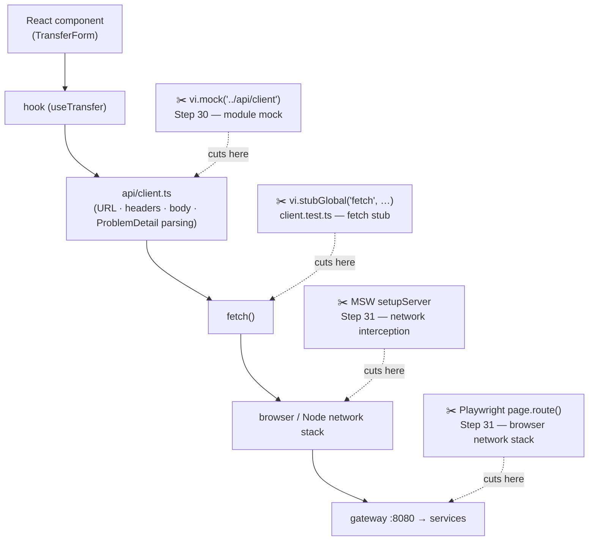
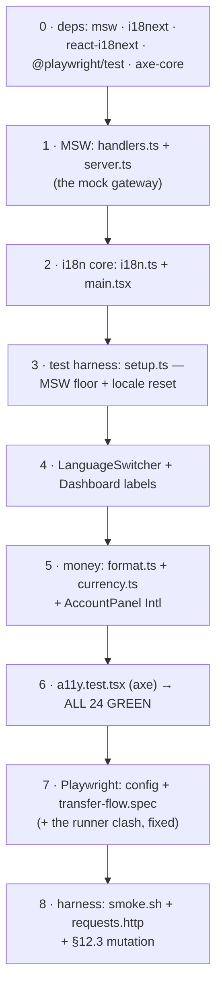

# Step 31 · Frontend pt. 3 — Testing, Accessibility & i18n (MSW, Playwright, a11y, multi-currency)
### Step 31 of 67 · Phase F — Full-Stack Frontend 🔵

> *Step 30 connected our React app to real backend APIs — and mocked them at the module level to test it. In Step 31 we master frontend quality: **MSW (Mock Service Worker)** moves our mocks down to the network layer so tests exercise real `fetch` behavior, **axe-core** turns accessibility into an automated gate, **react-i18next + `Intl.NumberFormat`** make the UI speak more than one language and more than one currency, and **Playwright** proves the whole money path — login → balance → transfer → live SSE notification — in a real Chromium.*

---

<a id="toc"></a>
## 🧭 The Six Movements of This Step

| | Movement | What happens | ~Time |
|---|---|---|---|
| **A** | [🧭 Orient](#orient) | 30-second overview · skip-test · cheat card · session plan | ~1 h |
| **B** | [🧠 Understand](#understand) | the mocking-boundary idea · pyramid vs trophy · a11y tree · i18n & Intl internals | ~2 h |
| **C** | [🛠️ Build](#build) | 9 sub-steps: deps → MSW → i18n → money → a11y → Playwright → harness | ~9.5 h |
| **D** | [🔬 Prove](#prove) | the Verification Log — every gate green, for real, incl. a §12.3 mutation | ~1 h |
| **E** | [🎓 Apply](#apply) | go deeper · interview prep (6 Q&A + STAR) · your-turn challenges | ~1.5 h |
| **F** | [🏆 Review](#review) | troubleshooting · resources · recap, flashcards, capsule | ~1 h |

**Total effort: ≈ 16 hours** — split across 8 sittings (see the [Session Plan](#session-plan)). Stopping mid-step at any ✋ checkpoint is a planned success, not a failure.

---

<a id="orient"></a>

# A · 🧭 Orient *(~1 h)*

## 📋 This Step in 30 Seconds

| | |
|---|---|
| **Title** | Frontend pt. 3 — Testing, Accessibility & i18n (MSW, Playwright, a11y, multi-currency) |
| **Step** | 31 of 67 · **Phase F — Full-Stack Frontend** 🔵 |
| **Effort** | ≈ 16 h focused (≈ 9.5 h of that is the build) |
| **What you'll run this step** | **Node 22 + npm only.** Vitest (component tests, now on an MSW network floor) and Playwright (E2E in a real Chromium). **No backend, no Docker required** — both test layers are hermetic by design. *(Optional, for 🎮 Play: the full gateway + services stack from Step 30.)* |
| **Buildable artifact** | `frontend/src/mocks/` (MSW handlers mirroring the gateway contract), `frontend/src/i18n/` (react-i18next + `Intl` money formatting), `frontend/src/a11y.test.tsx` (axe WCAG gate), `frontend/e2e/transfer-flow.spec.ts` (Playwright), `steps/step-31/{smoke.sh, requests.http}`, ADR-0022 |
| **Verification tier** | 🟠 **Standard** — `npm test` (24 tests), `npm run lint`, `npm run build`, `npx playwright test` (2/2), `smoke.sh` PASSED, plus a §12.3 mutation on the E2E |
| **Depends on** | **[Step 30](../step-30/lesson.md)** (Query + RHF/Zod + SSE), **[Step 29](../step-29/lesson.md)** (SPA + auth flow). Contracts referenced: Step 14 (Idempotency-Key, pagination envelope), Step 16 (JWT login), Step 20 (SSE notifications), Step 15/17 (gateway = single front door). |

By the end you'll **mock APIs at the network layer**, **catch WCAG violations automatically**, **render money correctly for any locale + currency**, and **prove the transfer flow in a real browser** — including asserting the `Idempotency-Key` header on the wire.

### ⏭️ Can You Skip This Step? (5-minute performance check)

Do these — don't just *feel* them. If **all four** pass, skim [🛠️ Build](#build) and jump to Step 32.

- [ ] **MSW:** in any Vite + Vitest repo, write an MSW handler for `POST /api/auth/login` that returns `401` with body `{ "detail": "Bad credentials" }`, wire `setupServer` into the test setup with `onUnhandledRequest: 'error'`, and make a component test assert the on-screen error — **no `vi.mock` anywhere**. *Pass: the test is green and any un-mocked request fails the run.*
- [ ] **a11y:** run `axe.run(container)` against a rendered form component; delete one `<label>` and name the violation id it reports. *Pass: you said `label` before running it.*
- [ ] **Intl:** in a Node REPL, print `1234.5` as German-locale euros **without typing `€`, `.` or `,` in your code**. *Pass: it prints `1.234,50 €`.*
- [ ] **Playwright:** write a spec that fills a login form and intercepts the login POST with `page.route()`, asserting a request header. *Pass: `npx playwright test` reports `1 passed` in a real Chromium.*

> [!TIP]
> Not 4/4? Stay. "How do you test your frontend?", "How do you make it accessible?", and "How do you display money for international users?" are three of the most reliable frontend interview questions in banking.

## 📇 Cheat Card

> **What this step delivers (one sentence):** a quality floor under the SPA — network-level API mocks (MSW), an automated WCAG gate (axe), locale-aware translations + multi-currency money (i18next + `Intl`), and a hermetic browser E2E of the full transfer flow (Playwright) — all runnable with `bash steps/step-31/smoke.sh`.

**Key commands** (from `frontend/`):

```bash
npm test                        # Vitest — 10 files / 24 tests on the MSW network floor
npm run test:e2e                # Playwright — 2 E2E specs in real Chromium (boots Vite itself)
npx playwright test --ui        # same, with the interactive UI runner
bash ../steps/step-31/smoke.sh  # all four gates: tests, lint, build, E2E (run from repo root: steps/step-31/smoke.sh)
```

**The headline — the same gateway contract, mocked at two network layers** (excerpts from the real files):

```ts
// src/mocks/handlers.ts — MSW intercepts the app's real fetch() in Vitest:
http.post(`${API_BASE}/bank/api/v1/transfers`, async ({ request }) => { /* 401 / 422 / 201 */ })

// e2e/transfer-flow.spec.ts — Playwright intercepts real Chromium networking:
const idempotencyKey = route.request().headers()['idempotency-key'];  // asserted ON THE WIRE
```

## 🎯 Why This Matters

Step 30's tests mocked `../api/client` at the **module** boundary — so a wrong URL, a dropped `Idempotency-Key` header, or a mis-parsed ProblemDetail body would sail through green tests and explode in production. Banks also live under accessibility law (ADA, the European Accessibility Act) and serve customers in many locales and currencies — "we'll fix the `$` hardcoding later" is how you end up displaying `$1.234,50` to a German customer. This step is the difference between "my React app works on my machine in English" and "my frontend is *provably* correct, accessible, and international" — which is exactly the story interviewers want to hear.

## ✅ What You'll Be Able to Do

Each outcome maps to at least one Test-Yourself item (constructive alignment — you'll know you know it):

| # | Outcome | Tested by |
|---|---|---|
| 1 | Mock a REST API at the **network layer** with MSW handlers that mirror a real gateway contract (auth, ProblemDetail errors, idempotency) | ✋ sub-steps 1 & 3 · ❓ B-1 · 🏋️ exercises 1–2 |
| 2 | Explain **which mocking boundary proves what** (module mock vs fetch stub vs MSW vs `page.route` vs real backend) and place a test suite on the pyramid/trophy | ❓ B-2 · 💼 Q1–Q2 · 🧠 Test Yourself |
| 3 | Enforce **WCAG A/AA basics** automatically (axe-core) and by construction (labels, `role="alert"`, `role="status"`) | 🔬 sub-step 6 · ❓ B-3 · 🏋️ near-transfer |
| 4 | Add **i18n** with react-i18next (synchronous resources, runtime language switch) without test-to-test leakage | ✋ sub-step 4 · 🩺 #6 · 🃏 flashcards |
| 5 | Format **multi-currency money** with `Intl.NumberFormat` — locale from the user, currency from the data, never a hardcoded `$` | 🔮 sub-step 5 · ⏭️ skip-check 3 · 🧠 Test Yourself |
| 6 | Write a **hermetic Playwright E2E** (webServer, route mocks, SSE stream mock) that asserts behavior *and* network contracts, and argue its trade-offs | 🔬 sub-steps 7–8 · 💼 Q6 · §12.3 mutation |

## 🧰 Before You Start

- **Prereqs:** Node 22 + npm (check: `node --version`). ~300 MB free disk for Playwright's Chromium.
- **You already have** (callbacks we build on): the SPA with login/AuthContext (Step 29), TanStack Query + RHF/Zod `TransferForm` + SSE `LiveNotifications` (Step 30), and 15 green Vitest tests in 6 files. On the backend side you built the very contracts we'll mirror: `Idempotency-Key` transfers (Step 14), JWT auth (Step 16), SSE notifications (Step 20), all fronted by the gateway (Steps 15/17/29/30).
- `Depends on: Steps 29, 30` (hard), `Steps 14, 16, 20` (contract knowledge).
- **Start clean:** `git status` clean at `step-31-start` (== `step-30-end`): `cd frontend && npm test` → 15 tests green.

<a id="session-plan"></a>
## 🗓️ Session Plan — 8 sittings, each ~1.5–2.5 h, each ending at a ✋

| # | Sitting | Covers | ~Time | Ends at |
|---|---|---|---|---|
| 1 | **The map** | Movements A + B (read, answer the ❓s) | ~2.5 h | ✋ end of B |
| 2 | **Tools + the mock gateway** | Sub-steps 0–1 (deps, MSW handlers + server) | ~2 h | ✋ sub-step 1 |
| 3 | **Speak i18n, wire the harness** | Sub-steps 2–3 (i18n core, test setup + MSW floor) | ~1.5 h | ✋ sub-step 3 |
| 4 | **Switch language, format money** | Sub-steps 4–5 | ~2 h | ✋ sub-step 5 |
| 5 | **The a11y gate + all 24 green** | Sub-step 6 (axe + full suite run) | ~1.5 h | ✋ sub-step 6 |
| 6 | **Real browser** | Sub-step 7 (Playwright config + E2E spec + the runner clash) | ~2.5 h | ✋ sub-step 7 |
| 7 | **Harness + prove it** | Sub-step 8 (smoke.sh, requests.http, §12.3 mutation) + 🎮 + Movement D | ~2 h | ✋ end of D |
| 8 | **Own it** | Movements E + F (interview prep, exercises, recap) | ~1.5 h | 🏁 done |

**Optional routes (choose your adventure):**
- ⏭️ **Skip-test route:** pass the 4 checks above → read B + the E2E spec, run `smoke.sh`, do the near-transfer exercise (~4 h total).
- 🚀 **Asides menu** (outside the 16 h budget): MSW browser/worker mode (+~30 min) · Playwright trace viewer (+~20 min) · i18next namespaces & extraction (+~30 min) · `aria-live` deep dive (+~20 min) · minor-units money libraries (+~20 min) — all in [🚀 Go Deeper](#go-deeper).

---

<a id="understand"></a>

# B · 🧠 Understand *(~2 h)*

## 🧠 The Big Idea — the boundary you mock is the boundary you prove *(~45 min)*

Every test replaces some part of the real world with a fake. The **only** question that matters is *where you make the cut* — because everything above the cut is tested, and everything below it is **assumed**.

In Step 30 we cut at the module boundary:

```ts
vi.mock('../api/client');   // Step 30: everything below this line is ASSUMED to work
```

That proved our components call `api.transfer(...)` with the right arguments. It proved **nothing** about what `transfer` actually does: the URL it hits, the `Idempotency-Key` header it sets, how it serializes the body, or how it parses an RFC 9457 ProblemDetail error. Refactor the client from `fetch` to `axios` and every one of those tests keeps passing — or breaks — for reasons that have nothing to do with user-visible behavior.

**MSW (Mock Service Worker)** moves the cut *below* `fetch`. Your app executes its real networking code; MSW intercepts the request in-process — before any socket opens — and your handler plays the gateway's part. **Playwright's `page.route()`** makes the same cut one level deeper still: inside a real browser's network stack. Here is the whole ladder:



*Alt-text: a vertical stack from React component down to gateway; four scissors show where each mocking technique cuts: vi.mock above the client, fetch-stub at fetch, MSW below fetch in the process, page.route in the browser network stack just before the real gateway.*

**Analogy — testing a car 🚗:** a module mock is bench-testing the dashboard with the engine unbolted (the fuel gauge sweeps nicely; you've proven nothing about fuel). MSW is a **rolling road** — the fully assembled car drives at 120 km/h with the wheels on rollers: engine, transmission, electronics all real; only the road is fake. Playwright is a **closed test track** with a robot driver — real car, real driving, controlled world. And the deployed stack (Step 32's capstone) is public roads.

What each cut can catch:

| Bug | `vi.mock` client | fetch stub | **MSW** | **page.route** | real backend |
|---|---|---|---|---|---|
| Component wires form → API call | ✅ | ✅ | ✅ | ✅ | ✅ |
| Wrong URL / missing `/bank` prefix | ❌ | ✅ | ✅ | ✅ | ✅ |
| Missing `Idempotency-Key` header | ❌ | ✅ | ✅ | ✅ | ✅ |
| ProblemDetail body mis-parsed | ❌ | ⚠️ hand-built Response | ✅ real Response | ✅ | ✅ |
| Routing/render across pages, real browser APIs | ❌ | ❌ | ❌ (jsdom) | ✅ | ✅ |
| Contract drift vs the *deployed* gateway | ❌ | ❌ | ❌ | ❌ | ✅ |

The last row is why the Verification Log honestly says: the hermetic layers **cannot** prove the deployed chain — that stays Step 32 capstone material.

🔮 **Predict #1:** our Step-29 `client.test.ts` stubs the global `fetch` itself (`vi.stubGlobal('fetch', fetchMock)`). This step wires MSW under the **whole** suite with `onUnhandledRequest: 'error'` — any request no handler matches fails the test. Will `client.test.ts` still pass, fail on unhandled requests, or start hitting MSW handlers? Hold your answer — we run it for real in [sub-step 3](#sub-3).

❓ **Knowledge check #1:** the client dev renames the header to `Idempotency_Key` (underscore) during a refactor. Which test layers from the table catch it — and which Step-30 test stays green?

<details><summary>Answer</summary>

The Step-30 `TransferForm.test.tsx` stays **green** — it asserts `api.transfer` was *called with* an idempotency key argument, not what the client does with it. The fetch stub (`client.test.ts`) catches it (it asserts `headers['Idempotency-Key']`), MSW *can* catch it (a handler that requires the header), and our Playwright transfer route **does** catch it — it fulfills with `400` when the header is missing. That exact failure is demonstrated for real in [sub-step 8](#sub-8)'s §12.3 mutation.
</details>

## 🧩 Pattern Spotlight — the testing pyramid vs the testing trophy *(~20 min)*

**Problem:** how many tests of each kind? **Classic pyramid** (Mike Cohn): lots of unit tests, fewer integration, a handful of E2E — because E2E used to be slow and flaky (Selenium era). **Testing trophy** (Kent C. Dodds, for frontends): the biggest bulge belongs to **integration-style component tests** — render real components, click like a user, mock only the network — because that's the best confidence-per-millisecond in UI code.

```
        pyramid                     trophy
          /\                        ____
         /E2E\                     ( E2E )        ← few, high-value (Playwright: 2)
        /------\                   /------\
       / integr \                 |  integ |      ← the bulge (components + MSW: 9)
      /----------\                 \------/
     /    unit    \                | unit |       ← pure logic (format, currency, client: 12)
    /--------------\               '------'
                                   ~static~       ← TypeScript + ESLint (free, always on)
```

*Alt-text: ASCII pyramid beside an ASCII trophy; the trophy's widest band is integration; a "static" base row of TypeScript and ESLint sits under the trophy.*

Where **our** suite lands after this step (real numbers from the Verification Log):

| Layer | What | Count |
|---|---|---|
| Static | `tsc` + ESLint (strict, `no-explicit-any`) | every commit |
| Unit | `format.test.ts` (3) · `currency.test.ts` (3) · `client.test.ts` (6, fetch-stub) | 12 |
| Component/integration | `LoginPage` (2) · `TransferForm` (2) · `AccountPanel` (2) · `ProtectedRoute` (2) · `useNotificationStream` (1) · `LanguageSwitcher` (1) · `a11y` (2) — all running **on the MSW floor** | 12 |
| E2E | Playwright `transfer-flow.spec.ts` | 2 |

**Trade-off:** trophies buy realism at the price of speed (our 24 Vitest tests: ~4 s; the 2 Playwright tests: ~4.5 s **for two**). **Alternative:** pure-pyramid suites run faster but let wiring bugs through; pure-E2E suites are 30-minute CI marathons. We take the trophy with a small, sharp E2E crown.

❓ **Knowledge check #2:** why do we *keep* `client.test.ts` on a fetch stub instead of migrating it to MSW like everything else?

<details><summary>Answer</summary>

It's a **unit test of the client itself** — it asserts the exact `RequestInit` (method, serialized body, each header) that the client constructs. A fetch stub hands you that object directly; with MSW you'd re-derive it from the intercepted `Request`. Both are legitimate — different altitudes. Component tests shouldn't care about `RequestInit`; the client's own unit test *is exactly about* `RequestInit`. One idea per layer.
</details>

## 🌱 Under the Hood — nothing here is magic *(~35 min)*

**How MSW intercepts without a network.** `setupServer()` (from `msw/node`) uses the `@mswjs/interceptors` library to patch Node's request internals — `fetch`, `http.request`, `XMLHttpRequest` — at process level. When the app calls `fetch('http://localhost:8080/bank/api/v1/transfers', …)`, the interceptor builds a standard `Request` object and walks your handler list **in order**, matching on method + URL pattern (`:id` segments and `*` wildcards supported). First match wins; its return value (`HttpResponse.json(...)` builds a spec-compliant `Response` with `Content-Type: application/json`) is handed back to the app **as if it came off the wire** — status, headers, body stream, the lot. No socket ever opens; no port is listened on ("server" is a metaphor). In the browser (the mode we *don't* use this step), the same handlers run inside a real Service Worker instead — same API, different interceptor. That's why the ecosystem calls this "network-level": the app's entire HTTP pipeline executes for real; only the far end is played by your handler.

**The accessibility tree.** Browsers maintain a second tree next to the DOM: the **AX tree**, which assistive tech (screen readers, voice control) consumes. Semantic HTML populates it for free — that's most of WCAG's "basics":

| You write | AX tree exposes | Which is why |
|---|---|---|
| `<button>` | `role=button`, its text as the *accessible name* | `getByRole('button', { name: 'Sign in' })` works |
| `<label>Username <input/></label>` | the input's accessible name = "Username" | `getByLabelText(/username/i)` + screen readers announce it |
| `<form aria-label="Transfer">` | `role=form` **named** "Transfer" (unnamed forms get no landmark) | `getByRole('form', { name: 'Transfer' })` in the E2E |
| `<p role="alert">` | a live region, `aria-live="assertive"` | errors are **announced immediately**, no focus needed |
| `<p role="status">` | a live region, `aria-live="polite"` | "Transfer sent ✓" waits for a pause in speech |

Notice the double payoff we've been collecting since Step 29 without naming it: **Testing Library queries the AX tree too.** Every `getByRole`/`getByLabelText` in our tests only works *because* the markup is accessible. axe-core (sub-step 6) audits the rendered DOM against ~100 WCAG rules (we run the `wcag2a/aa` + `wcag21a/aa` tag sets) and returns a `violations` array — our test asserts it's empty.

**react-i18next mechanics.** `i18next` is a plain JS **singleton** holding a resource tree (`language → namespace → key → string`) and an event emitter. `initReactI18next` bridges it to React: `useTranslation()` subscribes the component to the `languageChanged` event, so `i18n.changeLanguage('es')` re-renders every subscribed component with `t('dashboard.signOut')` resolved against the new language (falling back to `fallbackLng` for missing keys). Because we **inline the resources** (no async backend plugin), `init` completes synchronously — components can render translated text on first paint, and tests never need to "wait for i18n".

🧵 **Thread-safety note (the JS edition):** that singleton is **shared mutable state across every test in a file run** — the same disease as Step 11's shared counters, just single-threaded: instead of a data race you get *order-dependent tests* (a test that switches to Spanish poisons the next one). Same cure as always: guard the shared state — we reset the language in `afterEach` (sub-step 3), exactly like `server.resetHandlers()` guards MSW's handler stack and `localStorage.clear()` guards auth.

**`Intl.NumberFormat`.** Built into V8/Node 22 (full ICU) and every modern browser, backed by the Unicode **CLDR** locale database. `new Intl.NumberFormat('de-DE', { style: 'currency', currency: 'EUR' })` knows German digit grouping (`1.234,50`), symbol placement (trailing, with a non-breaking space), and per-currency decimal rules (JPY has **zero** minor digits). Locale and currency are **independent axes** — that's the whole design of our `formatMoney(amount, currency, locale)`.

❓ **Knowledge check #3:** the TransferForm shows two messages: "To account is required" (validation error) and "Transfer txn-1 sent ✓" (success). One is `role="alert"`, the other `role="status"` — which is which, and why?

<details><summary>Answer</summary>

Errors get `role="alert"` (`aria-live="assertive"`): the user's current action failed, so the screen reader interrupts to say so. Success gets `role="status"` (`aria-live="polite"`): important but not urgent — it's announced at the next pause instead of stepping on whatever is being read. Using `alert` for everything trains users to ignore alerts. Both are already in `TransferForm.tsx` from Step 30; this step adds the machine check (axe) and *asserts* `role=status` from a real browser in the E2E.
</details>

## 🛡️ Security Lens *(~10 min)*

- **Mocks must never ship.** `src/mocks/server.ts` is imported from exactly one place: `src/test/setup.ts` — which only Vitest loads. Playwright's routes live in `e2e/`, outside the app source. Verify it yourself: the production bundle in sub-step 7's build output contains no `msw` (and CI would fail loudly if handlers answered real customers with `mock-jwt`).
- **No real secrets in handlers.** `alice/password123` is the Step-16 *demo* user; handlers return an obviously fake `mock-jwt`. Never paste production tokens into fixtures — mock files live in git forever.
- **Idempotency from the browser matters.** A user double-clicking "Send transfer" (or a flaky network retry) is the browser-side version of Step 14's duplicate-POST problem. Our E2E asserts the header **on the wire**; the mutation in sub-step 8 proves the assertion bites.
- **i18n and XSS:** we set `interpolation.escapeValue: false` *only because React escapes all interpolated text itself*. The moment someone renders a translation with `dangerouslySetInnerHTML`, that assumption dies — don't.
- **a11y is compliance, not charity:** banks are squarely in scope of the ADA (US case law) and the European Accessibility Act (in force since June 2025) — WCAG 2.1 AA is the de-facto bar. An automated gate is the cheapest first line.

## 🕰️ Then vs. Now *(~10 min)*

| Concern | Then | Now (this step) | Why it changed · legacy note |
|---|---|---|---|
| Browser E2E | Selenium/WebDriver (2004+): out-of-process, flaky waits, driver-version roulette | **Playwright**: speaks the browser's own protocol (CDP), auto-waiting locators, bundled browsers | Reliability + speed; huge Selenium estates still run in enterprise CI |
| API mocking in tests | `sinon.fakeServer`, hand-rolled `fetch` stubs, `jest.mock` everywhere | **MSW**: one handler set, request-level, shared across test layers | Mocks moved to the boundary that matches reality; module mocks persist in older Jest codebases |
| Currency display | Hand-written `formatMoney` with regex comma-insertion and a `SYMBOLS` map | **`Intl.NumberFormat`** (full ICU in Node ≥ 13, all browsers) | CLDR does it correctly for ~700 locales; legacy utils linger and get JPY decimals wrong |
| a11y checking | Annual manual audit (if ever) | **axe-core in the test suite** — every `npm test` | Shift-left; manual audits still needed for what machines can't judge (~"is this *usable*?") |

**✋ Checkpoint (end of Movement B).** You can now say, in one sentence each: where MSW cuts, why the trophy bulges in the middle, what the AX tree is, why the i18n singleton needs an `afterEach` reset, and which two axes `formatMoney` keeps independent. All three ❓ answered?
**Re-entry ritual:** *Stopping here? You have the mental map (nothing built yet). Next session: [sub-step 0](#sub-0); first action: `cd frontend && node --version` (expect v22.x), then open `frontend/package.json`.*

---

<a id="build"></a>

# C · 🛠️ Let's Build It — Step by Step *(~9.5 h)*

We build bottom-up: tools first, then the mock gateway (MSW), then the i18n core it needs, then the harness wiring, then the user-visible features (language switcher, multi-currency money), then the gates (axe, Playwright), then the step harness. **Nine sub-steps — run something at every one.**



*Alt-text: nine boxes in a chain — dependencies, MSW mock gateway, i18n core, test harness wiring, language switcher, money formatting, a11y gate with all tests green, Playwright E2E, then the smoke/requests harness with the mutation check.*

## 📦 Your Starting Point

Tag `step-31-start` (== `step-30-end`). **Green right now:** `npm run build` (tsc + vite, 111 modules), `npm run lint` (1 benign warning), `npm test` → **6 files / 15 tests**, all API mocking via `vi.mock` / fetch stubs. **This step adds** (🌳 files we'll touch):

```
frontend/
├── package.json                        (± deps: msw, i18next, react-i18next, @playwright/test, axe-core)
├── vite.config.ts                      (± test.exclude: e2e/**  — sub-step 7's fix)
├── playwright.config.ts                (new — webServer + chromium project)
├── e2e/
│   └── transfer-flow.spec.ts           (new — the money path in real Chromium)
└── src/
    ├── main.tsx                        (± import './i18n/i18n')
    ├── mocks/
    │   ├── handlers.ts                 (new — the gateway contract, mocked)
    │   └── server.ts                   (new — setupServer)
    ├── test/setup.ts                   (± MSW lifecycle + i18n locale reset)
    ├── a11y.test.tsx                   (new — axe WCAG gate)
    ├── i18n/
    │   ├── i18n.ts                     (new — synchronous resources en/es)
    │   ├── LanguageSwitcher.tsx        (new)  + LanguageSwitcher.test.tsx
    │   └── format.ts                   (new — Intl money/date)  + format.test.ts
    ├── utils/
    │   └── currency.ts                 (new — Intl currency util)  + currency.test.ts
    ├── pages/DashboardPage.tsx         (± t() labels + <LanguageSwitcher/> + labeled account input)
    ├── accounts/AccountPanel.tsx       (± Intl-formatted balance, locale-aware)
    └── accounts/AccountPanel.test.tsx  (± one assertion: "$200.00")
steps/step-31/{requests.http, smoke.sh} · adr/0022-frontend-testing-accessibility-i18n.md
```

---

<a id="sub-0"></a>
### Sub-step 0 of 8 — Install the quality toolchain *(~40 min)* 🧭 *(you are here: **deps** → MSW → i18n core → harness → switcher → money → a11y → E2E → harness scripts)*

🎯 **Goal:** add the five tools of this step — `msw` (network mocks), `i18next` + `react-i18next` (translations), `@playwright/test` (browser E2E), `axe-core` (WCAG audit) — plus a `test:e2e` script, and download Playwright's Chromium.

📁 **Location:** edit `frontend/package.json` (then let npm rewrite `package-lock.json`).

⌨️ **Code** — the exact Step-31 diff of `frontend/package.json`:

```diff
     "build": "tsc && vite build",
     "preview": "vite preview",
     "lint": "eslint .",
-    "test": "vitest run"
+    "test": "vitest run",
+    "test:e2e": "playwright test"
   },
   "dependencies": {
     "@hookform/resolvers": "^3.10.0",
     "@tanstack/react-query": "^5.62.0",
+    "i18next": "^24.2.0",
     "react": "^19.1.0",
     "react-dom": "^19.1.0",
     "react-hook-form": "^7.54.0",
+    "react-i18next": "^15.4.0",
     "react-router-dom": "^7.6.0",
     "zod": "^3.24.0"
   },
   "devDependencies": {
     "@eslint/js": "^9.17.0",
+    "@playwright/test": "^1.49.0",
+    "axe-core": "^4.10.0",
+    "msw": "^2.7.0",
     "@testing-library/dom": "^10.4.0",
```

Apply it with npm (this edits `package.json` for you and installs in one go), then fetch the browser:

```bash
cd frontend
npm install i18next@^24.2.0 react-i18next@^15.4.0
npm install -D msw@^2.7.0 @playwright/test@^1.49.0 axe-core@^4.10.0
npx playwright install chromium
```

🔍 **Line-by-line:**

- `"test:e2e": "playwright test"` — a second, **separate** test runner. `npm test` stays Vitest; `npm run test:e2e` is Playwright. Two runners, two universes — the friction between them produces sub-step 7's real bug.
- `i18next` (runtime dep) — the framework-agnostic translation engine (the singleton from Movement B). `react-i18next` — its React bridge (`useTranslation`, `initReactI18next`). Runtime `dependencies`, because translated strings render in production.
- `msw` (dev dep) — Mock Service Worker; we use its Node mode (`msw/node`) inside Vitest only, so it's a `devDependency` and can never leak into the bundle.
- `@playwright/test` (dev dep) — the E2E runner *and* browser manager. `npx playwright install chromium` downloads a pinned Chromium build (~130 MB) into a shared cache (`%LOCALAPPDATA%\ms-playwright` on Windows, `~/.cache/ms-playwright` on Linux/macOS) — **browsers are not in `node_modules`**, which is why CI needs this command too. Plain `npx playwright install` would grab Firefox + WebKit as well; our config (sub-step 7) only uses Chromium.
- `axe-core` (dev dep) — Deque's WCAG rule engine, ~100 rules; we call its `axe.run()` directly from a Vitest test (no wrapper library needed).
- The `^` ranges are npm caret semantics (any compatible minor/patch); lockfile-resolved versions live in `VERSIONS.md` — notably `@playwright/test ^1.49.0` resolves to **1.60.0** here.

💭 **Under the hood:** `npm install` resolves the five packages against the existing lockfile and writes exact versions back into `package-lock.json` — that file is why your teammate gets byte-identical `node_modules`. Playwright's postinstall does *not* download browsers (deliberate — huge, and servers may not need them); the explicit `install chromium` step does, verifying checksums against the release the npm package was tested with.

▶️ **Run & See** — confirm the runner and the browser cache:

```bash
npx playwright --version
ls "$LOCALAPPDATA/ms-playwright"   # Windows Git Bash; on Linux/macOS: ls ~/.cache/ms-playwright
```

✅ **Expected** (real output from this machine):

```
Version 1.60.0
chromium-1223  chromium_headless_shell-1223  ffmpeg-1011  firefox-1522  webkit-2287
```

(Your cache may show only `chromium-*` entries if you installed just Chromium — that's all this step needs.)

❌ **Common wrong output:** `Version …` prints but the cache directory is empty or missing → you skipped `npx playwright install chromium`; sub-step 7 would fail with `Executable doesn't exist` (see 🩺 #3).

✋ **Checkpoint:** five new packages in `package.json`, `npx playwright --version` answers, Chromium present in the cache.
**Re-entry ritual:** *Stopping here? You have the toolchain installed, nothing wired. Next session: [sub-step 1](#sub-1); first action: create `frontend/src/mocks/handlers.ts`.*

💾 **Commit:**

```bash
git add frontend/package.json frontend/package-lock.json
git commit -m "build(frontend): add msw, react-i18next, playwright, axe-core (step 31 toolchain)"
```

⚠️ **Pitfall:** don't add `playwright` (the bare library) — the runner lives in `@playwright/test`, and installing both invites version skew. And never commit the browser cache; it's outside the repo for a reason.

---

<a id="sub-1"></a>
### Sub-step 1 of 8 — MSW: the mock gateway (`handlers.ts` + `server.ts`) *(~1 h 15)* 🧭 *(deps ✅ → **MSW** → i18n core → harness → switcher → money → a11y → E2E → harness scripts)*

🎯 **Goal:** write the network-level mirror of our gateway contract — login (Step 16), `/bank` account + entries (Steps 14/30), idempotent transfers with ProblemDetail errors (Step 14) — as MSW request handlers, plus the one-line Node server that serves them.

📁 **Location:** two new files → `frontend/src/mocks/handlers.ts` and `frontend/src/mocks/server.ts`.

⌨️ **Code** (complete file #1 — type it; every handler mirrors an endpoint you built in Phases B–E):

```ts
// frontend/src/mocks/handlers.ts
import { http, HttpResponse } from 'msw';
import type { Account, Page, LedgerEntry, LoginResponse, CurrentUser } from '../api/client';

const API_BASE = import.meta.env.VITE_API_BASE_URL ?? 'http://localhost:8080';

export const handlers = [
  // Auth
  http.post(`${API_BASE}/api/auth/login`, async ({ request }) => {
    const { username, password } = (await request.json()) as { username: string; password: string };
    if (username === 'alice' && password === 'password123') {
      return HttpResponse.json<LoginResponse>({ token: 'mock-jwt', expiresInSeconds: 3600 });
    }
    return HttpResponse.json({ detail: 'Bad credentials' }, { status: 401 });
  }),

  http.get(`${API_BASE}/api/auth/me`, ({ request }) => {
    const auth = request.headers.get('Authorization');
    if (!auth || !auth.startsWith('Bearer ')) {
      return new HttpResponse(null, { status: 401 });
    }
    return HttpResponse.json<CurrentUser>({ username: 'alice', roles: ['ROLE_USER'] });
  }),

  // Account
  http.get(`${API_BASE}/bank/api/accounts/:id`, ({ params, request }) => {
    const auth = request.headers.get('Authorization');
    if (!auth) return new HttpResponse(null, { status: 401 });
    if (params.id === 'ACC-ERROR') {
      return HttpResponse.json({ detail: 'Account not found' }, { status: 404 });
    }
    return HttpResponse.json<Account>({
      accountNumber: String(params.id),
      currency: 'USD',
      balance: 1500.00,
    });
  }),

  // Ledger Entries
  http.get(`${API_BASE}/bank/api/v1/accounts/:id/entries`, ({ request }) => {
    const auth = request.headers.get('Authorization');
    if (!auth) return new HttpResponse(null, { status: 401 });
    
    const page: Page<LedgerEntry> = {
      content: [
        { transactionId: 'tx-1', direction: 'CREDIT', amount: 500.00, description: 'Deposit', createdAt: '2026-01-01T10:00:00Z' },
      ],
      page: 0,
      size: 10,
      totalElements: 1,
      totalPages: 1,
    };
    return HttpResponse.json(page);
  }),

  // Transfer
  http.post(`${API_BASE}/bank/api/v1/transfers`, async ({ request }) => {
    const auth = request.headers.get('Authorization');
    if (!auth) return new HttpResponse(null, { status: 401 });
    
    const body = (await request.json()) as { amount: number };
    if (body.amount > 1000000) {
      return HttpResponse.json({ detail: 'Insufficient funds' }, { status: 422 });
    }
    
    return HttpResponse.json({ transactionId: 'mock-tx-uuid' }, { status: 201 });
  }),
];
```

⌨️ **Code** (complete file #2 — six lines):

```ts
// frontend/src/mocks/server.ts
import { setupServer } from 'msw/node';
import { handlers } from './handlers';

// This configures a request mocking server with the given request handlers.
export const server = setupServer(...handlers);
```

🔍 **Line-by-line:**

- `http, HttpResponse` — MSW v2's handler namespace and response factory. `http.post(pattern, resolver)` registers a resolver for POSTs whose URL matches `pattern`; `HttpResponse.json(body, { status })` builds a real `Response` with a JSON body and `Content-Type: application/json`.
- `import type { Account, … } from '../api/client'` — **the keystone line.** The mock's response shapes are the client's *own TypeScript types*. If Step 32 renames `balance` → `available`, this file stops compiling — contract drift becomes a build error, not a production surprise. (`import type` is erased at compile time — no runtime coupling to the client.)
- `API_BASE = import.meta.env.VITE_API_BASE_URL ?? 'http://localhost:8080'` — the *same* expression `api/client.ts` uses for its `BASE_URL`. MSW matches on the **full** URL, so the mock must agree with the client about the origin, or nothing matches. One convention, two files, zero drift.
- `(await request.json()) as { username: string; password: string }` — `request` is a standard Fetch-API `Request`; `.json()` returns `Promise<unknown>`-ish, so we assert the shape we accept. (The cast, not `any` — see the ▶️ below for why that distinction is enforced.)
- Login mirrors Step 16's contract: correct demo credentials → `{ token, expiresInSeconds }`; anything else → **401 with an RFC 9457-style `{ detail }` body**, exactly what `client.ts` parses into `ApiError.message` ("Bad credentials" surfaces in the UI).
- Every protected handler starts with the same guard the real gateway enforces: no `Authorization` header → `401` with an empty body (`new HttpResponse(null, …)` — no body at all, which also exercises the client's "non-JSON body" fallback branch).
- `:id` in `/bank/api/accounts/:id` is a path parameter — `params.id` delivers it, and the magic account `ACC-ERROR` returns a 404 ProblemDetail so component tests can trigger error states *through the network* instead of `mockRejectedValue`.
- The entries handler returns Step 14's pagination envelope (`content/page/size/totalElements/totalPages`) — typed as `Page<LedgerEntry>` so the envelope can't drift either.
- The transfer handler: `amount > 1000000` → **422 `{ detail: 'Insufficient funds' }`** (the business-rule rejection from Step 14), else **201** with a `transactionId`. Note what it does *not* yet check: the `Idempotency-Key` header — the Playwright layer asserts that on the wire in sub-step 7, and making *this* handler as strict is exercise 🏋️ 1.
- `setupServer(...handlers)` — spreads the array into MSW's Node-side interceptor. Creating it here (not in setup.ts) lets any *individual test* import `server` and override handlers per-test with `server.use(...)`.

💭 **Under the hood:** handler order matters — MSW walks the list top-down and the first match resolves the request. A `params`-typed match like `:id` happily swallows `/bank/api/accounts/anything`, so put more-specific routes above generic ones if you ever add them. Also note there is **no SSE handler**: `EventSource` isn't `fetch`, jsdom doesn't implement it, and our Step-30 setup already stubs it — streams are mocked at the Playwright layer instead (sub-step 7), where a real browser's `EventSource` exists.

🔮 **Predict #2:** the first draft of this file (true story) wrote `const { username, password } = await request.json() as any;`. Our ESLint config is `typescript-eslint` strict. What exactly happens on `npm run lint`?

<details><summary>Answer</summary>

Two hard errors — `@typescript-eslint/no-explicit-any`, one per `as any` (login + transfer) — failing the lint gate. See the real output below; the fix is the typed assertion you typed above.
</details>

▶️ **Run & See** — lint the new files:

```bash
npm run lint
```

❌ **Common wrong output** (the real capture from this step's first draft, with `as any` on the two `request.json()` lines):

```
C:\...\frontend\src\mocks\handlers.ts
  10:60  error  Unexpected any. Specify a different type  @typescript-eslint/no-explicit-any
  61:42  error  Unexpected any. Specify a different type  @typescript-eslint/no-explicit-any
✖ 3 problems (2 errors, 1 warning)
```

Fix = type what you accept: `(await request.json()) as { username: string; password: string }` and `(await request.json()) as { amount: number }` — as shown in the ⌨️ code above.

✅ **Expected** (real output, after the fix):

```
C:\Users\ramishtaha\Desktop\Claude\build-a-bank\frontend\src\auth\AuthContext.tsx
  46:17  warning  Fast refresh only works when a file only exports components. Use a new file to share constants or functions between components  react-refresh/only-export-components

✖ 1 problem (0 errors, 1 warning)
```

That one warning is the known-benign `react-refresh` advisory on `AuthContext.tsx`, present since Step 29 — zero errors is the gate.

✋ **Checkpoint:** `src/mocks/handlers.ts` + `server.ts` exist, typed against the client's own interfaces; lint is 0-errors.
**Re-entry ritual:** *Stopping here? You have a mock gateway nobody calls yet. Next session: [sub-step 2](#sub-2); first action: create `frontend/src/i18n/i18n.ts`.*

💾 **Commit:**

```bash
git add frontend/src/mocks/
git commit -m "test(frontend): MSW handlers mirroring the gateway contract + node server"
```

⚠️ **Pitfall:** MSW matches the **whole URL**. If a handler says `http.get('/api/auth/me', …)` (path only) while the client fetches `http://localhost:8080/api/auth/me`, the handler *does* match relative-path requests but your absolute-URL request only matches because MSW treats path-only patterns as same-origin — in jsdom that origin is `http://localhost:5173`, **not** `:8080`. Always build patterns from the same `API_BASE` the client uses, like we did.

---

<a id="sub-2"></a>
### Sub-step 2 of 8 — The i18n core: `i18n.ts` + one line in `main.tsx` *(~40 min)* 🧭 *(deps ✅ → MSW ✅ → **i18n core** → harness → switcher → money → a11y → E2E → harness scripts)*

🎯 **Goal:** initialize the i18next singleton with **inlined, synchronous** English + Spanish resources, and make the app load it before first render.

📁 **Location:** new file → `frontend/src/i18n/i18n.ts`; one-line edit → `frontend/src/main.tsx`.

⌨️ **Code** (complete file — type it):

```ts
// frontend/src/i18n/i18n.ts
// Step 31 · internationalization with react-i18next. Resources are inlined (synchronous init — no async backend),
// so translations are available immediately in the app AND in tests. English is the default + fallback; Spanish
// demonstrates a second locale. Importing this module initializes the shared i18n instance.
import i18n from 'i18next';
import { initReactI18next } from 'react-i18next';

export const resources = {
  en: {
    translation: {
      'dashboard.title': 'Build-a-Bank 🏦',
      'dashboard.signedInAs': 'Signed in as',
      'dashboard.signOut': 'Sign out',
      'dashboard.viewAccount': 'View account',
      'lang.label': 'Language',
    },
  },
  es: {
    translation: {
      'dashboard.title': 'Build-a-Bank 🏦',
      'dashboard.signedInAs': 'Sesión iniciada como',
      'dashboard.signOut': 'Cerrar sesión',
      'dashboard.viewAccount': 'Ver cuenta',
      'lang.label': 'Idioma',
    },
  },
} as const;

void i18n.use(initReactI18next).init({
  resources,
  lng: 'en',
  fallbackLng: 'en',
  interpolation: { escapeValue: false }, // React already escapes
});

export default i18n;
```

⌨️ **Edit** — the exact Step-31 diff of `frontend/src/main.tsx`:

```diff
 import { App } from './App';
 import { AuthProvider } from './auth/AuthContext';
+import './i18n/i18n'; // Step 31 · initialize i18n before the app renders
 import './index.css';
```

🔍 **Line-by-line:**

- `resources` — the whole translation database, inlined: `language → namespace → key → string`. `translation` is i18next's default namespace (bigger apps split into `dashboard`, `errors`, … — see 🚀). Keys are dotted paths by convention (`dashboard.signOut`), *not* nested objects here — flat keys keep grep trivial.
- `as const` — freezes the literal types, so tooling can know exactly which keys exist. Exporting `resources` also lets a test (or a future type-checking setup) import the same source of truth.
- `i18n.use(initReactI18next)` — registers the React bridge as a plugin *before* `init`. This is what lets `useTranslation()` anywhere in the tree find this instance.
- `.init({ resources, lng: 'en', … })` — because `resources` is provided inline, **`init` completes synchronously** — no `Suspense`, no loading flicker, and (crucially for us) no `await` needed in tests. The alternative — an async HTTP backend plugin fetching `/locales/en.json` — is how large apps lazy-load translations, at the cost of async init everywhere.
- `fallbackLng: 'en'` — a key missing in Spanish falls back to the English string instead of breaking the UI.
- `interpolation: { escapeValue: false }` — i18next's own HTML-escaping is redundant under React (which escapes all `{}` text), and double-escaping turns `&` into `&amp;amp;`. Movement B's 🛡️ caveat applies: this is only safe while nobody `dangerouslySetInnerHTML`s a translation.
- `void i18n.use(...).init(...)` — `init` returns a promise; `void` tells ESLint (`no-floating-promises`) we deliberately don't await it (synchronous resources make the promise already-resolved).
- The `main.tsx` import is **for side effects only** — importing the module runs `init`. Forget this line and every `t('dashboard.title')` renders the raw key string (see 🩺 #6).

💭 **Under the hood:** `i18next` keeps the active language and resource store on a module-level singleton — the same object whether imported from `main.tsx`, a component, or a test. `changeLanguage('es')` swaps a field and emits `languageChanged`; `initReactI18next` subscribes rendered components to that event. That singleton is also why tests must reset it (next sub-step) — Movement B's 🧵 note in action.

🔮 **Predict #3:** imagine a future `dashboard.welcome` key added only to the `en` block. With the config above, what renders when the app is in Spanish? And what if the key were missing from *both* languages?

<details><summary>Answer</summary>

Missing in `es` only → the **English** string renders (`fallbackLng: 'en'`). Missing everywhere → i18next renders the **key itself** (`dashboard.welcome`) — which is also your debugging signal: raw dotted keys on screen mean the key (or the whole init import, 🩺 #6) is missing.
</details>

▶️ **Run & See** — the compiler is the first test:

```bash
npx tsc --noEmit
```

✅ **Expected** (real run): **no output at all** — silence is success; exit code `0`. (`--noEmit` type-checks the whole `src/` without writing files.)

❌ **Common wrong output:** `error TS2307: Cannot find module 'react-i18next'` → sub-step 0's install didn't run in `frontend/` — check your directory and re-run the installs.

✋ **Checkpoint:** `i18n.ts` compiles; `main.tsx` imports it; the app still builds.
**Re-entry ritual:** *Stopping here? You have i18n initialized but nothing translated on screen yet (the Dashboard still hardcodes English — that's sub-step 4). Next session: [sub-step 3](#sub-3); first action: open `frontend/src/test/setup.ts`.*

💾 **Commit:**

```bash
git add frontend/src/i18n/i18n.ts frontend/src/main.tsx
git commit -m "feat(frontend): i18next core with synchronous en/es resources"
```

⚠️ **Pitfall:** don't initialize i18n inside a component or a `useEffect` — it must run **before** the first render of anything calling `useTranslation()`, or the first paint shows raw keys. A top-level side-effect import in the entry point is the standard pattern.

---

<a id="sub-3"></a>
### Sub-step 3 of 8 — Wire the harness: the MSW floor + reset rituals in `setup.ts` *(~45 min)* 🧭 *(deps ✅ → MSW ✅ → i18n ✅ → **harness** → switcher → money → a11y → E2E → harness scripts)*

🎯 **Goal:** put MSW underneath **every** Vitest test — with unmatched requests treated as *errors* — and add the two per-test resets that keep tests independent: MSW handler overrides and the i18n language.

📁 **Location:** edit → `frontend/src/test/setup.ts`.

⌨️ **Code** — the exact Step-31 diff first:

```diff
 import '@testing-library/jest-dom/vitest';
 import { cleanup } from '@testing-library/react';
-import { afterEach } from 'vitest';
+import { beforeAll, afterEach, afterAll } from 'vitest';
+import { server } from '../mocks/server';
+
+import i18n from '../i18n/i18n'; // Step 31 · the shared i18n instance (initialized on import; synchronous resources)
 
 // jsdom's localStorage getter throws for an opaque origin, so Vitest leaves the global `undefined`. …
@@
+// Establish API mocking before all tests.
+beforeAll(() => server.listen({ onUnhandledRequest: 'error' }));
+
 afterEach(() => {
   cleanup();
   localStorage.clear();
+  void i18n.changeLanguage('en'); // reset locale so a language-switch test doesn't leak into the next
+  // Reset any request handlers that we may add during the tests,
+  // so they don't affect other tests.
+  server.resetHandlers();
 });
+
+// Clean up after the tests are finished.
+afterAll(() => server.close());
```

…and the complete resulting file (the Step-29/30 stubs are unchanged — micro-recap: jsdom lacks `localStorage` under an opaque origin and has no `EventSource`, so we polyfill/stub both):

```ts
// frontend/src/test/setup.ts
// Step 29 · Vitest setup — registers jest-dom matchers (toBeInTheDocument, …) and resets DOM + localStorage
// between tests so they're independent.
import '@testing-library/jest-dom/vitest';
import { cleanup } from '@testing-library/react';
import { beforeAll, afterEach, afterAll } from 'vitest';
import { server } from '../mocks/server';

import i18n from '../i18n/i18n'; // Step 31 · the shared i18n instance (initialized on import; synchronous resources)

// jsdom's localStorage getter throws for an opaque origin, so Vitest leaves the global `undefined`. The app
// uses localStorage (AuthContext), so install a tiny in-memory Storage for tests — deterministic and isolated.
if (typeof globalThis.localStorage === 'undefined') {
  const store = new Map<string, string>();
  globalThis.localStorage = {
    get length() {
      return store.size;
    },
    clear: () => store.clear(),
    getItem: (key: string) => store.get(key) ?? null,
    key: (index: number) => Array.from(store.keys())[index] ?? null,
    removeItem: (key: string) => store.delete(key),
    setItem: (key: string, value: string) => store.set(key, String(value)),
  } as Storage;
}

// jsdom doesn't implement EventSource (Step 30 SSE). Install a no-op stub so components that mount the SSE hook
// don't crash; tests that exercise streaming install their own controllable EventSource via vi.stubGlobal.
if (typeof globalThis.EventSource === 'undefined') {
  class NoopEventSource {
    onopen: (() => void) | null = null;
    onerror: (() => void) | null = null;
    addEventListener(): void {}
    removeEventListener(): void {}
    close(): void {}
  }
  globalThis.EventSource = NoopEventSource as unknown as typeof EventSource;
}

// Establish API mocking before all tests.
beforeAll(() => server.listen({ onUnhandledRequest: 'error' }));

afterEach(() => {
  cleanup();
  localStorage.clear();
  void i18n.changeLanguage('en'); // reset locale so a language-switch test doesn't leak into the next
  // Reset any request handlers that we may add during the tests,
  // so they don't affect other tests.
  server.resetHandlers();
});

// Clean up after the tests are finished.
afterAll(() => server.close());
```

🔍 **Line-by-line (the new pieces):**

- `import { server } from '../mocks/server'` — this import is **the only bridge** between app-shaped code and the mocks. Production code never imports anything under `src/mocks/` (the 🛡️ guarantee from Movement B).
- `import i18n from '../i18n/i18n'` — a *side-effect + handle* import: loading it runs `init` (so every test file gets translated rendering without importing i18n itself), and the handle lets `afterEach` reset the language.
- `beforeAll(() => server.listen({ onUnhandledRequest: 'error' }))` — starts interception once per test file. **`onUnhandledRequest: 'error'` is the entire personality of this harness:** any request that reaches the network layer without a matching handler doesn't silently 404, doesn't warn — it **fails the test** with a loud `[MSW] Error: intercepted a request without a matching request handler`. What that buys you: a component that starts calling a new endpoint *cannot* pass tests until someone writes the expected contract into `handlers.ts`. Contract drift now has a tripwire. (The default, `'warn'`, lets un-mocked calls escape to the real network — flaky in CI, invisible locally.)
- `afterEach` order: `cleanup()` (unmount React trees) → `localStorage.clear()` (Step 29's auth reset) → `i18n.changeLanguage('en')` (**the locale reset** — without it, sub-step 4's Spanish-switching test leaves the singleton in `es`, and any later test asserting English text fails *only when run after it* — order-dependent failure, the worst kind) → `server.resetHandlers()` (drops any per-test `server.use(...)` overrides, restoring the pristine handler list).
- `afterAll(() => server.close())` — removes the interceptor patches; Node's `fetch` is native again after the suite.

💭 **Under the hood:** Vitest runs `setupFiles` once **per test file**, in each file's isolated worker environment — so `beforeAll/afterAll` here are per-file brackets, and the MSW server + i18n singletons are per-worker instances. That's why the resets live in `afterEach`: file isolation can't save you from leakage *between tests of the same file*.

Time to resolve 🔮 **Predict #1** from Movement B: `client.test.ts` replaces `fetch` *itself* with `vi.stubGlobal('fetch', fetchMock)`. MSW intercepts real `fetch` calls — but if `fetch` **is** a mock function, no request is ever constructed, so nothing reaches the interceptor. Prediction: it passes, untouched by MSW.

▶️ **Run & See** — the Step-29 unit tests on the new floor:

```bash
npx vitest run src/api/client.test.ts
```

✅ **Expected** (real output from this machine):

```
 ✓ src/api/client.test.ts (6 tests) 10ms

 Test Files  1 passed (1)
      Tests  6 passed (6)
   Start at  11:35:27
   Duration  1.26s (transform 83ms, setup 366ms, collect 28ms, tests 10ms, environment 448ms, prepare 122ms)
```

Exactly as predicted: 6/6 green, MSW never consulted — the stub's cut sits *above* MSW's cut (Movement B's ladder, applied).

❌ **Common wrong output:** `Error: Failed to resolve import "../mocks/server"` → `setup.ts` edited before sub-step 1's files exist, or a typo'd relative path.

❓ **Knowledge check #4:** why does `server.resetHandlers()` live in `afterEach` rather than trusting each test to clean up its own `server.use(...)` overrides?

<details><summary>Answer</summary>

Because a failing test never reaches its own cleanup lines — the assertion throw skips them — and the override would leak into the next test, cascading one failure into many mysterious ones. `afterEach` runs even after failures. Same reasoning as `finally` around resource cleanup in Java (Step 6), and the same reason `cleanup()`/`localStorage.clear()` already lived here.
</details>

✋ **Checkpoint:** setup wires MSW (error-mode) + locale reset; `client.test.ts` runs green on the floor.
**Re-entry ritual:** *Stopping here? You have the full test harness wired — every test now runs on a strict network floor. Next session: [sub-step 4](#sub-4); first action: create `frontend/src/i18n/LanguageSwitcher.tsx`.*

💾 **Commit:**

```bash
git add frontend/src/test/setup.ts
git commit -m "test(frontend): MSW floor (onUnhandledRequest=error) + i18n locale reset in Vitest setup"
```

⚠️ **Pitfall:** `onUnhandledRequest: 'error'` applies to **every** request, including ones you forgot components make (an avatar image, an analytics beacon…). When a green suite suddenly fails after adding a feature, read the MSW error — it prints the method + URL it intercepted. That's not noise; that's the tripwire working (🩺 #5).

---

<a id="sub-4"></a>
### Sub-step 4 of 8 — `LanguageSwitcher` + a translated, labeled Dashboard *(~1 h)* 🧭 *(deps ✅ → MSW ✅ → i18n ✅ → harness ✅ → **switcher** → money → a11y → E2E → harness scripts)*

🎯 **Goal:** a `<select>` that switches the live locale, the Dashboard's hardcoded strings replaced with `t()` keys, an explicit label on the account selector (a11y), and a test proving English → Spanish re-rendering.

📁 **Location:** new files → `frontend/src/i18n/LanguageSwitcher.tsx`, `frontend/src/i18n/LanguageSwitcher.test.tsx`; edit → `frontend/src/pages/DashboardPage.tsx`.

⌨️ **Code** (complete component — type it):

```tsx
// frontend/src/i18n/LanguageSwitcher.tsx
// Step 31 · switches the active locale at runtime (react-i18next). Changing it re-renders translated text AND
// re-formats money (AccountPanel formats with the current language), so the whole UI follows the choice.
import { useTranslation } from 'react-i18next';

export function LanguageSwitcher() {
  const { i18n, t } = useTranslation();
  return (
    <label>
      {t('lang.label')}
      <select value={i18n.language} onChange={(event) => void i18n.changeLanguage(event.target.value)}>
        <option value="en">English</option>
        <option value="es">Español</option>
      </select>
    </label>
  );
}
```

⌨️ **Edit** — the exact Step-31 diff of `frontend/src/pages/DashboardPage.tsx`:

```diff
 import { useState } from 'react';
+import { useTranslation } from 'react-i18next';
 
 import { AccountPanel } from '../accounts/AccountPanel';
 import { TransferForm } from '../accounts/TransferForm';
 import { useAuth } from '../auth/AuthContext';
+import { LanguageSwitcher } from '../i18n/LanguageSwitcher';
 import { LiveNotifications } from '../notifications/LiveNotifications';
 
 export function DashboardPage() {
   const { user, logout } = useAuth();
+  const { t } = useTranslation();
   const [accountNumber, setAccountNumber] = useState('ACC-A');
 
   return (
     <main>
       <header>
-        <h1>Build-a-Bank 🏦</h1>
+        <h1>{t('dashboard.title')}</h1>
         <p>
-          Signed in as <strong>{user?.username ?? '…'}</strong>
+          {t('dashboard.signedInAs')} <strong>{user?.username ?? '…'}</strong>
           {user !== null && user.roles.length > 0 ? ` (${user.roles.join(', ')})` : ''}
         </p>
+        <LanguageSwitcher />
         <button type="button" onClick={logout}>
-          Sign out
+          {t('dashboard.signOut')}
         </button>
       </header>
 
       <label>
-        View account
-        <input value={accountNumber} onChange={(event) => setAccountNumber(event.target.value)} />
+        {t('dashboard.viewAccount')}
+        <input
+          aria-label={t('dashboard.viewAccount')}
+          value={accountNumber}
+          onChange={(event) => setAccountNumber(event.target.value)}
+        />
       </label>
```

⌨️ **Code** (the test — try typing it from the description first: render a sample tree, assert English, `selectOptions` to `es`, `findBy` the Spanish, assert the English is gone; full solution here):

```tsx
// frontend/src/i18n/LanguageSwitcher.test.tsx
// Step 31 · switching the locale re-renders translated text (English → Spanish). i18n is initialized in the test
// setup and reset to English after each test.
import { render, screen } from '@testing-library/react';
import userEvent from '@testing-library/user-event';
import { useTranslation } from 'react-i18next';
import { describe, expect, it } from 'vitest';

import { LanguageSwitcher } from './LanguageSwitcher';

function Sample() {
  const { t } = useTranslation();
  return (
    <div>
      <LanguageSwitcher />
      <p>{t('dashboard.signOut')}</p>
    </div>
  );
}

describe('LanguageSwitcher', () => {
  it('switches translated text from English to Spanish', async () => {
    render(<Sample />);

    expect(screen.getByText('Sign out')).toBeInTheDocument();

    await userEvent.selectOptions(screen.getByLabelText(/language|idioma/i), 'es');

    expect(await screen.findByText('Cerrar sesión')).toBeInTheDocument();
    expect(screen.queryByText('Sign out')).not.toBeInTheDocument();
  });
});
```

🔍 **Line-by-line:**

- `const { i18n, t } = useTranslation()` — the hook returns both the translator (`t`) and the instance handle (`i18n`): one for reading strings, one for *changing state* (`i18n.language`, `changeLanguage`).
- The `<select>` is a **controlled component** driven by `i18n.language`; `onChange` fires `changeLanguage`, which emits the event that re-renders every subscribed component (Movement B mechanics). `void` again satisfies `no-floating-promises`.
- The `<select>` lives **inside a `<label>`** — the wrapping-label association from Movement B's AX-tree table, which is simultaneously why `getByLabelText(/language|idioma/i)` finds it in the test. The regex covers both languages because after switching, the label itself reads "Idioma".
- Dashboard: every user-facing string becomes `t('…')` against sub-step 2's keys. **What we deliberately did not translate:** `LoginPage`, `AccountPanel`'s headings, `TransferForm` — real i18n rollouts are incremental, and mixed-language UI mid-migration is normal (finishing is exercise 🏋️ 3).
- The account `<input>` gains `aria-label={t('dashboard.viewAccount')}` **in addition to** the wrapping label text. Belt and braces: the wrapping label already names it; the explicit `aria-label` keeps the accessible name attached even if a refactor later moves the input out of the label. This is the "labeled account selector" the a11y gate (sub-step 6) holds us to — and the E2E's `getByLabel(...)` locators feed on the same names.
- Test anatomy: `getByText('Sign out')` pins the *initial* language; `userEvent.selectOptions(select, 'es')` picks by option **value**; `await findByText` (async) waits out the re-render; and `queryByText(...).not.toBeInTheDocument()` proves the old string is *gone*, not merely joined by the new one (`queryBy` returns `null` instead of throwing — the only query safe for asserting absence).
- The `Sample` wrapper exists because the switcher alone carries no translated content beyond its own label — we need a bystander component to prove the re-render ripples outward.

💭 **Under the hood:** nothing in this test file imports `i18n.ts` — the **setup file** (sub-step 3) loaded it, and the singleton means `useTranslation()` in the test resolves the same instance. The `afterEach` reset is what makes this test a good citizen: it exits leaving the singleton in `es`, and setup flips it back before the next test runs.

🔮 **Predict #4:** after this sub-step you run the app and switch to Español. The Dashboard button says "Cerrar sesión" — what does the **LoginPage** "Sign in" button say if you log out and look?

<details><summary>Answer</summary>

Still "Sign in" — it's a hardcoded string, not a `t()` key. Only strings routed through `t()` translate; i18n adoption is per-string, not per-app. That partial state is exactly what exercise 🏋️ 3 finishes.
</details>

▶️ **Run & See** — the switch, witnessed:

```bash
npx vitest run src/i18n/LanguageSwitcher.test.tsx
```

✅ **Expected** (real output from this machine):

```
 ✓ src/i18n/LanguageSwitcher.test.tsx (1 test) 190ms

 Test Files  1 passed (1)
      Tests  1 passed (1)
   Start at  11:35:35
   Duration  1.47s (transform 73ms, setup 342ms, collect 78ms, tests 190ms, environment 450ms, prepare 125ms)
```

(In the full-suite run this same test clocks ~317 ms — timings breathe run to run; green is the constant.)

❌ **Common wrong output:** `Unable to find an element with the text: Cerrar sesión` **plus** raw `dashboard.signOut` visible in the printed DOM → the setup file isn't importing `i18n.ts`; re-check sub-step 3's import block.

✋ **Checkpoint:** the Dashboard is translated + labeled, and a green test proves live language switching.
**Re-entry ritual:** *Stopping here? You have a bilingual dashboard — run `npm run dev` and click the switcher. Next session: [sub-step 5](#sub-5); first action: create `frontend/src/i18n/format.ts`.*

💾 **Commit:**

```bash
git add frontend/src/i18n/LanguageSwitcher.tsx frontend/src/i18n/LanguageSwitcher.test.tsx frontend/src/pages/DashboardPage.tsx
git commit -m "feat(frontend): language switcher + translated, labeled dashboard (en/es)"
```

⚠️ **Pitfall:** asserting the post-switch text with `getByText` (sync) instead of `await findByText` fails intermittently — `changeLanguage` resolves before React finishes re-rendering. When state changes asynchronously, `findBy*` is the law (Step 29's lesson, still true).

---

<a id="sub-5"></a>
### Sub-step 5 of 8 — Multi-currency money with `Intl.NumberFormat` *(~1 h)* 🧭 *(deps ✅ → MSW ✅ → i18n ✅ → harness ✅ → switcher ✅ → **money** → a11y → E2E → harness scripts)*

🎯 **Goal:** two tiny, tested formatting utilities on the built-in `Intl` API, and an `AccountPanel` that renders the balance per **the user's locale** and **the account's currency** — zero hardcoded symbols.

📁 **Location:** new files → `frontend/src/i18n/format.ts` + `format.test.ts`, `frontend/src/utils/currency.ts` + `currency.test.ts`; edits → `frontend/src/accounts/AccountPanel.tsx` (+ one assertion in its test).

First, the two rules of money display — worth engraving:

> **Rule 1: locale comes from the user, currency comes from the data.** A German viewing a USD account sees German *formatting* of a dollar *amount*. Never derive one from the other, never hardcode either.
> **Rule 2: the frontend displays money; it never does arithmetic on it.** Amounts arrive as JSON numbers from the backend's `BigDecimal` (Step 7's house rule) and go straight into the formatter. Why floats can't be trusted with math:

```bash
node -e "console.log(0.1+0.2)"
```

```
0.30000000000000004
```

*(real output)* — sums, fees, and rounding stay server-side in `BigDecimal`.

⌨️ **Code** (complete — four small files):

```ts
// frontend/src/i18n/format.ts
// Step 31 · locale-aware, multi-currency formatting via the built-in Intl API (no library, full ICU in Node 22 /
// modern browsers). Money is formatted per currency + locale (symbol, grouping, decimals all locale-correct).
export function formatMoney(amount: number, currency: string, locale = 'en-US'): string {
  return new Intl.NumberFormat(locale, { style: 'currency', currency }).format(amount);
}

export function formatDateTime(iso: string, locale = 'en-US'): string {
  return new Intl.DateTimeFormat(locale, { dateStyle: 'medium', timeStyle: 'short' }).format(new Date(iso));
}
```

```ts
// frontend/src/i18n/format.test.ts
// Step 31 · multi-currency formatting is locale-correct (symbol, grouping, decimal places) via Intl.
import { describe, expect, it } from 'vitest';

import { formatMoney } from './format';

describe('formatMoney', () => {
  it('formats USD in en-US', () => {
    expect(formatMoney(1234.5, 'USD', 'en-US')).toBe('$1,234.50');
  });

  it('formats EUR in de-DE (German grouping + trailing symbol)', () => {
    const formatted = formatMoney(1234.5, 'EUR', 'de-DE');
    expect(formatted).toContain('1.234,50'); // dot-grouping, comma-decimal
    expect(formatted).toContain('€');
  });

  it('formats JPY with no decimal places', () => {
    expect(formatMoney(1234, 'JPY', 'en-US')).toBe('¥1,234');
  });
});
```

```ts
// frontend/src/utils/currency.ts
export function formatCurrency(amount: number, currency: string = 'USD', locale: string = 'en-US'): string {
  return new Intl.NumberFormat(locale, {
    style: 'currency',
    currency: currency,
  }).format(amount);
}
```

```ts
// frontend/src/utils/currency.test.ts
import { describe, expect, it } from 'vitest';
import { formatCurrency } from './currency';

describe('formatCurrency', () => {
  it('formats USD correctly in en-US', () => {
    expect(formatCurrency(1234.56)).toBe('$1,234.56');
  });

  it('formats EUR correctly in de-DE', () => {
    // de-DE locale formats as 1.234,56 €
    // Note: there is a non-breaking space before the euro symbol
    const formatted = formatCurrency(1234.56, 'EUR', 'de-DE');
    expect(formatted.replace(/\s/, ' ')).toBe('1.234,56 €');
  });

  it('formats JPY correctly in ja-JP', () => {
    expect(formatCurrency(1234.56, 'JPY', 'ja-JP')).toBe('￥1,235');
  });
});
```

⌨️ **Edit** — the exact Step-31 diff of `frontend/src/accounts/AccountPanel.tsx` (delete the hand-rolled formatter, format with the live locale):

```diff
-import { useAccount, useEntries } from './queries';
+import { useTranslation } from 'react-i18next';
 
-function money(amount: number, currency: string): string {
-  return `${currency} ${amount.toFixed(2)}`;
-}
+import { formatMoney } from '../i18n/format';
+import { useAccount, useEntries } from './queries';
 
 export function AccountPanel({ accountNumber }: { accountNumber: string }) {
+  const { i18n } = useTranslation();
   const account = useAccount(accountNumber);
   const entries = useEntries(accountNumber);
@@
       {account.data && (
         <p>
-          Balance: <strong>{money(account.data.balance, account.data.currency)}</strong>
+          Balance: <strong>{formatMoney(account.data.balance, account.data.currency, i18n.language)}</strong>
         </p>
       )}
```

…and the one-line consequence in `frontend/src/accounts/AccountPanel.test.tsx` (the old formatter printed `USD 200.00`; Intl prints a symbol):

```diff
-    expect(await screen.findByText(/USD 200\.00/)).toBeInTheDocument();
+    expect(await screen.findByText(/\$200\.00/)).toBeInTheDocument(); // Intl en-US currency formatting
```

🔍 **Line-by-line:**

- `new Intl.NumberFormat(locale, { style: 'currency', currency })` — the entire implementation. `style: 'currency'` activates symbol selection, per-currency decimal rules, and grouping conventions; `currency` takes ISO-4217 codes (`USD`, `EUR`, `JPY`) — exactly what our `Account.currency` field has carried since Step 13.
- Two utils, same engine? `format.ts` is the i18n-module home (with `formatDateTime` beside it, ready for the ledger's `createdAt` timestamps — wiring that in is a 🏋️ stretch goal); `currency.ts` is the dependency-free standalone (USD/en-US defaults) preserved from the interrupted session that first attacked this step. Both are tested; consolidating them is noted in ADR-0022 as debt-by-choice.
- `formatDateTime` takes the **ISO-8601 UTC string** the backend emits (`Instant` — Step 7's other house rule) and renders local convention: UTC on the wire, locale at the glass.
- The de-DE test's `.replace(/\s/, ' ')`: ICU separates amount and `€` with a **non-breaking space** (U+00A0) — visually identical to a space, fatally different to `toBe`. Normalize before comparing (the `format.test.ts` variant sidesteps with `toContain`).
- The ja-JP test: `1234.56` JPY → `￥1,235` — **rounded**, because JPY has zero minor units in CLDR, and that's the *full-width* yen sign (U+FFE5) ja-JP uses, vs. the half-width `¥` (U+00A5) of en-US. Character-level correctness you would never hand-roll.
- `AccountPanel` now passes `i18n.language` as the locale — so sub-step 4's switcher instantly re-formats the balance too (the `useTranslation()` subscription re-renders this component on language change). One switcher; text *and* numbers follow.
- The test diff is a **behavior-change receipt**: same balance `200`, new rendering `$200.00`. When a refactor changes user-visible output, exactly one assertion should have to move — and exactly one did.

💭 **Under the hood:** constructing `Intl.NumberFormat` is the costly part (locale-data lookup); `.format()` is cheap. Per-render construction is fine at our scale; hot paths memoize one formatter per (locale, currency) pair. Node 22 ships full ICU by default — older Node shipped `small-icu` (English only), a classic source of "passes in the browser, wrong in CI" formatting bugs.

🔮 **Predict #5:** `formatMoney(1234.56, 'JPY', 'en-US')` — what exactly comes out? How many decimals, and which yen sign?

<details><summary>Answer</summary>

`¥1,235` — rounded to zero decimals (JPY has no minor unit), half-width `¥`, en-US grouping. Compare the ja-JP test: same currency, different locale → `￥1,235` with the full-width sign. Locale and currency: independent axes — Rule 1.
</details>

▶️ **Run & See** — both util suites, plus `Intl` live in Node:

```bash
npx vitest run src/i18n/format.test.ts src/utils/currency.test.ts
node -e "console.log(new Intl.NumberFormat('de-DE',{style:'currency',currency:'EUR'}).format(1234.5)); console.log(new Intl.NumberFormat('en-US',{style:'currency',currency:'JPY'}).format(1234))"
```

✅ **Expected** (real output from this machine):

```
 ✓ src/utils/currency.test.ts (3 tests) 34ms
 ✓ src/i18n/format.test.ts (3 tests) 34ms

 Test Files  2 passed (2)
      Tests  6 passed (6)
   Start at  11:35:38
   Duration  1.33s (transform 83ms, setup 716ms, collect 34ms, tests 69ms, environment 985ms, prepare 294ms)
```

```
1.234,50 €
¥1,234
```

❌ **Common wrong output:** `expected '1.234,50 €' to be '1.234,50 €'` — two *visually identical* strings failing equality → you typed a normal space where ICU emits U+00A0; use the whitespace normalization shown above.

✋ **Checkpoint:** 6 formatting tests green; the dashboard balance renders `$1,500.00`-style and re-formats on language switch.
**Re-entry ritual:** *Stopping here? i18n + multi-currency money are done — the Vitest side lacks only the a11y gate. Next session: [sub-step 6](#sub-6); first action: create `frontend/src/a11y.test.tsx`.*

💾 **Commit:**

```bash
git add frontend/src/i18n/format.ts frontend/src/i18n/format.test.ts frontend/src/utils/ frontend/src/accounts/AccountPanel.tsx frontend/src/accounts/AccountPanel.test.tsx
git commit -m "feat(frontend): Intl multi-currency money formatting, locale-aware AccountPanel"
```

⚠️ **Pitfall:** the string `'$'` appearing anywhere in JSX is a code smell from today onward — display comes from `Intl`, currency codes come from data, and arithmetic stays in the backend's `BigDecimal`. (And never "fix" a Unicode assertion by copy-pasting the expected value from the failure message without understanding *why* it differed — you'd be baking U+00A0 into your source invisibly.)

---

<a id="sub-6"></a>
### Sub-step 6 of 8 — The a11y gate (axe-core) — and all 24 tests green *(~1 h 15)* 🧭 *(deps ✅ → MSW ✅ → i18n ✅ → harness ✅ → switcher ✅ → money ✅ → **a11y** → E2E → harness scripts)*

🎯 **Goal:** an automated WCAG A/AA check over the two key forms — and with it, the last Vitest file of the step, so we run the **whole 24-test suite** and take stock of the layered architecture we just built.

📁 **Location:** new file → `frontend/src/a11y.test.tsx`.

⌨️ **Code** (complete — type it):

```tsx
// frontend/src/a11y.test.tsx
// Step 31 · automated accessibility checks with axe-core. We scan the key forms for WCAG A/AA violations
// (labels, names, roles). color-contrast is disabled — it needs real layout, which jsdom doesn't compute.
import axe from 'axe-core';
import { describe, expect, it } from 'vitest';

import { TransferForm } from './accounts/TransferForm';
import { LoginPage } from './pages/LoginPage';
import { renderWithProviders } from './test/renderWithProviders';

async function wcagViolations(container: HTMLElement) {
  const results = await axe.run(container, {
    runOnly: { type: 'tag', values: ['wcag2a', 'wcag2aa', 'wcag21a', 'wcag21aa'] },
    rules: { 'color-contrast': { enabled: false } },
  });
  return results.violations.map((violation) => violation.id);
}

describe('accessibility (axe-core, WCAG A/AA)', () => {
  it('the login page has no violations', async () => {
    const { container } = renderWithProviders(<LoginPage />);
    expect(await wcagViolations(container)).toEqual([]);
  });

  it('the transfer form has no violations', async () => {
    const { container } = renderWithProviders(<TransferForm defaultFrom="ACC-A" />);
    expect(await wcagViolations(container)).toEqual([]);
  });
});
```

🔍 **Line-by-line:**

- `import axe from 'axe-core'` — the raw rule engine, no wrapper. `axe.run(container, options)` scans a DOM subtree and resolves to `{ violations, passes, incomplete, … }`.
- `runOnly: { type: 'tag', values: ['wcag2a', 'wcag2aa', 'wcag21a', 'wcag21aa'] }` — restrict to rules tagged as WCAG 2.0/2.1 level A and AA — the legal-baseline set from the 🛡️ lens, and a stable target (axe also ships "best practice" rules that churn more).
- `rules: { 'color-contrast': { enabled: false } }` — the one honest exclusion: contrast needs **computed layout and resolved colors**, which jsdom never calculates, so the rule can only produce noise here. Real-browser contrast checking is a stretch goal (`@axe-core/playwright`, 🏋️).
- `violations.map((v) => v.id)` then `toEqual([])` — a deliberately loud shape: on failure, Vitest prints the actual array, e.g. `[ 'label' ]`, and each id is a lookup key in Deque's rule docs. Much better than asserting `violations.length === 0` and learning nothing.
- Why these two components? `LoginPage` and `TransferForm` are the highest-stakes interactive surfaces (credentials; money). Note `renderWithProviders` (Step 30's helper — micro-recap: fresh retry-off `QueryClient` + `MemoryRouter` + `AuthProvider`) — and note what this file does **not** contain: `vi.mock`. These renders use the *real* `api/client`; if a render fired a request, MSW would answer it (or `error` it). This is the first spec fully living on the network floor.
- What makes them pass is work already done: Step 29's wrapping `<label>`s + `role="alert"` on LoginPage; Step 30's `aria-label="Transfer"` + per-field labels + `role="alert"`/`role="status"` on TransferForm; sub-step 4's labeled account input. The gate doesn't add accessibility — it stops us from *losing* it.

💭 **Under the hood:** axe walks the rendered DOM, computes each node's **accessible name and role** exactly the way a browser builds the AX tree (Movement B), and runs each rule's predicate over the candidates. It's async because rules yield to avoid jank in real pages. ~Half of WCAG is machine-checkable (names, roles, structure); the other half (meaningful alt text, focus *order that makes sense*) still needs humans — an automated gate is a floor, not a certificate.

🔬 **Break it on purpose #1:** open `frontend/src/pages/LoginPage.tsx` and unwrap the username input from its `<label>` (leave a bare `Username` text node + sibling `<input name="username" …/>`). Predict, then run `npx vitest run src/a11y.test.tsx`. Expected: the login test fails with the printed violations array containing `'label'` (form elements must have labels) — and notice `LoginPage.test.tsx` would *also* start failing, since `getByLabelText(/username/i)` loses its target: the a11y tree **is** the test-selector tree. Revert with `git checkout frontend/src/pages/LoginPage.tsx`.

▶️ **Run & See** — the new gate, then **the whole suite**:

```bash
npx vitest run src/a11y.test.tsx
```

✅ **Expected** (real output from this machine):

```
 ✓ src/a11y.test.tsx (2 tests) 173ms

 Test Files  1 passed (1)
      Tests  2 passed (2)
   Start at  11:35:49
   Duration  1.64s (transform 118ms, setup 352ms, collect 225ms, tests 173ms, environment 460ms, prepare 147ms)
```

```bash
npx vitest run
```

✅ **Expected** (real output — the step's full Vitest suite):

```
 Test Files  10 passed (10)
      Tests  24 passed (24)
   Duration  4.23s (transform 956ms, setup 9.01s, collect 2.70s, tests 2.84s, environment 14.00s, prepare 2.39s)
```

**The migration ledger** — where each of the 10 files now sits (per-file counts from this run):

| File | Tests | Network boundary |
|---|---|---|
| `api/client.test.ts` | 6 | fetch stub (unit — asserts `RequestInit` itself) |
| `i18n/format.test.ts` · `utils/currency.test.ts` | 3 + 3 | none (pure functions) |
| `notifications/useNotificationStream.test.ts` | 1 | controllable `EventSource` stub (browser API, not HTTP) |
| `i18n/LanguageSwitcher.test.tsx` | 1 (317 ms) | none — but leans on setup's locale reset |
| `a11y.test.tsx` | 2 | **real client on the MSW floor** (no `vi.mock`) |
| `auth/ProtectedRoute.test.tsx` | 2 | none (routing logic) |
| `pages/LoginPage.test.tsx` · `accounts/TransferForm.test.tsx` · `accounts/AccountPanel.test.tsx` | 2 + 2 + 2 | still `vi.mock('../api/client')` — they assert *call contracts* (`api.transfer` called with token/body/UUID key), now with MSW's error-mode as the tripwire beneath them |

Be precise about what happened here, because it's the honest version of "we migrated to MSW": we didn't rewrite every spec — we **changed the floor under all of them** (any unmocked request now fails loudly), added the first floor-native spec (`a11y.test.tsx`), and encoded the full gateway contract in `handlers.ts` where the E2E (next sub-step) mirrors it. Rewriting the three `vi.mock` component specs down onto the floor is deliberately left as exercise 🏋️ 2 — doing one yourself teaches more than reading three.

❓ **Knowledge check #5:** why is `color-contrast` the *only* WCAG rule we disable, and where should contrast be checked instead?

<details><summary>Answer</summary>

Because it's the one rule in our tag set that requires **rendered layout** — computed styles, resolved backgrounds, font sizes — and jsdom does not do layout, so results would be meaningless (false confidence either way). Check contrast where pixels exist: a real browser — `@axe-core/playwright` in the E2E layer (stretch goal), browser devtools audits, or design-system tokens validated at the source.
</details>

✋ **Checkpoint:** **10 files / 24 tests green** on the MSW floor, a11y gate armed.
**Re-entry ritual:** *Stopping here? The entire Vitest side of Step 31 is done and green. Next session: [sub-step 7](#sub-7) (Playwright); first action: create `frontend/playwright.config.ts`.*

💾 **Commit:**

```bash
git add frontend/src/a11y.test.tsx
git commit -m "test(frontend): axe-core WCAG A/AA gate over login + transfer forms"
```

⚠️ **Pitfall:** a green axe run is **not** "accessible, done" — it's "no machine-detectable violations in the scanned subtree". Keyboard-only walkthroughs and screen-reader smoke tests still matter; the gate's job is to stop regressions, not to award medals.

---

<a id="sub-7"></a>
### Sub-step 7 of 8 — Playwright: the money path in a real browser *(~1 h 30)* 🧭 *(deps ✅ → MSW ✅ → i18n ✅ → harness ✅ → switcher ✅ → money ✅ → a11y ✅ → **E2E** → harness scripts)*

🎯 **Goal:** a hermetic browser E2E — sign in → see the Intl-formatted balance → receive a live SSE notification → send a transfer — with the gateway mocked by `page.route()` and the `Idempotency-Key` asserted **on the wire**. Plus surviving the collision between our two test runners.

📁 **Location:** new files → `frontend/playwright.config.ts`, `frontend/e2e/transfer-flow.spec.ts`; two-line edit → `frontend/vite.config.ts`.

⌨️ **Code** (complete config — type it):

```ts
// frontend/playwright.config.ts
// Step 31 · Playwright E2E. Boots the Vite dev server itself (webServer) and runs specs from e2e/ in a real
// Chromium. VITE_API_BASE_URL is set to '' so the app issues SAME-ORIGIN relative requests — the specs
// intercept them with page.route(), keeping the E2E hermetic (no backend needed) and CORS-free.
import { defineConfig, devices } from '@playwright/test';

export default defineConfig({
  testDir: './e2e',
  timeout: 30_000,
  fullyParallel: true,
  retries: 0,
  reporter: [['list']],
  use: {
    baseURL: 'http://localhost:5173',
    trace: 'on-first-retry',
  },
  projects: [{ name: 'chromium', use: { ...devices['Desktop Chrome'] } }],
  webServer: {
    command: 'npm run dev',
    url: 'http://localhost:5173',
    reuseExistingServer: !process.env.CI,
    env: { VITE_API_BASE_URL: '' },
    timeout: 60_000,
  },
});
```

⌨️ **Code** (the complete spec — read it top to bottom before typing; the `mockGateway` helper is the MSW handler set's twin, one layer deeper):

```ts
// frontend/e2e/transfer-flow.spec.ts
// Step 31 · the money path in a real browser: sign in → see the balance → send a transfer → watch the live
// (SSE) notification arrive. The gateway is mocked at the network layer with page.route() — same contract the
// MSW handlers use in the Vitest suite, but exercised through real Chromium networking.
import { test, expect, type Page } from '@playwright/test';

const account = { accountNumber: 'ACC-A', currency: 'USD', balance: 1500.0 };

const entriesPage = {
  content: [
    {
      transactionId: 'tx-1',
      direction: 'CREDIT',
      amount: 500.0,
      description: 'Deposit',
      createdAt: '2026-01-01T10:00:00Z',
    },
  ],
  page: 0,
  size: 10,
  totalElements: 1,
  totalPages: 1,
};

const sseBody = [
  'retry: 600000', // keep EventSource from hammering reconnects after the body completes
  'event: transfer',
  `data: ${JSON.stringify({
    eventId: 'evt-1',
    transactionId: 'tx-live-1',
    fromAccount: 'ACC-A',
    toAccount: 'ACC-B',
    amount: 25,
    occurredAt: '2026-07-02T10:00:00Z',
    message: 'ACC-A sent 25.00 USD to ACC-B',
  })}`,
  '',
  '',
].join('\n');

/** Wire the mocked gateway: auth, account, entries, transfers, SSE stream. */
async function mockGateway(page: Page) {
  await page.route('**/api/auth/login', async (route) => {
    const body = route.request().postDataJSON() as { username: string; password: string };
    if (body.username === 'alice' && body.password === 'password123') {
      await route.fulfill({ json: { token: 'e2e-jwt', expiresInSeconds: 3600 } });
    } else {
      await route.fulfill({ status: 401, json: { detail: 'Bad credentials' } });
    }
  });
  await page.route('**/api/auth/me', (route) =>
    route.fulfill({ json: { username: 'alice', roles: ['ROLE_USER'] } }),
  );
  await page.route('**/bank/api/accounts/*', (route) => route.fulfill({ json: account }));
  await page.route('**/bank/api/v1/accounts/*/entries*', (route) => route.fulfill({ json: entriesPage }));
  await page.route('**/bank/api/v1/transfers', async (route) => {
    // assert the client sends the Idempotency-Key header (Step 14's public-API idempotency, from the browser)
    const idempotencyKey = route.request().headers()['idempotency-key'];
    if (!idempotencyKey) {
      await route.fulfill({ status: 400, json: { detail: 'Missing Idempotency-Key' } });
      return;
    }
    await route.fulfill({ status: 201, json: { transactionId: 'e2e-tx-42' } });
  });
  await page.route('**/notifications/api/notifications/stream', (route) =>
    route.fulfill({
      status: 200,
      headers: { 'content-type': 'text/event-stream', 'cache-control': 'no-cache' },
      body: sseBody,
    }),
  );
}

test('sign in → balance → transfer → live SSE notification', async ({ page }) => {
  await mockGateway(page);

  await page.goto('/login');
  await page.getByLabel('Username').fill('alice');
  await page.getByLabel('Password').fill('password123');
  await page.getByRole('button', { name: 'Sign in' }).click();

  // Dashboard: balance from the mocked account, formatted as localized currency.
  await expect(page.getByText('$1,500.00')).toBeVisible();

  // Live notification pushed over the (mocked) SSE stream.
  await expect(page.getByText('ACC-A sent 25.00 USD to ACC-B')).toBeVisible();

  // Send a transfer through the real form (RHF + Zod validation runs in-browser).
  const form = page.getByRole('form', { name: 'Transfer' });
  await form.getByLabel('To').fill('ACC-B');
  await form.getByLabel('Amount').fill('25');
  await form.getByRole('button', { name: 'Send transfer' }).click();

  await expect(page.getByRole('status')).toContainText('Transfer e2e-tx-42 sent');
});

test('wrong password shows an accessible error and stays on /login', async ({ page }) => {
  await mockGateway(page);

  await page.goto('/login');
  await page.getByLabel('Username').fill('alice');
  await page.getByLabel('Password').fill('wrong');
  await page.getByRole('button', { name: 'Sign in' }).click();

  await expect(page.getByRole('alert')).toContainText('Login failed');
  await expect(page).toHaveURL(/\/login$/);
});
```

🔍 **Line-by-line (config):**

- `testDir: './e2e'` — Playwright owns `e2e/`; Vitest owns `src/`. (Foreshadowing: nobody told Vitest that yet.)
- `webServer` — **the one-command trick**: `npx playwright test` runs `npm run dev`, polls `url` until Vite answers (up to 60 s), runs the specs, and tears the server down. `reuseExistingServer: !process.env.CI` means locally it will piggyback on a dev server you already have running — except that server won't have the `env` below, see ⚠️.
- `env: { VITE_API_BASE_URL: '' }` — **the same-origin trick**, and it's worth savoring. `api/client.ts` computes `BASE_URL = import.meta.env.VITE_API_BASE_URL ?? 'http://localhost:8080'`. Empty string is *defined*, so `??` keeps it, and every request becomes **relative** (`fetch('/bank/api/v1/transfers')`) — same-origin to the Vite page. Consequences: zero CORS (nothing cross-origin exists), and `page.route('**/…')` glob patterns intercept everything regardless of host. One env var makes the app hermetically testable. *(Gotcha within the trick: `''` is falsy, so `||` instead of `??` in the client would have silently restored `:8080` — Step 29's nullish-coalescing pedantry just paid rent.)*
- `projects: [{ name: 'chromium', … }]` — one browser project; `devices['Desktop Chrome']` is a preset bundle (viewport, UA). Adding `firefox`/`webkit` rows is a one-liner each — and multiplies CI time.
- `retries: 0` + `trace: 'on-first-retry'` — we want flakiness *visible*, not retried away (§12 spirit); if you ever enable retries, the first retry records a full trace you can open in the trace viewer (🚀).

🔍 **Line-by-line (spec):**

- `page.route(pattern, handler)` — Chromium asks Playwright before letting any matching request onto the network; `route.fulfill({ json })` answers it in-browser (status 200, JSON content-type). These five routes are the **same contract** as `src/mocks/handlers.ts` — compare them side by side: login credential check, `{ detail }` error bodies, the entries envelope. Two mock layers, one contract (keeping them from drifting apart is ADR-0022's noted stretch).
- `route.request().postDataJSON()` / `.headers()` — the request as the browser actually sent it. `headers()` lower-cases names, hence `['idempotency-key']`.
- **The transfer route is an assertion in disguise:** no `Idempotency-Key` header → fulfill `400` → the UI shows an error instead of success → the test's `getByRole('status')` expectation fails. The browser-side idempotency contract (Step 14, via Step 30's `crypto.randomUUID()`) is now enforced at the network layer. Sub-step 8 proves this trap is live.
- `sseBody` — a hand-built `text/event-stream` payload: `event: transfer` names the event (matching the hook's `addEventListener('transfer', …)`), `data:` carries the JSON, and the **blank line terminates the event** (that's the SSE framing from Step 20 — the two `''` entries produce it). The `retry: 600000` line is the subtle one: `route.fulfill` sends a *complete* body, so the browser's `EventSource` sees the stream end and — per spec — **auto-reconnects**, forever, immediately. `retry:` tells it to wait 600 000 ms first, which quietly parks reconnection beyond the test's lifetime. A real SSE server holds the connection open instead (that's why this trick exists only at the mock layer).
- Locators: `getByLabel('Username')`, `getByRole('button', { name: 'Sign in' })`, `getByRole('form', { name: 'Transfer' })`, `getByRole('status')`, `getByRole('alert')` — every locator reads the **AX tree**. The a11y work is literally what makes this spec writable; an unlabeled input would force brittle CSS selectors.
- `await expect(page.getByText('$1,500.00')).toBeVisible()` — `1500.0` went in as JSON; `$1,500.00` came out of `Intl` in a **real browser's** ICU. Sub-step 5, verified one layer deeper. All Playwright `expect`s auto-retry until timeout — no `sleep`, no manual waiting.
- Test 2 is the unhappy path: wrong password → 401 → `role="alert"` shows "Login failed" and the URL still ends `/login` — the accessible error contract, asserted from a real browser.

💭 **Under the hood:** Playwright drives Chromium over the DevTools protocol (CDP) from Node — the browser is real, rendering real pixels; `page.route` registers an in-browser network interception rule, so the request exists fully formed (headers and all) when your handler sees it. `fullyParallel` runs the two tests in two worker processes against two isolated browser contexts — cheap because contexts share one browser process.

🔮 **Predict #6:** the spec file ends in `.spec.ts` and lives inside `frontend/`. What happens the next time you run plain `npx vitest run`?

<details><summary>Answer</summary>

Vitest's default include glob matches `**/*.{test,spec}.?(c|m)[jt]s?(x)` across the project — it picks up `e2e/transfer-flow.spec.ts`, tries to load `@playwright/test`, and the file fails collection. See it for real below.
</details>

🔬 **Break it on purpose #2 — except it's already broken.** Run the Vitest suite again, unchanged:

```bash
npx vitest run
```

❌ **Real output** (captured when this actually happened in this step):

```
 Test Files  1 failed | 10 passed (11)
      Tests  24 passed (24)
```

Read it carefully — it's a weird one: **24/24 tests passed, yet the run failed.** The 11th "file" is the Playwright spec, which Vitest cannot even load (Playwright's `test`/`expect` refuse to run outside their own runner), so it counts as a failed *file* with zero tests. Two runners, one glob, one loser. The fix is a boundary treaty in `vite.config.ts`:

⌨️ **Edit** — the exact two-line diff:

```diff
     setupFiles: './src/test/setup.ts',
     css: false,
+    // Step 31 · Playwright owns e2e/ — Vitest must not try to load those specs (different runner, different APIs).
+    exclude: ['**/node_modules/**', '**/dist/**', 'e2e/**'],
   },
 });
```

(One subtlety: overriding `exclude` **replaces** Vitest's defaults, so `node_modules` and `dist` must be restated — drop them and Vitest would happily descend into your dependencies.)

▶️ **Run & See** — both runners in their own lanes:

```bash
npx vitest run          # Vitest: back to 10 files
npx playwright test     # Playwright: boots Vite, runs Chromium
```

✅ **Expected** — Vitest reports `Test Files 10 passed (10)` / `Tests 24 passed (24)` again (as captured after the fix), and Playwright (real output, first full E2E run on this machine):

```
Running 2 tests using 2 workers
  ok 2 [chromium] › e2e\transfer-flow.spec.ts:97:1 › wrong password shows an accessible error and stays on /login (1.1s)
  ok 1 [chromium] › e2e\transfer-flow.spec.ts:74:1 › sign in → balance → transfer → live SSE notification (1.4s)
  2 passed (4.5s)
```

Two workers, out-of-order completion (`ok 2` before `ok 1` — parallelism in action), real Chromium, 4.5 s total — **with the Vite server boot included**.

❌ **Common wrong output:** `Error: browserType.launch: Executable doesn't exist at …ms-playwright\chromium-…` → sub-step 0's `npx playwright install chromium` was skipped (🩺 #3).

✋ **Checkpoint:** 2/2 E2E green in real Chromium; Vitest and Playwright cleanly separated (10 files / 24 tests still green).
**Re-entry ritual:** *Stopping here? Every test layer of the step is green. Next session: [sub-step 8](#sub-8) (the step harness + proving the E2E bites); first action: create `steps/step-31/smoke.sh`.*

💾 **Commit:**

```bash
git add frontend/playwright.config.ts frontend/e2e/ frontend/vite.config.ts
git commit -m "test(frontend): hermetic Playwright E2E for the transfer flow; fence e2e/ off from Vitest"
```

⚠️ **Pitfall:** if a dev server is already running on 5173 *without* `VITE_API_BASE_URL=''` (your normal `npm run dev`), `reuseExistingServer: true` gladly reuses it — and every request heads for `http://localhost:8080`, where no route mock matches. Symptom: timeouts on the first `expect`. Fix: stop your dev server before `npx playwright test`, or run with `CI=1` to force a fresh, correctly-configured server (🩺 #4).

---

<a id="sub-8"></a>
### Sub-step 8 of 8 — The step harness: `smoke.sh`, `requests.http`, and proof the E2E bites *(~45 min)* 🧭 *(deps ✅ → MSW ✅ → i18n ✅ → harness ✅ → switcher ✅ → money ✅ → a11y ✅ → E2E ✅ → **harness scripts**)*

🎯 **Goal:** one command that runs all four quality gates; a `requests.http` documenting the *real* contract our two mock layers mirror; and a §12.3 mutation check proving the E2E's idempotency assertion actually fails when the code regresses.

📁 **Location:** new files → `steps/step-31/smoke.sh`, `steps/step-31/requests.http`. Decision record → `adr/0022-frontend-testing-accessibility-i18n.md`.

⌨️ **Code** (complete — both files):

```bash
#!/usr/bin/env bash
# steps/step-31/smoke.sh — Step 31 self-check: frontend quality gates (MSW tests, lint, build, Playwright E2E).
# Run from the repo root: bash steps/step-31/smoke.sh
set -euo pipefail

cd "$(dirname "$0")/../../frontend"

echo "== [1/4] Vitest (MSW network-level mocks, a11y, i18n) =="
npx vitest run --reporter=dot 2>&1 | tail -4

echo "== [2/4] ESLint =="
npm run lint --silent 2>&1 | tail -2 || { echo "LINT FAILED"; exit 1; }

echo "== [3/4] Production build (tsc + vite) =="
npm run build --silent 2>&1 | tail -2

echo "== [4/4] Playwright E2E (real Chromium, hermetic route mocks) =="
npx playwright test 2>&1 | tail -3

echo "SMOKE step-31: PASSED"
```

```http
# steps/step-31/requests.http — the gateway endpoints the Step-31 frontend exercises.
# These are the SAME contracts the MSW handlers (src/mocks/handlers.ts) and the Playwright route
# mocks (e2e/transfer-flow.spec.ts) fake — hit them for real here (gateway on :8080; run
# `make run-gateway run-auth run-demand-account run-notification` or the compose profile first).

### 1 · Login through the gateway (auth service) — grab the token
# @name login
POST http://localhost:8080/api/auth/login
Content-Type: application/json

{ "username": "alice", "password": "password123" }

### 2 · Who am I (Bearer from #1)
GET http://localhost:8080/api/auth/me
Authorization: Bearer {{login.response.body.token}}

### 3 · Account balance (gateway strips /bank → demand-account)
GET http://localhost:8080/bank/api/accounts/ACC-A
Authorization: Bearer {{login.response.body.token}}

### 4 · Ledger entries, newest first (Step 14 pagination envelope)
GET http://localhost:8080/bank/api/v1/accounts/ACC-A/entries?page=0&size=10&sort=createdAt,desc
Authorization: Bearer {{login.response.body.token}}

### 5 · Idempotent transfer (fresh UUID per attempt — same key never double-pays)
POST http://localhost:8080/bank/api/v1/transfers
Authorization: Bearer {{login.response.body.token}}
Content-Type: application/json
Idempotency-Key: {{$guid}}

{ "from": "ACC-A", "to": "ACC-B", "amount": 25.00, "description": "step-31 smoke transfer" }

### 6 · Live notifications stream (SSE — leave running, then fire #5 again in another tab)
GET http://localhost:8080/notifications/api/notifications/stream
Accept: text/event-stream
```

🔍 **Line-by-line:**

- `set -euo pipefail` — the Step-9 shell trinity (micro-recap: exit on error, on unset vars, and on any failure inside a pipe — without `pipefail`, `vitest … | tail` would report `tail`'s success even if vitest failed).
- `cd "$(dirname "$0")/../../frontend"` — the script locates itself, so it works from any cwd.
- Four gates, `tail`-trimmed to the verdict lines: the full 24-test suite (`--reporter=dot` keeps it terse), lint (with an explicit `LINT FAILED` guard because `npm run lint --silent` emits little on its own), the production build (`tsc && vite build` — the type gate *and* the bundle), and the Playwright run (which boots Vite itself, so this works on a cold machine).
- `requests.http` is **the reality anchor**: every request in it is one our mock layers imitate — same paths, same `Idempotency-Key: {{$guid}}` header (`$guid` = a fresh UUID per send, mirroring `crypto.randomUUID()` in `TransferForm`), same SSE stream. Run it against the real stack (all four services + gateway up) whenever you want to re-verify that the mirrors haven't drifted. It needs the backend; nothing else in this step does.

🔬 **Break it on purpose #3 — the §12.3 mutation.** A verification gate you've never seen fail is a gate you can't trust. Mutate the client: in `frontend/src/api/client.ts`, remove the `Idempotency-Key` header from `transfer()`:

```ts
// MUTATION (temporary!): headers: { ...authHeader(token) },   // key dropped
```

Then run `npx playwright test`. ❌ **Real output** (captured with exactly this mutation):

```
  1 failed
    [chromium] › e2e\transfer-flow.spec.ts:74:1 › sign in → balance → transfer → live SSE notification
  1 passed (8.2s)
```

The transfer route's 400-trap fired: no header → ProblemDetail error rendered → no `role="status"` success line → test failed. Now revert (`git checkout frontend/src/api/client.ts`) and re-run. ✅ **Real output:**

```
  ok 1 [chromium] › e2e\transfer-flow.spec.ts:74:1 › sign in → balance → transfer → live SSE notification (835ms)
  2 passed (3.3s)
```

Break → red → revert → green: the assertion is alive. (Note the login test kept passing during the mutation — it never sends a transfer. A good failure is *specific*.)

▶️ **Run & See** — the whole step, one command, from the repo root:

```bash
bash steps/step-31/smoke.sh
```

✅ **Expected** (real output from this machine):

```
== [1/4] Vitest (MSW network-level mocks, a11y, i18n) ==
      Tests  24 passed (24)
   Start at  11:36:00
   Duration  3.41s (transform 754ms, setup 6.63s, collect 2.24s, tests 2.55s, environment 10.81s, prepare 1.90s)

== [2/4] ESLint ==
✖ 1 problem (0 errors, 1 warning)

== [3/4] Production build (tsc + vite) ==
dist/assets/index-Cyo4XMfO.js   414.72 kB │ gzip: 127.38 kB
== [4/4] Playwright E2E (real Chromium, hermetic route mocks) ==
  ok 1 [chromium] › e2e\transfer-flow.spec.ts:74:1 › sign in → balance → transfer → live SSE notification (818ms)

  2 passed (3.3s)
SMOKE step-31: PASSED
```

❌ **Common wrong output:** `bash: steps/step-31/smoke.sh: No such file or directory` → you're not at the repo root; `cd` up first.

✋ **Checkpoint:** `SMOKE step-31: PASSED` — all four gates in one breath, plus a mutation-verified E2E.
**Re-entry ritual:** *Stopping here? The step's build is complete. Next session: [🎮 Play With It](#play) or straight to [Movement D](#prove); first action: `bash steps/step-31/smoke.sh` (again — it's your re-entry sanity check from now on).*

💾 **Commit:**

```bash
git add steps/step-31/ adr/0022-frontend-testing-accessibility-i18n.md
git commit -m "chore(step-31): smoke harness + gateway-contract requests.http + ADR-0022"
```

The decisions of this step — MSW as the suite's network floor (error-mode), hermetic-by-route-mocking Playwright, the runner separation, the axe baseline, synchronous i18n resources with test-time locale reset, and `Intl` for all money display — are recorded in **[ADR-0022](../../adr/0022-frontend-testing-accessibility-i18n.md)**, including the consciously deferred items (shared mock fixtures; the full-stack browser flow belonging to Step 32).

⚠️ **Pitfall:** on Windows, run `smoke.sh` from **Git Bash** (it ships with Git for Windows) — PowerShell won't execute bash scripts. And resist "improving" the mutation check by keeping a permanently-failing assertion around: mutations are performed, witnessed, and **reverted**.

**The flow you just proved, end to end** (🔁 sequence of E2E test #1):

```mermaid
sequenceDiagram
    participant PW as Playwright (Node)
    participant CR as Chromium
    participant V as Vite dev server :5173
    participant RM as page.route mocks

    PW->>V: webServer: npm run dev (VITE_API_BASE_URL='')
    PW->>CR: launch, register route mocks, goto /login
    CR->>V: GET /login (SPA HTML + JS)
    CR->>RM: POST /api/auth/login {alice, password123}
    RM-->>CR: 200 {token: e2e-jwt}
    CR->>RM: GET /api/auth/me (Bearer e2e-jwt)
    RM-->>CR: 200 {alice, ROLE_USER}
    CR->>RM: GET /bank/api/accounts/ACC-A · GET …/entries
    RM-->>CR: 200 balance 1500 → UI renders $1,500.00 (Intl)
    CR->>RM: GET /notifications/…/stream (EventSource)
    RM-->>CR: text/event-stream: event transfer → UI shows live message
    CR->>RM: POST /bank/api/v1/transfers (Idempotency-Key: uuid)
    RM-->>CR: 201 {e2e-tx-42} → role=status "Transfer e2e-tx-42 sent"
    PW->>PW: all expects green → 2 passed
```



*Alt-text: sequence diagram — Playwright boots Vite and Chromium; Chromium loads the SPA from Vite, then every API call (login, me, account, entries, SSE stream, transfer with Idempotency-Key) is answered by page.route mocks; assertions pass.*

---

<a id="play"></a>
## 🎮 Play With It *(~30 min)*

**1 · The bilingual, multi-currency dashboard, live.** From `frontend/`: `npm run dev`, open `http://localhost:5173`, sign in (`alice` / `password123` — needs the Step-30 backend up: `make run-gateway run-auth run-demand-account run-notification`; skip to #2 if you'd rather stay backend-free). Flip the switcher to **Español**: "Sign out" → "Cerrar sesión", and the balance re-formats to Spanish conventions — for a 1500-dollar balance that's `1500,00 US$` (decimal comma, trailing `US$`; that exact string is what Node's ICU produces for locale `es` + `USD` — we ran it). One dropdown, text and money both.

**2 · Playwright's UI mode** (no backend needed — this is the hermetic world):

```bash
npx playwright test --ui
```

A desktop app opens: run the transfer-flow spec and scrub the timeline — every step has a DOM snapshot, and the **Network** tab shows the `POST /bank/api/v1/transfers` with its `idempotency-key` header. Seeing your mock answer a real browser demystifies the whole layer.

**3 · The real contract.** With the full stack up, walk `steps/step-31/requests.http` top to bottom in your editor's HTTP client: login → me → balance → entries → transfer (watch `{{$guid}}` mint a fresh key) → leave #6's SSE stream open and fire #5 again from another tab — the `transfer` event arrives on the live stream, the real version of the E2E's `sseBody`.

**🧪 Little experiments** (each ~5 min, prediction first):

- In a component test file, add `server.use(http.get('*/bank/api/accounts/:id', () => HttpResponse.json({ detail: 'boom' }, { status: 500 })))` and render `AccountPanel` — predict which `role="alert"` text appears.
- Fetch `ACC-ERROR` in the dashboard's account box (with `npm run dev` + MSW off — i.e., against the real backend it's just a 404 for a missing account; in tests it's the handler's scripted 404). Watch the error state you built in Step 30 earn its keep.
- In the E2E, change `'25'` to `'0'` and predict what blocks the submit before any network call (Zod's `positive()` — the route mock never even fires; revert after).
- Delete `retry: 600000` from `sseBody`, run the E2E, and watch the Network tab in `--ui` mode: the stream request repeats — `EventSource` auto-reconnect, live. Revert.

---

## 🏁 The Finished Result

Tag: **`step-31-end`** (== `step-32-start`). You now have — and can prove you have:

- ✅ An MSW mock gateway (`src/mocks/`) mirroring the real contracts: login, me, account, entries envelope, idempotent transfer, ProblemDetail errors — typed against the client's own interfaces.
- ✅ A strict network floor under all **10 Vitest files / 24 tests** (`onUnhandledRequest: 'error'`), with per-test resets for handlers, locale, storage, and DOM.
- ✅ An automated **WCAG A/AA gate** (axe-core) over the login + transfer forms; labeled controls and `role="alert"`/`role="status"` semantics throughout.
- ✅ **i18n** (en/es) with a live language switcher, synchronous resources, and leak-proof tests.
- ✅ **Multi-currency money** via `Intl.NumberFormat` — locale from the user, currency from the data, zero hardcoded symbols.
- ✅ A **hermetic Playwright E2E** of the money path (login → balance → SSE → transfer) asserting the `Idempotency-Key` on the wire — mutation-verified.
- ✅ `steps/step-31/{smoke.sh, requests.http}`, ADR-0022, and a `test:e2e` script.
- ✅ All four gates green in one command: `bash steps/step-31/smoke.sh` → `SMOKE step-31: PASSED`.

---

<a id="prove"></a>

# D · 🔬 Prove It Works — the Verification Log *(~1 h)*

> **Lesson DoD: PASS (9 sub-steps · 🔮 6 · ❓ 5 · 🔬 3 · ▶️ 9)**

**Verification tier: 🟠 Standard** — full frontend gate suite (tests, lint, build, E2E) with real pasted output, `smoke.sh`, plus a §12.3 mutation sanity-check on the E2E's key assertion. Environment: Windows 11, Node v22.20.0, npm 11.16.0. Every block below is captured output — nothing synthesized.

## 1 · Clean install + the full Vitest suite (24 tests on the MSW floor)

A clean-room `npm ci` (installs *exactly* the lockfile into a fresh `node_modules`) completed, then the full suite:

```
 Test Files  10 passed (10)
      Tests  24 passed (24)
   Duration  4.23s (transform 956ms, setup 9.01s, collect 2.70s, tests 2.84s, environment 14.00s, prepare 2.39s)
```

Per-file accounting (from the same run): `client.test.ts` (6) · `useNotificationStream.test.ts` (1) · `ProtectedRoute.test.tsx` (2) · `i18n/format.test.ts` (3) · `utils/currency.test.ts` (3) · `i18n/LanguageSwitcher.test.tsx` (1 — "switches translated text from English to Spanish", 317 ms) · `accounts/AccountPanel.test.tsx` (2) · `a11y.test.tsx` (2) · `accounts/TransferForm.test.tsx` (2, incl. "submits a valid transfer with the typed values + an Idempotency-Key") · `pages/LoginPage.test.tsx` (2, incl. "shows an error message when login fails"). Σ = 24. Targeted per-file runs are pasted in their sub-steps ([3](#sub-3), [4](#sub-4), [5](#sub-5), [6](#sub-6)).

## 2 · Static gates: TypeScript + ESLint (including the caught-and-fixed errors)

`npx tsc --noEmit` → silent, exit 0. ESLint **failed first** on the initial MSW handlers (`as any` on two `request.json()` results — real capture):

```
C:\...\frontend\src\mocks\handlers.ts
  10:60  error  Unexpected any. Specify a different type  @typescript-eslint/no-explicit-any
  61:42  error  Unexpected any. Specify a different type  @typescript-eslint/no-explicit-any
✖ 3 problems (2 errors, 1 warning)
```

After typing the assertions (sub-step 1):

```
✖ 1 problem (0 errors, 1 warning)
```

The surviving warning is the known-benign `react-refresh/only-export-components` advisory on `AuthContext.tsx`, present since Step 29 (tracked; not a gate failure).

## 3 · Production build

```
✓ 133 modules transformed.
dist/index.html                   0.40 kB │ gzip:   0.27 kB
dist/assets/index-BcY8Q86r.css    0.60 kB │ gzip:   0.37 kB
dist/assets/index-Cyo4XMfO.js   414.72 kB │ gzip: 127.38 kB
✓ built in 1.43s
```

111 modules at `step-30-end` → **133** now (i18next, react-i18next, and our new modules; msw/axe/playwright are dev-only and correctly absent from the bundle).

## 4 · Playwright: capability check + hermetic E2E

```
npx playwright --version  → Version 1.60.0
%LOCALAPPDATA%/ms-playwright → chromium-1223, chromium_headless_shell-1223, ffmpeg-1011, firefox-1522, webkit-2287
```

First full E2E run (webServer boots Vite itself):

```
Running 2 tests using 2 workers
  ok 2 [chromium] › e2e\transfer-flow.spec.ts:97:1 › wrong password shows an accessible error and stays on /login (1.1s)
  ok 1 [chromium] › e2e\transfer-flow.spec.ts:74:1 › sign in → balance → transfer → live SSE notification (1.4s)
  2 passed (4.5s)
```

Also verified along the way (real failure, real fix — details in [sub-step 7](#sub-7)): plain `npx vitest run` initially reported `Test Files 1 failed | 10 passed (11)` because Vitest collected the Playwright spec; the `vite.config.ts` `exclude: ['**/node_modules/**', '**/dist/**', 'e2e/**']` restored 10 files / 24 tests green.

## 5 · §12.3 mutation sanity-check (both directions)

Mutation: removed the `Idempotency-Key` header from `transfer()` in `src/api/client.ts`. The Playwright transfer route rejects key-less requests with 400:

```
  1 failed
    [chromium] › e2e\transfer-flow.spec.ts:74:1 › sign in → balance → transfer → live SSE notification
  1 passed (8.2s)
```

Reverted (`git checkout src/api/client.ts`):

```
  ok 1 [chromium] › e2e\transfer-flow.spec.ts:74:1 › sign in → balance → transfer → live SSE notification (835ms)
  2 passed (3.3s)
```

The E2E's network-layer idempotency assertion demonstrably bites.

## 6 · smoke.sh — all four gates, one command

```
== [1/4] Vitest (MSW network-level mocks, a11y, i18n) ==
      Tests  24 passed (24)
   Duration  3.41s (transform 754ms, setup 6.63s, collect 2.24s, tests 2.55s, environment 10.81s, prepare 1.90s)
== [2/4] ESLint ==
✖ 1 problem (0 errors, 1 warning)
== [3/4] Production build (tsc + vite) ==
dist/assets/index-Cyo4XMfO.js   414.72 kB │ gzip: 127.38 kB
== [4/4] Playwright E2E (real Chromium, hermetic route mocks) ==
  ok 1 [chromium] › e2e\transfer-flow.spec.ts:74:1 › sign in → balance → transfer → live SSE notification (818ms)
  2 passed (3.3s)
SMOKE step-31: PASSED
```

## 7 · What was NOT run — stated plainly (§12.8)

**The live full-stack browser flow was not exercised this step.** Both test layers here are **hermetic by design**: Vitest talks to MSW, Playwright talks to `page.route()` — no request in this step's verification reached the real gateway, the real auth/demand-account/notification services, or a real database. That is a deliberate scope decision (recorded in ADR-0022), not an accident: the deployed-chain proof — real JWT issuance, gateway routing, CORS, SSE through the servlet gateway, Docker networking — is **Step 32 capstone material**, where the SPA is containerized behind the gateway and the whole chain is driven in a browser.

**Verify-adjacent — do it yourself now if you want the preview** (expected behavior, per `requests.http` and the Step-30 verified flow):

```bash
make run-auth run-demand-account run-notification run-gateway   # four terminals (or the compose profile)
cd frontend && npm run dev                                       # :5173 (CORS allow-listed origin)
```

Then sign in as `alice`/`password123`, watch the balance load through the real gateway, send a transfer, and see the SSE notification arrive — the same sequence the E2E proves hermetically. Known live-stack caveats from Step 30 still apply (SSE buffering through the servlet gateway; `APP_CORS_ALLOWED_ORIGINS=http://localhost:5173` on demand-account).

Also not run: Firefox/WebKit projects (config is Chromium-only — one-line additions when wanted); axe's `color-contrast` rule (impossible in jsdom — disabled with rationale in [sub-step 6](#sub-6)). Dependency pins cross-checked into `VERSIONS.md` (the only place version numbers live).

**✋ Checkpoint (end of Movement D).**
**Re-entry ritual:** *Stopping here? Everything is verified; what remains is consolidation. Next session: [Movement E](#apply); first action: open the first interview question and answer it out loud before expanding it.*

---

<a id="apply"></a>

# E · 🎓 Apply *(~1.5 h)*

<a id="go-deeper"></a>
## 🚀 Go Deeper *(optional — outside the 16 h budget)*

<details><summary>🚀 MSW in the browser: worker mode (+~30 min)</summary>

The same `handlers.ts` can run inside a real **Service Worker** during development: `npx msw init public/` generates `mockServiceWorker.js`, and a `src/mocks/browser.ts` with `setupWorker(...handlers)` starts it from `main.tsx` behind a dev-only flag. Then `npm run dev` works with **no backend at all** — the worker answers from your handlers, visible in the browser's Network tab as real requests. One handler set, three consumers (Vitest, dev browser, and — with discipline — Storybook). We skipped it this step because our dev loop already has a real backend; try it when you want offline demos.
</details>

<details><summary>🚀 Playwright trace viewer — time-travel debugging (+~20 min)</summary>

Run `npx playwright test --trace on`, then `npx playwright show-trace test-results/…/trace.zip`. You get a scrubber with a DOM snapshot *before and after every action*, console output, and each network exchange (click the transfer POST — there's your `idempotency-key` header). In CI, `trace: 'on-first-retry'` (our config) attaches traces only to flaky runs — the single best flake-diagnosis tool in the ecosystem.
</details>

<details><summary>🚀 i18next at scale: namespaces, extraction, plurals (+~30 min)</summary>

Real apps don't inline resources: they split per-feature **namespaces** (`useTranslation('dashboard')`) loaded lazily via `i18next-http-backend`, run **extraction** tooling (`i18next-parser` scans source for `t()` calls and emits/updates JSON catalogs — the files translators receive), and use ICU-style **plurals** (`t('inbox.count', { count })` with `_one`/`_other` key variants — Polish has three plural forms; never `count + " items"`). Our synchronous-inline setup is the correct *starting* architecture precisely because swapping the resource backend later changes zero component code.
</details>

<details><summary>🚀 aria-live regions beyond alert/status (+~20 min)</summary>

`role="alert"` and `role="status"` are shorthands for `aria-live="assertive"`/`"polite"` with implicit `aria-atomic`. The subtleties: a live region must exist in the DOM **before** its content changes (mounting a new `role="alert"` node works in most screen readers but is technically fragile — the robust pattern is a persistent region whose text you swap); `aria-atomic="true"` re-reads the whole region, not the delta; and `LiveNotifications`' list is a candidate for `aria-live="polite"` so arriving SSE messages get announced. Try that as a mini-exercise.
</details>

<details><summary>🚀 Money as minor units (+~20 min)</summary>

We format `number`s because our API sends JSON numbers from server-side `BigDecimal` and the SPA never computes. Systems that *must* handle money client-side (carts, fintech calculators) represent amounts as **integer minor units** (cents: `123450`) or strings, with libraries like `dinero.js` carrying `{ amount, currency, scale }` — then still hand *display* to `Intl.NumberFormat`. The invariant survives every architecture: floats never do money math.
</details>

## 💼 Interview Prep

<details><summary><b>Q1 — "You mock your API with MSW. Why not just <code>jest.mock</code>/<code>vi.mock</code> the API client module?"</b></summary>

Module mocks cut *above* the client, so the client's real behavior — URL construction, headers (our `Idempotency-Key`!), body serialization, error-body parsing — is never executed; refactoring the client breaks tests without breaking the app (and vice versa). MSW intercepts at the network layer: components run their **real** data path end-to-end inside the test, and handlers encode the API contract in one reviewable place. Module mocks stay legitimate at two spots: unit-testing the client itself (we stub `fetch` there — the test *is about* the request object), and non-HTTP browser APIs like `EventSource`. Bonus point: `onUnhandledRequest: 'error'` turns MSW into a contract tripwire — new endpoints can't sneak in un-mocked.
</details>

<details><summary><b>Q2 — "Testing pyramid or testing trophy for a React frontend — and where do E2E tests fit?"</b></summary>

For UI code I bias to the trophy: the highest confidence-per-millisecond comes from component-level tests that render real components, simulate real user events, and mock only the network — pure-unit-heavy suites pass while the wiring is broken. But the trophy still needs a *small, sharp* E2E crown for what jsdom can't do: real navigation, real browser networking, real rendering (ours: 2 Playwright tests covering the money path and the accessible failure path, ~4.5 s including server boot). The discipline is keeping E2E count low and value high — every flow in E2E should be one you'd page someone for. And a static base (TypeScript + strict ESLint) is the cheapest layer of all — our lint caught real `any`s in the mock layer the day it was written.
</details>

<details><summary><b>Q3 — "How do accessibility and testability relate in your test suite?"</b></summary>

They're the same tree. Screen readers consume the browser's accessibility tree (roles + accessible names); Testing Library's `getByRole`/`getByLabelText` and Playwright's `getByRole`/`getByLabel` query **that same tree**. So an unlabeled input is simultaneously a WCAG violation, an axe failure, and an element your tests can only reach with brittle CSS selectors. In our codebase: wrapping `<label>`s and `aria-label`s make `getByLabel('Amount')` work; `role="alert"` vs `role="status"` distinguishes interrupting errors from polite confirmations *and* gives tests semantic targets (`page.getByRole('status')`). We enforce the floor with axe-core in Vitest (WCAG A/AA tags, contrast excluded in jsdom with rationale). Accessible markup isn't a tax on delivery — it's the selector API.
</details>

<details><summary><b>Q4 — "Walk me through your i18n architecture. How does it scale, and what's the classic testing bug?"</b></summary>

i18next holds a resource catalog (`language → namespace → key → string`); components call `t('dashboard.signOut')` via `useTranslation()`, which subscribes them to language changes — `changeLanguage('es')` re-renders subscribers. We inline resources for synchronous init (no async loading in app or tests); at scale you split namespaces, lazy-load catalogs over HTTP, extract keys from source with tooling (`i18next-parser`), and hand translators JSON. Untranslated keys fall back (`fallbackLng`), and a raw dotted key on screen is the canonical "missing key / missing init" symptom. The classic testing bug: **the i18n instance is a shared mutable singleton** — a test that switches language leaks state into subsequent tests, giving order-dependent failures (the single-threaded cousin of a data race). Cure: reset in `afterEach` — ours flips back to `'en'` right next to `server.resetHandlers()` and `localStorage.clear()`, the same shared-state hygiene applied three ways.
</details>

<details><summary><b>Q5 — "What are the pitfalls of formatting currency in JavaScript?"</b></summary>

(1) **Floats can't do money math** — `0.1 + 0.2 === 0.30000000000000004`; compute in `BigDecimal`/integer minor units server-side, treat client amounts as display-only. (2) **Locale ≠ currency** — a German user with a USD account needs de-DE *formatting* of a USD *amount*; deriving either from the other (or hardcoding `$`) is a bug. (3) **Per-currency decimal rules** — JPY has zero minor units: `Intl` prints `¥1,235` (rounded), a hand-rolled `toFixed(2)` prints nonsense. (4) **Unicode surprises** — ICU emits non-breaking spaces (de-DE `1.234,50 €`) and locale-specific symbols (ja-JP's full-width `￥`), which break naive string assertions. (5) **Environment skew** — pre-v13 Node shipped English-only ICU, the classic "correct in browser, wrong in CI"; Node 22 is full-ICU. History note: before `Intl` (ES Intl spec, 2012+, ubiquitous only years later), teams hand-rolled all of this with regex grouping and symbol maps — the Then-vs-Now delta interviewers of a certain vintage love to probe.
</details>

<details><summary><b>Q6 — "Your Playwright E2E mocks the backend. Isn't that cheating? What does a hermetic E2E prove — and not prove?"</b></summary>

It's a trade, made explicit. Hermetic E2E (dev server + `page.route()`) proves: the SPA boots, routes, renders in a real browser; forms validate in-browser; the app *sends* contract-correct requests (we assert the `Idempotency-Key` header on the wire — and mutation-tested that assertion); real `EventSource` handles a well-formed SSE payload; and it does all that in seconds, deterministically, on any machine with no infrastructure — CI-friendly, flake-resistant. It does **not** prove the deployed chain: real auth issuing real JWTs, gateway routing/CORS, database state, SSE through the actual gateway. Both layers are necessary; they answer different questions. Our split: hermetic E2E every commit (this step), full-stack browser capstone at deployment milestones (Step 32) — and the mocks' fidelity is anchored by `requests.http`, the same contract runnable against the real stack. The dishonest version of this architecture is calling the hermetic suite "end-to-end tested" without stating the boundary — we state it in the ADR and the Verification Log.
</details>

<details><summary><b>⭐ STAR story — "Tell me about a time you improved quality without slowing the team down."</b></summary>

**Situation:** Our banking SPA's test suite mocked the API client module; tests were green while the frontend's actual HTTP behavior — headers, URLs, error parsing — was unverified, and a payment-critical header could regress silently. **Task:** Raise real coverage of the network contract and add accessibility + i18n gates, without adding a backend dependency to CI or slowing the sub-5-second suite. **Action:** I introduced MSW as a network-level floor under the whole suite with unhandled-request-as-error (contract tripwire), encoded the gateway contract once in typed handlers, added an axe-core WCAG gate over the credential and payment forms, and wrote a two-spec hermetic Playwright E2E whose transfer route *rejects* requests missing the idempotency header. I mutation-tested the gate: deleting the `Idempotency-Key` from the client made the E2E fail; reverting restored green — proof the assertion bites. Two real tooling snags (the E2E spec being collected by the unit runner; strict lint rejecting `any` in handlers) were fixed at the config/type level and documented. **Result:** 24 unit/component tests in ~4 s plus a 4.5 s browser E2E, zero backend needed in CI; a payment-header regression now fails a test in seconds instead of reaching production; and the accessibility gate turned WCAG basics from "audit finding" into "failing build". The pattern was recorded in an ADR and reused as the template for later features.
</details>

## 🏋️ Your Turn

**Exercise 1 — make the MSW transfer handler as strict as the E2E's (~20 min).** The Playwright route rejects transfers without an `Idempotency-Key`; the MSW handler doesn't yet. Add the check (400 + ProblemDetail), then prove it with a floor-level test that calls the real client.

<details><summary>Solution</summary>

In `handlers.ts`, at the top of the transfer resolver:

```ts
    const idempotencyKey = request.headers.get('Idempotency-Key');
    if (!idempotencyKey) {
      return HttpResponse.json({ detail: 'Missing Idempotency-Key' }, { status: 400 });
    }
```

New test (real `fetch` → MSW; no `vi.mock`):

```ts
// frontend/src/api/client.msw.test.ts
import { describe, expect, it } from 'vitest';
import { ApiError, transfer } from './client';

describe('transfer against the MSW contract', () => {
  it('succeeds with a key', async () => {
    const result = await transfer('mock-jwt', { from: 'ACC-A', to: 'ACC-B', amount: 25 }, crypto.randomUUID());
    expect(result.transactionId).toBe('mock-tx-uuid');
  });

  it('is rejected without a key', async () => {
    await expect(transfer('mock-jwt', { from: 'ACC-A', to: 'ACC-B', amount: 25 }, '')).rejects.toThrow(
      /Missing Idempotency-Key/,
    );
    await expect(transfer('mock-jwt', { from: 'ACC-A', to: 'ACC-B', amount: 25 }, '')).rejects.toBeInstanceOf(ApiError);
  });
});
```

(An empty-string key produces an empty header value — falsy to the handler's check. Run: `npx vitest run src/api/client.msw.test.ts`.)
</details>

**Exercise 2 — migrate `LoginPage.test.tsx` off `vi.mock` onto the floor (~30 min).** Delete the module mock; let submits traverse the real client into the MSW login handler. Success: assert the token landed in `localStorage` (`bab.token` → `mock-jwt`). Failure: wrong password → the handler's 401 → `role="alert"`.

<details><summary>Solution</summary>

```tsx
// frontend/src/pages/LoginPage.test.tsx — Step 31 exercise version (network-level, no vi.mock)
import { render, screen } from '@testing-library/react';
import userEvent from '@testing-library/user-event';
import { MemoryRouter } from 'react-router-dom';
import { describe, expect, it } from 'vitest';

import { AuthProvider } from '../auth/AuthContext';
import { LoginPage } from './LoginPage';

function renderLogin() {
  return render(
    <MemoryRouter initialEntries={['/login']}>
      <AuthProvider>
        <LoginPage />
      </AuthProvider>
    </MemoryRouter>,
  );
}

describe('LoginPage (MSW)', () => {
  it('stores the issued token after a successful login', async () => {
    renderLogin();
    await userEvent.type(screen.getByLabelText(/username/i), 'alice');
    await userEvent.type(screen.getByLabelText(/password/i), 'password123');
    await userEvent.click(screen.getByRole('button', { name: /sign in/i }));

    expect(localStorage.getItem('bab.token')).toBe('mock-jwt'); // issued by the MSW handler
  });

  it('shows an accessible error when the credentials are wrong', async () => {
    renderLogin();
    await userEvent.type(screen.getByLabelText(/username/i), 'alice');
    await userEvent.type(screen.getByLabelText(/password/i), 'wrong');
    await userEvent.click(screen.getByRole('button', { name: /sign in/i }));

    expect(await screen.findByRole('alert')).toHaveTextContent(/login failed/i);
    expect(localStorage.getItem('bab.token')).toBeNull();
  });
});
```

Notice what changed in *kind*: the old test asserted `api.login` was called with `('alice', 'password')`; this one asserts observable outcomes (token stored, error announced) with the whole real pipeline in between — including the `/api/auth/me` call the AuthContext fires after login, which the MSW `me` handler answers. Credentials must now be the handler's *valid* pair. (Await the alert with `findByRole` before asserting storage if you see timing flakes.)
</details>

**Exercise 3 — add French (~15 min).** Third locale: `fr` resources for the five dashboard keys + an `<option value="fr">Français</option>`. Verify the switcher test still passes, then extend it to assert `Se déconnecter`.

<details><summary>Solution sketch</summary>

Add to `resources` in `i18n.ts`: `fr: { translation: { 'dashboard.title': 'Build-a-Bank 🏦', 'dashboard.signedInAs': 'Connecté en tant que', 'dashboard.signOut': 'Se déconnecter', 'dashboard.viewAccount': 'Voir le compte', 'lang.label': 'Langue' } }`, add the `<option>`, and in the test: `await userEvent.selectOptions(screen.getByLabelText(/language|idioma|langue/i), 'fr'); expect(await screen.findByText('Se déconnecter')).toBeInTheDocument();`. The label regex grows with each language — that's your hint that `getByRole('combobox')` is the sturdier locator long-term.
</details>

**⭐ Near-transfer exercise — a new feature built quality-first (~1.5 h).** Build an **Accounts directory page** the way this step taught: a `/accounts` route with a *labeled* search input and a list of accounts (number + Intl-formatted balance) fetched from `GET {API_BASE}/bank/api/accounts` — an endpoint that **doesn't exist in `handlers.ts` yet**. Definition of done: ① a new MSW handler returning 2–3 accounts (typed `Account[]`, `Authorization` guard, ProblemDetail on failure); ② a component whose test renders it through **real fetch** (no `vi.mock`) and asserts both accounts appear with `$…`-formatted balances; ③ an axe scan of the page added to `a11y.test.tsx` (empty violations); ④ every string a `t()` key with en + es entries. Pattern-match sub-steps 1 → 6; nothing new is required.

<details><summary>Solution sketch (key parts)</summary>

Handler (`handlers.ts`): `http.get(`${API_BASE}/bank/api/accounts`, ({ request }) => { if (!request.headers.get('Authorization')) return new HttpResponse(null, { status: 401 }); return HttpResponse.json<Account[]>([{ accountNumber: 'ACC-A', currency: 'USD', balance: 1500.0 }, { accountNumber: 'ACC-B', currency: 'EUR', balance: 250.5 }]); })` — placed **above** the `:id` handler? Not needed: `/bank/api/accounts` (no trailing segment) doesn't match `/bank/api/accounts/:id`, which requires one — but *test* that belief (`ACC-ERROR` taught you how). Component: `useQuery({ queryKey: ['accounts'], queryFn: () => listAccounts(token) })` (add `listAccounts` to `client.ts`), render a `<label>`-wrapped search input filtering client-side, format each balance with `formatMoney(balance, currency, i18n.language)`. Test: `renderWithProviders(<AccountsPage />)` after seeding `bab.token`, then `expect(await screen.findByText('$1,500.00')).toBeInTheDocument()` and the EUR row per your locale. a11y: one more `it` block calling `wcagViolations(container)`. If your test fails with the MSW unhandled-request error naming a URL you didn't expect — congratulations, the tripwire works; read the URL and fix the handler or the client.
</details>

**Stretch goals:** wire `formatDateTime` into `AccountPanel`'s ledger entries (locale-aware timestamps; update the test) · add `@axe-core/playwright` and scan the dashboard in the E2E (real-browser contrast checking — closes the jsdom gap) · extract the shared request fixtures (`account`, `entriesPage`) into one module imported by both `handlers.ts` and the E2E spec (ADR-0022's noted debt) · add a `firefox` project to `playwright.config.ts` and compare run times.

**✋ Checkpoint (end of Movement E).**
**Re-entry ritual:** *Stopping here? Solutions for every exercise are in the `<details>` above. Next session: [Movement F](#review); first action: skim 🩺 and check none of the listed symptoms are latent in your tree (`bash steps/step-31/smoke.sh`).*

---

<a id="review"></a>

# F · 🏆 Review *(~1 h)*

## 🩺 Troubleshooting

**1 · Vitest fails after adding the Playwright spec** *(real — hit during this step)*

```
 Test Files  1 failed | 10 passed (11)
      Tests  24 passed (24)
```

**Cause:** Vitest's default include glob (`**/*.{test,spec}.*`) collects `e2e/transfer-flow.spec.ts`, which imports `@playwright/test` — un-loadable outside the Playwright runner, so the *file* fails with all *tests* passing. **Fix:** `vite.config.ts` → `test.exclude: ['**/node_modules/**', '**/dist/**', 'e2e/**']` (restate the defaults — `exclude` replaces them).

**2 · ESLint: `Unexpected any` in the MSW handlers** *(real — hit during this step)*

```
  10:60  error  Unexpected any. Specify a different type  @typescript-eslint/no-explicit-any
  61:42  error  Unexpected any. Specify a different type  @typescript-eslint/no-explicit-any
```

**Cause:** `await request.json() as any` — strict lint (rightly) refuses. **Fix:** assert the accepted shape: `(await request.json()) as { username: string; password: string }`.

**3 · `browserType.launch: Executable doesn't exist at …ms-playwright…`** *(anticipated)*
**Cause:** the npm package installed, the browser binaries didn't. **Fix:** `npx playwright install chromium` (they live in a user-level cache, not `node_modules` — new machine or wiped cache = run it again).

**4 · Playwright times out on the first expectation, or port 5173 is busy** *(anticipated)*
**Cause:** `reuseExistingServer: !process.env.CI` reused *your* dev server — started without `VITE_API_BASE_URL=''`, so the app calls `http://localhost:8080` and bypasses every route mock. **Fix:** stop your dev server before `npx playwright test` (or set `CI=1` to refuse reuse). If 5173 is held by something else entirely, find and kill it (`netstat -ano | findstr 5173` on Windows, `lsof -i :5173` elsewhere).

**5 · `[MSW] Error: intercepted a request without a matching request handler … GET http://localhost:8080/…`** *(anticipated)*
**Cause:** not a bug in MSW — the tripwire. A component made a request no handler covers (new endpoint, changed URL, or a handler pattern whose origin doesn't match the client's `API_BASE`). **Fix:** read the printed method + URL; add or correct the handler in `handlers.ts` (or `server.use(...)` per-test). If the URL differs from your handler only by origin, revisit sub-step 1's ⚠️.

**6 · The UI shows raw keys like `dashboard.signOut`** *(anticipated)*
**Cause:** i18n never initialized (missing `import './i18n/i18n'` in `main.tsx` — or in tests, `setup.ts` not importing it), or the key genuinely doesn't exist in any language. **Fix:** check the import first, then the `resources` spelling (flat dotted keys — `dashboard.signOut`, not nested objects).

**7 · `getByLabelText` / `getByLabel` can't find a field that's visibly labeled** *(anticipated)*
**Cause:** visual adjacency isn't association — the text node sits *next to* the input, not wrapping it, with no `htmlFor`/`aria-label`. **Fix:** wrap in `<label>` (our house pattern) or add `aria-label`; note axe flags the same defect as `label` — one root cause, three symptoms (a11y, Vitest, Playwright).

**Reset ritual:** stuck beyond repair? `git status` → stash or discard, `git checkout step-31-start -- frontend/ steps/step-31/` for a file-level reset (or `git reset --hard step-31-start` for scorched earth — uncommitted work dies), then `cd frontend && npm ci` and re-enter at the sub-step you trust. `make doctor` checks the toolchain basics.

## 📚 Resources & Glossary

**Curated links:** [MSW docs](https://mswjs.io/docs/) (esp. *Comparison* and *Best practices*) · [Playwright docs](https://playwright.dev/docs/intro) (*Locators*, *Mock APIs*, *Trace viewer*) · [Kent C. Dodds — The Testing Trophy](https://kentcdodds.com/blog/the-testing-trophy-and-testing-classifications) · [WAI-ARIA Authoring Practices](https://www.w3.org/WAI/ARIA/apg/) · [WebAIM — Form Labels](https://webaim.org/techniques/forms/) · [Deque axe rules index](https://dequeuniversity.com/rules/axe/) · [MDN — Intl.NumberFormat](https://developer.mozilla.org/en-US/docs/Web/JavaScript/Reference/Global_Objects/Intl/NumberFormat) · [react-i18next docs](https://react.i18next.com/) · [RFC 9457 (ProblemDetail)](https://www.rfc-editor.org/rfc/rfc9457) — the error shape both mock layers mirror.

**This step's terms:** **MSW** (network-level request interception for tests) · **handler** (a scripted request→response rule) · **hermetic test** (self-contained; no external systems) · **AX tree** (the browser's accessibility tree: roles + names) · **accessible name** (what a control is announced as; source of `getByLabel*`) · **live region** (`aria-live` — announced on change; `alert`=assertive, `status`=polite) · **WCAG** (Web Content Accessibility Guidelines; A/AA = the legal baseline) · **i18n / l10n** (internationalization = making translatable; localization = the translations) · **locale** (language + regional conventions, e.g. `de-DE`) · **ICU / CLDR** (the library + data that make `Intl` correct) · **webServer** (Playwright's boot-the-app-under-test hook) · **route mock** (`page.route()` — in-browser network interception).

## 🏆 Recap & Study Notes

**(a) Key points**

1. **The boundary you mock is the boundary you prove.** Module mocks validate call wiring; MSW validates the real request pipeline; `page.route` validates it from a real browser; only the deployed stack validates the chain. Choose per question, and *say which you chose*.
2. `onUnhandledRequest: 'error'` converts "we forgot to mock that" from silent flake into instant, named failure — a living contract tripwire.
3. Accessibility is infrastructure: the same labels and roles that satisfy WCAG are the selector API for Vitest *and* Playwright. axe-core makes the floor automatic; humans still judge the ceiling.
4. i18n = keys + catalogs + a subscribed singleton; test hygiene means resetting that singleton like any shared mutable state.
5. Money display: locale from the user, currency from the data, `Intl.NumberFormat` for the pixels, `BigDecimal` (server) for the math — and never a literal `$` in JSX.
6. A hermetic E2E in seconds beats a full-stack E2E you never run — as long as you *state the boundary* (ours: ADR-0022 + Verification Log §7) and pay the full-stack debt at the milestone (Step 32).
7. Verification you haven't seen fail is decoration — mutate, watch red, revert, watch green (§12.3).

**(b) Key Terms** — see the Glossary above; if you can define *hermetic*, *accessible name*, *live region*, *locale*, and *handler* cold, you own this step's vocabulary.

**(c) 🧠 Test Yourself** *(answers hidden)*

<details><summary>1 · A teammate's new component fetches <code>/bank/api/limits</code>. No one touched the test setup. What happens on <code>npm test</code>, exactly and why?</summary>

Any test that renders the component fails with `[MSW] Error: intercepted a request without a matching request handler` naming `GET …/bank/api/limits` — `onUnhandledRequest: 'error'` treats unknown requests as failures. The fix is to encode the new contract as a handler in `handlers.ts` (or a per-test `server.use`). This is the designed behavior: new endpoints must be written down before they can be "tested".
</details>

<details><summary>2 · Why does the E2E's SSE mock start with <code>retry: 600000</code>, and why does a real SSE endpoint not need it?</summary>

`route.fulfill` delivers a complete, finite body; when it ends, the browser's `EventSource` auto-reconnects immediately and forever, spamming the route. The `retry:` field sets the reconnection delay to 10 minutes — beyond the test's life. A real SSE endpoint holds the connection open (it never "completes"), so reconnection isn't triggered in the first place.
</details>

<details><summary>3 · <code>formatMoney(99.99, 'JPY', 'de-DE')</code> — reason out the output's three properties before checking.</summary>

Zero decimals (JPY minor units) → rounds to `100`; German conventions for grouping/placement (no grouping needed at 3 digits; symbol per de-DE's CLDR pattern); the JPY symbol as de-DE renders it. The exact string matters less than the reasoning: *currency* fixed the rounding, *locale* fixed the presentation — verify in Node with one line if you're curious, that's what it's for.
</details>

<details><summary>4 · The mutation check removed a header and the E2E failed — but the Vitest suite stayed green (24/24). Is that a hole? Where would you close it?</summary>

Yes, and a known one: `client.test.ts` *does* assert the header, but only against a stubbed fetch (it would have caught it — for the header specifically); the *component*-level specs wouldn't, since they mock the client module. Closing it at the floor level = Exercise 1 (make the MSW transfer handler reject key-less requests), after which any floor-traversing test of the transfer path enforces the contract too. Defense in depth: same assertion, three layers.
</details>

**(d) 🔗 How This Connects** — Backward: the mocks mirror contracts you built for real — idempotent transfers + pagination (Step 14), JWT login (Step 16), SSE events (Step 20), the gateway front door (Steps 15/17); the reset rituals are Step 11's shared-state discipline in a single-threaded costume; Steps 29–30 supplied every component under test. Forward: Step 32 hardens token storage, Dockerizes the SPA behind the gateway, and pays this step's stated debt — the **live full-stack browser flow** — as the Phase-F capstone; the a11y/i18n/testing patterns become house style for every UI feature after.

**(e) Résumé line** — *"Established the frontend quality architecture for a banking SPA: network-level API mocking (MSW), automated WCAG A/AA gates (axe-core), i18n with multi-currency Intl formatting, and hermetic Playwright E2E that asserts payment-idempotency headers on the wire — 26 tests across three layers, all green in under 10 seconds, mutation-verified."*

**(f) ✅ You can now…** mock any REST contract at the network layer · fail builds on WCAG violations · ship a language switcher whose text *and* money follow the locale · drive a real browser through a payment flow with zero backend · argue mocking-boundary trade-offs like a senior.

**(g) 🃏 Flashcards** *(inline here; the course orchestrator appends them to `docs/flashcards.md` — do not add them yourself)*

| # | Front | Back |
|---|---|---|
| 1 | Where does MSW's Node mode intercept requests — and what still runs for real? | In-process, patching `fetch`/`http` via interceptors before any socket opens; the app's entire networking code (URLs, headers, serialization, response parsing) runs for real — only the far end is scripted. |
| 2 | What does `server.listen({ onUnhandledRequest: 'error' })` buy a test suite? | Any request without a matching handler fails the test loudly with method + URL — a contract tripwire: new endpoints can't ship untested/un-mocked. |
| 3 | `role="alert"` vs `role="status"`? | Both are live regions. `alert` = `aria-live="assertive"`, interrupts — for errors. `status` = `aria-live="polite"`, waits for a pause — for success/info. Overusing `alert` trains users to ignore it. |
| 4 | The two rules of displaying money in a frontend? | Locale from the user, currency from the data (never derive/hardcode either — `Intl.NumberFormat(locale, {style:'currency', currency})`); and display-only: arithmetic stays server-side in `BigDecimal`. |
| 5 | How do you make a Playwright E2E hermetic for a Vite SPA? | `webServer` boots Vite with `VITE_API_BASE_URL=''` → app makes same-origin relative requests → `page.route('**/…')` mocks answer them in-browser. No backend, no CORS, seconds per run. |

**🔁 Revisit these in ~5 steps** (around Step 36, once the capstone and new services have landed on top of them).

**(h) ✍️ One-line reflection** — write yours before moving on: *which mocking boundary were you unknowingly trusting before today, and what's the first bug it would have let through?*

**(i)** Thirty-one steps in, you didn't just test a frontend — you built the **apparatus of proof**: four gates, three mocking layers you can name and defend, and a red-green mutation receipt that your most important assertion actually bites. That's not "extra credit" engineering; that's the difference between hoping and knowing. Step 32 takes this provably-correct SPA and ships it — hardened tokens, containers, and the full-stack browser run this step deliberately saved for last. See you there. 🏦

## 🧳 Context Capsule

Written to [`steps/step-31/capsule.md`](capsule.md) — the ≤25-line state snapshot (what exists, what changed, gotchas, callback hooks, Step-32's starting expectation) that the next session reads instead of this lesson.

---

*Step 31 of 67 · Phase F 🔵 · `step-31-end` == `step-32-start` · Verification tier 🟠 Standard — Lesson DoD recorded at the top of the [Verification Log](#prove).*
