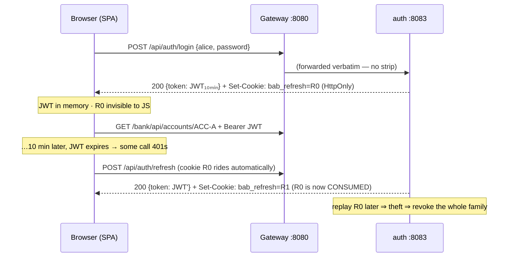
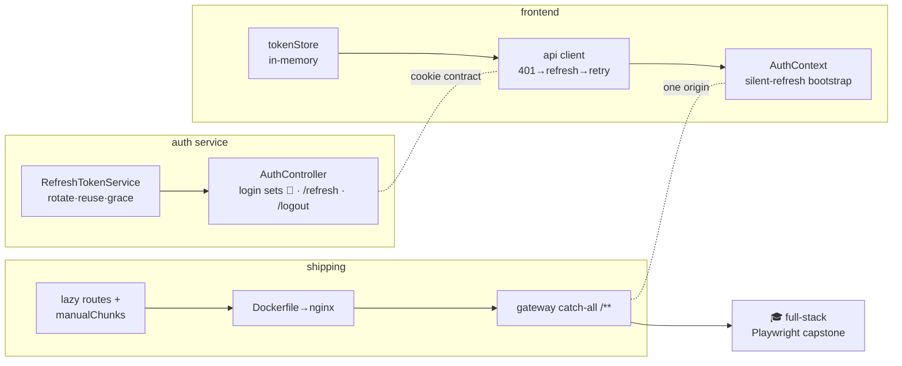
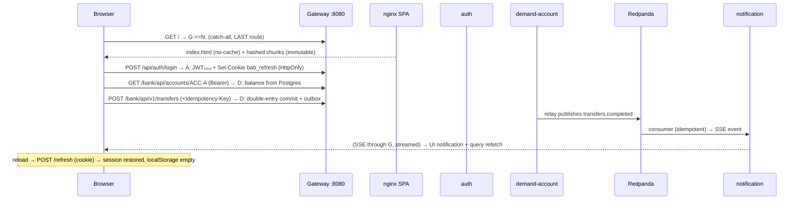

# Step 32 · Frontend pt.4 — Hardening & Ship 🎓🎖️
### Phase F — Full-Stack Frontend 🔵 · Step 32 of 67 · Phase-F finale & full-stack milestone

> **The debt comes due tonight.** Since Step 29 your JWT has been sitting in `localStorage` — readable by any
> script that ever sneaks into your page — with a promise in the risk register: *"harden in Step 32."* This is
> Step 32. You'll move the session into a rotating, theft-detecting httpOnly cookie, split the bundle so the
> login page stops shipping the whole bank, put the SPA in a container behind the gateway (one origin, no
> CORS), and then prove the ENTIRE course — browser → gateway → auth → ledger → Kafka → SSE → browser — with a
> Playwright run against the real stack. Zero mocks. When the capstone caught two real bugs during authoring,
> it earned its place. Yours will too.

## 🧭 The Six Movements of This Step

| | Movement | What happens | ~time |
|---|---|---|---|
| **A** | [🧭 Orient](#orient) | 30-second overview · skip-test · cheat card · session plan | ~1 h |
| **B** | [🧠 Understand](#understand) | where a session lives · rotation + reuse detection · cookies, CAS & route-order law | ~2 h |
| **C** | [🛠️ Build](#build) | 11 sub-steps: store → endpoints → wire-tests → client → context → tests → CORS → bundle → ship → 🎓 capstone → smoke | ~13 h |
| **D** | [🔬 Prove](#prove) | the Verification Log — 🔴 Full tier: mutation drills both sides, wire transcripts, full-stack run, clean-room | ~45 min |
| **E** | [🎓 Apply](#apply) | BFF/CSP asides · interview prep · your-turn · cumulative review | ~2 h |
| **F** | [🏆 Review](#review) | war-story troubleshooting · glossary · recap, flashcards, Phase-F close-out | ~45 min |

---

<a id="orient"></a>

# A · 🧭 Orient

## 📋 This Step in 30 Seconds ⏱ ~5 min

| | |
|---|---|
| **What** | Token refresh + rotation + reuse detection (auth service & SPA) · route guards that survive reloads · code-splitting + bundle analysis · SPA in nginx behind the gateway's catch-all route · full-stack Playwright capstone |
| **Badge** | 🔵 Core — plus 🎓 Phase-F capstone and the 🎖️ **full-stack milestone** |
| **Effort** | ~20 h (8 sittings) |
| **What to run** | Docker (compose infra + SPA image) · the four services `auth` 8083 · `demand-account` 8082 · `notification` 8084 · `gateway` 8080 · Node 22 for the SPA |
| **You finish with** | `step-32-end` — the whole bank usable at **http://localhost:8080** through ONE origin |

### ⏭️ Can You Skip This Step? (5-minute self-check)

Do these **now**, concretely — feelings don't count:

1. Write the `Set-Cookie` header for a refresh token that JavaScript must never read, that must never ride on
   a `/bank/**` request, and that must survive a browser restart for 12 h. *(Pass: you produced
   `HttpOnly`, `Path=/api/auth`, `Max-Age=43200`, `SameSite=Strict` — and can say why each attribute is there.)*
2. Your SPA is one 415 kB chunk. Name the TWO Vite/Rollup mechanisms that turn it into
   "login page loads 100 kB, dashboard loads on demand, framework cached across deploys." *(Pass:
   route-level `React.lazy()` dynamic imports + `manualChunks` vendor split.)*
3. A user has your app open in two tabs; both fire `POST /refresh` with the same cookie at the same instant,
   and your server does strict rotation-reuse-revocation. What happens, and what's the standard fix? *(Pass:
   the loser looks like token theft → whole family revoked → both tabs logged out; fix = a short reuse
   grace/leeway window, or cross-tab refresh coordination.)*

All three cold? Skim [D · Prove](#d--prove) and the capsule, take the tag, move on. Any hesitation — this step
pays interview-grade dividends; stay.

## 📇 Cheat Card ⏱ ~2 min

```bash
# Infra + the shipped SPA container (Postgres on 5433 — host 5432 is often taken):
docker compose -f deploy/compose.fullstack.yaml up -d --build

# The four services, each in its own terminal (only demand-account needs env):
./mvnw -pl services/auth spring-boot:run
SPRING_DATASOURCE_URL=jdbc:postgresql://localhost:5433/demand_account \
  APP_CORS_ALLOWED_ORIGINS=http://localhost:8080 ./mvnw -pl services/demand-account spring-boot:run
./mvnw -pl services/notification spring-boot:run
./mvnw -pl gateway spring-boot:run

# The whole bank through one origin:  http://localhost:8080  (alice / password)
# The capstone:                        cd frontend && npm run test:e2e:fullstack
# One-shot proof:                      bash steps/step-32/smoke.sh
```

**The one diagram that is this step:**

```
Browser ──(1 origin: :8080)──▶ Gateway ──▶ /api/auth/**  → auth       (login/refresh/logout + cookie)
   ▲   access JWT: in MEMORY   │  order   ──▶ /bank/**     → demand-acct (ledger)
   │   refresh: httpOnly 🍪    │  is law  ──▶ /notifications/** → notif (SSE)
   └── SSE stream ◀────────────┘          ──▶ /**  (LAST)  → nginx SPA container
```

**Delivered:** the session can be stolen-from-storage no more, the bundle is split and analyzed, and the bank
ships as one origin — proven by a mock-free browser test of the whole pipeline.

## 🎯 Why This Matters ⏱ ~2 min

"Where do you store the JWT?" is a bar-raiser interview question because every answer is a trade-off, and
`localStorage` is the one that gets your candidacy (and your users' money) declined. Refresh-token rotation
with reuse detection is what Auth0/OAuth BCPs actually prescribe — building it by hand means you'll never
cargo-cult it. And "we shipped it behind one origin so CORS stopped existing" is the sentence that tells a
senior engineer you understand browsers, not just frameworks.

## ✅ What You'll Be Able to Do ⏱ ~2 min

Each outcome maps to an assessment (constructive alignment — you'll meet every one again below):

1. **Implement refresh-token rotation with reuse detection & a concurrency grace** → 🔬 break-it in sub-step 3,
   ❓ check 2, 💼 Q1/Q3, 🧠 TY-1.
2. **Keep a session alive with an access token that never touches storage** (silent refresh, single-flight
   401 retry, session-expiry propagation) → sub-steps 4–6 ▶️, 🔬 break-it 2, 🧠 TY-2.
3. **Lock a cookie down attribute-by-attribute and say honestly what XSS can still do** → ❓ check 1,
   💼 Q2, 🧠 TY-3.
4. **Split a Vite bundle by route + vendor and read a treemap** → sub-step 8 ▶️, 🏋️ exercise 2, 🧠 TY-4.
5. **Ship an SPA: multi-stage Docker build, nginx SPA fallback + cache policy, gateway catch-all with
   order-as-law** → sub-steps 9–10 ▶️, ❓ check 4, 💼 Q5.
6. **Drive a zero-mock, full-pipeline browser test and debug what it catches** → sub-step 10 ▶️, 🩺 both war
   stories, 🧠 TY-5.

## 🧰 Before You Start ⏱ ~5 min

**Depends on: Steps 15–17 (gateway, JWT, RS256/JWKS), 20–21 (outbox → Kafka → SSE, idempotency), 29–31 (the SPA line).**

- Callbacks you'll leach on: Step 16/17's `JwtService` + filter chain (we extend, not rewrite); Step 18's
  deny-by-default CORS (it will 403 you tonight — deliberately); Step 11's check-then-act atomicity (the
  refresh store is a tiny concurrent state machine); Step 31's MSW handlers (the gateway contract's copy —
  they change when the contract changes, which is this step's plot twist).
- Tooling: `docker compose version` ≥ v2, `node -v` = 22.x, and the `step-31-end` tag green
  (`git status` clean on `main`, `./mvnw -pl services/auth,gateway -am verify` → BUILD SUCCESS).
- 💡 *Faster in IntelliJ:* split editor with `AuthController.java` and `client.ts` side by side — this step is
  one protocol implemented twice.

## 🗓️ Session Plan ⏱ ~20 h total — stopping between sittings is the plan, not a failure

| # | Sitting (~2–3 h) | You stop at ✋ having |
|---|---|---|
| 1 | **B · Understand** + sub-step 1 (the refresh store) | a rotating, theft-detecting token store that compiles |
| 2 | Sub-steps 2–3 (endpoints + wire tests) | login sets the cookie; replay → 401 **proven over HTTP** |
| 3 | Sub-step 4 (tokenStore + api client rework) | a client that silently refreshes and retries once |
| 4 | Sub-steps 5–6 (AuthContext bootstrap + the test suite) | 29 Vitest green incl. the cookie round-trip |
| 5 | Sub-steps 7–8 (credentialed CORS + code-splitting) | a split bundle + treemap you can read |
| 6 | Sub-step 9 (nginx + Dockerfile + catch-all route) | the SPA served BY the gateway on :8080 |
| 7 | Sub-step 10 (full stack up + capstone E2E) | 🎓 2/2 green against the real bank |
| 8 | Sub-step 11 + **D/E/F** (smoke, prove, recap) | `step-32-end` tagged; Phase F closed 🎖️ |

**Optional routes:** skip-test says go → read D + capsule (~30 min). 🚀 asides are outside the budget, each
labeled `+~N min`. Shortest honest path: sittings 1–2, 3–4, 6–7 (the perf sitting 5 is the only skippable one —
log it in your own debt register if you do 😉).

---

<a id="understand"></a>

# B · 🧠 Understand ⏱ ~2 h

## 🧠 The Big Idea: a session is a *place*, and every place has a threat model ⏱ ~40 min

Your bank's session was living in `localStorage`. Ask the three questions that decide a session's home:

1. **Who can read it?** `localStorage`: any JS on the page — including the compromised analytics snippet,
   the typo-squatted npm package, the XSS payload in a customer's name. An **httpOnly cookie**: no JS, ever.
   **JS memory** (a module variable): only code in the running page, and it evaporates on reload.
2. **Where does it travel?** `localStorage`: nowhere by itself — *you* attach it (which is why Step 29 wrote
   `Authorization: Bearer …` by hand). A cookie: **automatically**, on every matching request — powerful and
   dangerous (that's CSRF's whole diet). `Path=/api/auth` puts it on a leash.
3. **How long does it live?** Storage: until cleared — *the stolen copy works next month*. Memory: minutes.
   A cookie: exactly `Max-Age`.

No single place wins, so the modern pattern **splits the session in two**:

| | Access token | Refresh token |
|---|---|---|
| Format | JWT (RS256) — *stateless*, any service validates it offline via JWKS (Step 17) | **Opaque random bytes** — meaningless without server-side state |
| Lives | JS **memory** only (`tokenStore`) | **httpOnly cookie**, `Path=/api/auth` |
| Lifetime | **10 min** (was 30 — see Security Lens) | 12 h, **consumed on every use** (rotation) |
| If stolen | worthless in minutes | detected on replay → whole family revoked |



**Analogy — the coat-check ticket.** The access JWT is your *drink wristband*: anyone can check it at a
glance (signature), it expires with the evening, and nobody keeps a registry of wristbands. The refresh token
is the *coat-check ticket*: a dumb number that only means something in the attendant's book. Hand in ticket
47, you get your coat **and a new ticket**; ticket 47 is crossed out. If someone shows up later with a copied
47, the attendant doesn't shrug — they know it was already used, assume the book is compromised, and lock the
whole rack (family revocation). Stateless where cheap verification matters, stateful where *revocation*
matters. That split is the entire lesson.

## 🧩 Pattern Spotlight — Refresh-Token Rotation with Reuse Detection ⏱ ~20 min

- **Problem:** long-lived credentials must survive reloads but not survive theft.
- **Why it fits:** rotation makes every refresh token single-use, so a stolen one has a razor-thin useful
  life; reuse detection turns the thief's *second* attempt into an alarm that kills the victim's session too
  (fail closed — this is a bank).
- **The wrinkle you must handle (found by adversarial review of this very step):** all tabs share ONE cookie.
  Two tabs booting simultaneously both present R0 — indistinguishable, at that instant, from theft. Strict
  revocation = a **guaranteed logout loop** on "restore my tabs". The standard fix is a short **reuse
  grace** (ours: 3 s, configurable): a replay *inside* the window is answered 409-retry-with-your-current-
  cookie (no revocation); *outside* it, the hammer falls. Auth0 calls this the "reuse interval".
- **Alternatives:** cross-tab coordination (`navigator.locks`/`BroadcastChannel`) — solves tabs, not two
  browsers, and is more client machinery (🚀 aside, +~20 min); sliding non-rotating refresh cookies — simpler,
  but theft is then *undetectable*; keeping 30-min access tokens and no refresh at all — that's just Step 29
  with extra steps.

## 🌱 Under the Hood ⏱ ~35 min

**Cookie attributes are compiler flags for the browser.** `HttpOnly` removes it from `document.cookie`'s
universe. `SameSite=Strict` stops it riding on requests *initiated by other sites* (CSRF's transport).
`Path=/api/auth` means `/bank/**` calls never carry it. `Secure` requires TLS (config-off only because local
dev is plain http — browsers refuse `Secure` cookies over http). One subtlety that makes our dev flow work:
SameSite compares **sites** (scheme + registrable domain) and **ignores ports** — so `localhost:5173` →
`localhost:8080` is *same-site* (Strict is happy) even though it's *cross-origin* (CORS is not — see
sub-step 7).

**The store is a concurrent state machine.** Consuming a token is check-then-act — Step 11 taught you that's
a race. We make it atomic with a **compare-and-swap**: records are immutable Java `record`s (value equality!),
so `map.replace(key, expected, updated)` succeeds for exactly ONE of two racing rotations; the loser is, by
construction, inside the grace window. No locks, no synchronized — and the sealed `RotationResult` interface
makes the controller's `switch` provably exhaustive (add a fourth outcome; it stops compiling — Step 2's
sealed types, cashing in).

**Route order is the law of the MVC gateway.** Spring Cloud Gateway Server WebMVC composes your YAML routes
into one `RouterFunction` **in list order** — strict first-match-wins. There IS an `order` attribute on route
properties; it is **silently ignored** (open upstream issue #3495 — verified by reading the 5.0.1 jar). So the
new `Path=/**` SPA route survives only as the LAST list entry, and a regression test — not a comment alone —
guards it. (The gateway's own `/actuator/*` endpoints still win: their handler mapping runs at order −100,
before route matching at 3.) Related relief: SSE streaming through this servlet gateway works out of the box —
`text/event-stream` is in the default `streaming-media-types`, which switches the proxy to a flush-per-read
copy loop. Each open SSE connection pins one Tomcat worker thread, though — remember that number when you size
pools in Phase G.

## 🛡️ Security Lens ⏱ ~15 min — what this does NOT fix (say it out loud)

- **Active XSS still wins the open session.** httpOnly means injected script can't *read* the cookie — but it
  can *use* it: `fetch('/api/auth/refresh', {credentials:'include'})` from inside your page returns a fresh
  access token to whoever is running there. What we removed is the **persistent, exfiltratable copy** (the
  localStorage token that still works from the attacker's laptop next week). The real anti-XSS arsenal is
  CSP, output encoding (React's escaping), and dependency hygiene (Phase H scanners).
- **Logout cannot un-sign a JWT.** Revoking the refresh family stops *renewal*; an already-issued access
  token stays valid until `exp` — nothing can recall a signature. That's exactly why this step cut the TTL
  30 → 10 min: it bounds the post-logout window. (True instant revocation = denylist/introspection = state on
  every request — the trade-off returns in interviews forever.)
- **Credentialed CORS turns a config typo into account takeover.** `/refresh` now answers a *readable* access
  token to any origin the CORS policy trusts *with credentials*. Spring rejects `allowedOrigins("*")` +
  credentials, but happily accepts `allowedOriginPatterns("*")` — the exact "just make CORS work" reflex. Our
  gateway now **fails startup** if `*` appears in the origin list. Wildcards and credentials must never meet.
- **CSRF on the refresh endpoint?** A cross-site POST to `/refresh` *can* be sent (SameSite=Strict blocks it
  from genuinely cross-site pages anyway) — but the attacker can't *read* the response (Same-Origin Policy), and the
  rotation makes the request itself harmless noise. Logout-CSRF would be an annoyance, not a breach.

## 🕰️ Then vs. Now ⏱ ~10 min

| Era | Session home | Died because |
|---|---|---|
| 2005 | `JSESSIONID` cookie + server session map | didn't scale horizontally without sticky sessions/replication |
| 2015 | JWT in `localStorage`, "stateless all the things" | XSS exfiltration + unrevocable long-lived tokens |
| Now | Short JWT in memory + rotating httpOnly refresh cookie (or full BFF) | — this is where OAuth BCPs landed |

Legacy note: you will still meet the 2015 pattern in production codebases constantly — now you can name its
exact failure mode *and* the migration path, which is worth more than never having seen it.

## 🧵 Thread-safety note

Shared mutable state in this step: the refresh-token map (server) and `tokenStore` + `refreshInFlight`
(browser). The server side races for real (two HTTP threads, one token) → CAS via `ConcurrentHashMap.replace`
(Step 11's lost-update, banking edition). The browser side is single-threaded, but *concurrent promises*
re-create the same bug shape — five 401s must share ONE refresh (single-flight), or you rotate five times and
trip your own alarm. Same discipline, different runtime.

---

<a id="build"></a>

# C · 🛠️ Build

## 📦 Your Starting Point ⏱ ~10 min

You're on tag **`step-32-start`** (== `step-31-end`): 14 Maven modules green, the SPA with 24 Vitest tests +
2 hermetic Playwright specs, JWT in `localStorage` (the debt), one 415 kB bundle chunk, no Dockerfile, gateway
routing four service prefixes with CORS for the Vite origin. Verify your ground exactly like the AI session
that authored this did:

```bash
git status                                   # clean, on main
./mvnw -pl services/auth,gateway -am verify  # BUILD SUCCESS
```

## 🛠️ Let's Build It — Step by Step ⏱ ~13 h build core

🗺️ **What we'll build:**



*(Diagram alt-text: three clusters — auth service store+endpoints, SPA tokenStore→client→context, and
shipping lazy-chunks→Dockerfile→gateway-catch-all — feeding one full-stack Playwright capstone.)*

🌳 **Files we'll touch:**

```
services/auth/src/main/java/com/buildabank/auth/
  security/RefreshTokenService.java   (new)   security/SecurityConfig.java   (edit)
  web/AuthController.java             (edit)  user/UserService.java          (edit: find())
  ../resources/application.yml        (edit)  + RefreshFlowTest ✚ RotationGraceTest ✚
gateway/  application.yml (catch-all + ⚠️ comments) · GatewayCorsConfig.java (credentials + guard) · test
frontend/ src/auth/{tokenStore.ts✚, AuthContext.tsx, ProtectedRoute.tsx} · src/api/client.ts
          src/accounts/queries.ts · src/mocks/handlers.ts · src/test/setup.ts · 5 test files (+session.test✚)
          e2e/transfer-flow.spec.ts · vite.config.ts · src/App.tsx
          nginx.conf✚ · Dockerfile✚ · .dockerignore✚ · playwright.fullstack.config.ts✚ · e2e-fullstack/✚
deploy/compose.fullstack.yaml✚ · steps/step-32/{smoke.sh,requests.http}✚ · adr/0023✚
services/demand-account: TransferController/TransferService (a real bug the capstone catches!) + 2 tests
```

---

### Sub-step 1 of 11 — The refresh-token store: rotation, reuse detection, grace ⏱ ~1.5 h 🧭 *(you are here: **store** → endpoints → wire-tests → client → context → tests → cors → bundle → ship → capstone → smoke)*

🎯 **Goal:** a server-side store where refresh tokens are opaque, hashed, single-use, family-grouped — and
where replay means revocation, unless it's two of YOUR tabs racing (grace window).

📁 **Exact location:** `services/auth/src/main/java/com/buildabank/auth/security/RefreshTokenService.java` (new file)

⌨️ **Code** (complete — type it, don't paste; this one rewires your fingers):

```java
// services/auth/src/main/java/com/buildabank/auth/security/RefreshTokenService.java
package com.buildabank.auth.security;

import java.nio.charset.StandardCharsets;
import java.security.MessageDigest;
import java.security.NoSuchAlgorithmException;
import java.security.SecureRandom;
import java.time.Duration;
import java.time.Instant;
import java.util.Base64;
import java.util.Map;
import java.util.UUID;
import java.util.concurrent.ConcurrentHashMap;

import org.springframework.beans.factory.annotation.Value;
import org.springframework.stereotype.Service;

/**
 * Server-side refresh-token store with <strong>rotation</strong> and <strong>reuse detection</strong>
 * (Step 32).
 *
 * <p>Unlike the access JWT (self-contained, verified by signature alone), a refresh token here is an
 * <em>opaque</em> random value whose meaning lives on the server — which is exactly what lets us revoke it,
 * rotate it, and notice theft. Every refresh <em>consumes</em> the presented token and issues a successor in
 * the same <em>family</em> (one family per login). If a token that was already consumed shows up again,
 * someone is replaying a stolen value — we revoke the whole family, forcing a fresh login everywhere.
 *
 * <p>Storage notes: we keep only the SHA-256 <em>hash</em> of each token (a heap dump must not yield
 * replayable credentials), in a {@link ConcurrentHashMap} (in-memory, consistent with the demo
 * {@code UserService}; production would use Redis/DB so restarts and multiple instances share state).
 * Consuming a token is a compare-and-swap, so concurrent refreshes of the SAME token can't both succeed
 * (🧵 Step 11: check-then-act must be atomic).
 */
@Service
public class RefreshTokenService {

    /** One stored refresh token: who it belongs to, its login family, expiry, and whether it was consumed. */
    record RefreshRecord(String username, String familyId, Instant expiresAt, Instant usedAt, boolean revoked) {

        boolean expired(Instant now) {
            return now.isAfter(expiresAt);
        }
    }

    /**
     * The three ways a rotation can end. A sealed interface (Step 2!) so the controller's handling is
     * exhaustive — the compiler proves no outcome goes unmapped.
     */
    public sealed interface RotationResult {

        /** Success: set {@code rawToken} as the new cookie; mint an access JWT for {@code username}. */
        record Rotated(String rawToken, String username) implements RotationResult {
        }

        /**
         * A benign race: another request (a second browser tab) rotated this token milliseconds ago.
         * → 409; the client retries once — its browser already holds the successor cookie.
         */
        record ConcurrentRotation() implements RotationResult {
        }

        /** Unknown, expired, revoked, or replayed-after-grace (theft) → 401. */
        record Invalid() implements RotationResult {
        }
    }

    private final Map<String, RefreshRecord> byTokenHash = new ConcurrentHashMap<>();
    private final SecureRandom random = new SecureRandom();
    private final Duration ttl;
    private final Duration rotationGrace;

    public RefreshTokenService(@Value("${bank.auth.refresh-ttl-hours:12}") long ttlHours,
                               @Value("${bank.auth.rotation-grace-seconds:3}") long rotationGraceSeconds) {
        this.ttl = Duration.ofHours(ttlHours);
        this.rotationGrace = Duration.ofSeconds(rotationGraceSeconds);
    }

    /** Start a NEW family (login): mint a random token, store its hash, hand back the raw value once. */
    public String issue(String username) {
        return store(username, UUID.randomUUID().toString());
    }

    /**
     * Rotation with reuse detection. Consumes {@code rawToken} atomically and issues a successor in the same
     * family. A token replayed <em>within the rotation grace</em> is a benign race (two tabs refreshing with
     * the same shared cookie) → {@link RotationResult.ConcurrentRotation}, family intact. Replayed
     * <em>after</em> the grace it means theft or a very stale client → the whole family is revoked and the
     * result is {@link RotationResult.Invalid}: a bank fails closed.
     */
    public RotationResult rotate(String rawToken) {
        Instant now = Instant.now();
        String hash = sha256(rawToken);

        RefreshRecord current = byTokenHash.get(hash);
        if (current == null || current.revoked() || current.expired(now)) {
            return new RotationResult.Invalid();           // unknown, revoked, or expired → 401
        }
        if (current.usedAt() != null) {
            if (Duration.between(current.usedAt(), now).compareTo(rotationGrace) <= 0) {
                return new RotationResult.ConcurrentRotation();   // the other tab won milliseconds ago
            }
            revokeFamily(current.familyId());              // REUSE beyond grace → kill the family
            return new RotationResult.Invalid();
        }

        // Consume via compare-and-swap (records compare by value): of two IN-FLIGHT rotations of the same
        // token, exactly one replace() succeeds — the loser is, by construction, inside the grace window.
        // Check-then-act made atomic without a lock (🧵 Step 11).
        RefreshRecord used = new RefreshRecord(current.username(), current.familyId(),
                current.expiresAt(), now, false);
        if (!byTokenHash.replace(hash, current, used)) {
            return new RotationResult.ConcurrentRotation();
        }
        String successor = store(current.username(), current.familyId());
        return new RotationResult.Rotated(successor, current.username());
    }

    /** Logout: revoke the presented token's whole family (best effort — unknown tokens are a no-op). */
    public void revoke(String rawToken) {
        RefreshRecord record = byTokenHash.get(sha256(rawToken));
        if (record != null) {
            revokeFamily(record.familyId());
        }
    }

    public long ttlSeconds() {
        return ttl.toSeconds();
    }

    private String store(String username, String familyId) {
        byte[] bytes = new byte[32];                       // 256 bits of SecureRandom entropy
        random.nextBytes(bytes);
        String raw = Base64.getUrlEncoder().withoutPadding().encodeToString(bytes);
        byTokenHash.put(sha256(raw),
                new RefreshRecord(username, familyId, Instant.now().plus(ttl), null, false));
        return raw;
    }

    private void revokeFamily(String familyId) {
        byTokenHash.replaceAll((hash, r) ->
                r.familyId().equals(familyId)
                        ? new RefreshRecord(r.username(), r.familyId(), r.expiresAt(), r.usedAt(), true)
                        : r);
    }

    /** We store only hashes: a stolen memory snapshot must not contain replayable refresh tokens. */
    private static String sha256(String raw) {
        try {
            MessageDigest digest = MessageDigest.getInstance("SHA-256");
            return Base64.getUrlEncoder().withoutPadding()
                    .encodeToString(digest.digest(raw.getBytes(StandardCharsets.UTF_8)));
        } catch (NoSuchAlgorithmException e) {
            throw new IllegalStateException("SHA-256 unavailable", e);
        }
    }
}
```

🔍 **Line-by-line** (the load-bearing choices):

- `record RefreshRecord(…)` — immutable. Every "mutation" builds a *new* record. Not style — mechanics: the
  CAS below compares by `equals`, and records get value-equality for free.
- `sealed interface RotationResult` + three `record` implementations — the *return type is the state
  machine*. `sealed` (Step 2) means the compiler knows these are ALL the cases.
- `@Value("${bank.auth.refresh-ttl-hours:12}")` — constructor injection with a default; tests override
  `rotation-grace-seconds` per-context (sub-step 3 uses that).
- `byTokenHash.get(hash)` then `…replace(hash, current, used)` — read, decide, **compare-and-swap**. If
  another thread consumed the token between our `get` and `replace`, the map no longer holds `current`,
  `replace` returns `false`, and we take the benign-race branch instead of double-issuing.
- `Duration.between(usedAt, now).compareTo(rotationGrace) <= 0` — "consumed within the last 3 s?" `Duration`
  compares like `BigDecimal` (Step 12's money discipline): no float math on time, ever.
- `SecureRandom` + 32 bytes + base64url-no-padding — 256 bits of entropy in a cookie-safe alphabet (a
  padding `=` would need quoting in the cookie).
- `sha256(raw)` as the key — the server *recognizes* a token it can no longer *produce*. Same idea as BCrypt
  for passwords (Step 16); a plain hash suffices because this input is already high-entropy.
- `revokeFamily` via `replaceAll` — mark every record in the family revoked. O(all live tokens); fine
  in-memory, an indexed set in the Redis version.

💭 **Under the hood:** `ConcurrentHashMap.replace(k, expected, new)` locks one hash bin for nanoseconds; two
rotations of the *same* token serialize there, rotations of *different* tokens never contend. You've built a
lock-free single-consume semantic out of value equality — the in-memory twin of `@Version` optimistic locking
(Step 9): read → build successor → CAS → loser takes the conflict path.

🔮 **Predict before you run:** `rotate()` is called twice, sequentially, **5 s apart**, with the same raw
token. First call returns…? Second returns…? A third call with the *successor* from call one? *(Answers at
the ▶️ — write yours down first.)*

▶️ **Run & See** — it must compile (tests land in sub-step 3; nothing calls it yet):

```bash
./mvnw -q -pl services/auth compile
```

✅ **Expected output** (real run):

```text
(no output — with -q, silence IS success; the exit code is 0)
```

❌ **Common wrong output:** `error: incompatible types: RefreshRecord cannot be converted to RotationResult`
— you made `RefreshRecord` implement `RotationResult` while re-typing. They're different animals: one is
*storage*, one is *outcome*. *(Prediction answers: `Rotated` · `Invalid` — 5 s > 3 s grace, family revoked ·
`Invalid` — the successor died with its family.)*

✋ **Checkpoint.** Stopping here? You have a compiling, theft-detecting store that nothing calls yet.
**Next session: sub-step 2; first action:** open `services/auth/.../web/AuthController.java`.

💾 **Commit:**

```bash
git add services/auth
git commit -m "feat(auth): refresh-token store with rotation, reuse detection and race grace"
```

⚠️ **Pitfall:** storing the *raw* token as the map key. Every test still passes… and one heap dump or
misconfigured debug endpoint later, every live session is replayable. Hash-at-rest costs one line.

---

### Sub-step 2 of 11 — `/login` sets the cookie; `/refresh` + `/logout` manage it ⏱ ~1 h 🧭 *(store ✅ → **endpoints** → wire-tests → client → …)*

🎯 **Goal:** wire the store to HTTP: login answers JWT-in-body **plus** refresh-cookie; `/refresh`
pattern-matches the sealed result onto 200/409/401; `/logout` revokes and clears.

📁 **Exact location:** edits in `services/auth/.../web/AuthController.java`,
`security/SecurityConfig.java`, `user/UserService.java`, `resources/application.yml`.

⌨️ **Code — `AuthController`, the Step-32 shape** (your Step-17 `/me`/`/admin` endpoints stay untouched; new
imports: `@Value`, `HttpHeaders`, `ResponseCookie`, `@CookieValue`, `RefreshTokenService`):

```java
// services/auth/src/main/java/com/buildabank/auth/web/AuthController.java  (changed parts)
@RestController
@RequestMapping("/api/auth")
public class AuthController {

    /** The refresh cookie's name — the browser scopes it to the gateway origin. */
    static final String REFRESH_COOKIE = "bab_refresh";

    private final UserService users;
    private final JwtService jwt;
    private final RefreshTokenService refreshTokens;
    private final boolean cookieSecure;

    public AuthController(UserService users, JwtService jwt, RefreshTokenService refreshTokens,
                          @Value("${bank.auth.cookie-secure:false}") boolean cookieSecure) {
        this.users = users;
        this.jwt = jwt;
        this.refreshTokens = refreshTokens;
        this.cookieSecure = cookieSecure;   // false for local http; MUST be true behind TLS (prod)
    }

    /** Authenticate (BCrypt) → 200: short-lived access JWT in the body + refresh token in an httpOnly cookie. */
    @PostMapping("/login")
    public ResponseEntity<TokenResponse> login(@Valid @RequestBody LoginRequest request) {
        return users.authenticate(request.username(), request.password())
                .map(user -> ResponseEntity.ok()
                        .header(HttpHeaders.SET_COOKIE, refreshCookie(refreshTokens.issue(user.username()),
                                refreshTokens.ttlSeconds()).toString())
                        .body(new TokenResponse(jwt.issue(user.username(), user.roles()), jwt.ttlSeconds())))
                .orElseGet(() -> ResponseEntity.status(HttpStatus.UNAUTHORIZED).build());
    }

    /**
     * Trade a valid refresh cookie for a fresh access JWT + a ROTATED refresh cookie. 401 = missing/unknown/
     * expired/revoked/replayed-after-grace; 409 = the benign two-tabs race (client retries with the cookie it
     * now holds). Authenticated by the cookie itself, so it's permitAll in the chain.
     */
    @PostMapping("/refresh")
    public ResponseEntity<TokenResponse> refresh(
            @CookieValue(name = REFRESH_COOKIE, required = false) String refreshToken) {
        if (refreshToken == null) {
            return ResponseEntity.status(HttpStatus.UNAUTHORIZED).build();
        }
        // Pattern-switch over the sealed result (Step 2's sealed types earning their keep): the compiler
        // enforces that every outcome is handled — add a fourth result type and this stops compiling.
        return switch (refreshTokens.rotate(refreshToken)) {
            case RefreshTokenService.RotationResult.Rotated(String rawToken, String username) -> {
                var user = users.find(username).orElseThrow();   // seeded users never vanish
                yield ResponseEntity.ok()
                        .header(HttpHeaders.SET_COOKIE,
                                refreshCookie(rawToken, refreshTokens.ttlSeconds()).toString())
                        .body(new TokenResponse(jwt.issue(user.username(), user.roles()), jwt.ttlSeconds()));
            }
            case RefreshTokenService.RotationResult.ConcurrentRotation() ->
                    ResponseEntity.status(HttpStatus.CONFLICT).build();
            case RefreshTokenService.RotationResult.Invalid() ->
                    ResponseEntity.status(HttpStatus.UNAUTHORIZED).build();
        };
    }

    /** Revoke the refresh family and clear the cookie (Max-Age=0 tells the browser to delete it) → 204. */
    @PostMapping("/logout")
    public ResponseEntity<Void> logout(
            @CookieValue(name = REFRESH_COOKIE, required = false) String refreshToken) {
        if (refreshToken != null) {
            refreshTokens.revoke(refreshToken);
        }
        return ResponseEntity.noContent()
                .header(HttpHeaders.SET_COOKIE, refreshCookie("", 0).toString())
                .build();
    }

    /**
     * The refresh cookie, locked down: httpOnly (no JS access), SameSite=Strict (not sent cross-site),
     * Path=/api/auth (sent ONLY to auth endpoints — never rides along on /bank calls), Secure per config.
     */
    private ResponseCookie refreshCookie(String value, long maxAgeSeconds) {
        return ResponseCookie.from(REFRESH_COOKIE, value)
                .httpOnly(true)
                .secure(cookieSecure)
                .sameSite("Strict")
                .path("/api/auth")
                .maxAge(maxAgeSeconds)
                .build();
    }
```

**Three small companions** (before → after):

```java
// user/UserService.java — ADD (the refresh flow re-loads roles without re-checking a password):
/** Look a user up by username — no password check (Step 32: the refresh flow re-loads roles). */
public Optional<StoredUser> find(String username) {
    return Optional.ofNullable(users.get(username));
}
```

```java
// security/SecurityConfig.java — the permitAll line grows two entries:
// BEFORE: .requestMatchers("/api/auth/login", "/actuator/health", "/oauth2/jwks").permitAll()
// AFTER  (refresh + logout are 'public' to the FILTER CHAIN but authenticated by the cookie in the controller):
.requestMatchers("/api/auth/login", "/api/auth/refresh", "/api/auth/logout",
        "/actuator/health", "/oauth2/jwks").permitAll()
```

```yaml
# resources/application.yml — ttl-minutes 30 → 10, plus the new bank.auth block:
bank:
  jwt:
    # Step 32: 30 → 10. Logout revokes the REFRESH family, but an already-issued access JWT is stateless —
    # nothing can un-sign it, so it stays valid until exp. A short TTL bounds that window; the SPA silently
    # refreshes, so users never notice.
    ttl-minutes: 10
  # Step 32 — the refresh session (rotating httpOnly cookie). cookie-secure MUST be true behind TLS;
  # false here only because local dev is plain http (browsers drop Secure cookies over http).
  auth:
    refresh-ttl-hours: 12
    cookie-secure: ${BANK_AUTH_COOKIE_SECURE:false}
```

🔍 **Line-by-line:**

- `ResponseCookie.from(…)` — Spring's typed `Set-Cookie` builder; `.toString()` renders the exact wire
  header. Never concatenate cookie strings by hand: attribute-order and escaping bugs stay invisible until
  production.
- `@CookieValue(name = REFRESH_COOKIE, required = false)` — MVC parses the `Cookie` request header for you;
  `required=false` + null-check answers a clean 401 instead of a framework 400.
- `case … Rotated(String rawToken, String username)` — a **record pattern**: the `case` label deconstructs
  the record, dropping its fields into scope. With a sealed type, no `default` is needed — and that's the
  feature: a new outcome = compile error here, not a silently unmapped path.
- `refreshCookie("", 0)` — `Max-Age=0` is the standard "delete this cookie" wire idiom.
- Why is `/refresh` `permitAll`?? Because at refresh time the caller **has no valid bearer token** — that's
  the whole point. URL rules authenticate *requests*; this endpoint authenticates via *state* (the cookie),
  inside the controller.

💭 **Under the hood:** `Path=/api/auth` works ONLY because the gateway's auth route does **not**
`StripPrefix` (Step 29's choice, now load-bearing): the browser-visible path must equal the path the browser
matches the cookie against. That invariant now carries a ⚠️ comment in the gateway YAML *and* on the cookie
builder — change either side and refresh dies silently with 401s.

🔮 **Predict:** `curl -X POST localhost:8083/api/auth/refresh` with no cookie at all — which status, and which
line of code produced it?

▶️ **Run & See:**

```bash
./mvnw -q -pl services/auth spring-boot:run &     # give it ~5 s to boot
curl -s -o /dev/null -w '%{http_code}\n' -X POST http://localhost:8083/api/auth/refresh
curl -s -i -X POST http://localhost:8083/api/auth/login -H 'Content-Type: application/json' \
  -d '{"username":"alice","password":"password"}' | grep -i set-cookie
```

✅ **Expected output** (real run):

```text
401
set-cookie: bab_refresh=<43 url-safe chars>; Path=/api/auth; Max-Age=43200; Expires=...; HttpOnly; SameSite=Strict
```

*(Prediction answer: the `if (refreshToken == null)` guard — the store was never consulted.)*

❌ **Common wrong output:** `403` on `/refresh` — the `permitAll` entries are missing; the filter chain is
demanding a bearer token from the endpoint whose job is to work without one.

✋ **Checkpoint.** You can mint, rotate, and kill sessions with curl (Ctrl-C the service). **Next session:
sub-step 3; first action:** create `services/auth/src/test/java/com/buildabank/auth/RefreshFlowTest.java`.

💾 **Commit:** `git commit -am "feat(auth): login refresh-cookie + /refresh rotation + /logout revocation"`

⚠️ **Pitfall:** REST tools with silent cookie jars (Postman, some IDE HTTP clients) will "prove" rotation
while actually sending whatever cookie *they* chose. For security flows, trust only explicit jars:
`curl -c jar -b jar`, or headers you constructed yourself.

---

### Sub-step 3 of 11 — Proving the lifecycle over real HTTP (+ the 🔬 mutation drill) ⏱ ~1.5 h 🧭 *(endpoints ✅ → **wire-tests** → client → …)*

🎯 **Goal:** wire-level tests for the whole lifecycle — attributes, rotation, theft, grace, logout — then
*break the reuse detector on purpose* and watch exactly one test scream.

📁 **Exact location:** `services/auth/src/test/java/com/buildabank/auth/RefreshFlowTest.java` and
`RotationGraceTest.java` (both new).

⌨️ **Code — `RefreshFlowTest` (grace pinned to 0, so "reuse" means STRICT reuse):**

```java
// services/auth/src/test/java/com/buildabank/auth/RefreshFlowTest.java
package com.buildabank.auth;

import static org.assertj.core.api.Assertions.assertThat;

import java.net.URI;
import java.net.http.HttpClient;
import java.net.http.HttpRequest;
import java.net.http.HttpResponse;
import java.util.List;
import java.util.Optional;

import com.jayway.jsonpath.JsonPath;

import org.junit.jupiter.api.BeforeEach;
import org.junit.jupiter.api.Test;
import org.springframework.boot.test.context.SpringBootTest;
import org.springframework.boot.test.web.server.LocalServerPort;

/**
 * The Step-32 session lifecycle over real HTTP: login plants a locked-down refresh cookie; /refresh rotates
 * it and mints a fresh access JWT; REUSING a consumed refresh token is detected and revokes the whole family
 * (both the replayed token AND its successor die); /logout revokes and clears the cookie. Cookies are parsed
 * by hand from Set-Cookie so every attribute we assert is the exact wire value.
 *
 * <p>Rotation grace is pinned to 0 here so "reuse" means STRICT reuse — the benign concurrent-tabs window
 * (409) is covered separately in {@link RotationGraceTest}.
 */
@SpringBootTest(webEnvironment = SpringBootTest.WebEnvironment.RANDOM_PORT,
        properties = "bank.auth.rotation-grace-seconds=0")
class RefreshFlowTest {

    @LocalServerPort
    int port;

    private final HttpClient http = HttpClient.newHttpClient();
    private String base;

    @BeforeEach
    void setup() {
        base = "http://localhost:" + port;
    }

    @Test
    void login_setsHttpOnlyLockedDownRefreshCookie() throws Exception {
        HttpResponse<String> login = login("alice", "password");
        assertThat(login.statusCode()).isEqualTo(200);

        String setCookie = setCookieHeader(login).orElseThrow();
        assertThat(setCookie).startsWith("bab_refresh=");
        assertThat(setCookie).contains("HttpOnly");            // JS must never read this cookie
        assertThat(setCookie).contains("SameSite=Strict");     // never sent cross-site
        assertThat(setCookie).contains("Path=/api/auth");      // only rides to auth endpoints
    }

    @Test
    void refresh_rotatesTheCookie_andMintsAFreshAccessToken() throws Exception {
        HttpResponse<String> login = login("alice", "password");
        String firstCookie = cookieValue(login);

        HttpResponse<String> refreshed = refresh(firstCookie);
        assertThat(refreshed.statusCode()).isEqualTo(200);

        String newAccessToken = JsonPath.read(refreshed.body(), "$.token");
        assertThat(newAccessToken).isNotBlank().contains(".");         // a real JWT
        String secondCookie = cookieValue(refreshed);
        assertThat(secondCookie).isNotBlank().isNotEqualTo(firstCookie);   // ROTATED, not reissued
    }

    @Test
    void reusingAConsumedRefreshToken_revokesTheWholeFamily() throws Exception {
        String firstCookie = cookieValue(login("alice", "password"));
        String secondCookie = cookieValue(refresh(firstCookie));       // consumes firstCookie

        // Replay the consumed token (what a thief with a stolen old cookie does) → rejected…
        assertThat(refresh(firstCookie).statusCode()).isEqualTo(401);
        // …and the legitimate successor is dead too: the whole family was revoked (fail closed).
        assertThat(refresh(secondCookie).statusCode()).isEqualTo(401);
    }

    @Test
    void refresh_withoutACookie_is401() throws Exception {
        assertThat(refresh(null).statusCode()).isEqualTo(401);
    }

    @Test
    void logout_revokesTheSession_andClearsTheCookie() throws Exception {
        String cookie = cookieValue(login("alice", "password"));

        HttpResponse<String> logout = post("/api/auth/logout", "", cookie);
        assertThat(logout.statusCode()).isEqualTo(204);
        assertThat(setCookieHeader(logout).orElseThrow()).contains("Max-Age=0");   // browser deletes it

        assertThat(refresh(cookie).statusCode()).isEqualTo(401);       // and the server side is revoked
    }

    // ── helpers ──
    private HttpResponse<String> login(String username, String password) throws Exception {
        return post("/api/auth/login",
                "{\"username\":\"" + username + "\",\"password\":\"" + password + "\"}", null);
    }

    private HttpResponse<String> refresh(String refreshCookieValue) throws Exception {
        return post("/api/auth/refresh", "", refreshCookieValue);
    }

    private HttpResponse<String> post(String path, String body, String refreshCookieValue) throws Exception {
        HttpRequest.Builder builder = HttpRequest.newBuilder(URI.create(base + path))
                .header("Content-Type", "application/json")
                .POST(HttpRequest.BodyPublishers.ofString(body));
        if (refreshCookieValue != null) {
            builder.header("Cookie", "bab_refresh=" + refreshCookieValue);
        }
        return http.send(builder.build(), HttpResponse.BodyHandlers.ofString());
    }

    private static Optional<String> setCookieHeader(HttpResponse<String> response) {
        List<String> cookies = response.headers().allValues("Set-Cookie");
        return cookies.stream().filter(c -> c.startsWith("bab_refresh=")).findFirst();
    }

    /** The bare cookie value from Set-Cookie: `bab_refresh=VALUE; Path=…; …` → `VALUE`. */
    private static String cookieValue(HttpResponse<String> response) {
        String header = setCookieHeader(response).orElseThrow();
        return header.substring("bab_refresh=".length(), header.indexOf(';'));
    }
}
```

**And `RotationGraceTest.java`** — same helper style (copy the private methods; the login helper hardcodes
alice), DEFAULT grace, exactly one scenario:

```java
// services/auth/src/test/java/com/buildabank/auth/RotationGraceTest.java  (core test)
@SpringBootTest(webEnvironment = SpringBootTest.WebEnvironment.RANDOM_PORT)
class RotationGraceTest {

    @Test
    void replayWithinGrace_is409_andDoesNotRevokeTheFamily() throws Exception {
        String firstCookie = cookieValue(login());

        HttpResponse<String> winner = refresh(firstCookie);            // tab A rotates R0 → R1
        assertThat(winner.statusCode()).isEqualTo(200);
        String successor = cookieValue(winner);

        HttpResponse<String> loser = refresh(firstCookie);             // tab B replays R0 milliseconds later
        assertThat(loser.statusCode()).isEqualTo(409);                 // benign race — NOT theft

        assertThat(refresh(successor).statusCode()).isEqualTo(200);    // the family survived
    }
    // …helpers identical in style to RefreshFlowTest…
}
```

🔍 **Line-by-line:**

- `properties = "bank.auth.rotation-grace-seconds=0"` — one property splits the behavior into two
  *deterministic* test worlds. Never test a time window by sleeping across it when you can pin the window.
- Java's own `HttpClient`, no cookie jar — **deliberately**. Reuse-detection tests *replay old cookies*; a
  jar would "helpfully" prevent exactly the attack you're simulating. (Boot-4 note: `TestRestTemplate` left
  the default test classpath — it moved to `spring-boot-resttestclient` and lost auto-config; raw
  `HttpClient` keeps this dependency-free.)
- `cookieValue()` slices `Set-Cookie` at the first `;` — the value is everything after `name=`.

💭 **Under the hood:** `RANDOM_PORT` boots real Tomcat; these assertions run on the same bytes a browser
would parse. Step 31 called that network-level fidelity; here it's *security*-level fidelity — `HttpOnly` and
friends exist only as header text, so header text is what we assert.

🔮 **Predict:** could `RotationGraceTest`'s `loser` call ever land *outside* the 3 s grace and flake? What
would have to be true?

▶️ **Run & See:**

```bash
./mvnw -pl services/auth verify
```

✅ **Expected output** (real run, summary lines):

```text
[INFO] Tests run: 9, Failures: 0, Errors: 0, Skipped: 0 -- in com.buildabank.auth.AuthSecurityTest
[INFO] Tests run: 2, Failures: 0, Errors: 0, Skipped: 0 -- in com.buildabank.auth.PasswordEncodingTest
[INFO] Tests run: 5, Failures: 0, Errors: 0, Skipped: 0 -- in com.buildabank.auth.RefreshFlowTest
[INFO] Tests run: 1, Failures: 0, Errors: 0, Skipped: 0 -- in com.buildabank.auth.RotationGraceTest
[INFO] Tests run: 17, Failures: 0, Errors: 0, Skipped: 0
[INFO] BUILD SUCCESS
```

*(Prediction answer: >3 s between two sequential local HTTP calls — a frozen JVM or a debugger breakpoint.
Accepted risk; also exactly why the grace is configurable.)*

🔬 **Break it on purpose — the §12.3 mutation drill.** A reuse detector that never fires looks identical to a
working one *until the theft*. Prove your test has teeth: in `RefreshTokenService.rotate`, delete the whole
`if (current.usedAt() != null) { … }` block, then:

```bash
./mvnw -pl services/auth test -Dtest=RefreshFlowTest
```

✅ **Expected output** (real run — the FAILURE is the success):

```text
[ERROR] Tests run: 5, Failures: 1, Errors: 0, Skipped: 0 <<< FAILURE! -- in com.buildabank.auth.RefreshFlowTest
[ERROR] com.buildabank.auth.RefreshFlowTest.reusingAConsumedRefreshToken_revokesTheWholeFamily <<< FAILURE!
expected: 401
[INFO] BUILD FAILURE
```

**Revert the block**, re-run: `Tests run: 5, Failures: 0 … BUILD SUCCESS` (real run confirmed). One property,
one test, proven alive.

❓ **Knowledge check 1:** why does the *successor* die when the *old* token is replayed? What survives if you
only kill the replayed token? <details><summary>Answer</summary>If only the replayed token died, a thief who
stole R0 and already rotated it to R1' keeps a working session — you punished the evidence, not the theft.
Family revocation says: "someone in this lineage is an impostor and I can't tell who" → everyone
re-authenticates. The user loses ten seconds; the thief loses everything.</details>

✋ **Checkpoint.** Lifecycle proven at the wire, alarm verified live. **Next session: sub-step 4; first
action:** create `frontend/src/auth/tokenStore.ts`.

💾 **Commit:** `git commit -am "test(auth): refresh lifecycle wire tests + rotation-grace coverage"`

⚠️ **Pitfall:** asserting `SameSite=strict` (lowercase). Spring emits `SameSite=Strict`, and these are
case-sensitive text comparisons — copy assertions from a captured header, not from memory.

---

### Sub-step 4 of 11 — The SPA's session plumbing: `tokenStore` + the reworked api client ⏱ ~1.5 h 🧭 *(wire-tests ✅ → **client** → context → tests → …)*

🎯 **Goal:** the token leaves `localStorage` forever. A module-private store holds it; the client attaches
it, silently refreshes on 401 (single-flight), retries once, and announces session death.

📁 **Exact location:** `frontend/src/auth/tokenStore.ts` (new) + `frontend/src/api/client.ts` (rework).

⌨️ **Code — `tokenStore.ts` (complete):**

```ts
// frontend/src/auth/tokenStore.ts
// Step 32 · the access token's ONLY home: a module-private variable. Not localStorage (readable by any
// injected script, survives forever), not a cookie (rides on every request) — plain JS memory. It vanishes on
// reload; the silent-refresh bootstrap (AuthContext) restores it from the httpOnly refresh cookie. XSS can
// still *use* the app while it's open (no client-side storage fixes that), but it can no longer exfiltrate a
// long-lived credential from storage.
//
// Session-expiry is announced through a tiny listener list so the API layer (which discovers the 401) can
// tell the React layer (which owns rendering) without importing it — no circular dependency.

let accessToken: string | null = null;

const sessionExpiredListeners = new Set<() => void>();

export const tokenStore = {
  get(): string | null {
    return accessToken;
  },

  set(token: string): void {
    accessToken = token;
  },

  clear(): void {
    accessToken = null;
  },

  /** Subscribe to "the session is gone" (refresh failed). Returns an unsubscribe function. */
  onSessionExpired(listener: () => void): () => void {
    sessionExpiredListeners.add(listener);
    return () => sessionExpiredListeners.delete(listener);
  },

  /** Called by the API layer when a refresh attempt fails — the session is over, everywhere. */
  notifySessionExpired(): void {
    sessionExpiredListeners.forEach((listener) => listener());
  },
};
```

**`client.ts` — the session core** (interfaces/`ApiError`/`request()` from Steps 29–30 are unchanged; the
`token` parameter disappears from every signature — components never see a token again):

```ts
// frontend/src/api/client.ts  (Step-32 session plumbing — the new heart of the file)
import { tokenStore } from '../auth/tokenStore';

let refreshInFlight: Promise<string | null> | null = null;

/**
 * Trade the httpOnly refresh cookie for a fresh access token (and a rotated cookie). SINGLE-FLIGHT: if five
 * queries hit 401 at once, they all await the SAME refresh — five parallel refreshes would rotate the cookie
 * five times and trip the server's reuse detection (which revokes the whole session family).
 * Resolves null when there is no live session (no cookie / revoked / expired).
 */
export function refreshAccessToken(): Promise<string | null> {
  // credentials:'include' — in cross-origin dev (5173 → 8080) fetch neither sends nor stores cookies
  // without it. Same-origin (the shipped topology) it's a harmless no-op.
  const attempt = () =>
    request<LoginResponse>('/api/auth/refresh', { method: 'POST', credentials: 'include' });

  refreshInFlight ??= (async () => {
    try {
      let response: LoginResponse;
      try {
        response = await attempt();
      } catch (error) {
        // 409 = another tab rotated the shared cookie mid-flight (a benign race the server distinguishes
        // from theft). The browser already holds the successor cookie — retry ONCE with it.
        if (error instanceof ApiError && error.status === 409) {
          response = await attempt();
        } else {
          throw error;
        }
      }
      tokenStore.set(response.token);
      return response.token;
    } catch {
      tokenStore.clear();
      return null;
    } finally {
      refreshInFlight = null; // next 401 starts a fresh attempt
    }
  })();
  return refreshInFlight;
}

function withBearer(init: RequestInit, token: string): RequestInit {
  return { ...init, headers: { ...init.headers, Authorization: `Bearer ${token}` } };
}

/**
 * A protected call: attach the in-memory token; on 401 (access token expired), refresh ONCE and retry.
 * If the refresh itself fails, the session is over — announce it (AuthContext listens and logs out).
 */
async function authorizedRequest<T>(path: string, init: RequestInit = {}): Promise<T> {
  const token = tokenStore.get() ?? (await refreshAccessToken());
  if (token === null) {
    tokenStore.notifySessionExpired();
    throw new ApiError(401, 'Not signed in');
  }
  try {
    return await request<T>(path, withBearer(init, token));
  } catch (error) {
    if (!(error instanceof ApiError) || error.status !== 401) {
      throw error; // only a 401 means "token expired" — anything else is the caller's problem
    }
    const fresh = await refreshAccessToken();
    if (fresh === null) {
      tokenStore.notifySessionExpired();
      throw error;
    }
    return request<T>(path, withBearer(init, fresh)); // one retry — never loop
  }
}

// ── Auth (Step 29; session lifecycle Step 32) ───────────────────────────────
/** Sign in: the body carries the access token (kept in memory); the refresh cookie rides in httpOnly. */
export async function login(username: string, password: string): Promise<LoginResponse> {
  const response = await request<LoginResponse>('/api/auth/login', {
    method: 'POST',
    credentials: 'include', // accept the Set-Cookie in cross-origin dev
    body: JSON.stringify({ username, password }),
  });
  tokenStore.set(response.token);
  return response;
}

/** Sign out: revoke the refresh family server-side + clear the cookie, then drop the in-memory token. */
export async function logout(): Promise<void> {
  try {
    await request<void>('/api/auth/logout', { method: 'POST', credentials: 'include' });
  } finally {
    tokenStore.clear();
  }
}

export function getCurrentUser(): Promise<CurrentUser> {
  return authorizedRequest<CurrentUser>('/api/auth/me');
}

// ── Demand-account: signatures LOSE the token parameter ─────────────────────
export function getAccount(accountNumber: string): Promise<Account> {
  return authorizedRequest<Account>(`/bank/api/accounts/${encodeURIComponent(accountNumber)}`);
}

export function listEntries(accountNumber: string, page = 0, size = 10): Promise<Page<LedgerEntry>> {
  const query = new URLSearchParams({ page: String(page), size: String(size), sort: 'createdAt,desc' });
  return authorizedRequest<Page<LedgerEntry>>(
    `/bank/api/v1/accounts/${encodeURIComponent(accountNumber)}/entries?${query.toString()}`,
  );
}

export function transfer(body: TransferRequest, idempotencyKey: string): Promise<TransferResult> {
  return authorizedRequest<TransferResult>('/bank/api/v1/transfers', {
    method: 'POST',
    headers: { 'Idempotency-Key': idempotencyKey },
    body: JSON.stringify(body),
  });
}
```

*(One tiny edit inside the untouched `request()` helper: logout returns 204 with no body, so add
`if (response.status === 204) { return undefined as T; }` after the `!response.ok` block.)*

🔍 **Line-by-line:**

- `let accessToken` at module scope — module-private: exported functions close over it; nothing else can
  touch it. ES modules are singletons per page, so every importer shares this one variable.
- The listener `Set` — a 12-line event emitter. The api layer *discovers* session death; React *reacts* to
  it; neither imports the other's world (no circular dependency, no prop-drilling a logout callback).
- `refreshInFlight ??=` — the whole single-flight mechanism in one operator: if a refresh promise exists,
  return it; otherwise create it. JS is single-threaded, so this check-then-act is race-free *between*
  awaits — the same discipline as the server's CAS, enforced by the event loop instead.
- The nested try/`409` — the client-side half of the grace protocol. By the time the loser's 409 arrives,
  the browser jar already holds the winner's rotated cookie; one blind retry heals the race.
- `finally { refreshInFlight = null; }` — without this, ONE failed refresh would poison every future attempt
  (they'd all await the same rejected-then-cached promise).
- `tokenStore.get() ?? (await refreshAccessToken())` — first call after a reload has no token; recover
  *before* the request instead of paying a guaranteed 401 round-trip.
- `credentials: 'include'` on login/refresh/logout ONLY — least privilege: `/bank` calls have no business
  carrying cookies (and the `Path` attribute already agrees).

💭 **Under the hood:** in dev the SPA (5173) and gateway (8080) are cross-**origin** (ports differ) but
same-**site** (both `localhost` — SameSite ignores ports). So `SameSite=Strict` is satisfied, but `fetch`
still requires `credentials:'include'` to send/store cookies cross-origin, and the *server* must answer
`Access-Control-Allow-Credentials: true` (sub-step 7) or the browser discards the response. Three different
gatekeepers, three different rulebooks.

🔮 **Predict:** after a hard reload, the dashboard fires `getAccount` + `listEntries` simultaneously. Token
is null for both. How many `POST /refresh` requests hit the network?

▶️ **Run & See** — type-check + the (now-broken) suite:

```bash
cd frontend && npx tsc --noEmit && npx vitest run --reporter=dot 2>&1 | tail -3
```

✅ **Expected output** (real behavior at this point):

```text
(tsc: silence — the client compiles)
(vitest: several FAILURES — AccountPanel/TransferForm/ProtectedRoute tests still pass tokens and seed
 localStorage; MSW errors on the unmocked POST /api/auth/refresh)
```

That red is **correct** — the contract changed and the tests noticed (that's their job). Sub-steps 5–6 bring
the suite to green; resist the urge to "fix" tests by weakening them. *(Prediction answer: ONE — both calls
await the same `refreshInFlight` promise.)*

✋ **Checkpoint.** Client plumbing done, suite honestly red. **Next session: sub-step 5; first action:** open
`frontend/src/auth/AuthContext.tsx`.

💾 **Commit:** `git commit -am "feat(frontend): in-memory tokenStore + silent-refresh api client (WIP: tests red)"`

⚠️ **Pitfall:** forgetting `finally { refreshInFlight = null }`. Symptom: login works, everything works…
until the FIRST failed refresh, after which the app can never sign in again without a reload. The bug hides
for days because the failure path needs a dead session to trigger.

---

### Sub-step 5 of 11 — `AuthContext` bootstraps the session; the guard learns to wait ⏱ ~1 h 🧭 *(client ✅ → **context** → tests → cors → …)*

🎯 **Goal:** on mount, ONE silent refresh decides `initializing → authenticated | anonymous`; the route guard
holds the door while deciding (no more reload-bounces-to-login); session expiry anywhere logs out everywhere.

📁 **Exact location:** `frontend/src/auth/AuthContext.tsx`, `frontend/src/auth/ProtectedRoute.tsx`,
`frontend/src/accounts/queries.ts` (all rework), one line in `src/pages/DashboardPage.tsx`.

⌨️ **Code — `AuthContext.tsx` (complete):**

```tsx
// frontend/src/auth/AuthContext.tsx
// Step 29 · the auth flow's single source of truth — WHO is signed in and WHETHER we know yet.
// Step 32 · hardened: no token in localStorage (or anywhere else JS-storage-readable). The access token lives
// in tokenStore (memory); on mount we run a SILENT REFRESH — the httpOnly cookie proves the session — so a
// page reload keeps you signed in without persisting a credential. Until that first answer comes back the
// status is 'initializing' (the route guard shows a placeholder instead of bouncing you to /login).
import { createContext, useCallback, useContext, useEffect, useMemo, useState, type ReactNode } from 'react';

import * as api from '../api/client';
import { tokenStore } from './tokenStore';

export type SessionStatus = 'initializing' | 'authenticated' | 'anonymous';

export interface AuthState {
  user: api.CurrentUser | null;
  status: SessionStatus;
  isAuthenticated: boolean;
  login: (username: string, password: string) => Promise<void>;
  logout: () => Promise<void>;
}

const AuthContext = createContext<AuthState | null>(null);

export function AuthProvider({ children }: { children: ReactNode }) {
  const [user, setUser] = useState<api.CurrentUser | null>(null);
  const [status, setStatus] = useState<SessionStatus>('initializing');

  // Bootstrap: one silent refresh. Success → we're signed in (reload survived); 401 → anonymous, show /login.
  useEffect(() => {
    let cancelled = false; // StrictMode double-mounts; the stale effect must not set state
    void (async () => {
      const token = await api.refreshAccessToken();
      if (cancelled) return;
      if (!token) {
        setStatus('anonymous');
        return;
      }
      try {
        const me = await api.getCurrentUser();
        if (!cancelled) {
          setUser(me);
          setStatus('authenticated');
        }
      } catch {
        if (!cancelled) setStatus('anonymous');
      }
    })();
    return () => {
      cancelled = true;
    };
  }, []);

  // The API layer discovers session death (a refresh that fails mid-use); we own reacting to it.
  useEffect(
    () =>
      tokenStore.onSessionExpired(() => {
        setUser(null);
        setStatus('anonymous'); // the route guard redirects to /login on next render
      }),
    [],
  );

  const login = useCallback(async (username: string, password: string) => {
    await api.login(username, password); // stores the access token + accepts the refresh cookie
    setUser(await api.getCurrentUser()); // resolve who we are for the dashboard greeting
    setStatus('authenticated');
  }, []);

  const logout = useCallback(async () => {
    try {
      await api.logout(); // revokes the refresh family server-side + clears the cookie
    } finally {
      setUser(null);
      setStatus('anonymous'); // even if the network call failed, drop the local session
    }
  }, []);

  const value = useMemo<AuthState>(
    () => ({ user, status, isAuthenticated: status === 'authenticated', login, logout }),
    [user, status, login, logout],
  );

  return <AuthContext.Provider value={value}>{children}</AuthContext.Provider>;
}

export function useAuth(): AuthState {
  const context = useContext(AuthContext);
  if (context === null) {
    throw new Error('useAuth must be used within an AuthProvider');
  }
  return context;
}
```

**`ProtectedRoute.tsx` (complete — the three-state guard):**

```tsx
// frontend/src/auth/ProtectedRoute.tsx
// Step 32 · session-aware: while the silent-refresh bootstrap is deciding ('initializing') we hold the door
// with a placeholder — redirecting straight to /login would bounce every reload even when the httpOnly cookie
// is about to restore the session. Only a settled 'anonymous' redirects (replace, so Back doesn't loop).
import { Navigate } from 'react-router-dom';
import type { ReactNode } from 'react';

import { useAuth } from './AuthContext';

export function ProtectedRoute({ children }: { children: ReactNode }) {
  const { status } = useAuth();
  if (status === 'initializing') {
    return <p aria-busy="true">Checking your session…</p>;
  }
  if (status !== 'authenticated') {
    return <Navigate to="/login" replace />;
  }
  return <>{children}</>;
}
```

**`queries.ts`** — delete every `token` thread: hooks read `const { isAuthenticated } = useAuth()` and gate
with `enabled: isAuthenticated && accountNumber.length > 0`; `queryFn: () => api.getAccount(accountNumber)`;
`useTransfer`'s `mutationFn: (vars) => api.transfer(vars.request, vars.idempotencyKey)`. And in
`DashboardPage.tsx`, `onClick={logout}` becomes `onClick={() => void logout()}` (logout is async now — the
`void` tells ESLint the promise is deliberately not awaited in a click handler).

🔍 **Line-by-line:**

- `status`, not `boolean` — the reload problem is a THREE-state problem: *don't know yet / yes / no*. Squash
  it to a boolean and you must pick a wrong default: `false` bounces every reload to /login before the cookie
  answers; `true` flashes the dashboard at strangers.
- `let cancelled = false` + cleanup — React 18/19 StrictMode mounts effects twice in dev; the stale first
  run must not `setState` after unmount. (The refresh itself is safe to fire twice: single-flight collapses
  overlapping calls, and the grace absorbs a straggler.)
- `useEffect(() => tokenStore.onSessionExpired(…), [])` — the subscription returns its own unsubscribe
  function, which *is* the effect cleanup. Symmetry as API design.
- `finally` in `logout` — locally you're signed out even if the server call failed; the worst leftover is a
  cookie the server already refuses.
- `aria-busy="true"` on the placeholder — Step 31's a11y habit: state changes announced, not just painted.

💭 **Under the hood:** the bootstrap is the ONLY place that refreshes *proactively*; everything else
refreshes *reactively* (on 401). That asymmetry is deliberate: proactive-everywhere means timers and clock
drift; reactive-everywhere means every reload starts with a guaranteed failed round-trip. One proactive call
at mount + reactive recovery after = no timers, no wasted 401s.

🔮 **Predict:** with the backend running, sign in, then hard-reload (F5). What do you see for the first
~100 ms, and which TWO requests hit the network before the balance re-appears?

▶️ **Run & See** (backend from sub-step 2 still running; Vite dev server up):

```bash
cd frontend && npm run dev
# browser: http://localhost:5173 → sign in as alice/password → F5
```

✅ **Expected (observed live):** "Checking your session…" flickers, then the dashboard returns signed-in —
DevTools Network shows `POST /api/auth/refresh` → 200 (with a fresh `Set-Cookie`) then `GET /api/auth/me` →
200. **Application → Local Storage: empty.** The Step-29 debt is gone.

❌ **Common wrong output:** reload always lands on /login *and* Network shows refresh → 200. Your guard
redirects on `!isAuthenticated` without checking `initializing` — the bounce won the race against the
bootstrap.

✋ **Checkpoint.** Sessions survive reloads with an empty localStorage. **Next session: sub-step 6; first
action:** open `frontend/src/mocks/handlers.ts`.

💾 **Commit:** `git commit -am "feat(frontend): silent-refresh bootstrap + three-state route guard"`

⚠️ **Pitfall:** gating `enabled:` on `tokenStore.get() !== null`. The store is NOT reactive — React re-renders
on *state* changes, and the store is deliberately not state. Gate on context `status`; let the client own the
token.

---

### Sub-step 6 of 11 — The test suite learns the new contract (MSW cookies included) ⏱ ~1.5 h 🧭 *(context ✅ → **tests** → cors → bundle → …)*

🎯 **Goal:** suite back to green — MSW mocks the refresh contract (cookies and all), component tests drive
auth via the mocked bootstrap, and a new `session.test.ts` proves 401→refresh→retry, single-flight, expiry
propagation, and a real cookie round-trip.

📁 **Exact location:** `src/mocks/handlers.ts`, `src/test/setup.ts`, `src/auth/session.test.ts` (new),
`src/auth/ProtectedRoute.test.tsx`, `src/accounts/{AccountPanel,TransferForm}.test.tsx`,
`src/api/client.test.ts`, `src/a11y.test.tsx`, `e2e/transfer-flow.spec.ts`.

⌨️ **Code — the three new MSW handlers (`handlers.ts`; login's handler gains the `Set-Cookie` header):**

```ts
// frontend/src/mocks/handlers.ts — Step-32 additions. MSW keeps a virtual cookie jar in Node, so a later
// /refresh in the same test really receives what login set (network-level fidelity, same as the browser).
http.post(`${API_BASE}/api/auth/login`, async ({ request }) => {
  const { username, password } = (await request.json()) as { username: string; password: string };
  if (username === 'alice' && password === 'password123') {
    return HttpResponse.json<LoginResponse>(
      { token: 'mock-jwt', expiresInSeconds: 3600 },
      { headers: { 'Set-Cookie': 'bab_refresh=mock-refresh-1; Path=/api/auth; HttpOnly; SameSite=Strict' } },
    );
  }
  return HttpResponse.json({ detail: 'Bad credentials' }, { status: 401 });
}),

// Silent refresh — with a cookie you get a fresh token + a ROTATED cookie; without one (every fresh test):
// 401. This default is what keeps `onUnhandledRequest:'error'` from killing every component test now that
// AuthProvider fires /refresh on mount.
http.post(`${API_BASE}/api/auth/refresh`, ({ cookies }) => {
  const refresh = cookies.bab_refresh;
  if (!refresh) {
    return HttpResponse.json({ detail: 'No session' }, { status: 401 });
  }
  return HttpResponse.json<LoginResponse>(
    { token: 'mock-jwt', expiresInSeconds: 3600 },
    { headers: { 'Set-Cookie': `bab_refresh=${refresh}-rotated; Path=/api/auth; HttpOnly; SameSite=Strict` } },
  );
}),

http.post(
  `${API_BASE}/api/auth/logout`,
  () =>
    new HttpResponse(null, {
      status: 204,
      headers: { 'Set-Cookie': 'bab_refresh=; Path=/api/auth; HttpOnly; Max-Age=0' },
    }),
),
```

**`setup.ts`** — two changes: the Step-29 localStorage shim is **deleted** (nothing uses localStorage
anymore — deleting a workaround is the best kind of diff), and the afterEach adds
`tokenStore.clear(); // module state — reset between tests` where `localStorage.clear()` used to be.

**`session.test.ts` (new — the network-level proof; complete):**

```ts
// frontend/src/auth/session.test.ts
// Step 32 · the session machinery at the NETWORK level (MSW): an expired access token triggers exactly one
// silent refresh and a retry; concurrent 401s share that refresh (single-flight); a dead session notifies
// the expiry listeners; and the MSW virtual cookie jar proves the login → refresh cookie round-trip.
import { http, HttpResponse } from 'msw';
import { afterEach, describe, expect, it, vi } from 'vitest';

import { getAccount, login, refreshAccessToken } from '../api/client';
import { server } from '../mocks/server';
import { tokenStore } from './tokenStore';

const API_BASE = import.meta.env.VITE_API_BASE_URL ?? 'http://localhost:8080';

/** An /accounts handler that 401s stale tokens and serves fresh ones — the "access token expired" world. */
function accountRespectsToken() {
  server.use(
    http.get(`${API_BASE}/bank/api/accounts/:id`, ({ request, params }) => {
      const auth = request.headers.get('Authorization');
      if (auth !== 'Bearer fresh-jwt') {
        return HttpResponse.json({ detail: 'Token expired' }, { status: 401 });
      }
      return HttpResponse.json({ accountNumber: String(params.id), currency: 'USD', balance: 42 });
    }),
  );
}

/** A /refresh that always succeeds (as if a live cookie were present), counting how often it's hit. */
function refreshAlwaysSucceeds() {
  let calls = 0;
  server.use(
    http.post(`${API_BASE}/api/auth/refresh`, () => {
      calls += 1;
      return HttpResponse.json({ token: 'fresh-jwt', expiresInSeconds: 1800 });
    }),
  );
  return () => calls;
}

describe('session machinery (401 → refresh → retry)', () => {
  afterEach(() => tokenStore.clear());

  it('retries a 401 request once after a silent refresh', async () => {
    tokenStore.set('stale-jwt');
    accountRespectsToken();
    const refreshCalls = refreshAlwaysSucceeds();

    const account = await getAccount('ACC-A');

    expect(account.balance).toBe(42); // the RETRY succeeded
    expect(tokenStore.get()).toBe('fresh-jwt'); // and the new token replaced the stale one
    expect(refreshCalls()).toBe(1);
  });

  it('shares ONE refresh across concurrent 401s (single-flight)', async () => {
    tokenStore.set('stale-jwt');
    accountRespectsToken();
    const refreshCalls = refreshAlwaysSucceeds();

    const [a, b, c] = await Promise.all([getAccount('ACC-A'), getAccount('ACC-B'), getAccount('ACC-C')]);

    expect([a.balance, b.balance, c.balance]).toEqual([42, 42, 42]);
    expect(refreshCalls()).toBe(1); // three 401s, one refresh — not three rotations
  });

  it('announces session expiry when the refresh itself fails', async () => {
    tokenStore.set('stale-jwt');
    accountRespectsToken(); // default /refresh handler 401s (no cookie in the jar)
    const expired = vi.fn();
    const unsubscribe = tokenStore.onSessionExpired(expired);

    await expect(getAccount('ACC-A')).rejects.toMatchObject({ status: 401 });
    expect(expired).toHaveBeenCalledOnce(); // AuthContext listens to this and logs out
    expect(tokenStore.get()).toBeNull();
    unsubscribe();
  });

  it('round-trips the refresh cookie: login plants it, refresh finds it (MSW virtual cookie jar)', async () => {
    await login('alice', 'password123'); // handler sets bab_refresh=mock-refresh-1
    tokenStore.clear(); // simulate a page reload: memory gone, cookie survives

    const token = await refreshAccessToken(); // sends credentials:'include' → the jar attaches the cookie

    expect(token).toBe('mock-jwt'); // the default /refresh handler honored the cookie
  });
});
```

**The five updated files, one line of intent each** (full diffs are in the repo at `step-32-end`):

- `ProtectedRoute.test.tsx` — drives the guard through its THREE states by mocking the api module:
  a never-settling `refreshAccessToken` → placeholder shown; `mockResolvedValue(null)` → redirect;
  `mockResolvedValue('restored-jwt')` + `getCurrentUser` → protected content.
- `AccountPanel.test.tsx` — localStorage seeding replaced by
  `vi.mocked(api.refreshAccessToken).mockResolvedValue('jwt-123')` + a `getCurrentUser` mock; the call
  assertion becomes `toHaveBeenCalledWith('ACC-A')` — **no token argument anymore**.
- `TransferForm.test.tsx` — destructures `[body, idempotencyKey]` from the transfer mock (token arg gone).
- `client.test.ts` — login test asserts `init.credentials === 'include'` **and**
  `tokenStore.get() === 'jwt-123'`; protected-call tests seed `tokenStore.set('jwt-123')` first.
- `a11y.test.tsx` — pins the bootstrap open (`mockReturnValue(new Promise(() => undefined))`) so axe scans a
  stable DOM (otherwise the async settle mid-scan triggers React's un-`act()`ed-update warning).
- `e2e/transfer-flow.spec.ts` (hermetic) — `mockGateway()` gains
  `page.route('**/api/auth/refresh', (route) => route.fulfill({ status: 401, json: { detail: 'No session' } }))`
  — without it the mount-time refresh falls through to the Vite dev server (instant 404, accidentally-working
  semantics; mock it and the spec is *deterministically* anonymous).

🔍 **Line-by-line (the ideas that generalize):**

- `({ cookies })` in an MSW resolver — MSW 2.x maintains a **virtual cookie jar in Node**: `Set-Cookie` from
  a mocked `HttpResponse` is stored and re-attached to later matching requests. Two honesty notes: it only
  works via MSW's `HttpResponse` (a native `Response` drops the header silently), and the jar proves
  *wiring*, not browser security — `HttpOnly`/`SameSite` enforcement is asserted in the backend wire tests
  and the real browser only.
- `refreshAlwaysSucceeds()` returning a closure counter — count *behavior*, not implementation: "how many
  refreshes hit the network" is the single-flight contract in one integer.
- `mockReturnValue(new Promise(() => undefined))` — a promise that never settles = a state machine frozen in
  `initializing`. The cheapest time-machine in testing.

💭 **Under the hood:** Vitest 3 default pooling isolates test *files* (fresh module registry each), so
`tokenStore`/MSW-jar state can't leak across files — but tests *within* a file share modules, hence
`tokenStore.clear()` in `afterEach`. Same leak class as Step 31's i18n reset; module state always needs a
teardown story.

🔮 **Predict:** the suite had 24 tests at step-31-end. Some were rewritten, `session.test.ts` adds 4, and one
guard test became three. Green total now?

▶️ **Run & See:**

```bash
npx vitest run --reporter=dot 2>&1 | tail -3 && npm run lint --silent 2>&1 | tail -2 && npx playwright test 2>&1 | tail -3
```

✅ **Expected output** (real run):

```text
 Test Files  11 passed (11)
      Tests  29 passed (29)
✖ 1 problem (0 errors, 1 warning)        ← the pre-existing react-refresh warning (verified present at step-31-end)
  ok 1 … sign in → balance → transfer → live SSE notification (962ms)
  ok 2 … wrong password shows an accessible error and stays on /login (673ms)
  2 passed (3.9s)
```

*(Prediction answer: 29.)*

🔬 **Break it on purpose #2 — the client's turn.** In `authorizedRequest`'s catch, replace the
refresh-and-retry block with a bare `throw error;` and run `npx vitest run src/auth/session.test.ts`:

```text
 × retries a 401 request once after a silent refresh
 × shares ONE refresh across concurrent 401s (single-flight)
 × announces session expiry when the refresh itself fails
 ✓ round-trips the refresh cookie …
 Tests  3 failed | 1 passed (4)
```

Three failures naming exactly the three behaviors the mutation removed (real run). Revert → `4 passed`.
Mutation drills on BOTH sides of the wire — the §12.3 habit.

❓ **Knowledge check 2:** why must the default `/refresh` handler answer 401 rather than 200? What breaks in
`ProtectedRoute.test` if it answers 200? <details><summary>Answer</summary>The default world must be "no
session" — with a 200 default, every component test renders *signed-in* whether it means to or not, and the
guard's redirect test can never see its redirect (the bootstrap authenticates first). Defaults encode the
null hypothesis; tests opt INTO privilege via `server.use()`.</details>

✋ **Checkpoint.** 29 green + lint + hermetic E2E green — the SPA's whole quality floor holds under the new
session model. **Next session: sub-step 7; first action:** open
`gateway/src/main/java/com/buildabank/gateway/GatewayCorsConfig.java`.

💾 **Commit:** `git commit -am "test(frontend): cookie-aware MSW contract + session machinery suite (29 green)"`

⚠️ **Pitfall:** `server.resetHandlers()` does NOT clear MSW's cookie jar (no public reset API). Design tests
so cookie state is per-scenario (our login round-trip is the file's last test) — or model session state in
handler closures you reset yourself in `beforeEach`.

---

### Sub-step 7 of 11 — Credentialed CORS at the gateway — with a tripwire ⏱ ~30 min 🧭 *(tests ✅ → **cors** → bundle → ship → …)*

🎯 **Goal:** dev's cross-origin cookie flow works (`Allow-Credentials: true`) AND a wildcard origin becomes
a startup crash instead of an account-takeover vector.

📁 **Exact location:** `gateway/src/main/java/com/buildabank/gateway/GatewayCorsConfig.java` (edit) +
one assertion in `GatewayRoutingTest`.

⌨️ **Code (before → after, the bean's opening):**

```java
// BEFORE (Step 29):
CorsConfiguration config = new CorsConfiguration();
config.setAllowedOrigins(allowedOrigins.stream().filter(o -> !o.isBlank()).toList()); // empty ⇒ deny all

// AFTER (Step 32):
List<String> origins = allowedOrigins.stream().filter(o -> !o.isBlank()).toList();
// Step 32 guard: with credentialed CORS, /api/auth/refresh answers a READABLE access token to any
// allowed origin. A wildcard here would hand every website a signed-in user visits a valid bank
// token (full account takeover, no XSS needed) — so a wildcard kills the app at startup, loudly.
if (origins.contains("*")) {
    throw new IllegalStateException(
            "app.security.cors.allowed-origins must list explicit origins — '*' is forbidden with "
                    + "credentialed CORS (the refresh flow would leak access tokens to any site)");
}
CorsConfiguration config = new CorsConfiguration();
config.setAllowedOrigins(origins); // empty ⇒ deny all
// … existing methods/headers lines unchanged …
config.setAllowCredentials(true);   // NEVER together with a wildcard origin — ours is an exact list
```

And in `GatewayRoutingTest.corsPreflightFromTheAllowedOriginIsAllowed`, one new line:

```java
// Step 32: the refresh flow authenticates with a cookie — credentialed CORS must be granted.
assertThat(preflight.headers().firstValue("Access-Control-Allow-Credentials")).hasValue("true");
```

🔍 **Line-by-line:** `setAllowCredentials(true)` is what turns the browser's "I got the response but you may
not read it" into a readable one for credentialed fetches. Spring itself rejects `allowedOrigins("*")` with
credentials — but it *accepts* `allowedOriginPatterns("*")`, the exact "just make CORS work" reflex under
deadline. Our guard closes that door **at boot**, when the operator is watching, not at exploit time. Note
what the guard does NOT reject: an *empty* list — that's the legitimate shipped topology (same-origin, CORS
never engages, deny-all is fail-closed).

💭 **Under the hood:** why doesn't production need any of this? Because CORS exists only when origins differ
— and sub-step 9 makes the gateway serve the SPA itself. **The best CORS policy is the one the architecture
made unnecessary.**

🔮 **Predict:** with `APP_CORS_ALLOWED_ORIGINS='*'`, when exactly does the failure surface — first browser
request, first preflight, or before any request at all?

▶️ **Run & See:**

```bash
./mvnw -pl gateway verify
```

✅ **Expected output** (real run): `Tests run: 7, Failures: 0 … BUILD SUCCESS` — wait, 7? Two of those land
in sub-step 9 (the catch-all tests); at THIS point you have 5 incl. the credentials assertion, all green.
*(Prediction answer: before any request — bean construction throws, the app never binds the port.)*

✋ **Checkpoint.** Dev cookie flow authorized, wildcard tripwired. **Next: sub-step 8; first action:**
`cd frontend && npm run build` (capture your baseline!). 💾 **Commit:**
`git commit -am "feat(gateway): credentialed CORS with wildcard-origin startup guard"`

⚠️ **Pitfall:** "fixing" a dev CORS error by echoing the request's Origin back unconditionally (the classic
StackOverflow snippet). With `Allow-Credentials: true` that is precisely the account-takeover configuration
the guard exists to prevent — reflected-origin + credentials = wildcard with extra steps.

---

### Sub-step 8 of 11 — Split the bundle: lazy routes + vendor chunk + a treemap you can read ⏱ ~1 h 🧭 *(cors ✅ → **bundle** → ship → capstone → smoke)*

🎯 **Goal:** the login page stops downloading the dashboard. Route-level `lazy()` + a `react-vendor`
`manualChunks` split + `rollup-plugin-visualizer` to SEE the result — with before/after numbers.

📁 **Exact location:** `frontend/src/App.tsx`, `frontend/vite.config.ts`, `package.json` (one dev dep).

⌨️ **Code — capture the baseline FIRST (real run at step-31-end code):**

```text
dist/assets/index-CNpotJuI.js   415.82 kB │ gzip: 127.80 kB     ← everything, one chunk
```

Install the analyzer, then rework `App.tsx`:

```bash
npm install --save-dev rollup-plugin-visualizer   # resolved 7.0.1 — pinned by the lockfile + VERSIONS.md
```

```tsx
// frontend/src/App.tsx
// Step 32 · route-level code-splitting: each page is a lazy() dynamic import, so Rollup emits it as its own
// chunk and the browser downloads a page's JS the first time someone NAVIGATES there — the login screen no
// longer pays for TanStack Query, the forms stack, or the dashboard. Suspense shows a fallback during the
// (first-visit-only) chunk fetch. The .then() re-shapes our named exports into the default export lazy() wants.
import { lazy, Suspense } from 'react';
import { Navigate, Route, Routes } from 'react-router-dom';

import { ProtectedRoute } from './auth/ProtectedRoute';

const LoginPage = lazy(() => import('./pages/LoginPage').then((m) => ({ default: m.LoginPage })));
const DashboardPage = lazy(() =>
  import('./pages/DashboardPage').then((m) => ({ default: m.DashboardPage })),
);

export function App() {
  return (
    <Suspense fallback={<p aria-busy="true">Loading…</p>}>
      <Routes>
        <Route path="/login" element={<LoginPage />} />
        <Route
          path="/"
          element={
            <ProtectedRoute>
              <DashboardPage />
            </ProtectedRoute>
          }
        />
        <Route path="*" element={<Navigate to="/" replace />} />
      </Routes>
    </Suspense>
  );
}
```

```ts
// frontend/vite.config.ts — additions
import { visualizer } from 'rollup-plugin-visualizer';
// plugins: [react(), visualizer({ filename: 'dist/stats.html', gzipSize: true })],
// build: { rollupOptions: { output: { manualChunks: {
//   'react-vendor': ['react', 'react-dom', 'react-router-dom'],
// } } } },
```

🔍 **Line-by-line:**

- `lazy(() => import('./pages/LoginPage')…)` — a **dynamic import is a build-time promise AND a bundler
  instruction**: Rollup sees it and cuts the module graph there, emitting a separate chunk fetched on first
  render of that route.
- `.then((m) => ({ default: m.LoginPage }))` — `lazy()` wants a default export; this adapter keeps our
  named-export convention without touching the pages.
- `Suspense fallback` — what renders during the chunk fetch. On repeat visits the chunk is cached and the
  fallback never paints.
- `manualChunks: { 'react-vendor': […] }` — framework code changes on *your* schedule (rarely), app code
  changes every deploy. Separate them and returning users' browsers keep the 49 kB framework chunk across
  releases — cache-hit economics, not aesthetics.
- `visualizer(… gzipSize: true)` — emits `dist/stats.html`, a treemap of what's actually inside each chunk.
  Optimizing a bundle without one is dieting without a scale.

💭 **Under the hood:** why does `index-*.js` stay biggest? Open the treemap: `main.tsx` *eagerly* imports
the QueryClientProvider, i18n (side-effect init), and the api client — shared plumbing every route needs.
Splitting is a graph-cut problem: you cut at dynamic-import edges, and anything reachable from the eager
entry stays in the entry. The next cut (i18n lazy-load per locale) is 🏋️ exercise territory.

🔮 **Predict:** which chunk will the transfer-form stack (react-hook-form + zod) land in, and why?

▶️ **Run & See:**

```bash
npm run build 2>&1 | tail -8
```

✅ **Expected output** (real run):

```text
dist/index.html                          0.48 kB │ gzip:  0.30 kB
dist/assets/index-BcY8Q86r.css           0.60 kB │ gzip:  0.37 kB
dist/assets/LoginPage-D0yCtRC1.js        0.97 kB │ gzip:  0.54 kB
dist/assets/react-vendor-CZSMlDFp.js    48.88 kB │ gzip: 17.21 kB
dist/assets/DashboardPage-783jV5Pj.js  103.13 kB │ gzip: 29.85 kB
dist/assets/index-CVFr3SM7.js          263.86 kB │ gzip: 82.55 kB
✓ built in 1.60s
```

**Read it like an engineer:** first-paint on /login = index + react-vendor + LoginPage ≈ **100.3 kB gzip,
down from 127.8** (−21%); the 29.9 kB dashboard (RHF, Zod, the account UI) now loads only on navigation
*(prediction answer: `DashboardPage-*.js` — the form stack is only reachable from that route)*; and
`react-vendor` survives your deploys in users' caches. Open `dist/stats.html` and find the biggest rectangle
you didn't expect — there's always one (ours: i18next, eagerly initialized in `main.tsx`).

✋ **Checkpoint.** Suite still green (`npx vitest run` — 29; hermetic E2E — 2). **Next session: sub-step 9;
first action:** create `frontend/nginx.conf`. 💾 **Commit:**
`git commit -am "perf(frontend): route-level code-splitting + vendor chunk + bundle treemap"`

⚠️ **Pitfall:** lazy-loading the *guard* or the *providers*. Split at route leaves, keep the shell eager —
a lazy AuthProvider means every route waits on the session chunk before anything paints, which un-splits
your split with extra steps.

---

### Sub-step 9 of 11 — Ship it: nginx + multi-stage Dockerfile + the gateway's catch-all ⏱ ~1.5 h 🧭 *(bundle ✅ → **ship** → capstone → smoke)*

🎯 **Goal:** the SPA becomes a container the gateway serves — one origin for app AND APIs, deep links
included, cache policy correct, route order regression-tested.

📁 **Exact location:** `frontend/nginx.conf`, `frontend/Dockerfile`, `frontend/.dockerignore` (all new);
`gateway/src/main/resources/application.yml` + `GatewayRoutingTest` (edits); `deploy/compose.fullstack.yaml` (new).

⌨️ **Code — `nginx.conf` (complete):**

```nginx
# frontend/nginx.conf — how the SPA container serves the built app (Step 32).
# nginx serves STATIC FILES only; every API call leaves the browser toward the gateway (same origin in the
# shipped topology — the gateway's catch-all route forwards non-service paths HERE, verbatim).
server {
    listen 80;
    server_name _;

    root /usr/share/nginx/html;
    index index.html;

    # Hashed build assets (index-CVFr3SM7.js …): the hash changes when content changes, so the file itself
    # is immutable — let browsers cache it for a year and never revalidate.
    location /assets/ {
        try_files $uri =404;
        add_header Cache-Control "public, max-age=31536000, immutable";
    }

    # index.html must ALWAYS revalidate: it is the manifest that names the current hashed chunks. Cache it
    # and users keep loading a stale chunk list after a redeploy — the classic "lazy chunk 404" outage.
    location = /index.html {
        add_header Cache-Control "no-cache";
    }

    # SPA deep links: /login (or any client-side route) is not a file on disk — hand it to index.html and
    # let React Router take over. Real files (vite.svg, …) are still served directly.
    location / {
        try_files $uri $uri/ /index.html;
    }
}
```

**`Dockerfile` (complete):**

```dockerfile
# frontend/Dockerfile — Step 32 · ship the SPA as a container (multi-stage).
# Stage 1 needs the whole Node toolchain (~180 MB) to BUILD; stage 2 ships only nginx + ~150 kB of static
# files. The toolchain never reaches production — smaller image, smaller attack surface.
# Versions pinned per VERSIONS.md (never :latest).

# ── Stage 1: build ──────────────────────────────────────────────────────────
FROM node:22.20.0-alpine AS build
WORKDIR /app

# Lockfile first → `npm ci` layer is cached until dependencies actually change (not on every source edit).
COPY package.json package-lock.json ./
RUN npm ci

COPY . .
# '' = same-origin relative fetches: the app calls /api/auth/…, /bank/… on WHATEVER origin serves it — the
# gateway. (Vite inlines this at BUILD time; it is not a runtime setting.)
ENV VITE_API_BASE_URL=""
RUN npm run build

# ── Stage 2: serve ──────────────────────────────────────────────────────────
FROM nginx:1.28.3-alpine
COPY nginx.conf /etc/nginx/conf.d/default.conf
COPY --from=build /app/dist /usr/share/nginx/html
EXPOSE 80
# The base image's CMD ["nginx", "-g", "daemon off;"] is what we want — no override needed.
```

**`.dockerignore`:** `node_modules`, `dist`, `playwright-report`, `test-results`, `Dockerfile`,
`.dockerignore` — the build context stays small, and `npm ci` inside the image rebuilds dependencies from the
lockfile instead of inheriting your host's (Windows-flavored) tree.

**The gateway's catch-all** — appended as the **LAST** route in `application.yml`:

```yaml
            # Step 32: the shipped topology — the gateway serves the SPA too (one origin for app + API, so
            # no CORS and the SameSite cookie just works). Forwards to the nginx container from
            # frontend/Dockerfile. NO StripPrefix: nginx must see /assets/chunk.js verbatim.
            # ⚠️ ORDER IS LOAD-BEARING: the MVC gateway matches routes strictly by LIST POSITION (first match
            # wins; RouteProperties' `order` attribute is silently ignored — spring-cloud-gateway#3495). This
            # catch-all MUST stay the last route, after every service prefix. Side effect: unknown paths now
            # return the SPA's index.html (200), not 404 — SPA routes must never collide with the four
            # service prefixes above. (The gateway's own /actuator/* endpoints still win: their handler
            # mapping runs at order -100, before route matching at 3.)
            - id: spa
              uri: ${services.spa.uri:http://localhost:5175}
              predicates:
                - Path=/**
              filters:
                - AddResponseHeader=X-Gateway, build-a-bank
```

**Two regression tests** in `GatewayRoutingTest` (a second stub server plays "nginx"; `services.spa.uri`
registered in `@DynamicPropertySource`):

```java
@Test
void catchAllRouteForwardsUnmatchedPathsToTheSpa() throws Exception {
    HttpResponse<String> response = http.send(
            HttpRequest.newBuilder(URI.create("http://localhost:" + gatewayPort + "/some/client/route"))
                    .GET().build(),
            HttpResponse.BodyHandlers.ofString());

    assertThat(response.statusCode()).isEqualTo(200);
    assertThat(response.body()).contains("spa");                         // the SPA stub answered…
    assertThat(spaReceivedPath.get()).isEqualTo("/some/client/route");   // …with the path forwarded verbatim
}

@Test
void serviceRoutesStillWinOverTheCatchAll() throws Exception {
    // Step 32 regression guard: route order is LIST POSITION (the `order` attribute is ignored by the
    // MVC gateway) — if someone reorders application.yml and /** swallows /bank, this fails loudly.
    spaReceivedPath.set(null);
    HttpResponse<String> response = http.send(
            HttpRequest.newBuilder(URI.create("http://localhost:" + gatewayPort + "/bank/api/accounts/ACC-A"))
                    .GET().build(),
            HttpResponse.BodyHandlers.ofString());

    assertThat(response.statusCode()).isEqualTo(200);
    assertThat(response.body()).contains("\"ok\":true");                 // the SERVICE stub answered
    assertThat(receivedPath.get()).isEqualTo("/api/accounts/ACC-A");     // stripped, as before
    assertThat(spaReceivedPath.get()).isNull();                          // the SPA never saw it
}
```

**And `deploy/compose.fullstack.yaml`** — Postgres (**host port 5433** — 5432 is taken on this machine,
CAPABILITIES.md), Redis 6379, Redpanda v24.2.7 with a single host-facing listener
(`--kafka-addr PLAINTEXT://0.0.0.0:9092 --advertise-kafka-addr PLAINTEXT://localhost:9092 --mode
dev-container --smp 1` — dev-container mode auto-creates `transfers.completed` on first produce), and the
`spa` service built from `../frontend`, published as `5175:80`. Full file in the repo — every image pinned,
every service health-checked.

🔍 **Line-by-line (the ship-craft):**

- Lockfile-first `COPY` — Docker caches layers by input digest; dependencies change rarely, source hourly.
  Order the Dockerfile by change-frequency and rebuilds take seconds.
- `ENV VITE_API_BASE_URL=""` — **build-time**, not runtime: Vite string-replaces `import.meta.env.*` during
  bundling. An env var on the *running* container does nothing — a classic SPA-in-Docker trap.
- The three-tier cache policy — immutable for hashed assets, `no-cache` (= revalidate, not "don't store")
  for index.html. Get the second one wrong and every redeploy strands users on a stale chunk manifest
  requesting hashes that no longer exist: the lazy-chunk-404 outage, now directly relevant because sub-step 8
  created those lazy chunks.
- `try_files $uri $uri/ /index.html` — filesystem first, then the SPA fallback. This is what makes a
  bookmarked deep link work when nginx has never heard of `/login`.
- Single listener Redpanda — correct while every Kafka client is on the HOST; the moment a *container* needs
  the broker, you need the dual internal/external listener split (the ⚠️ comment says so).

💭 **Under the hood:** the gateway forwards paths **verbatim** to the route URI (no strip on this route), so
`/assets/index-*.js` arrives at nginx unchanged and Vite's default `base: '/'` is exactly right. And why does
`/actuator/health` survive a `/**` route? Handler-mapping order: actuator's mapping registers at −100, route
matching at 3 — the catch-all never even sees actuator requests. (Verified against the running stack below.)

🔮 **Predict:** `curl http://localhost:8080/actuator/health` and `curl http://localhost:8080/nonsense/path`
— which returns JSON, which returns HTML, and which returns 404?

▶️ **Run & See:**

```bash
./mvnw -pl gateway verify                                      # route-order guards
docker compose -f deploy/compose.fullstack.yaml up -d --build  # infra + SPA image
sleep 8
curl -s http://localhost:5175/ | head -c 120                   # nginx, direct
curl -s -o /dev/null -w 'deep link: %{http_code}\n' http://localhost:5175/login
```

✅ **Expected output** (real runs):

```text
[INFO] Tests run: 7, Failures: 0, Errors: 0, Skipped: 0
[INFO] BUILD SUCCESS
 Container bab-postgres  Started    Container bab-redis  Started
 Container bab-redpanda  Started    Container bab-spa    Started
<!doctype html>
<html lang="en">
  <head>
    <meta charset="UTF-8" />
    ...
deep link: 200
```

And through the gateway (start it: `./mvnw -pl gateway spring-boot:run`) — the prediction's answers, live:

```text
$ curl -s http://localhost:8080/actuator/health
{"groups":["liveness","readiness"],"status":"UP"}                       ← JSON: actuator outranks /**
$ curl -s -o /dev/null -w '%{http_code}\n' http://localhost:8080/nonsense/path
200                                                                     ← HTML via SPA fallback; NOTHING 404s anymore
$ asset=$(curl -s http://localhost:8080/ | grep -o 'assets/index-[^"]*\.js' | head -1)
$ curl -s -o /dev/null -w "%{http_code} cache-control: %header{cache-control}\n" http://localhost:8080/$asset
200 cache-control: public, max-age=31536000, immutable                  ← the cache policy, end to end
```

❌ **Common wrong output:** `/bank/...` returning HTML — the catch-all is listed above a service route. The
`serviceRoutesStillWinOverTheCatchAll` test exists precisely so you find this in CI, not in production.

✋ **Checkpoint.** The bank has ONE front door serving both app and APIs. **Next session: sub-step 10 (the
capstone); first action:** start the four services (cheat card order). 💾 **Commit:**
`git commit -am "feat(ship): SPA container (nginx) + gateway catch-all + fullstack compose"`

⚠️ **Pitfall:** editing frontend code and wondering why :8080 doesn't change — the SPA container bakes the
build at image time. `docker compose -f deploy/compose.fullstack.yaml up -d --build spa` after every frontend
change you want visible through the gateway.

---

### Sub-step 10 of 11 — 🎓 The Phase-F capstone: the whole bank, one browser, zero mocks ⏱ ~2 h 🧭 *(ship ✅ → **capstone** → smoke)*

🎯 **Goal:** a second Playwright config that drives the REAL stack — login → live balance → transfer →
outbox → Kafka → SSE → UI — plus reload-survives-via-cookie. And two real bugs to catch on the way.

📁 **Exact location:** `frontend/playwright.fullstack.config.ts`, `frontend/e2e-fullstack/bank-capstone.spec.ts`
(both new); `vite.config.ts` test.exclude + a `package.json` script; two bug-fix edits in `services/demand-account`.

⌨️ **Code — the config (complete):**

```ts
// frontend/playwright.fullstack.config.ts
// Step 32 · the Phase-F capstone config: NO webServer, NO route mocks — the browser hits the REAL gateway
// (http://localhost:8080), which serves the shipped SPA container and fronts the real services. Start the
// stack first (deploy/compose.fullstack.yaml + the four Spring services); run with:
//   npm run test:e2e:fullstack
// Kept separate from playwright.config.ts so the hermetic suite (`npm run test:e2e`) still runs anywhere,
// Docker or not.
import { defineConfig, devices } from '@playwright/test';

export default defineConfig({
  testDir: './e2e-fullstack',
  timeout: 60_000, // real network + a 2s outbox poll + Kafka + SSE — generous beats flaky
  fullyParallel: false, // sequential: the money test computes an expected balance — no concurrent transfers
  workers: 1,
  retries: 0,
  reporter: [['list']],
  use: {
    baseURL: 'http://localhost:8080', // the gateway — the ONLY origin the browser ever sees
    trace: 'on-first-retry',
  },
  projects: [{ name: 'chromium', use: { ...devices['Desktop Chrome'] } }],
});
```

**The spec** (`e2e-fullstack/bank-capstone.spec.ts` — complete in the repo; the skeleton + the assertions
that matter):

```ts
// frontend/e2e-fullstack/bank-capstone.spec.ts  (structure — full file in the repo)
const GATEWAY = 'http://localhost:8080';
const usd = new Intl.NumberFormat('en-US', { style: 'currency', currency: 'USD' });

// beforeAll: REAL login via the API (alice/'password' — the seeded user; note the hermetic mocks use
// 'password123': mock creds and real creds are different universes) → create ACC-A/ACC-B only if a GET
// says they don't exist (a duplicate POST 500s — see the war story below).

test('🎓 full-stack money path: login → live balance → transfer → SSE notification → balance updates', async ({ page, request }) => {
  const before = await balanceOf(request, await apiToken(request), 'ACC-A');

  await page.goto('/login');                        // served by nginx THROUGH the gateway
  await page.getByLabel('Username').fill('alice');
  await page.getByLabel('Password').fill('password');
  await page.getByRole('button', { name: 'Sign in' }).click();

  await expect(page.getByText(usd.format(before))).toBeVisible({ timeout: 15_000 });  // REAL Postgres balance

  const form = page.getByRole('form', { name: 'Transfer' });
  await form.getByLabel('To').fill('ACC-B');
  await form.getByLabel('Amount').fill('5.25');
  await form.getByRole('button', { name: 'Send transfer' }).click();
  await expect(page.getByRole('status')).toContainText('sent', { timeout: 15_000 });

  // The LIVE pipeline: ledger commit → outbox relay (2 s poll) → Redpanda → notification → SSE → this DOM.
  await expect(page.getByText('Transfer of 5.25 from ACC-A to ACC-B completed.')).toBeVisible({ timeout: 20_000 });

  // And the user-visible balance refreshed to the post-transfer number (query invalidation → refetch).
  await expect(page.getByText(usd.format(before - 5.25))).toBeVisible({ timeout: 15_000 });
});

test('reload keeps the session: the httpOnly refresh cookie silently restores it (no localStorage!)', async ({ page, context }) => {
  // …login through the UI…
  // context.cookies(url) returns only cookies that would be SENT to that url — ask with the cookie's path:
  const cookie = (await context.cookies(`${GATEWAY}/api/auth/refresh`)).find((c) => c.name === 'bab_refresh');
  expect(cookie?.httpOnly).toBe(true);
  expect(cookie?.path).toBe('/api/auth');

  await page.reload();                                                   // in-memory token: GONE
  await expect(page.getByText(/signed in as/i)).toBeVisible({ timeout: 15_000 });  // cookie restored it
  expect(await page.evaluate(() => localStorage.length)).toBe(0);        // the Step-29 debt is paid
});
```

Plus the housekeeping: `vite.config.ts` `test.exclude` gains `'e2e-fullstack/**'` (Vitest must not load
Playwright specs), and `package.json` gains
`"test:e2e:fullstack": "playwright test --config playwright.fullstack.config.ts"`.

🔍 **Line-by-line:**

- `workers: 1, fullyParallel: false` — the money test computes `before − 5.25` from a pre-read balance; a
  concurrent second transfer would falsify the arithmetic. Determinism first; parallelism when it's free.
- `timeout: 60_000` + per-assertion `timeout: 20_000` on the SSE line — the pipeline legitimately contains a
  2 s outbox poll + Kafka + SSE hops. Generous timeouts on *real* stacks aren't sloppiness; flaking by
  impatience is.
- `const usd = new Intl.NumberFormat('en-US', …)` — the test formats its expectation with the SAME API the UI
  uses (Step 31's `formatMoney`), so assertion and rendering can't drift apart.
- The seeder logs in with `alice`/**`password`** — the REAL seeded credential; the hermetic mocks use
  `password123`. Different creds per universe is a feature: a failure always tells you which world it's from.
- GET-before-POST seeding — a duplicate account POST 500s (unhandled unique constraint; war story below), so
  idempotent seeding checks existence first.

💭 **Under the hood:** there is deliberately NO `webServer` block — the app under test is the *shipped nginx
container through the gateway*, not a dev server; this suite tests the deployment as much as the code. Also,
Playwright's `request` fixture shares no cookies with `page`: API seeding can't accidentally authenticate the
browser, so the UI login is doing its own real work.

🔮 **Predict:** will attempt #1 pass? Everything is unit-tested, mutation-drilled twice, hermetically green.
Commit to yes/no — and if no, name the layer you distrust most: SPA, gateway, auth, ledger, or the mocks.

▶️ **Run & See — attempt #1** (stack up per the cheat card, accounts seeded):

```text
  1) 🎓 full-stack money path …
     Error: expect(locator).toBeVisible() failed
     Locator: getByText('$1,475.00')          ← the REAL balance never rendered
```

🩺 **War story #1 — the capstone catches a real bug (this actually happened while authoring this step).**
A probe with `page.on('pageerror')` printed: **`Invalid currency code : null`**. On the wire:

```text
$ curl -s http://localhost:8080/bank/api/accounts/ACC-A -H "Authorization: Bearer $TOKEN"
{"accountNumber":"ACC-A","currency":null,"balance":1475.0000}
```

`TransferController.balance()` had been hand-building its response since Step 12-era code:
`new AccountResponse(accountNumber, null, transfers.balanceOf(accountNumber))` — **a literal `null`
currency**, shipped for 20 steps. Nothing noticed because the MSW handlers (Step 30/31) *return `'USD'`* —
the mock was politer than the product. `Intl.NumberFormat` throws on a null currency; the dashboard
white-screened. **The fix** (in `services/demand-account`): a real `accountOf()` read in `TransferService`,
`AccountResponse.from(transfers.accountOf(accountNumber))` in the controller, and a regression test
asserting `jsonPath("$.currency").value("USD")`. Then `./mvnw -pl services/demand-account verify` →
`Tests run: 48, Failures: 0 … BUILD SUCCESS` (real run). *Lesson of the lesson: mocks are a copy of the
contract; only the real stack IS the contract.*

▶️ **Run & See — attempt #2** (demand-account restarted with the fix):

```text
  1) 🎓 full-stack money path …
     page.on('response'): HTTP 403 POST http://localhost:8080/bank/api/v1/transfers
     ALERT EL: [ 'Request to /bank/api/v1/transfers failed (403)' ]
```

🩺 **War story #2 — your own Step-18 hardening bites, correctly.** curl transfers had worked all evening.
The difference: **browsers attach an `Origin` header to every POST** — even same-origin ones — and the
gateway forwards it. So demand-account (port 8082) receives `Origin: http://localhost:8080`, checks its
Step-18 **deny-by-default CORS allow-list** (empty by default), and rejects the "foreign" origin: 403. curl
never sends `Origin`, so curl never sees it. The service can't know 8080 is "its own" gateway — the fix is
explicit trust: start demand-account with `APP_CORS_ALLOWED_ORIGINS=http://localhost:8080` in this topology
(already in the cheat card — now you know *why* it's there). Deny-by-default did exactly its job; you just
met it from the other side of the proxy.

▶️ **Run & See — attempt #3** (real output):

```bash
npm run test:e2e:fullstack
```

✅ **Expected output** (real run):

```text
  ok 1 [chromium] › e2e-fullstack\bank-capstone.spec.ts:49:1 › 🎓 full-stack money path: login → live balance → transfer → SSE notification → balance updates (2.8s)
  ok 2 [chromium] › e2e-fullstack\bank-capstone.spec.ts:80:1 › reload keeps the session: the httpOnly refresh cookie silently restores it (no localStorage!) (1.7s)

  2 passed (6.2s)
```

Read test 1's assertion chain again, slowly: a real browser, served by nginx through the gateway, signed in
with a rotating cookie, read a Postgres balance, moved `BigDecimal` money through the double-entry ledger,
which outboxed to Redpanda, which the notification service consumed and pushed over SSE **through the servlet
gateway**, into the DOM, while TanStack Query refetched the new balance. **That single green line is Steps
8–32 holding hands.** 🎖️

❓ **Knowledge check 3:** why did the SSE stream work through the gateway with zero configuration, and what
ONE upstream header change would silently break it? <details><summary>Answer</summary>Gateway MVC 5.0.x puts
`text/event-stream` in its default `streaming-media-types`, switching to a flush-per-read proxy loop. The
match is an EXACT MediaType comparison — an upstream that starts sending
`Content-Type: text/event-stream;charset=UTF-8` no longer matches and falls back to full buffering (events
arrive only at connection close). Fix: add the charset variant to
`spring.cloud.gateway.server.webmvc.streaming-media-types`.</details>

✋ **Checkpoint.** 🎓 Capstone green. **Next session: sub-step 11; first action:** create
`steps/step-32/smoke.sh`. 💾 **Commit:**
`git commit -am "feat(e2e): full-stack Playwright capstone + demand-account currency fix + proxied-CORS trust"`

⚠️ **Pitfall:** asserting the cookie with `context.cookies(GATEWAY)` — Playwright filters by "would this
cookie be SENT to this URL", and a `Path=/api/auth` cookie doesn't ride to `/`. Query with a URL under the
cookie's path (the spec does), or `context.cookies()` for the whole jar.

---

### Sub-step 11 of 11 — `smoke.sh`: the step proves itself in one command ⏱ ~30 min 🧭 *(capstone ✅ → **smoke**)*

🎯 **Goal:** one script = the step's definition of done: static gates always; wire-lifecycle + capstone when
the stack is up (skips honestly when it isn't).

📁 **Exact location:** `steps/step-32/smoke.sh` + `steps/step-32/requests.http` (both in the repo — the
smoke's full source is short enough to read in one sitting; the requests file walks login → refresh → use →
logout → refresh-after-logout-401 with the editor's cookie jar).

⌨️ **The shape that matters:**

```bash
# gates 1–4: vitest · eslint · split build · hermetic e2e        (run ANYWHERE)
# gate 5 (stack up): login → rotate → sleep 4 → replay old → MUST be 401 → successor → MUST be 401
# gate 6 (stack up): npm run test:e2e:fullstack
curl -s --max-time 3 http://localhost:8080/actuator/health | grep -q '"status":"UP"' || {
  echo "== [5-6/6] SKIPPED: gateway not up =="; exit 0; }   # honest skip, not a silent pass
```

🔍 **Line-by-line:** the reuse assertions *fail the script* on the wrong status (`[ "$REPLAY" = "401" ] ||
exit 1`) — a smoke that only prints is a mood, not a gate. The `sleep 4` steps past the 3 s grace so the
replay is theft, not race.

💭 **Under the hood:** the stack-detection guard (`curl --max-time 3 …/health || SKIP`) keeps the script
honest in BOTH worlds: without Docker it still gates the static quality floor and *says* what it skipped; on
the full stack it runs all six gates. A skipped check that reports itself is verification; a silent skip is a
lie with good intentions.

🔮 **Predict:** what does gate 5 print for the replay if you set `bank.auth.rotation-grace-seconds=3600` and
restart auth?

▶️ **Run & See:**

```bash
bash steps/step-32/smoke.sh
```

✅ **Expected output** (real run, trimmed):

```text
== [1/6] Vitest (MSW cookie-aware session suite included) ==
 Test Files  11 passed (11)
      Tests  29 passed (29)
== [2/6] ESLint ==
✖ 1 problem (0 errors, 1 warning)
== [3/6] Production build (code-split: react-vendor + per-route chunks) ==
dist/assets/react-vendor-CZSMlDFp.js    48.88 kB │ gzip: 17.21 kB
dist/assets/DashboardPage-783jV5Pj.js  103.13 kB │ gzip: 29.85 kB
dist/assets/index-CVFr3SM7.js          263.86 kB │ gzip: 82.55 kB
== [4/6] Playwright E2E (hermetic — no backend needed) ==
  2 passed (3.7s)
== [5/6] Session lifecycle on the wire (through the gateway) ==
login:            200
refresh (rotate): 200
replay old:       401 (expect 401 — reuse detection)
successor after:  401 (expect 401 — family revoked)
== [6/6] 🎓 Full-stack Playwright capstone (real gateway, zero mocks) ==
  2 passed (4.6s)
SMOKE step-32: PASSED
```

*(Prediction answer: `replay old: 409` — inside a one-hour "grace" every theft looks like a tab race, and
the smoke fails. Grace is a race-window dial, not a comfort dial: keep it in seconds.)*

✋ **Checkpoint.** The step self-verifies. 💾 **Commit:**
`git commit -am "chore(step-32): smoke script + requests.http (session lifecycle + capstone gates)"`

⚠️ **Pitfall:** writing the smoke's happy-path first and the assertions never. Steal this script's pattern:
every security property in this step exists as a *line that can fail*.

🔁 **The flow you just shipped, end to end:**



*(Diagram alt-text: browser → gateway fan-out — SPA static from nginx via the catch-all, login/refresh to
auth with the httpOnly cookie, money to demand-account, then the async leg ledger→outbox→Redpanda→
notification→SSE back through the gateway; a reload note shows silent refresh restoring the session.)*

## 🎮 Play With It ⏱ ~30 min

Stack up (cheat card) → open **http://localhost:8080** — the bank, one origin:

- Sign in (alice/password) → DevTools **Application → Cookies**: `bab_refresh`, HttpOnly ✓, Path `/api/auth`.
  Try `document.cookie` in the console: the refresh token is simply *not there*.
- **Network** tab → sit on the dashboard ~10 min (access TTL) → watch a `/bank` call 401, a `/refresh` fire,
  a retry succeed — without you noticing anything in the UI. That's the machinery you built.
- `steps/step-32/requests.http` — walk login → refresh → use → logout → refresh-again-401 in your editor.
- **🧪 Experiments:** (1) two tabs, sign in, F5 both fast — nobody gets logged out (thank the 409 grace);
  (2) `docker compose -f deploy/compose.fullstack.yaml stop spa` → APIs still work, `/` 500s — static and
  dynamic fail independently; (3) edit the cookie in DevTools to garbage → next refresh 401s → clean bounce
  to /login.

## 🏁 The Finished Result ⏱ ~10 min

Tag **`step-32-end`** (== `step-33-start`). Learner-facing Definition of Done — every box must be TRUE, not
hoped:

- [ ] `./mvnw verify` → 14 modules BUILD SUCCESS; `services/auth` runs **17 tests** (5 RefreshFlow + 1 grace new)
- [ ] Replaying a consumed refresh token → 401 AND kills its successor (proved by test + smoke gate 5)
- [ ] `npx vitest run` → **29 passed**, incl. `session.test.ts` (single-flight proven by a call-counter)
- [ ] Reload while signed in: session survives, `localStorage` is EMPTY (capstone test 2)
- [ ] `npm run build` → ≥4 chunks; login first-paint ≈ 100 kB gzip (was 128); `dist/stats.html` exists
- [ ] `http://localhost:8080/` serves the SPA **through the gateway**; `/actuator/health` still JSON;
      hashed assets carry `immutable`, index.html carries `no-cache`
- [ ] `npm run test:e2e:fullstack` → **2 passed** against the real stack
- [ ] `bash steps/step-32/smoke.sh` → `SMOKE step-32: PASSED`

---

<a id="prove"></a>

# D · 🔬 Prove ⏱ ~45 min

## 🔬 Prove It Works — the Verification Log

> **Lesson DoD: PASS (11 sub-steps · 🔮 11 · ❓ 7 · 🔬 2 · ▶️ 13)** · **Verification tier: 🔴 Full**
> (security path + phase capstone + 🎖️ milestone step — mutation drills on both sides of the wire, full-repo
> verify, live full-stack run, clean-room verify from the tag).

Everything below is pasted from real runs on the reference machine (2026-07-02/03), in build order.

**1 · Backend — auth module (new: RefreshFlowTest ×5, RotationGraceTest ×1):**

```text
[INFO] Tests run: 9,  Failures: 0, Errors: 0, Skipped: 0 -- in com.buildabank.auth.AuthSecurityTest
[INFO] Tests run: 2,  Failures: 0, Errors: 0, Skipped: 0 -- in com.buildabank.auth.PasswordEncodingTest
[INFO] Tests run: 5,  Failures: 0, Errors: 0, Skipped: 0 -- in com.buildabank.auth.RefreshFlowTest
[INFO] Tests run: 1,  Failures: 0, Errors: 0, Skipped: 0 -- in com.buildabank.auth.RotationGraceTest
[INFO] Tests run: 17, Failures: 0, Errors: 0, Skipped: 0
[INFO] BUILD SUCCESS
```

**2 · §12.3 mutation drill, backend** (reuse-detection block deleted → exactly the right test fails → revert → green):

```text
[ERROR] com.buildabank.auth.RefreshFlowTest.reusingAConsumedRefreshToken_revokesTheWholeFamily <<< FAILURE!
expected: 401
[INFO] BUILD FAILURE
--- after revert ---
[INFO] Tests run: 5, Failures: 0, Errors: 0, Skipped: 0
[INFO] BUILD SUCCESS
```

**3 · §12.3 mutation drill, frontend** (401-retry replaced by bare rethrow → the three behavior tests fail by name → revert → 4 passed):

```text
 × retries a 401 request once after a silent refresh
 × shares ONE refresh across concurrent 401s (single-flight)
 × announces session expiry when the refresh itself fails
 ✓ round-trips the refresh cookie: login plants it, refresh finds it (MSW virtual cookie jar)
 Tests  3 failed | 1 passed (4)      → revert →      Tests  4 passed (4)
```

**4 · Gateway (catch-all + order guard + credentialed preflight):** `Tests run: 7, Failures: 0 … BUILD SUCCESS`

**5 · demand-account (the capstone-found currency fix + regression):** `Tests run: 48, Failures: 0 … BUILD SUCCESS`

**6 · SPA gates:** Vitest `Tests 29 passed (29)` · ESLint `0 errors, 1 warning` (the warning pre-exists at
`step-31-end` — re-verified by stashing this step's changes and re-running lint) · split build (chunk table in
sub-step 8, exact bytes) · hermetic Playwright `2 passed (3.9s)`.

**7 · The session lifecycle on the wire, through the gateway (real curl transcript):**

```text
=== THEFT DEMO: replay a consumed refresh token after the grace window ===
login:                      200
refresh with R0:            200   (rotated -> R1)
REPLAY R0 (stolen cookie):  401   (reuse detected -> family revoked)
refresh with R1 (victim):   401   (successor dead too -> forced re-login)

=== TWO-TABS DEMO: replay INSIDE the grace window is a benign race ===
login:                      200
tab A refresh with S0:      200   (rotated -> S1)
tab B replays S0 (races):   409   (409 Conflict - retry with current cookie)
tab B retries with S1:      200   (session survives)
```

**8 · The event pipeline through the gateway (SSE listener + transfer, same terminal):**

```text
== transfer 25 USD ACC-A -> ACC-B through the gateway ==
{"transactionId":"f14d82a7-eb7f-439f-8201-087f1d7f280b"}
== SSE events received through the gateway ==
event:transfer
data:{"eventId":"69c65bc2-...","transactionId":"f14d82a7-eb7f-439f-8201-087f1d7f280b","fromAccount":"ACC-A",
"toAccount":"ACC-B","amount":25.0,...,"message":"Transfer of 25.0 from ACC-A to ACC-B completed."}
```

Same `transactionId` on the POST response and the SSE event — ledger → outbox → Redpanda → consumer → SSE,
one identity end to end.

**9 · 🎓 Full-stack capstone:** `2 passed (6.2s)` (full lines in sub-step 10).

**10 · Full-repo verify (all 14 modules, Testcontainers included):**

```text
[INFO] Build-a-Bank :: Services :: CIF .................... SUCCESS [ 43.531 s]
[INFO] Build-a-Bank :: Services :: Demand Account ......... SUCCESS [01:03 min]
[INFO] Build-a-Bank :: Services :: Auth ................... SUCCESS [  9.176 s]
[INFO] Build-a-Bank :: Services :: Notification ........... SUCCESS [ 28.382 s]
[INFO] Build-a-Bank :: Gateway ............................ SUCCESS [  7.682 s]
[INFO] ... (14 of 14) ...
[INFO] BUILD SUCCESS
```

**11 · `bash steps/step-32/smoke.sh` → `SMOKE step-32: PASSED`** (all six gates; transcript in sub-step 11).

**12 · Clean-room (§12.4):** fresh `git clone` of the tagged commit into a temp dir → `./mvnw verify` +
`npm ci && npm run build && npx vitest run` → results recorded in `docs/ai/VERIFICATION-LEDGER.md` row
`step-32-end` (run after tagging; the ledger is the source of truth for this one).

**Verify-adjacent (honest per CAPABILITIES.md):** a real CDN/cloud deploy of the SPA container (S3+CloudFront
/ Cloud Run / Azure SWA) is not runnable here — the container + gateway topology is its local equivalent, and
Phase J's IaC capstone covers the cloud path with `validate`/`plan` discipline. Everything else in this step
ran for real.

---

<a id="apply"></a>

# E · 🎓 Apply ⏱ ~2 h

## 🚀 Go Deeper (all optional)

<details><summary>🚀 The BFF (Backend-for-Frontend) pattern — where this design goes at scale (+~25 min)</summary>

Our SPA still holds an access token in JS memory. The next hardening rung is a thin server-side BFF that owns
ALL tokens and gives the browser only a session cookie — the browser never sees a bearer token at all. Cost:
another deployable, and your gateway grows auth logic. The OAuth "browser-based apps" BCP now recommends BFF
for high-value targets; our in-memory + rotating-refresh design is the strongest *pure-SPA* posture. Sketch
one: a gateway filter that swaps `bab_session` → `Authorization: Bearer` from a server-side map. You already
own every piece it needs.
</details>

<details><summary>🚀 Cross-tab refresh coordination with the Web Locks API (+~20 min)</summary>

The server-side grace absorbs tab races; you can also prevent them:
`navigator.locks.request('bab-refresh', () => refreshAccessToken())` serializes refreshes across ALL tabs of
an origin — one lock, zero 409s (same-browser only; the grace still covers two browsers/devices). Wrap our
`refreshAccessToken` and watch the 409 path go quiet in the two-tabs experiment.
</details>

<details><summary>🚀 CSP: the actual anti-XSS defense this lesson kept pointing at (+~30 min)</summary>

Add to `frontend/nginx.conf`:
`add_header Content-Security-Policy "default-src 'self'; script-src 'self'; connect-src 'self'; frame-ancestors 'none'" always;`
— Vite's production build is CSP-clean (no inline scripts), so this usually Just Works; anything an attacker
injects from elsewhere is refused at the browser. Then try to violate it from DevTools and watch the console
report. Phase-H security steps formalize this.
</details>

## 💼 Interview Prep

<details><summary><strong>Q1 — Walk me through refresh-token rotation. Why rotate at all?</strong></summary>
Single-use refresh tokens: each /refresh consumes the presented token and issues a successor in the same
login family. Rotation shrinks a stolen token's useful life to "until the victim refreshes next", and —
the real prize — makes theft *observable*: a consumed token presented again is proof of a second copy, and
the server revokes the entire family (both parties re-authenticate; the thief is locked out). Mention the
concurrency wrinkle (shared cookie, parallel tabs) and the reuse-grace/leeway that separates races from
theft, and you're answering at the level of people who've shipped it.
</details>

<details><summary><strong>Q2 — Where do you store a JWT in the browser, and what does each choice cost?</strong></summary>
localStorage: survives everything, readable by any script — XSS exfiltrates a long-lived credential; worst
choice for the anchor credential. httpOnly cookie: invisible to JS but rides automatically → CSRF surface +
it's on every matching request. JS memory: invisible to *storage* theft, gone on reload. The composite
answer: short-lived access token in memory + rotating refresh token in a path-scoped httpOnly
SameSite=Strict cookie + silent refresh on boot — and the honesty clause: active XSS can still *use* the
open session; CSP/encoding/dependency hygiene are the defenses against that.
</details>

<details><summary><strong>Q3 — (Concurrency) Two requests rotate the same refresh token simultaneously. Design the server so exactly one wins, without locks.</strong></summary>
Immutable records + ConcurrentHashMap.replace(key, expected, updated) — a compare-and-swap on value
equality. Both readers see the unconsumed record; one replace succeeds; the loser's CAS fails and takes the
conflict path (our 409). Same optimistic-concurrency shape as JPA's @Version (Step 9), one level down. The
follow-up — "why not synchronized?" — contention scope: CAS serializes only same-token races for nanoseconds;
a lock would serialize all rotations.
</details>

<details><summary><strong>Q4 — Your logout endpoint returns 204 but the user's API calls keep working for a few minutes. Bug?</strong></summary>
Behavior, not bug — stateless JWTs can't be recalled; logout revokes the *refresh* family (no renewal), and
issued access tokens ride to exp. Mitigations ladder: short TTL (we cut 30→10 min) → server-side denylist
checked per request → opaque tokens + introspection — each rung trades statelessness for immediacy. A bank
that needs instant kill accepts the state.
</details>

<details><summary><strong>Q5 — (Version-evolution) Sessions: 2005 → 2015 → now?</strong></summary>
JSESSIONID + server session map (revocable, didn't scale horizontally without sticky sessions) → stateless
JWT-everywhere in localStorage (scaled beautifully, unrevocable + XSS-exfiltratable) → the hybrid: short
stateless access token + stateful rotating refresh anchor, or full BFF. The pendulum settled on "stateless
where verification is hot, stateful where revocation matters" — and legacy code from era 2 is everywhere,
which is why the migration story is the interview answer.
</details>

<details><summary><strong>Q6 — Why did your same-origin POST get a 403 CORS rejection behind a gateway?</strong></summary>
Browsers send Origin on every POST (even same-origin); proxies forward it. The downstream service compares
Origin (public host:port) against its own address (internal port) → "cross-origin" → deny-by-default rejects.
Fixes: teach the internal service the public origin explicitly (our choice), strip/inject at the gateway, or
only enforce browser-origin policy at the edge. Bonus point: curl never sends Origin — which is why the bug
hides from every terminal test.
</details>

## 🏋️ Your Turn

1. **Logout-all-devices.** `RefreshTokenService` groups tokens by family (one per login). Add
   `revokeAllFor(username)` + `POST /api/auth/logout-all` (authenticated by the *access* token this time —
   why?), and a wire test: two logins, logout-all, both cookies 401.
   <details><summary>Solution sketch</summary>Records already carry username — `replaceAll` marking every
   record whose username matches. The endpoint uses `Authentication` (bearer), not the cookie, because "log
   out everywhere" should work from a device whose own refresh cookie is already gone. Test: two logins →
   two cookies; `POST /logout-all` with a valid bearer; both `refresh()` calls → 401.</details>
2. **Shrink the eager chunk.** `dist/stats.html` shows i18next inside the entry. Lazy-load the Spanish
   resources (dynamic `import('./locales/es.json')` on language switch) and paste your before/after chunk
   table. Target: entry −15 kB.
   <details><summary>Solution sketch</summary>Move `es` out of the synchronous resources object;
   `i18n.addResourceBundle('es', …)` inside the switcher's click handler after the dynamic import resolves;
   keep `en` eager (default locale must never flash). The e2e stays green because the switcher awaits the
   bundle before `changeLanguage`.</details>
3. **Near-transfer — front `market-info` through the front door.** Add a `/market/**` → :8085 route (where
   in the list, and why?), extend `GatewayRoutingTest` with the strip assertion, and prove the catch-all
   still loses. Same pattern as sub-step 9, different service — if it takes you more than 20 minutes,
   re-read "route order is the law".
   <details><summary>Solution sketch</summary>Anywhere ABOVE the spa catch-all (convention: with its sibling
   service routes), `StripPrefix=1`, `services.market-info.uri` property, third stub or reuse the shared one +
   a `spaReceivedPath.get() == null` assertion.</details>
4. **Stretch:** implement the Web Locks cross-tab single-flight from the 🚀 aside and demonstrate (Network
   tab, two tabs, F5 both) that exactly one `/refresh` fires.

## 🧠 Cumulative Review (interleaving — 5 quick ones)

<details><summary>1 · Step 21: the Idempotency-Key on transfers — what double-spend does it prevent that the ledger's locking does NOT?</summary>Client retries (timeout → resend): locking serializes concurrent writers, but a re-sent request is a NEW transaction the DB would happily apply twice; the key dedupes at the API boundary.</details>
<details><summary>2 · Step 17: why can demand-account validate our new 10-min JWTs with no code change?</summary>It validates via the auth service's public key from /oauth2/jwks; TTL lives in the token's exp claim — issuers change policy, validators just check math.</details>
<details><summary>3 · Step 20: why does the SSE notification survive a notification-service restart mid-pipeline?</summary>The outbox row is the durable fact; the relay re-publishes, Kafka retains, the consumer's idempotent ProcessedEventStore dedupes — at-least-once + idempotency = effectively-once.</details>
<details><summary>4 · Step 11: name the exact concurrency bug class the CAS in rotate() prevents.</summary>Lost update via check-then-act on shared state — two readers both see "unconsumed", both act. CAS makes the act conditional on the state still being what was checked.</details>
<details><summary>5 · Step 28: which quality gate would have flagged a survived `if (usedAt != null)` deletion even without our manual drill?</summary>PITest (mutation testing, `-Pmutation`) — the RemoveConditional mutant on that branch would survive iff no test kills it; our manual drill is the same idea, aimed.</details>

---

<a id="review"></a>

# F · 🏆 Review ⏱ ~45 min

## 🩺 Troubleshooting

**Real errors hit while building this step (verbatim → cause → fix):**

- `PAGEERROR Invalid currency code : null` (Playwright probe) → `GET /api/accounts/{id}` hand-built its DTO
  with a null currency since the Step-12 era; MSW mocks masked it → map the real entity
  (`AccountResponse.from(transfers.accountOf(...))`) + a `$.currency` regression test. *Meta-fix: mocks
  mirror the contract you THINK you have; E2E reads the one you actually have.*
- `HTTP 403 POST /bank/api/v1/transfers` (browser only; curl fine) → browsers send `Origin` on every POST;
  the gateway forwards it; demand-account's deny-by-default CORS (Step 18) saw an unlisted origin → start it
  with `APP_CORS_ALLOWED_ORIGINS=http://localhost:8080` in the gateway-fronted topology.
- `expected: true, received: undefined` on the capstone's cookie assertion → `context.cookies(url)` filters
  by cookie *path*; ask with `${GATEWAY}/api/auth/refresh`, not the origin root.
- Duplicate `POST /api/accounts` → **HTTP 500** (`Internal Server Error`, unique-constraint violation with no
  handler) → the capstone's seeder became GET-then-create. *(Left as-is in demand-account: a 409 ProblemDetail
  mapping is Phase-G hygiene — logged in `docs/ai/CONTRACT-DEBT.md`.)*
- React warning `An update to AuthProvider inside a test was not wrapped in act(...)` in `a11y.test.tsx` →
  the async bootstrap settles mid-axe-scan → pin it open with a never-settling mock (the a11y suite doesn't
  test auth).

**Anticipated (you'll likely meet these):**

- *(anticipated)* `net::ERR_CONNECTION_REFUSED` on :5175 through the gateway → the SPA container isn't up —
  `docker compose -f deploy/compose.fullstack.yaml up -d --build spa`.
- *(anticipated)* Refresh always 401 in dev although login worked → missing `credentials:'include'` on the
  fetch (the cookie was never stored) — and note: Vitest can't catch this one (MSW's Node jar replays cookies
  regardless of credentials mode); only a real browser proves it.
- *(anticipated)* Refresh 401 after "harmless" gateway refactoring → someone added `StripPrefix` to the auth
  route; the cookie's `Path=/api/auth` no longer matches. The ⚠️ comments exist because this failure is silent.
- *(anticipated)* `password authentication failed` from demand-account → you're on the machine's OTHER
  Postgres: host 5432 is occupied, compose maps 5433 — the `SPRING_DATASOURCE_URL` override is not optional.

**Reset ritual:** `docker compose -f deploy/compose.fullstack.yaml down -v && docker compose -f
deploy/compose.fullstack.yaml up -d --build`, restart the four services, re-run
`bash steps/step-32/smoke.sh`. `make doctor` for toolchain sanity.

## 📚 Resources & Glossary

- OAuth 2.0 for Browser-Based Apps (IETF BCP draft) — the storage/rotation guidance this step implements ·
  OWASP: HTML5 Local Storage & Session Management cheat sheets · MDN: `Set-Cookie` attributes; SameSite ·
  Spring Cloud Gateway Server WebMVC reference (routes-as-list; streaming media types) · Vite: Build
  Optimizations & manualChunks · Playwright: `BrowserContext.cookies` semantics.

**Glossary:** *rotation* — refresh tokens are single-use; each use mints a successor · *token family* — all
successors of one login; the revocation blast radius · *reuse detection* — a consumed token presented again =
theft signal · *rotation grace* — seconds inside which a replay is treated as a tab race (409), not theft ·
*silent refresh* — cookie → new access token on app boot, no user interaction · *single-flight* — concurrent
demands coalesce into one in-flight operation · *BFF* — server-side token custodian for a browser app ·
*immutable caching* — hashed filename ⇒ cache forever; the manifest (index.html) revalidates instead.

## 🏆 Recap & Study Notes

**(a) Key points.** Sessions split: stateless short access token (verify hot, in memory) + stateful rotating
refresh anchor (revocable, httpOnly cookie). Reuse detection turns theft into an observable event; a grace
window keeps tab races from looking like theft; CAS makes consumption atomic. Ship = build-time env, staged
Docker image, cache policy by mutability, one origin through the gateway (route order is law). Mocks are
copies of contracts — capstones read the original.

**(b) Key terms:** rotation · family revocation · reuse grace · silent refresh · single-flight ·
`SameSite`/`HttpOnly`/`Path` · credentialed CORS · manualChunks · `try_files` · catch-all route.

**(c) 🧠 Test Yourself** — <details><summary>5 questions</summary>
1. Why is the refresh token opaque while the access token is a JWT? *(Revocation needs server-side state;
hot-path verification wants statelessness.)*
2. A replayed refresh token arrives 2 s after its consumption; 20 s after. Server responses? *(409 family
intact; 401 family revoked.)*
3. Reload: why does the dashboard NOT bounce to /login even though the token store is empty? *(Guard holds in
'initializing' until the silent refresh settles.)*
4. Why must index.html be `no-cache` when assets are `immutable`? *(It names the current hashes; stale
manifest ⇒ requests for deleted chunks.)*
5. Why did curl hide the 403 the browser saw? *(No Origin header from curl; deny-by-default CORS only judges
requests that declare an origin.)*
</details>

**(d) 🔗 How this connects:** the cookie leans on Step 29's no-strip route; reuse-detection is Step 11's
atomicity in a security costume; the capstone rides Step 20-21's pipeline; Phase G will containerize the
*Java* services next — the SPA image is the template.

**(e) Résumé line:** *"Built, tested, secured, and deployed a React/TypeScript banking UI — in-memory tokens
with rotating httpOnly refresh sessions and reuse detection, route-level code-splitting, an nginx container
behind a Spring Cloud Gateway single origin — verified by a zero-mock Playwright run across the full
event-driven stack."* 🎖️

**(f) You can now…** implement OAuth-grade session hardening by hand · reason about cookie scope through
proxies · split and audit a production bundle · ship an SPA container behind a gateway · write E2E that
catches what mocks hide.

**(g) 🃏 Flashcards** (appended to `docs/flashcards.md` · 🔁 revisit in ~3 steps, with Phase G's ingress work):
refresh rotation/reuse/grace · token homes & their threat models · single-flight · immutable-vs-no-cache ·
route order is law.

**(h) ✍️ One-line reflection:** write yours — mine: *the mock was politer than the product, and the capstone
knew.*

**(i)** Phase F is **closed**. Four steps ago the frontend was an empty Vite folder; tonight a real browser
moved real money through nine services and told you about it over a live stream, behind one hardened origin.
Next: Phase G hands you the keys to production — containers for everything, Kubernetes, and the day the
gateway itself gets replicas. The bank is real now. Go to bed proud. 🎓

## 🧳 Context Capsule

→ `steps/step-32/capsule.md` — what exists, gotchas (route order! cookie path! MSW jar!), and what Step 33
expects. Written per spec §5; the next session reads only that.
