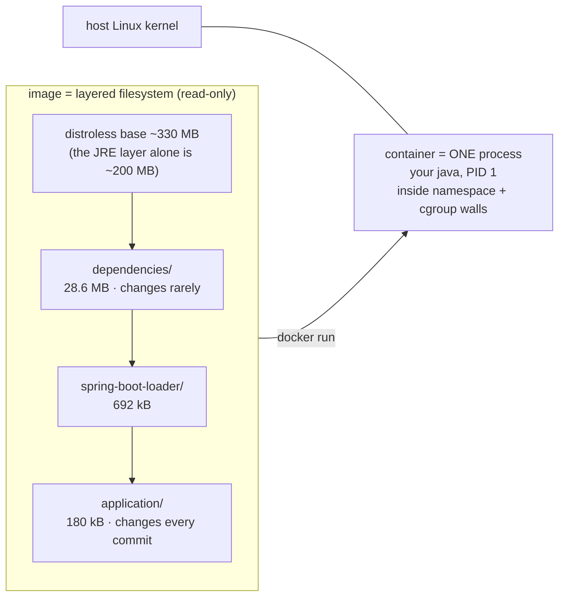
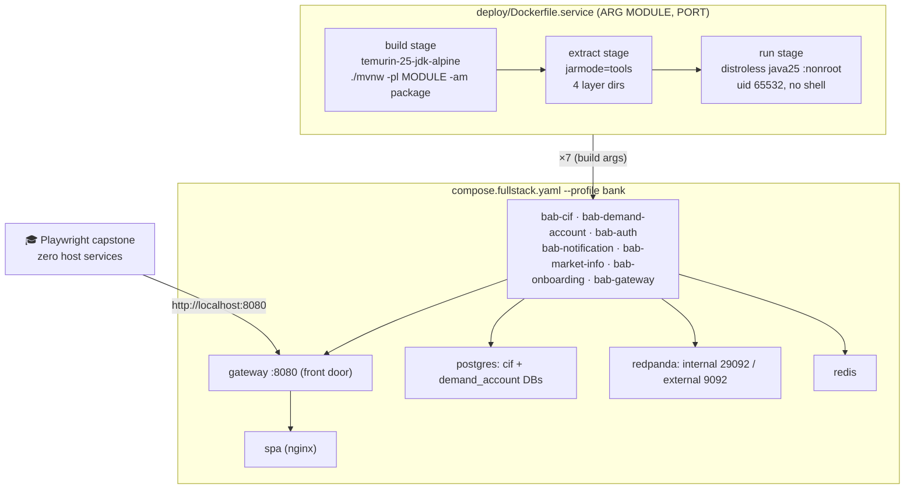
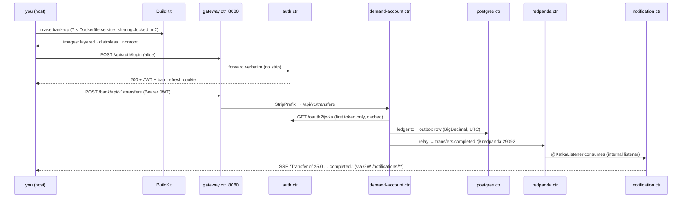

# Step 33 · Containerize Everything — Multi-stage, Distroless, Non-root 📦
### Phase G — DevOps Zero to Hero 🔵🟣 · Step 33 of 67 · Phase G opens

> **Last night the bank needed four terminals to run.** One for auth, one for the ledger, one for
> notifications, one for the gateway — each a `./mvnw spring-boot:run` on *your* machine, with *your*
> JDK, *your* environment quirks. Tonight the whole platform — six services, the gateway, the SPA,
> Postgres, Redis, Redpanda — starts with **one command** and runs identically on any machine with
> Docker. Along the way you'll shrink a 471 MB root-user image into a layered, distroless, non-root
> one, watch the JVM read its memory budget from the container's walls, get a container deliberately
> OOM-killed and read the corpse, and cut startup ~30% with JDK 25's AOT cache. The proof at the end
> is the same Playwright capstone from Step 32 — green against a bank with **zero** host processes.

## 🧭 The Six Movements of This Step

| | Movement | What happens | ~time |
|---|---|---|---|
| **A** | [🧭 Orient](#orient) | 30-second overview · skip-test · cheat card · session plan | ~1 h |
| **B** | [🧠 Understand](#understand) | what an image *is* · cgroup walls & the container-aware JVM · multi-stage builds | ~2.5 h |
| **C** | [🛠️ Build](#build) | 12 sub-steps: naive → multi-stage → layered → distroless → JVM lab → AOT → fleet Dockerfile → infra rewire → compose profile → poke it → 🎓 capstone → Buildpacks/Jib | ~13 h |
| **D** | [🔬 Prove](#prove) | the Verification Log — 🟠 Standard tier: full `./mvnw verify`, all-container capstone, smoke gates | ~45 min |
| **E** | [🎓 Apply](#apply) | jlink & hardening asides · interview prep · your-turn exercises | ~1.5 h |
| **F** | [🏆 Review](#review) | troubleshooting (real errors included) · glossary · recap & flashcards | ~45 min |

---

<a id="orient"></a>

# A · 🧭 Orient ⏱ ~1 h

## 📋 This Step in 30 Seconds ⏱ ~5 min

| | |
|---|---|
| **What** | A naive Dockerfile evolved into the real thing (multi-stage → layered → distroless → non-root) · JVM-in-a-cgroup tuning with a deliberate OOM kill · JDK 25 AOT-cache startup lab · ONE parameterized Dockerfile for all 7 services · `deploy/compose.fullstack.yaml` grows a `bank` profile that runs the ENTIRE platform in containers · Buildpacks & Jib compared with real runs |
| **Badge** | 🔵 Core — Phase G opener |
| **Effort** | ~20 h (8 sittings) |
| **What to run** | Docker Desktop only. Every command in this step is `docker …`, `docker compose …`, or `./mvnw …`. No host services — that's the point. |
| **You finish with** | `step-33-end` — the whole bank at **http://localhost:8080** from `make bank-up`, zero host processes |

### ⏭️ Can You Skip This Step? (5-minute self-check)

Performance test — do these, don't "feel" them. All three pass ⇒ skim 🧠 The Big Idea, then jump to [sub-step 7](#c7) and build the fleet.

1. **Write a multi-stage Dockerfile** for any Spring Boot jar: build stage compiles the jar, runtime stage has only a JRE, the process runs as a **non-root** user. Pass: the app answers a curl **and** `docker inspect <ctr> --format '{{.Config.User}}'` prints a non-zero uid.
2. **Prove layer caching**: change one line of Java, rebuild, and paste the two build-log lines showing your **dependencies layer was `CACHED`** while the app layer rebuilt. (If everything rebuilt, you don't pass — you're missing the layered-jar idea.)
3. **Size a container JVM**: run any Java image with `-m 256m` and `-XX:MaxRAMPercentage=50`, and show `MaxHeapSize` = 128 MiB via `-XX:+PrintFlagsFinal`. Bonus: explain what exit code 137 means and who sends the signal.

## 📇 Cheat Card ⏱ ~5 min

```bash
# The whole bank, in containers, one origin:
make bank-up      # = docker compose -f deploy/compose.fullstack.yaml --profile bank up -d --build
make bank-ps      #   all 11 containers + state
make bank-logs S=gateway
make bank-down    #   tears down + drops volumes

# Build ONE service image by hand (any of the 7 — they share deploy/Dockerfile.service):
docker build -f deploy/Dockerfile.service \
  --build-arg MODULE=services/auth --build-arg PORT=8083 -t bab-auth:0.1.0-SNAPSHOT .
```

The Dockerfile shape you'll internalize (three stages, four runtime layers):

```dockerfile
FROM eclipse-temurin:25-jdk-alpine AS build      # ① compile INSIDE Docker (hermetic)
RUN --mount=type=cache,target=/root/.m2 ./mvnw -pl $MODULE -am package -DskipTests
FROM eclipse-temurin:25-jdk-alpine AS extract    # ② split the jar by change-frequency
RUN java -Djarmode=tools -jar app.jar extract --layers --launcher --destination extracted
FROM gcr.io/distroless/java25-debian13:nonroot   # ③ no shell, no root, just a JRE
COPY --from=extract …/dependencies/ ./           #    big, changes rarely  → cached
COPY --from=extract …/application/  ./           #    tiny, changes always → rebuilt
```

**This step delivers:** the bank as a fleet of pinned, non-root, distroless images — and the Step-32 full-stack capstone passing against it with zero host services.

## 🎯 Why This Matters ⏱ ~3 min

"Works on my machine" died the day someone first typed `FROM`. Every deployment target you'll meet from here — Kubernetes (Step 34), CI/CD (Step 35), canary releases (Step 38) — consumes *images*, so image craft is the entry ticket to all of Phase G. And it's a naked interview filter: "walk me through your Dockerfile" and "why did your pod get OOM-killed at 137?" separate people who shipped containers from people who watched a video about them. You're about to be the first kind.

## ✅ What You'll Be Able to Do ⏱ ~2 min

Each outcome maps to a check — that's how you'll *know* you can do it:

- **Explain image vs container vs layer** (and what BuildKit caches) → ❓ checks in B, 🧠 Test Yourself Q1
- **Write a multi-stage, layered, non-root Dockerfile** for any JVM service → ✋ sub-steps 2–4, 🏋️ near-transfer exercise
- **Size a JVM inside a cgroup and diagnose an OOM kill** (137, `OOMKilled=true`) → 🔬 break-it in sub-step 5, 💼 Q3, 🧠 Q3
- **Cut cold-start with the JDK 25 AOT cache** and say why it's a lab, not yet a fleet default → ✋ + ❓ in sub-step 6
- **Run a multi-service topology with compose profiles, healthchecks, initdb and dual-listener Kafka** → ✋ sub-steps 8–9, ❓ in sub-step 8, 🧠 Q4
- **Argue Dockerfile vs Buildpacks vs Jib with evidence** → ✋ sub-step 12 (the measured table), 💼 Q5

## 🧰 Before You Start ⏱ ~10 min

**Depends on: Steps 8, 15, 20, 28, 32.**

- **Step 8** gave you compose + Flyway + the 5433 port dodge — today Postgres serves *two* databases.
- **Step 15/29/32** built the gateway front door; its route URIs were env-parameterized from day one (`${services.cif.uri:http://localhost:8081}`) — today that foresight pays off *without touching a line of Java*.
- **Step 20** wired the Outbox → Kafka relay; today its broker address stops being `localhost`.
- **Step 32** shipped the SPA as a container (`frontend/Dockerfile`) — the multi-stage template you'll now apply to the JVM, and the full-stack capstone you'll re-aim at an all-container bank.

Check your ground (all three must pass before sitting 1):

```bash
docker info --format 'Docker {{.ServerVersion}} · {{.NCPU}} CPUs · {{.MemTotal}} bytes for the VM'
git status --porcelain   # empty = clean
git describe --tags      # step-32-end (== step-33-start)
```

> 💡 Everything runs from the **repo root**. When a command needs a different directory, the prompt shows it.

## 🗓️ Session Plan (~20 h → 8 sittings) ⏱ ~5 min

Stopping mid-step at any ✋ is a *planned success*, not a failure — every sub-step ends with a re-entry ritual.

| Sitting | ~h | You do | Ends at |
|---|---|---|---|
| **1** | 2.5 | Orient + The Big Idea + Under the Hood, then **sub-step 1**: auth in a box (first win ≤10 min of build time) | ✋ 1 |
| **2** | 2.5 | Sub-steps **2–3**: hermetic multi-stage build, layered jars + the cache demo | ✋ 3 |
| **3** | 2.5 | Sub-steps **4–5**: distroless + non-root, the JVM-vs-cgroups lab + 🔬 OOM kill | ✋ 5 |
| **4** | 2 | Sub-steps **6–7**: AOT-cache startup lab, promote to `deploy/Dockerfile.service` | ✋ 7 |
| **5** | 2.5 | Sub-step **8**: two databases + dual-listener Redpanda (the infra rewire) | ✋ 8 |
| **6** | 2.5 | Sub-steps **9–10**: the `bank` profile — all 7 services composed, then poke every wire | ✋ 10 |
| **7** | 2.5 | Sub-steps **11–12**: 🎓 capstone against zero host services + smoke.sh; Buildpacks & Jib with real runs | ✋ 12 |
| **8** | 2 | D Prove (read + re-run) · E Apply (interview prep, your-turn) · F Review (recap, flashcards) | 🏁 |

**Optional routes:** skip-test passers start at sitting 4 (fast-track, saves ~7 h) · every 🚀 aside is labeled `+~N min` and lives OUTSIDE these budgets · sub-step 12 is self-contained — droppable if you're over budget (you lose the comparison table, not the bank).

---

<a id="understand"></a>

# B · 🧠 Understand ⏱ ~2.5 h

## 🧠 The Big Idea ⏱ ~45 min

**An image is not a small virtual machine. It's a stack of read-only filesystem diffs plus a JSON note saying how to start one process.** A container is that process, running on *your host's kernel*, inside three kinds of walls the kernel provides:

- **namespaces** — what the process can *see* (its own PID 1, its own network, its own `/`),
- **cgroups** — what it can *use* (memory ceiling, CPU quota),
- **capabilities/users** — what it's *allowed to do* (this is where root vs non-root bites).


*Alt-text: an image is four stacked read-only layers (base JRE, dependencies, loader, application) that `docker run` turns into a single java process, PID 1, boxed in by the host kernel's namespace and cgroup walls.*

**The analogy that holds up:** layers are **git commits for filesystems**. Each `COPY`/`RUN` line commits a diff on top of the previous state; the layer's identity is a content hash. Change a line and you don't "edit" anything — you fork from the last unchanged commit and re-create everything after it. That single fact explains *all* of today's Dockerfile choreography: put what changes rarely (dependencies) in early layers, what changes every commit (your classes) in the last one, and rebuilds/pulls only ever ship the tiny tip.

Why this matters *for a bank*: reproducibility is a control. The image you tested is — byte for byte — the image you ship; there is no "the server had a different JDK". Phase H will even sign these bytes. Today you make the bytes worth signing.

❓ **Quick check** — a colleague says "containers are lightweight VMs." Name the two concrete ways that's wrong, and the one way it's a fair intuition. <details><summary>Answer</summary>Wrong: (1) there's no guest kernel — every container shares the host kernel (that's why a kernel exploit escapes ALL containers); (2) an image doesn't boot — it starts one process with an entrypoint, PID 1, no init system. Fair intuition: from the process's own point of view the namespaces make it *look* like it has a machine to itself (own PID table, own network, own filesystem root).</details>

## 🧩 Pattern Spotlight: the Builder pattern, filesystem edition ⏱ ~20 min

**Problem:** compiling needs a ~440 MB JDK image + Maven + caches; running needs ~30 MB of jars on a JRE. One environment can't be both minimal and self-sufficient.
**The pattern:** *multi-stage build* — several `FROM`s in one Dockerfile; each later stage cherry-picks files from earlier ones (`COPY --from=build …`); only the **last** stage becomes the image. The toolchain is scaffolding: present for the build, absent from the artifact.
**Alternatives & trade-offs:** build the jar on the host and `COPY` it in (fast, but the image inherits whatever your laptop's JDK did — you'll do this ONCE in sub-step 1, then never again) · Cloud Native Buildpacks (zero Dockerfile, opinionated, heavier — measured in sub-step 12) · Jib (daemonless, Maven-native — sub-step 12 shows why it's benched *today*).
**Where you've seen it:** `frontend/Dockerfile` (Step 32) is exactly this — node toolchain in stage 1, 150 kB of static files on nginx in stage 2. Today's twist is JVM-specific: a third *extract* stage that takes the fat jar apart by change-frequency.

## 🌱 Under the Hood: how the JVM discovers its walls ⏱ ~40 min

Nothing tells the JVM it's "in Docker". At startup, HotSpot *probes the cgroup filesystem* — on any modern Linux, cgroups **v2**: it reads `/sys/fs/cgroup/memory.max` and `/sys/fs/cgroup/cpu.max` (the interface files for its own cgroup). If a ceiling exists, ergonomics size against the ceiling; if not, against host RAM. You can watch this exact probe:

```text
Provider: cgroupv2          ← java -XshowSettings:system, from sub-step 5's real run
Effective CPU Count: 2
CPU Quota: 200000us / CPU Period: 100000us   ← --cpus 2, expressed as quota/period
```

Three consequences you'll verify live:

1. **Default heap is 25% of the limit** — tiny 512 MB container ⇒ 128 MB heap. `-XX:MaxRAMPercentage=75` is the standard correction for a single-process container (you'll bake it in via `JAVA_TOOL_OPTIONS`, the env var every JVM reads at startup).
2. **Heap is not the process.** Metaspace + code cache + thread stacks + direct buffers live OUTSIDE the heap. Percentage 75 leaves the other 25 for them; set 100 and the *kernel* kills you — which brings us to…
3. **Two different OOMs.** `java.lang.OutOfMemoryError` = the *JVM* gave up allocating heap (stack trace, graceful-ish). **Exit 137** = the *kernel's* OOM-killer sent SIGKILL (128 + 9) because the container's whole cgroup (every process in it) crossed `memory.max` — no stack trace, no goodbye, just `OOMKilled=true` in `docker inspect`. Interviews love this distinction; sub-step 5 makes you produce both halves of the evidence.

And the second "under the hood" of the day — **what `jarmode` does**: a Spring Boot fat jar carries an index of its own contents. `java -Djarmode=tools -jar app.jar extract --layers --launcher` asks the jar to unpack itself into four directories ordered by change-frequency (`dependencies/`, `spring-boot-loader/`, `snapshot-dependencies/`, `application/`), so each can become its own Docker layer. At runtime, `JarLauncher` reassembles the classpath from those directories — same app, cache-friendly shape.

## 🛡️ Security Lens ⏱ ~15 min

- **Root in a container is not "contained root."** Same uid 0 as the host kernel sees; one container-escape CVE away from owning the node. Your naive image (sub-step 1) runs as root — you'll *prove* it, then fix it. Distroless `:nonroot` bakes uid **65532** into the image so nobody has to remember a `USER` line.
- **Attack surface is what's IN the image.** A shell + package manager turn "attacker ran code in my container" into "attacker installed tools in my container". Distroless has no `sh`, no `apk`, no `curl` — sub-step 4 shows `docker exec … sh` failing with *executable file not found*, which is the sound of a whole exploit class not happening. Honest trade-off: it also kills exec-debugging and shell-based healthchecks (Step 34's k8s probes fix that properly, from outside).
- **Pin or be poisoned.** `FROM eclipse-temurin:latest` means "whatever someone pushed last night." Tags here are exact (`VERSIONS.md` records the digests) — Phase H turns that into verification with cosign.
- **Secrets never go in layers.** A `RUN` that reads a secret leaves it in the layer *forever* (layers are content-addressed history, remember). Our demo creds are fake by design; real secret delivery is Phase H's Vault.

## 🕰️ Then vs. Now ⏱ ~15 min

| Era | Java-in-Docker reality | What survives today |
|---|---|---|
| ≤ JDK 8u121 (2017) | JVM read HOST memory/CPUs; a 512 MB container on a 64 GB host sized a ~16 GB heap → fleets of 137s | the war stories — and interview Q3 |
| 8u131–9 | `-XX:+UseCGroupMemoryLimitForHeap` (experimental band-aid) | you'll still see it in old runbooks; it's gone |
| JDK 10+ | **`-XX:+UseContainerSupport` ON by default** — cgroup probing is standard | today's default behavior (sub-step 5) |
| JDK 10 → 23 | CDS → AppCDS: dump class metadata, share at startup | the *idea* of "pay class-loading once" |
| JDK 24 | **the AOT cache lands** (Project Leyden, JEP 483) | the CDS successor |
| **JDK 25 (ours)** | one-step training ergonomics `-XX:AOTCacheOutput` (JEP 514) → ~30% faster startup, measured in sub-step 6 | the current answer; Boot 4 integrates it |
| docker build (legacy) | serial, no cache mounts | — |
| **BuildKit (ours)** | content-addressed layers, `--mount=type=cache`, parallel stages | `sharing=locked` saves your Maven cache in sub-step 7 |

---

<a id="build"></a>

# C · 🛠️ Build ⏱ ~13 h

## 📦 Your Starting Point ⏱ ~5 min

You're on tag **`step-33-start`** (== `step-32-end`). Green and in hand: 14 Maven modules verifying clean; the SPA shipped as a container; `deploy/compose.fullstack.yaml` running infra (Postgres :5433, Redis, Redpanda) + SPA; the four core services running **on the host** in four terminals. Every service's config is already env-driven with localhost defaults (the 12-factor habit from Step 8) — remember that; it's the reason today needs **zero Java changes**.

What you'll build: seven container images from one Dockerfile, a compose `bank` profile that runs the whole platform, and the labs that teach you *why* each Dockerfile line exists.

```bash
git checkout main && git describe --tags   # step-32-end
./mvnw -pl services/auth -am verify        # warm-up + sanity: BUILD SUCCESS, auth 17 tests
```

## 🛠️ Let's Build It — Step by Step ⏱ ~10.5 h of sub-steps

🗺️ **What we're building:**


*Alt-text: one parameterized three-stage Dockerfile produces seven service images; a compose profile wires them to Postgres (two databases), dual-listener Redpanda, Redis and the SPA behind the gateway on :8080; the Playwright capstone drives the gateway.*

🌳 **Files we'll touch:**

```text
build-a-bank/
├── .dockerignore                      ← NEW (sub-step 2): context hygiene + hermetic builds
├── services/auth/Dockerfile           ← NEW (sub-step 1), evolves in 2–4, RETIRES in 7
├── deploy/
│   ├── Dockerfile.service             ← NEW (sub-step 7): the ONE fleet Dockerfile
│   ├── initdb/01-create-cif-db.sql    ← NEW (sub-step 8): second database
│   └── compose.fullstack.yaml         ← EDIT (sub-steps 8–9): dual-listener + profile "bank"
├── Makefile                           ← EDIT (sub-step 9): bank-up/-down/-ps/-logs, image-service
└── steps/step-33/{requests.http,smoke.sh}  ← NEW (sub-steps 10–11)
```

> 🧵 **Thread-safety note (Step 11 lens):** today's shared mutable state isn't a Java field — it's Maven's local repository. Sub-step 7 hits a real race (7 concurrent builds, one `~/.m2`, no file locking) and fixes it with `sharing=locked`, the mount-level equivalent of a mutex.

---

<a id="c1"></a>

### Sub-step 1 of 12 — Auth in a box: the naive image (~45 min) 🧭 *(you are here: **naive** → multi-stage → layered → distroless → JVM lab → AOT → fleet → infra → compose → poke → capstone → alternatives)*

🎯 **Goal:** get *any* service into *any* container and prove it serves traffic — your first win — then read three flaws off the artifact that the next three sub-steps will fix one by one.

📁 **Location:** new file → `services/auth/Dockerfile` (auth is the perfect guinea pig: no DB, no Kafka, no Redis — it boots anywhere).

First, make sure the jar exists on the host (this naive version copies it in — that's flaw #3, and we do it anyway, once, on purpose):

```bash
./mvnw -pl services/auth -am package -DskipTests
```

⌨️ **Code:**

```dockerfile
# services/auth/Dockerfile — Step 33 sub-step 1: the NAIVE image (deliberately).
# One stage, full JDK, root user, fat jar copied from the HOST build. It works — and every
# flaw it has (size, root, host-dependent build) is what the rest of Step 33 fixes.
FROM eclipse-temurin:25-jdk-alpine
COPY target/auth-0.1.0-SNAPSHOT.jar app.jar
EXPOSE 8083
ENTRYPOINT ["java", "-jar", "/app.jar"]
```

🔍 **Line-by-line (every token is new — this is your first Dockerfile of the course):**

- `FROM eclipse-temurin:25-jdk-alpine` — the base layer: Alpine Linux + the Temurin **JDK** matching our pinned Java (exact tags/digests live in `VERSIONS.md`, never restated here). `FROM` is "start my layer stack on top of theirs."
- `COPY target/auth-0.1.0-SNAPSHOT.jar app.jar` — copies FROM the build **context** (the directory you pass to `docker build` — here `services/auth`) INTO the image as a new layer. The daemon can only see the context; nothing else on your disk exists to it.
- `EXPOSE 8083` — *documentation*, not a firewall rule: it declares which port the process listens on. The actual host mapping happens at run time (`-p`).
- `ENTRYPOINT ["java", "-jar", "/app.jar"]` — the one process this container exists to run, in **exec form** (a JSON array: no shell involved, java IS PID 1 and receives signals directly — that's what makes `docker stop` trigger Boot's graceful shutdown from Step 13's `server.shutdown: graceful`).

💭 **Under the hood:** `docker build` sends the context to the daemon, then executes each instruction in a temporary container, snapshotting the filesystem diff as a layer. Four instructions ⇒ image = base layers + 1 COPY layer + metadata (EXPOSE/ENTRYPOINT change *config*, not filesystem — they're 0-byte "layers").

🔮 **Predict:** the Temurin JDK Alpine base is ~440 MB and the jar ~29 MB. Within 50 MB, how big is the image? And whoami inside — root or something Alpine-ish like `nobody`?

▶️ **Run & See:**

```bash
cd services/auth
docker build -t bab-auth:naive .
docker images bab-auth:naive --format '{{.Repository}}:{{.Tag}}  {{.Size}}'
```

✅ **Expected output (real run, abridged to the tail):**

```text
#6 [2/2] COPY target/auth-0.1.0-SNAPSHOT.jar app.jar
#6 DONE 0.6s
#7 exporting to image
#7 naming to docker.io/library/bab-auth:naive done
#7 DONE 1.4s
bab-auth:naive  471MB
```

Now run it and hit it — the exact login you've curled since Step 16, now answered from inside a container:

```bash
docker run -d --name bab-auth-naive -p 8083:8083 bab-auth:naive
sleep 6
curl -s -i -X POST http://localhost:8083/api/auth/login \
  -H "Content-Type: application/json" -d '{"username":"alice","password":"password"}' | head -3
docker logs bab-auth-naive | grep "Started"
docker exec bab-auth-naive sh -c 'whoami && id -u'
```

✅ **Expected output (real):**

```text
HTTP/1.1 200
Set-Cookie: bab_refresh=Ymz7T5CtGEejg9HiYftoXzw3MnV843l0fjDXQ_Cndvs; Path=/api/auth; Max-Age=43200; ...; HttpOnly; SameSite=Strict
...
2026-07-02T19:49:50.701Z  INFO 1 --- [auth] [main] com.buildabank.auth.AuthApplication : Started AuthApplication in 4.869 seconds (process running for 5.741)
root
0
```

Look at three things: the JWT machinery from Step 32 works untouched (the refresh cookie is right there) · the log says **PID 1** — java IS the container · and `whoami` says **root**. That's flaw #1. Flaw #2 is 471 MB (a full JDK + Alpine to run one jar). Flaw #3 is invisible but worst: the jar came from *your host* — whatever JDK, whatever uncommitted code you had. Three sub-steps, three fixes.

❌ **If you see `COPY failed: ... target/auth-0.1.0-SNAPSHOT.jar: not found`:** you skipped the `./mvnw package` above, or you ran `docker build` from the repo root (the context must be `services/auth` for THIS naive version — the `.` argument is the context).

✋ **Checkpoint:** a containerized auth answers login with a 200 and you can name its three flaws from evidence, not slides. Clean up: `docker rm -f bab-auth-naive`.

🔄 **Stopping here?** You have a working (naive) auth image. Next: sub-step 2 (build INSIDE Docker); first action: create `.dockerignore` at the repo root.

💾 **Commit:**

```bash
git add services/auth/Dockerfile
git commit -m "feat(deploy): naive auth Dockerfile (step 33 sub-step 1 - deliberately flawed baseline)"
```

⚠️ **Pitfall:** `EXPOSE` opens nothing. If curl can't connect, the missing piece is `-p 8083:8083` at `docker run` — host-port:container-port. `EXPOSE` without `-p` is a sticky note, not a socket.

---

<a id="c2"></a>

### Sub-step 2 of 12 — Multi-stage: build INSIDE Docker (~1 h) 🧭 *(naive ✅ → **multi-stage** → layered → distroless → …)*

🎯 **Goal:** kill flaw #3 (host-dependent jar) by compiling *inside* the image build — hermetically, with a cached Maven repo so it doesn't take forever — and kill some of flaw #2 by shipping a JRE instead of a JDK.

📁 **Location:** first a NEW file at the **repo root** → `.dockerignore`, then EDIT `services/auth/Dockerfile`.

Why the root? Because building inside Docker means the build needs the *whole Maven reactor* (parent pom + every module pom — Step 8's `<modules>` list), so the context becomes the repo root. And a repo-root context without a `.dockerignore` would upload `.git`, `frontend/node_modules`, every `target/`… slow AND dangerous.

⌨️ **Code (new file):**

```dockerfile
# .dockerignore — Step 33. Applies when the build CONTEXT is the repo root (deploy/Dockerfile.service,
# services/auth/Dockerfile stages 2+). Two jobs:
#  1. Keep the context small + cache-friendly (docs/steps churn must not invalidate COPY layers).
#  2. Keep HOST build artifacts out of the hermetic in-image build — a stale target/*.jar from your
#     machine must never sneak into an image that claims it was built from source.
.git
**/target
**/.flattened-pom.xml
frontend
steps
docs
adr
security
deploy
Makefile
*.md
*.log
.claude
.idea
**/.DS_Store
```

⌨️ **Code (edit — replace `services/auth/Dockerfile` entirely):**

```dockerfile
# services/auth/Dockerfile — Step 33 sub-step 2: multi-stage, hermetic.
# Stage 1 builds the jar INSIDE Docker (same JDK for everyone — no "works on my machine" jars);
# stage 2 ships only a JRE + the jar. Build context is the REPO ROOT (the Maven reactor needs
# every module's pom.xml):  docker build -f services/auth/Dockerfile -t bab-auth:multistage .
# Versions pinned per VERSIONS.md (never :latest).

# ── Stage 1: build ──────────────────────────────────────────────────────────
FROM eclipse-temurin:25-jdk-alpine AS build
WORKDIR /workspace

# The reactor: parent pom + every module pom must be present, or ./mvnw can't resolve the graph.
COPY mvnw pom.xml ./
COPY .mvn/ .mvn/
COPY libs/ libs/
COPY services/ services/
COPY gateway/ gateway/
COPY playground/ playground/

# --mount=type=cache keeps ~/.m2 on the BUILDER between builds (BuildKit) — first build downloads
# the world once; later builds hit the cache. It is NOT a layer: it never ships in the image.
RUN --mount=type=cache,target=/root/.m2 \
    ./mvnw -pl services/auth -am package -DskipTests

# ── Stage 2: run ────────────────────────────────────────────────────────────
FROM eclipse-temurin:25-jre-alpine
WORKDIR /app
COPY --from=build /workspace/services/auth/target/auth-0.1.0-SNAPSHOT.jar app.jar
EXPOSE 8083
ENTRYPOINT ["java", "-jar", "app.jar"]
```

🔍 **Line-by-line (the new tokens):**

- `.dockerignore` — same idea as `.gitignore` but for the build context. The `**/target` line is the safety-critical one: it *guarantees* the hermetic build can't accidentally `COPY` a stale host-built jar. `deploy`, `steps`, `docs`… are excluded so editing a lesson never invalidates a `COPY services/ …` layer (cache hygiene).
- `AS build` — names the stage so later stages can reference it.
- `WORKDIR /workspace` — creates + cds into it; all relative paths below live there.
- The **COPY choreography** — poms and wrapper first, then module trees. Maven's reactor (Step 8) refuses to resolve `-pl services/auth -am` unless *every* `<module>` listed in the parent pom exists, so we copy all module dirs even though only auth + `libs/common` get built (`-am` = also-make dependencies).
- `RUN --mount=type=cache,target=/root/.m2` — a BuildKit **cache mount**: a persistent directory that exists *only during RUN*, kept between builds on the builder. Without it, every image build re-downloads every dependency; with it, only the first build pays.
- `-DskipTests` — heresy? No: tests already gate `verify` on the host and in CI (Step 35 formalizes it). The image build's job is *packaging*, and repeating the full Testcontainers suite inside every image build would need Docker-inside-Docker anyway.
- `FROM eclipse-temurin:25-jre-alpine` — stage 2 starts from a fresh, smaller base (**JRE** — runtime only, no compiler). Only this stage ships.
- `COPY --from=build …` — the multi-stage magic: reach into the *build* stage's filesystem and take one file. The JDK, Maven, and source code all evaporate.

💭 **Under the hood:** each stage is its own layer stack; BuildKit builds them as a DAG and drops everything not reachable from the final stage. The cache mount lives in BuildKit's private store — `docker images` will never show it, `docker builder prune` clears it.

🔮 **Predict:** first build must download every dependency inside the container — minutes. And the image: the JRE base is ~110 MB smaller than the JDK. From 471 MB to…?

▶️ **Run & See (from the repo root — note the `-f` and the `.`):**

```bash
cd ../..   # back to the repo root if you were in services/auth
docker build -f services/auth/Dockerfile -t bab-auth:multistage .
docker images bab-auth --format '{{.Repository}}:{{.Tag}}  {{.Size}}'
docker run -d --name bab-auth-ms -p 8083:8083 bab-auth:multistage && sleep 6 && \
  curl -s -o /dev/null -w "login %{http_code}\n" -X POST http://localhost:8083/api/auth/login \
  -H "Content-Type: application/json" -d '{"username":"alice","password":"password"}'
docker rm -f bab-auth-ms
```

✅ **Expected output (real; the first build took ~4 min on this machine, dominated by the in-container dependency download):**

```text
#6 [build 2/9] WORKDIR /workspace
...
#15 [build 9/9] RUN --mount=type=cache,target=/root/.m2     ./mvnw -pl services/auth -am package -DskipTests
...
#18 naming to docker.io/library/bab-auth:multistage done
bab-auth:multistage  359MB
bab-auth:naive       471MB
login 200
```

❌ **If the Maven step dies with `Child module .../playground/java-basics does not exist`:** you forgot one of the `COPY` lines (the reactor needs every module directory present — check all six COPYs).

✋ **Checkpoint:** same 200, 112 MB lighter, and the jar provably came from clean sources inside the build — your laptop's state can no longer leak into the artifact.

🔄 **Stopping here?** You have a hermetic multi-stage build. Next: sub-step 3 (layered jars — rebuild in seconds); first action: open `services/auth/Dockerfile` and find the `COPY --from=build` line you're about to split into four.

💾 **Commit:**

```bash
git add .dockerignore services/auth/Dockerfile
git commit -m "feat(deploy): hermetic multi-stage auth image + root .dockerignore"
```

⚠️ **Pitfall:** `.dockerignore` lives next to the *context root*, not next to the Dockerfile. Put it in `services/auth/` and the repo-root build ignores it silently — and your context balloons to hundreds of MB (watch the `transferring context:` line; ours stays ~5 MB).

---

<a id="c3"></a>

### Sub-step 3 of 12 — Layered jars: rebuilds in seconds, pulls in kilobytes (~1 h) 🧭 *(naive ✅ → multi-stage ✅ → **layered** → distroless → …)*

🎯 **Goal:** stop shipping a ~29 MB fat jar as ONE layer. Split it by change-frequency with Boot's `jarmode` so a code-only change rebuilds (and re-pulls) ~180 **kB**, not ~29 MB.

📁 **Location:** EDIT `services/auth/Dockerfile` — insert an *extract* stage between build and run, and change the run stage's COPYs.

⌨️ **Code (the full file after the edit — new/changed lines are the extract stage + the four COPYs):**

```dockerfile
# services/auth/Dockerfile — Step 33 sub-step 3: multi-stage + LAYERED.
# Build context is the REPO ROOT:  docker build -f services/auth/Dockerfile -t bab-auth:layered .

# ── Stage 1: build ──────────────────────────────────────────────────────────
FROM eclipse-temurin:25-jdk-alpine AS build
WORKDIR /workspace
COPY mvnw pom.xml ./
COPY .mvn/ .mvn/
COPY libs/ libs/
COPY services/ services/
COPY gateway/ gateway/
COPY playground/ playground/
RUN --mount=type=cache,target=/root/.m2 \
    ./mvnw -pl services/auth -am package -DskipTests

# ── Stage 2: extract — split the fat jar by change frequency ───────────────
FROM eclipse-temurin:25-jdk-alpine AS extract
WORKDIR /extract
COPY --from=build /workspace/services/auth/target/auth-0.1.0-SNAPSHOT.jar app.jar
# jarmode=tools (Boot 3.3+/4): the jar knows how to take itself apart. --layers splits by change
# frequency (dependencies / loader / snapshots / application), --launcher keeps JarLauncher.
RUN java -Djarmode=tools -jar app.jar extract --layers --launcher --destination extracted

# ── Stage 3: run — four COPYs, least → most volatile ───────────────────────
FROM eclipse-temurin:25-jre-alpine
WORKDIR /app
COPY --from=extract /extract/extracted/dependencies/ ./
COPY --from=extract /extract/extracted/spring-boot-loader/ ./
COPY --from=extract /extract/extracted/snapshot-dependencies/ ./
COPY --from=extract /extract/extracted/application/ ./
EXPOSE 8083
ENTRYPOINT ["java", "org.springframework.boot.loader.launch.JarLauncher"]
```

🔍 **Line-by-line (what changed and why):**

- The **extract stage** exists so the splitting happens *once*, in a stage with a JDK, and stage 3 just copies directories. `-Djarmode=tools` flips the jar into its self-service CLI (you met the non-layered form of this idea in Step 32's nginx build? No — it's new today; ≤3 new terms, this is #1).
- `extract --layers --launcher --destination extracted` — produces four directories. `dependencies/` = your 28.6 MB of Spring + drivers (changes when you bump versions), `spring-boot-loader/` = 692 kB of Boot's launcher classes, `snapshot-dependencies/` = SNAPSHOT-versioned deps (4 kB here), `application/` = **your** classes + resources (180 kB).
- **COPY order is the whole trick**: Docker invalidates a layer *and everything after it* when its content changes. Dependencies almost never change ⇒ first. Your code always changes ⇒ last. (Git-commits analogy from 🧠: keep the churn at the tip.)
- `ENTRYPOINT ["java", "org.springframework.boot.loader.launch.JarLauncher"]` — no `-jar` anymore: `JarLauncher` (new term #2) is Boot's launcher class; run from `/app` it reassembles the classpath from the four directories. Java's default classpath is `.`, which is exactly WORKDIR `/app`, where the loader classes landed.

💭 **Under the hood:** each `COPY --from` layer is content-hashed. Rebuild after a code change ⇒ `dependencies/` bytes are identical ⇒ same hash ⇒ layer **CACHED**, even though the jar it was extracted from changed. A registry pull works the same way — clients fetch only layers whose digests they don't have. Your future CI (Step 35) will push 180 kB per deploy, not 29 MB.

🔮 **Predict:** (a) rebuild with NO changes — how long? (b) touch one Java file, rebuild — which of the four runtime COPY layers show `CACHED`?

▶️ **Run & See:**

```bash
docker build -f services/auth/Dockerfile -t bab-auth:layered .   # first layered build
# (a) no-change rebuild, timed:
time docker build -f services/auth/Dockerfile -t bab-auth:layered .
# (b) change one line (add a comment to AuthApplication.java), rebuild, watch the CACHED lines:
echo '// layer-cache demo' >> services/auth/src/main/java/com/buildabank/auth/AuthApplication.java
time docker build -f services/auth/Dockerfile -t bab-auth:layered .
git checkout -- services/auth/src/main/java/com/buildabank/auth/AuthApplication.java
```

✅ **Expected output (real runs on this machine):** the no-change rebuild is all-cache:

```text
16 CACHED steps
real    0m3.267s
```

…and the one-line-change rebuild re-runs Maven (the `COPY services/` layer changed) but keeps the heavy runtime layers:

```text
#15 [build 9/9] RUN --mount=type=cache,... ./mvnw -pl services/auth -am package -DskipTests   ← re-ran (warm cache)
#18 [extract 4/4] RUN java -Djarmode=tools -jar app.jar extract --layers ...                  ← re-ran
#20 [stage-2 3/6] COPY --from=extract /extract/extracted/dependencies/ ./
#20 CACHED                                                                                    ← 28.6 MB unchanged!
#21 [stage-2 4/6] COPY --from=extract /extract/extracted/spring-boot-loader/ ./
#21 CACHED
real    0m9.263s
```

Nine seconds, and only the 180 kB `application/` layer is new. Prove the sizes yourself:

```bash
docker history bab-auth:layered --format '{{.CreatedBy}}\t{{.Size}}' | head -6
```

```text
ENTRYPOINT ["java" "org.springframework.boot…   0B
EXPOSE [8083/tcp]                                0B
COPY /extract/extracted/application/ ./ …        180kB     ← your bank, the part that changes
COPY /extract/extracted/snapshot-dependencie…    4.1kB
COPY /extract/extracted/spring-boot-loader/ …    692kB
COPY /extract/extracted/dependencies/ ./ …       28.6MB    ← Spring, the part that doesn't
```

✋ **Checkpoint:** you can rebuild auth's image in single-digit seconds and explain which layer a registry would actually transfer. Sanity: `docker run` it once (same commands as sub-step 2, image `bab-auth:layered`) — login 200. *(Real run note: on this machine that 200 arrived with `Started AuthApplication in 10.4 s` — a full `./mvnw verify` was hogging the CPUs in the background. Containers don't make slow hosts fast.)*

🔄 **Stopping here?** You have layered, cache-friendly images. Next: sub-step 4 (distroless + non-root); first action: change stage 3's `FROM` to `gcr.io/distroless/java25-debian13:nonroot`.

💾 **Commit:**

```bash
git add services/auth/Dockerfile
git commit -m "feat(deploy): layered auth image via jarmode=tools (deps/loader/app split)"
```

⚠️ **Pitfall:** the four COPYs *merge* into the same `/app`. If you give each its own WORKDIR subdirectory "to keep things tidy", `JarLauncher` finds no `BOOT-INF` where it expects and dies with `ClassNotFoundException`. The flat merge IS the layout.

---

<a id="c4"></a>

### Sub-step 4 of 12 — Distroless + non-root: shrink the attack surface, not the megabytes (~45 min) 🧭 *(… layered ✅ → **distroless** → JVM lab → AOT → fleet → …)*

🎯 **Goal:** kill flaw #1 (root) and most of what an attacker could *do* inside the container — by swapping the runtime base for Google's distroless Java image, `:nonroot` variant. Then break into it and fail.

📁 **Location:** EDIT `services/auth/Dockerfile` — stage 3 only.

⌨️ **Code (the diff — stages 1–2 unchanged):**

```dockerfile
# services/auth/Dockerfile — stage 3 diff (sub-step 4)
# ── Stage 3: run — distroless (no shell, no package manager), non-root ─────
-FROM eclipse-temurin:25-jre-alpine
+FROM gcr.io/distroless/java25-debian13:nonroot
 WORKDIR /app
 COPY --from=extract /extract/extracted/dependencies/ ./
 COPY --from=extract /extract/extracted/spring-boot-loader/ ./
 COPY --from=extract /extract/extracted/snapshot-dependencies/ ./
 COPY --from=extract /extract/extracted/application/ ./
 EXPOSE 8083
 ENTRYPOINT ["java", "org.springframework.boot.loader.launch.JarLauncher"]
```

🔍 **Line-by-line:**

- `gcr.io/distroless/java25-debian13` — "distroless" (new term #1 today) = a base with **no shell, no package manager, no coreutils**: just glibc, CA certs, tzdata, and a JRE. Fun fact from `docker history`: the JRE inside is *Temurin 25*, assembled by Google's Bazel build — same JVM you've used all course, minus the operating system around it.
- `:nonroot` — this tag variant sets `USER 65532` (a fixed unprivileged uid, conventionally `nonroot`) in the image config. No `USER` line for you to forget; the wrong default is unrepresentable.
- Everything else is identical — that's the point of the layered layout: the runtime base is a swappable decision.

💭 **Under the hood:** "no shell" isn't hardening theater. `docker exec <ctr> sh`, `RUN`-style debugging, `wget`-based healthchecks, reverse shells that call `/bin/sh -i` — all of these resolve a binary by PATH *inside the container's filesystem*. If the binary isn't in the bytes, the technique doesn't exist. The cost is symmetrical: YOUR debugging loses `exec sh` too (k8s ephemeral debug containers — Step 34 — are the grown-up answer).

🔮 **Predict:** alpine-JRE was 359 MB. Distroless is famous for being minimal — so this should be way smaller, right? (Commit to a number before you build. The answer is a lesson in honest engineering.)

▶️ **Run & See:**

```bash
docker build -f services/auth/Dockerfile -t bab-auth:distroless .
docker images bab-auth --format '{{.Tag}}  {{.Size}}'
docker run -d --name bab-auth-dl -p 8083:8083 bab-auth:distroless && sleep 8 && \
  curl -s -o /dev/null -w "login %{http_code}\n" -X POST http://localhost:8083/api/auth/login \
  -H "Content-Type: application/json" -d '{"username":"alice","password":"password"}'
docker logs bab-auth-dl | grep -m1 "Starting AuthApplication"
```

✅ **Expected output (real; first build pulls the distroless base — ~100 s on this machine, one-time):**

```text
distroless  360MB
layered     360MB
multistage  359MB
naive       471MB
login 200
... Starting AuthApplication v0.1.0-SNAPSHOT using Java 25.0.3 with PID 1 (/app/BOOT-INF/classes started by nonroot in /app)
```

**360 MB — dead even with the alpine-JRE images (multistage 359, layered 360).** Surprised? Distroless is Debian-based (glibc), alpine is musl — the OS-libs delta roughly cancels the removed shell/tools. The honest claim for distroless was never "smaller"; it's **less executable surface**. The log line delivers the other win for free: `started by nonroot`.

🔬 **Break it on purpose #1 — try to get a shell:**

```bash
docker exec bab-auth-dl sh -c 'id'
docker exec bab-auth-dl whoami
docker inspect bab-auth-dl --format 'User={{.Config.User}}'
docker rm -f bab-auth-dl
```

✅ **Expected output (real — the failures ARE the feature):**

```text
OCI runtime exec failed: exec failed: unable to start container process: exec: "sh": executable file not found in $PATH
OCI runtime exec failed: exec failed: unable to start container process: exec: "whoami": executable file not found in $PATH
User=65532
```

Read that error the way an attacker would: *there is nothing here to run but java*. Risk R-002 — cif/notification/market-info/onboarding still have no app-layer auth and trust the network — doesn't disappear, but an entire playbook of post-exploitation just did.

❓ **Check:** a teammate proposes `FROM gcr.io/distroless/java25-debian13:nonroot` + `HEALTHCHECK CMD curl -f http://localhost:8083/actuator/health`. What happens, and what are your two honest options? <details><summary>Answer</summary>The healthcheck can never pass — there's no `curl` (no shell either, so no `wget`, no `sh -c`). Options: (1) keep distroless and do health-gating from OUTSIDE the container (compose `depends_on` only on infra that has healthcheck binaries, k8s HTTP probes in Step 34 — the kubelet curls from outside); (2) trade back to a shell-ful base for exec-style checks and accept the surface. We choose (1) — the lesson's compose file health-gates only postgres/redis/redpanda.</details>

✋ **Checkpoint:** auth runs distroless as uid 65532, answers 200, and you've personally failed to shell into it.

🔄 **Stopping here?** You have the final *shape* of the runtime image. Next: sub-step 5 (the JVM meets its cgroup); first action: run the `PrintFlagsFinal` command below — no file edits.

💾 **Commit:**

```bash
git add services/auth/Dockerfile
git commit -m "feat(deploy): distroless non-root runtime for auth (uid 65532, no shell)"
```

⚠️ **Pitfall:** distroless tags are *family:variant* — `:nonroot` here. Plain `:latest`-style habits die hard; an unpinned distroless family tag is still "whatever was pushed last". `VERSIONS.md` records the digest we resolved today.

---

<a id="c5"></a>

### Sub-step 5 of 12 — The JVM meets its cgroup: a tuning lab with a body count (~1 h) 🧭 *(… distroless ✅ → **JVM lab** → AOT → fleet → …)*

🎯 **Goal:** SEE container-aware heap ergonomics with your own eyes (three runs, three heaps), bake the right default into the image, then cross the memory ceiling on purpose and read the corpse (exit 137).

📁 **Location:** no files yet — this is a lab on `bab-auth:distroless`. The one-line bake happens mid-way.

The JVM's `-XX:+PrintFlagsFinal` dumps every flag's *final* value after ergonomics ran. We'll override the entrypoint to interrogate the JVM directly (distroless has `java` on PATH — the ONE binary it has):

🔮 **Predict:** three runs — (A) `-m 512m`, (B) `-m 512m` with `MaxRAMPercentage=75`, (C) no limit at all. Write down the three `MaxHeapSize` values you expect (this Docker VM has ~11.6 GB).

▶️ **Run & See:**

```bash
# (B is the image default in a moment — for now pass the flag by hand)
docker run --rm -m 512m -e JAVA_TOOL_OPTIONS= --entrypoint java bab-auth:distroless \
  -XX:+PrintFlagsFinal -version | grep " MaxHeapSize"                      # (A) default 25%
docker run --rm -m 512m --entrypoint java bab-auth:distroless \
  -XX:MaxRAMPercentage=75.0 -XX:+PrintFlagsFinal -version | grep " MaxHeapSize"   # (B) 75%
docker run --rm -e JAVA_TOOL_OPTIONS= --entrypoint java bab-auth:distroless \
  -XX:+PrintFlagsFinal -version | grep " MaxHeapSize"                      # (C) no limit
```

✅ **Expected output (real):**

```text
   size_t MaxHeapSize   = 134217728    {product} {ergonomic}     ← (A) 128 MiB = 25% of 512m
   size_t MaxHeapSize   = 402653184    {product} {ergonomic}     ← (B) 384 MiB = 75% of 512m
   size_t MaxHeapSize   = 3110076416   {product} {ergonomic}     ← (C) ~2.9 GiB = 25% of the VM's RAM
```

Run (C) is the quiet horror: *no limit means the host's RAM is the limit*. Ten unlimited JVMs on one node each believe 25% of everything is theirs. Always set limits; then tell the JVM how much of the limit to use. And the JVM will happily show you what it sees — cgroup v2, quota and all:

```bash
docker run --rm -m 512m --cpus 2 --entrypoint java bab-auth:distroless -XshowSettings:system -version
```

```text
Operating System Metrics:
    Provider: cgroupv2
    Effective CPU Count: 2
    CPU Period: 100000us
    CPU Quota: 200000us          ← --cpus 2 = 200ms of CPU per 100ms period
```

💭 **Under the hood:** HotSpot's ergonomics read `/sys/fs/cgroup/memory.max` and `cpu.max` once, at JVM start — the `Provider: cgroupv2` line above is that probe reporting in. The kernel's side is unforgiving arithmetic: cgroup memory accounting covers EVERY page the container's processes touch (heap, metaspace, thread stacks, mapped files), and the OOM-killer fires on that total — it neither knows nor cares about any JVM-internal number.

**Now bake the sane default.** 📁 EDIT `services/auth/Dockerfile`, stage 3, before `EXPOSE`:

⌨️ **Code:**

```dockerfile
# services/auth/Dockerfile — stage 3, before EXPOSE (sub-step 5)
# Container-aware heap: 75% of the container's memory LIMIT (not the host's RAM). JAVA_TOOL_OPTIONS
# is read by every JVM at startup — compose can still override per service.
ENV JAVA_TOOL_OPTIONS="-XX:MaxRAMPercentage=75.0"
```

🔍 `JAVA_TOOL_OPTIONS` (new term #1) is the JVM's official env hook — every `java` launch prepends its contents (you'll see `Picked up JAVA_TOOL_OPTIONS: …` in every log from now on; that's your audit trail). Why env and not `ENTRYPOINT` args? Because compose/k8s can *override an env var per deployment* without rebuilding the image. Why 75? Rule of thumb for a single-JVM container: leave ~25% for metaspace, code cache, thread stacks and direct buffers (the 🌱 movement's point 2).

Rebuild once (`docker build -f services/auth/Dockerfile -t bab-auth:distroless .` — seconds, it's one metadata layer).

🔬 **Break it on purpose #2 — cross the ceiling.** Auth needs roughly 200+ MB RSS to boot comfortably. Give it 64 MB and watch the *kernel* (not the JVM) end it:

🔮 **Predict:** will you get a nice `OutOfMemoryError` stack trace in the logs, or something ruder?

```bash
docker run -d --name bab-auth-oom -m 64m bab-auth:distroless
sleep 20
docker inspect bab-auth-oom --format 'OOMKilled={{.State.OOMKilled}} ExitCode={{.State.ExitCode}} Status={{.State.Status}}'
docker logs bab-auth-oom 2>&1 | tail -2
docker rm -f bab-auth-oom
```

✅ **Expected output (real):**

```text
OOMKilled=true ExitCode=137 Status=exited
2026-07-02T20:00:23.519Z  INFO 1 --- [auth] [main] c.b.auth.AuthApplication : Starting AuthApplication v0.1.0-SNAPSHOT using Java 25.0.3 with PID 1 (/app/BOOT-INF/classes started by nonroot in /app)
2026-07-02T20:00:23.523Z  INFO 1 --- [auth] [main] c.b.auth.AuthApplication : No active profile set, falling back to 1 default profile: "default"
```

The logs just… stop. Mid-startup, no exception, no farewell — because SIGKILL can't be caught or handled — the kernel ends the process without letting it run another instruction, so there's no chance to log a goodbye. `137 = 128 + 9` (killed by signal 9). The only witness is the cgroup accounting Docker surfaces as `OOMKilled=true`. **Interview gold:** logs-end-abruptly + exit 137 + OOMKilled=true ⇒ raise the limit or shrink the JVM — no stack trace will ever come.

*(Honest lab note from this machine: at `-m 100m` auth actually squeaked through — startup crawled (context init 2286 ms vs the usual ~360 ms) but survived. The boundary is workload-dependent; 64 MB kills it reliably. Resist copying "100m was fine once" into production.)*

✋ **Checkpoint:** you can predict a container JVM's heap from `-m` + percentage, read cgroup metrics through the JVM's eyes, and distinguish kernel-OOM (137) from JVM-OOM (stack trace) with evidence.

🔄 **Stopping here?** Sitting 3 ends here by design. Next: sub-step 6 (AOT startup lab); first action: `cd services/auth/target` — the lab runs on the host.

💾 **Commit:**

```bash
git add services/auth/Dockerfile
git commit -m "feat(deploy): bake MaxRAMPercentage=75 via JAVA_TOOL_OPTIONS into the auth image"
```

⚠️ **Pitfall:** `-XX:MaxRAMPercentage=100`. The heap alone may fit — but heap + metaspace + stacks won't, and you'll meet 137 again, now in production, intermittently, under load. 75 is not a superstition; it's headroom for the non-heap 25%.

---

<a id="c6"></a>

### Sub-step 6 of 12 — Faster cold starts: the JDK 25 AOT cache (~45 min) 🧭 *(… JVM lab ✅ → **AOT** → fleet → infra → …)*

🎯 **Goal:** measure a real startup win from Project Leyden's AOT cache (JEP 483/514): one training run → one `.aot` file → the JVM skips re-doing class loading + linking work on every boot. Then understand precisely why we DON'T bake it into the fleet images yet.

📁 **Location:** a host-side lab in `services/auth/target` (no repo files change — this sub-step produces *numbers and judgment*).

First, extract the jar into the AOT-friendly flat layout (same `jarmode` tool, no `--layers` this time — the cache wants stable classpaths, and the flat form gives `java -jar` a plain directory):

▶️ **Run & See (three runs — extract, baseline, training):**

```bash
cd services/auth/target
java -Djarmode=tools -jar auth-0.1.0-SNAPSHOT.jar extract --destination app
# baseline — how fast does it start WITHOUT a cache? (Ctrl-C after the Started line)
java -jar app/auth-0.1.0-SNAPSHOT.jar
```

✅ **Expected output (real; your absolute numbers will differ — watch the DELTAS):**

```text
... Started AuthApplication in 3.762 seconds (process running for 4.101)
```

Now the training run. JDK 25's one-step ergonomics (`-XX:AOTCacheOutput`, JEP 514) records what the run loads/links and writes the cache at exit; Spring's `-Dspring.context.exit=onRefresh` makes the app exit right after the context refreshes — a perfect "boot once, remember everything" workload:

```bash
java -XX:AOTCacheOutput=auth.aot -Dspring.context.exit=onRefresh -jar app/auth-0.1.0-SNAPSHOT.jar
ls -lh auth.aot
```

✅ **Expected output (real — including the warnings, which are normal):**

```text
[1.290s][warning][aot] Skipping org/springframework/boot/logging/log4j2/Log4J2LoggingSystem: Unlinked class not supported by AOTClassLinking
[1.291s][warning][aot] Skipping org/springframework/core/ReactiveAdapterRegistry$ReactorAdapter: Unlinked class not supported by AOTClassLinking
AOTCache creation is complete: auth.aot 70057984 bytes
Removed temporary AOT configuration file auth.aot.config
-rw-r--r-- 1 ramishtaha 197121 67M Jul  3 01:35 auth.aot
```

🔍 **What just happened:** the JVM ran your app as a *rehearsal*, noted every class it loaded, linked, and initialized, and serialized that work into a 67 MB memory-mappable archive. The `Skipping …` warnings are classes the archiver can't pre-link (optional log4j2 path, Reactor adapter we don't use) — they'll simply load the normal way. Now the payoff run:

🔮 **Predict:** baseline was 3.762 s. With the cache — 10% faster? 30%? 60%?

```bash
java -XX:AOTCache=auth.aot -jar app/auth-0.1.0-SNAPSHOT.jar
```

✅ **Expected output (real):**

```text
... Started AuthApplication in 2.607 seconds (process running for 2.953)
```

**3.762 → 2.607 s started, 4.101 → 2.953 s process — a ~30% cold-start cut** from one flag pair and a rehearsal. (Single measurements on a busy dev box — treat as an effect size, not a benchmark.)

💭 **Why this is a lab and not a Dockerfile line (yet):** the training run *boots the app*. For auth (no infra) that would work in an image build. But cif/demand-account run **Flyway against Postgres during context refresh** — inside `docker build` there is no Postgres, so the training run would fail the build. The clean solutions — train in CI against throwaway infra (Step 35+), or Spring's process-AOT tooling — belong to later steps. Today: know the tool, own the measurement, resist half-baking it into only-the-easy images. *(Recorded as a consequence in ADR-0024.)*

❓ **Check:** why does `-Dspring.context.exit=onRefresh` make a *good* training run for a Spring app? <details><summary>Answer</summary>Training wants to observe exactly the class-loading/linking work a real boot does — and context refresh is where Spring loads, wires and initializes virtually everything. Exiting right after refresh captures ~all startup classes without needing the app to serve traffic (or have its infra dependencies available for longer than a boot).</details>

✋ **Checkpoint:** you produced a `.aot` cache, measured ~30% faster startup, and can articulate the build-time-infra constraint that keeps it out of the fleet images. Clean up: `rm -rf app auth.aot` (target/ junk).

🔄 **Stopping here?** Next: sub-step 7 (ONE Dockerfile for all seven services); first action: `git mv`-free — create `deploy/Dockerfile.service` fresh, then delete `services/auth/Dockerfile`.

💾 **Commit:** nothing to commit — this sub-step's artifacts are `target/` ephemera and knowledge.

⚠️ **Pitfall:** training on a *different* JVM/classpath than the payoff run (bump a dependency, forget to retrain). The JVM detects a stale cache and silently falls back to normal loading — your "optimization" evaporates without an error. Pin the cache to the build that made it.

---

<a id="c7"></a>

### Sub-step 7 of 12 — Promote: ONE Dockerfile for the whole fleet (~45 min) 🧭 *(… AOT ✅ → **fleet** → infra → compose → …)*

🎯 **Goal:** seven services differ by exactly two facts — Maven module and port. Turn the auth Dockerfile into `deploy/Dockerfile.service` with two `ARG`s, fix the concurrency trap that parallel builds spring on Maven, and retire the single-service file.

📁 **Location:** new file → `deploy/Dockerfile.service`; then `git rm services/auth/Dockerfile`.

⌨️ **Code (type it yourself — it's your sub-step-4 Dockerfile with `ARG`s threaded through; full solution below if you get stuck):**

<details>
<summary>✅ Full `deploy/Dockerfile.service` (spoiler — try first)</summary>

```dockerfile
# deploy/Dockerfile.service — Step 33: ONE parameterized, multi-stage Dockerfile for every Java
# service (they differ only by Maven module + port). Hermetic (builds inside Docker), layered
# (dependencies cached separately from your code), distroless + non-root at runtime.
#
#   docker build -f deploy/Dockerfile.service --build-arg MODULE=services/auth --build-arg PORT=8083 \
#                -t bab-auth:0.1.0-SNAPSHOT .
#
# Build context = repo root (the Maven reactor needs every module pom). Versions pinned per VERSIONS.md.

# ── Stage 1: build — full JDK + Maven wrapper, never ships ─────────────────
FROM eclipse-temurin:25-jdk-alpine AS build
WORKDIR /workspace

# The reactor: parent pom + every module pom must be present, or ./mvnw can't resolve the graph.
COPY mvnw pom.xml ./
COPY .mvn/ .mvn/
COPY libs/ libs/
COPY services/ services/
COPY gateway/ gateway/
COPY playground/ playground/

# --mount=type=cache keeps ~/.m2 on the BUILDER between builds — first build downloads the world
# once; later builds (any module) reuse it. It is NOT an image layer: it never ships.
# sharing=locked: `docker compose build` runs the 7 service builds CONCURRENTLY, and Maven's local
# repository has no file locking — two mvnw processes writing ~/.m2 at once corrupt it. locked
# serializes just the mount, letting everything else parallelize.
ARG MODULE
RUN --mount=type=cache,target=/root/.m2,sharing=locked \
    ./mvnw -pl ${MODULE} -am package -DskipTests

# ── Stage 2: extract — split the fat jar into Docker-cache-friendly layers ──
FROM eclipse-temurin:25-jdk-alpine AS extract
WORKDIR /extract
ARG MODULE
COPY --from=build /workspace/${MODULE}/target/*.jar app.jar
# jarmode=tools (Boot 3.3+/4): the jar knows how to take itself apart. --layers splits by change
# frequency (dependencies / loader / snapshots / application), --launcher keeps JarLauncher.
RUN java -Djarmode=tools -jar app.jar extract --layers --launcher --destination extracted

# ── Stage 3: run — distroless (no shell, no package manager), non-root ─────
FROM gcr.io/distroless/java25-debian13:nonroot
WORKDIR /app
# Least → most volatile: a code-only change rebuilds ONLY the last (tiny) layer.
COPY --from=extract /extract/extracted/dependencies/ ./
COPY --from=extract /extract/extracted/spring-boot-loader/ ./
COPY --from=extract /extract/extracted/snapshot-dependencies/ ./
COPY --from=extract /extract/extracted/application/ ./
# Container-aware heap: 75% of the container's memory LIMIT (not the host's RAM). JAVA_TOOL_OPTIONS
# is read by every JVM at startup — compose can still override per service.
ENV JAVA_TOOL_OPTIONS="-XX:MaxRAMPercentage=75.0"
ARG PORT
EXPOSE ${PORT}
# Distroless has no shell — exec form only. JarLauncher rebuilds the fat-jar classpath from the
# extracted layout (default classpath "." is WORKDIR /app, where the loader classes landed).
ENTRYPOINT ["java", "org.springframework.boot.loader.launch.JarLauncher"]
```
</details>

Then retire the special case:

```bash
git rm services/auth/Dockerfile
```

🔍 **Line-by-line (the promotion deltas):**

- `ARG MODULE` — build-time variable, set per image via `--build-arg MODULE=services/cif`. Note it's declared **inside each stage that uses it** (ARG scope resets at every `FROM` — forget the second declaration and stage 2's `${MODULE}` expands to empty, with a wonderfully misleading `COPY` error).
- `COPY --from=build /workspace/${MODULE}/target/*.jar app.jar` — the glob is safe: Boot's repackage leaves the original as `*.jar.original`, which the glob ignores.
- `sharing=locked` — the 🧵 note pays off. Compose will build all seven images *concurrently*; they all mount the same `.m2` cache, and Maven's local repo tolerates zero concurrent writers. `locked` = only one RUN may hold the mount at a time; other stages of other builds still parallelize. (Options: `shared` (default, unsafe here), `private` (safe but 7 separate caches — 7× downloads).)
- `ARG PORT` + `EXPOSE ${PORT}` — pure documentation (sub-step 1), but *correct* documentation per service.
- **Deleting `services/auth/Dockerfile`** — one source of truth. Its evolution lives in your git history (sub-steps 1–5), which is exactly where teaching artifacts belong once promoted.

💭 **Under the hood:** `--build-arg` values participate in layer cache keys. Two builds with different `MODULE` share every layer up to the first line whose *result* differs — the six COPY layers are shared verbatim; the Maven RUN forks per module.

🔮 **Predict:** with the `.m2` cache warm from sub-steps 2–4, how long to build the *auth* image through the NEW file — and will stage 3's layers come back `CACHED` from the sub-step-4 builds?

▶️ **Run & See:**

```bash
docker build -f deploy/Dockerfile.service --build-arg MODULE=services/auth --build-arg PORT=8083 \
  -t bab-auth:0.1.0-SNAPSHOT .
```

✅ **Expected output (real; 1 m 51 s total on this machine — ~100 s was the one-time distroless base pull; warm rebuilds are seconds):**

```text
#19 [stage-2 2/6] WORKDIR /app
#20 [stage-2 3/6] COPY --from=extract /extract/extracted/dependencies/ ./
#23 [stage-2 6/6] COPY --from=extract /extract/extracted/application/ ./
#24 naming to docker.io/library/bab-auth:0.1.0-SNAPSHOT done
```

There's also a Make wrapper — ⌨️ add it to the repo `Makefile` (CLI stays canonical, per the house rule):

```make
# Makefile — Step 33 (sub-step 7)
image-service: ## Step 33: build one service image by hand, e.g. `make image-service MODULE=services/auth PORT=8083`
	docker build -f deploy/Dockerfile.service --build-arg MODULE=$(MODULE) --build-arg PORT=$(PORT) \
		-t bab-$(notdir $(MODULE)):0.1.0-SNAPSHOT .
```

🔍 `$(notdir $(MODULE))` is GNU-make for “basename”: `services/auth` → `auth` → image `bab-auth`. Try it:

```bash
make image-service MODULE=services/market-info PORT=8085   # any service, one line
```

✋ **Checkpoint:** one Dockerfile can produce any of the seven images; auth's bespoke file is gone.

🔄 **Stopping here?** Next: sub-step 8 (the infra grows up); first action: open `deploy/compose.fullstack.yaml` and find the redpanda `--advertise-kafka-addr` line — you're about to give it a second personality.

💾 **Commit:**

```bash
git add deploy/Dockerfile.service Makefile
git commit -m "feat(deploy): parameterized fleet Dockerfile (ARG MODULE/PORT, sharing=locked m2 cache); retire auth Dockerfile"
```

⚠️ **Pitfall:** re-declaring `ARG MODULE` only in stage 1. Stage 2's `${MODULE}` silently becomes empty → `COPY --from=build /workspace//target/*.jar` → "not found". The error names a path with a double slash — now you know what that smell means.

---

<a id="c8"></a>

### Sub-step 8 of 12 — The infra grows up: two databases, two Kafka listeners (~1 h) 🧭 *(… fleet ✅ → **infra** → compose → poke → …)*

🎯 **Goal:** prepare the compose infra for tenants that live INSIDE the network: Postgres must serve cif's database too (database-per-service, one instance), and Redpanda must advertise itself differently to containers (`redpanda:29092`) than to the host (`localhost:9092`) — the dual-listener pattern the Step-32 compose file literally predicted in a comment.

📁 **Location:** new file → `deploy/initdb/01-create-cif-db.sql`; EDIT → `deploy/compose.fullstack.yaml` (postgres + redpanda services).

⌨️ **Code (new file):**

```sql
-- deploy/initdb/01-create-cif-db.sql — Step 33
-- The compose Postgres now serves TWO services, each with its OWN database (database-per-service,
-- Step 8): POSTGRES_DB creates demand_account; this script adds cif. Scripts in
-- /docker-entrypoint-initdb.d run ONCE, on first boot of an EMPTY data volume — if bab-pgdata
-- already exists from Step 32, run `docker compose -f deploy/compose.fullstack.yaml down -v` first.
CREATE DATABASE cif OWNER bank;
```

⌨️ **Code (the two edits in `deploy/compose.fullstack.yaml`):**

```yaml
# deploy/compose.fullstack.yaml — the postgres service (image/env/ports/healthcheck unchanged)
  postgres:
    volumes:
      - bab-pgdata:/var/lib/postgresql/data
      # Step 33: second database (cif) for the containerized topology — database-per-service on one
      # instance. Runs ONCE, on first boot of an empty volume (hence the down -v note above).
      - ./initdb:/docker-entrypoint-initdb.d:ro
```

```yaml
# deploy/compose.fullstack.yaml — the redpanda service (image/container_name/healthcheck unchanged)
  redpanda:
    # Step 33: DUAL listeners (the Step-32 single-listener comment said this day would come).
    # A Kafka client bootstraps, then reconnects to whatever address the broker ADVERTISES — one
    # advertised address can't be right for both host clients (localhost:9092) and container
    # clients (redpanda:29092), so the broker listens twice and advertises each side its own name.
    # Host tooling/hybrid keeps localhost:9092 unchanged; containers use redpanda:29092.
    command:
      - redpanda
      - start
      - --mode
      - dev-container
      - --smp
      - "1"
      - --kafka-addr
      - internal://0.0.0.0:29092,external://0.0.0.0:9092
      - --advertise-kafka-addr
      - internal://redpanda:29092,external://localhost:9092
    ports:
      - "9092:9092"                          # external listener only; 29092 stays on the compose network
```

🔍 **Line-by-line:**

- `/docker-entrypoint-initdb.d` — the Postgres image runs any `*.sql`/`*.sh` in this directory **once, at first initialization of an empty data directory**. Not idempotent, not re-run on restarts — a provisioning hook, not a migration tool (Flyway keeps owning migrations *inside* each database, exactly as since Step 8).
- `:ro` — the container gets the script read-only; provisioning inputs shouldn't be writable by the thing they provision.
- **Why dual listeners (the whole point):** a Kafka client's first connection (bootstrap) can reach the broker at ANY address — but the broker then *tells* the client "connect to me at ⟨advertised address⟩" for actual work. Advertise `localhost:9092` and a *container* client dutifully reconnects to… itself. Advertise `redpanda:29092` and the *host* can't resolve `redpanda`. Two listeners, each advertising the name its audience can resolve, is the standard fix (same story on any Kafka, not a Redpanda quirk).
- `internal://…29092` has **no `ports:` mapping** — it exists only on the compose network, which is precisely correct.

💭 **Under the hood:** compose puts every service on a default bridge network with built-in DNS — service name ⇒ container IP. That DNS is why `redpanda`, `postgres`, `redis`, `auth`… resolve from other containers but mean nothing to your host. Every "how do containers find each other" mystery today reduces to that one sentence.

🔮 **Predict:** after `down -v` + `up -d postgres redis redpanda`, what does `rpk cluster info` report as the broker address — `localhost:9092`, `redpanda:29092`, or both?

▶️ **Run & See:**

```bash
docker compose -f deploy/compose.fullstack.yaml down -v      # ⚠️ empties bab-pgdata → initdb will run
docker compose -f deploy/compose.fullstack.yaml up -d postgres
sleep 6
docker exec bab-postgres psql -U bank -d demand_account -c '\l' | head -6
docker compose -f deploy/compose.fullstack.yaml up -d redpanda
docker exec bab-redpanda rpk cluster info | head -8
```

✅ **Expected output (real — both databases, and the broker self-identifies by its INTERNAL name):**

```text
      Name      | Owner | Encoding | Locale Provider |  Collate   | ...
----------------+-------+----------+-----------------+------------+
 cif            | bank  | UTF8     | libc            | en_US.utf8 |
 demand_account | bank  | UTF8     | libc            | en_US.utf8 |

BROKERS
=======
ID    HOST      PORT
0*    redpanda  29092
```

(`rpk` runs inside the container ⇒ it's an *internal* client ⇒ it's told `redpanda:29092`. A host client bootstrapping `localhost:9092` gets the external story — you'll see the notification service prove the internal one for real in sub-step 10.)

❓ **Check:** your colleague maps `29092:29092` "so I can debug the internal listener from the host." What actually happens when a host tool bootstraps `localhost:29092`? <details><summary>Answer</summary>Bootstrap succeeds (the port forwards fine) — then the broker advertises `redpanda:29092` for the follow-up connections, the host can't resolve `redpanda`, and the client dies with cryptic "broker may not be available" retries. Advertised addresses, not port mappings, decide reachability. That's WHY the two listeners exist.</details>

✋ **Checkpoint:** infra now speaks to two audiences: psql shows `cif` + `demand_account`; rpk shows the internal listener. Leave these containers running.

🔄 **Stopping here?** Sitting 5 ends here. Next: sub-step 9 (the fleet joins compose); first action: open `deploy/compose.fullstack.yaml` at the end of the `spa:` block — the seven service blocks go right after it.

💾 **Commit:**

```bash
git add deploy/initdb/01-create-cif-db.sql deploy/compose.fullstack.yaml
git commit -m "feat(deploy): initdb second database (cif) + redpanda dual listeners (internal 29092/external 9092)"
```

⚠️ **Pitfall:** editing initdb scripts and re-running `up` — nothing happens, because the data volume already exists and Postgres skips initialization entirely. The fix is always `down -v` (destroys local data — fine here, Flyway rebuilds schema and this is a learning stack).

---

<a id="c9"></a>

### Sub-step 9 of 12 — `--profile bank`: the whole fleet, composed (~1.5 h) 🧭 *(… infra ✅ → **compose** → poke → capstone → …)*

🎯 **Goal:** add the seven services to `deploy/compose.fullstack.yaml` under a compose **profile** named `bank` — so the same file still serves the Step-32 hybrid (default profile) AND the new all-container topology — then bring the entire bank up with one command.

📁 **Location:** EDIT `deploy/compose.fullstack.yaml` — append after `spa:`. This is the longest ⌨️ of the step; every service block is the same five decisions (build args, env, ports, depends_on, mem_limit), so read `cif` + `demand-account` + `gateway` closely and the other four become obvious.

⌨️ **Code (appended to `deploy/compose.fullstack.yaml`; while you're in there, update the file's top header comment to describe both topologies — cosmetic, but future-you reads headers first):**

```yaml
# deploy/compose.fullstack.yaml — appended after the spa: block
  # ── --profile bank: the containerized bank (Step 33) ──────────────────────
  # All images build from ONE parameterized Dockerfile; context is the repo root (the Maven reactor).
  # Config via env vars only (12-factor, Step 8) — same jar, different environment.

  cif:
    profiles: ["bank"]
    build: &service-build
      context: ..
      dockerfile: deploy/Dockerfile.service
      args: { MODULE: services/cif, PORT: "8081" }
    image: bab-cif:0.1.0-SNAPSHOT
    container_name: bab-cif
    environment:
      SPRING_DATASOURCE_URL: jdbc:postgresql://postgres:5432/cif   # service NAME, container port
    ports:
      - "8081:8081"                          # host-mapped for debugging; the gateway is the real front door
    depends_on:
      postgres: { condition: service_healthy }   # Flyway migrates at startup — the DB must be ready
    mem_limit: 512m                          # the JVM sizes its heap from THIS (MaxRAMPercentage=75)

  demand-account:
    profiles: ["bank"]
    build:
      <<: *service-build
      args: { MODULE: services/demand-account, PORT: "8082" }
    image: bab-demand-account:0.1.0-SNAPSHOT
    container_name: bab-demand-account
    environment:
      SPRING_DATASOURCE_URL: jdbc:postgresql://postgres:5432/demand_account
      AUTH_JWKS_URI: http://auth:8083/oauth2/jwks          # JWT validation fetches auth's public key (Step 17)
      KAFKA_BOOTSTRAP_SERVERS: redpanda:29092              # the INTERNAL listener (see redpanda above)
      REDIS_HOST: redis
      # Browsers send Origin on every cross-page POST; the gateway forwards it verbatim (Step 32
      # discovery: curl won't reproduce the 403 a browser gets when this is missing).
      APP_CORS_ALLOWED_ORIGINS: http://localhost:8080
    ports:
      - "8082:8082"
    depends_on:
      postgres: { condition: service_healthy }
      redpanda: { condition: service_healthy }
      redis: { condition: service_healthy }
    mem_limit: 512m

  auth:
    profiles: ["bank"]
    build:
      <<: *service-build
      args: { MODULE: services/auth, PORT: "8083" }
    image: bab-auth:0.1.0-SNAPSHOT
    container_name: bab-auth
    # No env needed: in-memory users + demo JWT defaults. ⚠️ Sessions live in this container's
    # memory — `docker compose restart auth` signs everyone out (known watch-item since Step 32).
    ports:
      - "8083:8083"
    mem_limit: 512m

  notification:
    profiles: ["bank"]
    build:
      <<: *service-build
      args: { MODULE: services/notification, PORT: "8084" }
    image: bab-notification:0.1.0-SNAPSHOT
    container_name: bab-notification
    environment:
      KAFKA_BOOTSTRAP_SERVERS: redpanda:29092
    ports:
      - "8084:8084"
    depends_on:
      redpanda: { condition: service_healthy }
    mem_limit: 512m

  market-info:
    profiles: ["bank"]
    build:
      <<: *service-build
      args: { MODULE: services/market-info, PORT: "8085" }
    image: bab-market-info:0.1.0-SNAPSHOT
    container_name: bab-market-info
    environment:
      REDIS_HOST: redis
    ports:
      - "8085:8085"
    depends_on:
      redis: { condition: service_healthy }
    mem_limit: 512m

  onboarding:
    profiles: ["bank"]
    build:
      <<: *service-build
      args: { MODULE: services/onboarding, PORT: "8086" }
    image: bab-onboarding:0.1.0-SNAPSHOT
    container_name: bab-onboarding
    environment:
      CIF_URL: http://cif:8081
      ACCOUNT_URL: http://demand-account:8082
    ports:
      - "8086:8086"
    depends_on:                              # clients are lazy (@HttpExchange, Step 23) — started is enough
      cif: { condition: service_started }
      demand-account: { condition: service_started }
    mem_limit: 512m

  gateway:
    profiles: ["bank"]
    build:
      <<: *service-build
      args: { MODULE: gateway, PORT: "8080" }
    image: bab-gateway:0.1.0-SNAPSHOT
    container_name: bab-gateway
    environment:
      # SystemEnvironmentPropertySource name mangling: services.cif.uri → SERVICES_CIF_URI
      # (dots AND dashes become underscores). These fill the ${services.*.uri:…} placeholders
      # in gateway/src/main/resources/application.yml — defaults stay localhost for host runs.
      SERVICES_CIF_URI: http://cif:8081
      SERVICES_DEMAND_ACCOUNT_URI: http://demand-account:8082
      SERVICES_AUTH_URI: http://auth:8083
      SERVICES_NOTIFICATION_URI: http://notification:8084
      SERVICES_SPA_URI: http://spa:80
    ports:
      - "8080:8080"                          # THE front door — the only port a user needs
    depends_on:
      auth: { condition: service_started }
      demand-account: { condition: service_started }
      notification: { condition: service_started }
      spa: { condition: service_started }
    mem_limit: 512m
```

…and the Makefile targets that wrap it (raw commands stay canonical, in the Makefile comments):

```make
# Makefile — Step 33 targets (raw compose equivalents live in the Makefile's comments)
bank-up: ## Step 33: the WHOLE bank in containers — 7 distroless Java images + SPA + infra, one origin :8080
	docker compose -f deploy/compose.fullstack.yaml --profile bank up -d --build

bank-down: ## Step 33: stop the containerized bank (drops the data volume too)
	docker compose -f deploy/compose.fullstack.yaml --profile bank down -v

bank-ps: ## Step 33: list the bank's containers + health
	docker compose -f deploy/compose.fullstack.yaml --profile bank ps

bank-logs: ## Step 33: follow one service's logs, e.g. `make bank-logs S=gateway`
	docker compose -f deploy/compose.fullstack.yaml --profile bank logs -f $(S)
```

🔍 **Line-by-line (the five decisions, once):**

- `profiles: ["bank"]` (new term #1) — the service is INVISIBLE to plain `docker compose up`; it exists only with `--profile bank`. That's how one file carries two topologies: infra+SPA stay profile-less (the Step-32 hybrid keeps working, muscle memory intact), the fleet is opt-in.
- `&service-build` / `<<: *service-build` — plain YAML anchors/merge (not a compose feature): define the build block once, override `args` per service. Seven blocks, one source of truth, no drift.
- `environment:` — reread each value and notice **you configured seven services for a new network topology without touching ONE line of Java or YAML inside them.** `SPRING_DATASOURCE_URL=jdbc:postgresql://postgres:5432/…` (service name + *container* port 5432 — the 5433 mapping is a host-side story); `AUTH_JWKS_URI=http://auth:8083/oauth2/jwks` (Step 17's lazy JWKS fetch, now cross-container); `KAFKA_BOOTSTRAP_SERVERS=redpanda:29092` (sub-step 8's internal listener); `APP_CORS_ALLOWED_ORIGINS=http://localhost:8080` (Step 32's browser-Origin discovery — the browser's origin is still the HOST-visible gateway address; curl can't reproduce the 403 you'd get without it).
- The **gateway env block** is the subtle one: Spring's relaxed env binding maps `services.demand-account.uri` from `SERVICES_DEMAND_ACCOUNT_URI` (dots AND dashes → underscores, uppercased). The yml placeholders `${services.*.uri:localhost-default}` were planted in Step 15 — today they bloom. `SERVICES_SPA_URI=http://spa:80` re-aims the catch-all at the nginx *container* port (80), not the host mapping (5175).

❓ **Quick check** — why do the services' yml defaults stay `localhost` instead of the compose names? <details><summary>Answer</summary>Because the SAME jar still runs in the Step-32 hybrid and under plain `./mvnw spring-boot:run`, where localhost IS correct. Defaults serve the common case; env vars re-aim per topology (12-factor, Step 8). Bake compose names into the yml and every host run breaks.</details>
- `depends_on` with `condition: service_healthy` **only where a healthcheck exists** (postgres/redis/redpanda — infra images ship check binaries). App containers are distroless — no shell, no wget, no exec-style healthcheck possible — so app→app ordering uses `service_started` + the services' own laziness/retries (JWKS lazy, Kafka consumer retries, `@HttpExchange` connects per request). The proper fix — probing from OUTSIDE the container — is exactly what Kubernetes does in Step 34.
- `mem_limit: 512m` — the cgroup ceiling sub-step 5 taught the JVM to respect: 384 MiB heap each, hard kernel wall at 512.

💭 **Under the hood:** `docker compose --profile bank up -d --build` builds all seven images concurrently (BuildKit DAG; `sharing=locked` keeps Maven sane), then starts containers in dependency order — you'll literally see the waves: infra healthchecks first, then cif/demand-account/notification/market-info, then onboarding/gateway.

🔮 **Predict:** total containers when it's all up? (Count before you run.)

▶️ **Run & See:**

```bash
docker compose -f deploy/compose.fullstack.yaml --profile bank down -v   # clean slate (initdb!)
make bank-up          # or the raw compose command from the Makefile comment
sleep 15 && make bank-ps
curl -s http://localhost:8080/actuator/health
```

✅ **Expected output (real, abridged — the startup waves, then eleven containers, then the front door):**

```text
 Container bab-redpanda  Healthy
 Container bab-postgres  Healthy
 Container bab-cif  Started
 Container bab-demand-account  Started
 Container bab-onboarding  Starting
 Container bab-gateway  Started

bab-auth             running   Up 37 seconds
bab-cif              running   Up 26 seconds
bab-demand-account   running   Up 26 seconds
bab-gateway          running   Up 25 seconds
bab-market-info      running   Up 31 seconds
bab-notification     running   Up 31 seconds
bab-onboarding       running   Up 25 seconds
bab-postgres         running   Up 37 seconds (healthy)
bab-redis            running   Up 37 seconds (healthy)
bab-redpanda         running   Up 37 seconds (healthy)
bab-spa              running   Up 37 seconds

{"groups":["liveness","readiness"],"status":"UP"}
```

**Eleven containers, one command.** And look at that health JSON: Boot 4 exposes `liveness`/`readiness` **probe groups** by default — `/actuator/health/liveness` and `/actuator/health/readiness` both answer `{"status":"UP"}` right now. File that away: those two URLs are precisely what Step 34's Kubernetes probes will point at.

❌ **If cif restarts in a loop with `FATAL: database "cif" does not exist`:** your pgdata volume predates sub-step 8 (initdb never ran). `make bank-down` (it's the `down -v`) and up again.

✋ **Checkpoint:** the whole bank runs from one command with zero host processes. Four terminals → zero.

🔄 **Stopping here?** Leave it running if you're continuing tonight; otherwise `make bank-down` — sub-step 10's first action brings it back (`make bank-up`).

💾 **Commit:**

```bash
git add deploy/compose.fullstack.yaml Makefile
git commit -m "feat(deploy): compose profile 'bank' - whole platform containerized (7 services + SPA + infra)"
```

⚠️ **Pitfall:** `docker compose down` **without** `--profile bank` stops only the profile-less services — the seven bank containers keep running and hold their ports. Profiles filter *every* compose verb, `down` included. (The Make targets always pass the profile so you don't get bitten.)

---

<a id="c10"></a>

### Sub-step 10 of 12 — Poke the containerized bank: every wire, end to end (~45 min) 🧭 *(… compose ✅ → **poke** → capstone → alternatives)*

🎯 **Goal:** walk every integration you've built since Step 8 — login, JWT-guarded ledger, validation, Kafka event → notification, cache, SPA — and watch each answer from a container. Plus one break-it that teaches how the catch-all route swallows the unwary.

📁 **Location:** new file → `steps/step-33/requests.http` — the whole collection below, editor-clickable, curl equivalents included. Stack up first (`make bank-up`).

⌨️ **Code (the step's request collection — create it now, then fire the requests as this sub-step walks through them):**

```http
# steps/step-33/requests.http — poke the CONTAINERIZED bank (everything behind the gateway, :8080).
# Start it first:  make bank-up   (or: docker compose -f deploy/compose.fullstack.yaml --profile bank up -d --build)
# curl equivalents are under each request. VS Code REST Client / IntelliJ HTTP Client compatible.

### 1) Gateway health — the front door is a container now
GET http://localhost:8080/actuator/health
# curl -s http://localhost:8080/actuator/health

### 2) The probe endpoints Kubernetes will use in Step 34 (Boot exposes these groups by default)
GET http://localhost:8080/actuator/health/liveness
# curl -s http://localhost:8080/actuator/health/liveness
# (Heads-up: /actuator/gateway does NOT exist on the WebMVC gateway flavor — request it and the
#  catch-all serves you the SPA's index.html instead. Details: lesson 🩺.)

### 3) Login through gateway → auth container (note the httpOnly bab_refresh cookie in the response)
# @name login
POST http://localhost:8080/api/auth/login
Content-Type: application/json

{"username": "alice", "password": "password"}
# curl -s -X POST http://localhost:8080/api/auth/login -H 'Content-Type: application/json' \
#      -d '{"username":"alice","password":"password"}'

### 4a) Open an account through the gateway (JWT from (3); BigDecimal money as a string)
POST http://localhost:8080/bank/api/accounts
Authorization: Bearer {{login.response.body.token}}
Content-Type: application/json

{"accountNumber": "ACC-33-001", "currency": "EUR", "openingBalance": "250.00"}
# TOKEN=$(curl -s -X POST http://localhost:8080/api/auth/login -H 'Content-Type: application/json' \
#         -d '{"username":"alice","password":"password"}' | sed -E 's/.*"token":"([^"]+)".*/\1/')
# curl -s -X POST http://localhost:8080/bank/api/accounts -H "Authorization: Bearer $TOKEN" \
#      -H 'Content-Type: application/json' \
#      -d '{"accountNumber":"ACC-33-001","currency":"EUR","openingBalance":"250.00"}'

### 4b) Read it back (gateway strips /bank, demand-account container answers)
GET http://localhost:8080/bank/api/accounts/ACC-33-001
Authorization: Bearer {{login.response.body.token}}
# curl -s http://localhost:8080/bank/api/accounts/ACC-33-001 -H "Authorization: Bearer $TOKEN"

### 4c) A second account + a transfer — fires the outbox → Redpanda (internal listener) → notification path
POST http://localhost:8080/bank/api/accounts
Authorization: Bearer {{login.response.body.token}}
Content-Type: application/json

{"accountNumber": "ACC-33-002", "currency": "EUR", "openingBalance": "100.00"}

### 4d) The transfer itself (fields are from/to; money is a BigDecimal string; Idempotency-Key required)
POST http://localhost:8080/bank/api/v1/transfers
Authorization: Bearer {{login.response.body.token}}
Content-Type: application/json
Idempotency-Key: step33-req-{{$timestamp}}

{"from": "ACC-33-001", "to": "ACC-33-002", "amount": "25.00"}
# curl -s -X POST http://localhost:8080/bank/api/v1/transfers -H "Authorization: Bearer $TOKEN" \
#      -H 'Content-Type: application/json' -H "Idempotency-Key: step33-req-$RANDOM" \
#      -d '{"from":"ACC-33-001","to":"ACC-33-002","amount":"25.00"}'
# Then watch it land: docker logs bab-notification --since 1m 2>&1 | grep notified

### 5) The SPA itself — served by nginx, through the gateway catch-all
GET http://localhost:8080/
Accept: text/html
# curl -s http://localhost:8080/ | head -5

### 6) A service NOT behind the gateway — market-info, via its debug host-port mapping
GET http://localhost:8085/api/market/rates/USD/EUR
# curl -s http://localhost:8085/api/market/rates/USD/EUR

### 7) Actuator health of an individual container (host-mapped debug port)
GET http://localhost:8082/actuator/health
# curl -s http://localhost:8082/actuator/health
```

💭 **Under the hood:** every hop below is compose DNS + the gateway's route table doing the work — the SAME requests Step 32 sent to a half-host topology now cross four containers, and nothing about their shape changed. That's the definition of a good seam.

▶️ **Run & See (the money path first — token, account, read-back):**

```bash
TOKEN=$(curl -s -X POST http://localhost:8080/api/auth/login -H 'Content-Type: application/json' \
        -d '{"username":"alice","password":"password"}' | sed -E 's/.*"token":"([^"]+)".*/\1/')
curl -s -i -X POST http://localhost:8080/bank/api/accounts -H "Authorization: Bearer $TOKEN" \
  -H 'Content-Type: application/json' \
  -d '{"accountNumber":"ACC-33-001","currency":"EUR","openingBalance":"250.00"}' | head -2
curl -s http://localhost:8080/bank/api/accounts/ACC-33-001 -H "Authorization: Bearer $TOKEN"
```

✅ **Expected output (real):**

```text
HTTP/1.1 201
Vary: Origin
{"accountNumber":"ACC-33-001","currency":"EUR","balance":250.0000}
```

🔍 **What that 201 traveled through:** browser-shaped request → **gateway container** (route `/bank/**`, StripPrefix) → **demand-account container** → which validated your JWT by fetching **auth container**'s public key over `http://auth:8083/oauth2/jwks` (Step 17, now via compose DNS) → wrote to **postgres**'s `demand_account` DB → and the money is a `BigDecimal` (`250.0000`) that survived the whole trip.

Now the event path — make a transfer, and catch the notification service consuming it off the *internal* Kafka listener (create `ACC-33-002` first, same POST shape, `"openingBalance": "100.00"`):

```bash
curl -s -X POST http://localhost:8080/bank/api/v1/transfers -H "Authorization: Bearer $TOKEN" \
  -H 'Content-Type: application/json' -H "Idempotency-Key: step33-poke-$RANDOM" \
  -d '{"from":"ACC-33-001","to":"ACC-33-002","amount":"25.00"}'
sleep 6 && docker logs bab-notification --since 1m 2>&1 | grep notified | tail -1
```

✅ **Expected output (real):**

```text
{"transactionId":"a0e67bd2-74af-4861-9d35-87f2e8927267"}
... c.b.n.application.NotificationService : notified: Transfer of 25.0 from ACC-33-001 to ACC-33-002 completed.
```

That log line traveled: ledger tx + outbox row (Step 20) → relay → `redpanda:29092` → `@KafkaListener` in another container. *(First poke on this machine sent `{"fromAccount": …}` out of muscle memory and got a beautiful RFC 9457 400 — `"errors":{"to":"must not be blank","from":"must not be blank"}` — Step 13's ProblemDetail doing its job through two containers. The field names are `from`/`to`.)*

Two more wires — the Redis-backed FX read model (host debug port; market-info isn't behind the gateway) and the SPA through the front door:

```bash
curl -s http://localhost:8085/api/market/rates/USD/EUR
curl -s http://localhost:8080/ | grep -o '<div id="root"></div>'
```

✅ **Expected output (real):**

```text
{"base":"USD","quote":"EUR","rate":0.9201,"asOf":1783022984796}
<div id="root"></div>
```

🔬 **Break it on purpose #3 — ask the gateway for something that doesn't exist:**

🔮 **Predict:** `curl http://localhost:8080/actuator/gateway` — the route-listing endpoint Step 15 configured in `management.endpoints.web.exposure.include`. 200 with routes? 404?

```bash
curl -s http://localhost:8080/actuator | head -c 300
curl -s http://localhost:8080/actuator/gateway | head -3
```

✅ **Expected output (real — and genuinely surprising):**

```text
{"_links":{"self":{...},"info":{...},"health-path":{...},"health":{...}}}
<!doctype html>
<html lang="en">
  <head>
```

**You got the SPA.** Two lessons in one artifact: (1) the `gateway` actuator endpoint *doesn't exist* in the Server-WebMVC gateway flavor — it's in the exposure list (Step 15 wrote it there optimistically) but the actuator discovery JSON shows only health/info, so there's no handler; (2) therefore the request falls through the route list to the `/**` catch-all and gets `index.html` **with a 200**. Since Step 32, "unknown path" doesn't mean 404 anymore — it means *the SPA*. Burn that into your debugging instincts: **an HTML response to an API call means you fell through to the catch-all.**

✋ **Checkpoint:** login, ledger, validation, Kafka, Redis, SPA — all verified in-container; and you can spot a catch-all fall-through on sight.

🔄 **Stopping here?** Next: sub-step 11 (the capstone proves it wholesale); first action: `cd frontend && npm run test:e2e:fullstack` — that's the whole sub-step, really.

💾 **Commit:**

```bash
git add steps/step-33/requests.http
git commit -m "docs(step-33): requests.http for the containerized bank"
```

⚠️ **Pitfall:** debugging demand-account by curling `localhost:5433`-era URLs. Inside the network it's `postgres:5432`; from the host it's `localhost:5433`; the *service containers* never see 5433. Port mappings are a host-side illusion — keep the two address spaces separate in your head (sub-step 8's whole lesson).

---

<a id="c11"></a>

### Sub-step 11 of 12 — 🎓 The proof: Step 32's capstone vs zero host services (~45 min) 🧭 *(… poke ✅ → **capstone** → alternatives)*

🎯 **Goal:** re-run the full-stack Playwright capstone — real browser, real gateway, zero mocks — against a bank where *nothing* runs on the host. Then wire the step's `smoke.sh` so future-you can re-prove it in one command.

📁 **Location:** `frontend/e2e-fullstack/` (unchanged from Step 32 — that's the beauty); new file `steps/step-33/smoke.sh` (in the repo).

💭 **Why this is the right proof:** Step 32's capstone drives login → live balance → transfer → **SSE notification** → balance update through a real Chromium. In Step 32, four services ran on your host. Today the same spec, same config, same assertions run against containers only. If anything about the containerization broke a wire — JWKS fetch, Kafka listeners, SSE buffering through the gateway, cookie paths — this fails. It's regression-testing an entire *topology change* with zero new test code.

🔮 **Predict:** the SSE stream now crosses gateway-container → notification-container. Any reason the two tests should behave differently than in Step 32? (Think, then run.)

▶️ **Run & See (stack up from sub-step 9):**

```bash
cd frontend && npm run test:e2e:fullstack
```

✅ **Expected output (real):**

```text
Running 2 tests using 1 worker

  ok 1 [chromium] › e2e-fullstack\bank-capstone.spec.ts:49:1 › 🎓 full-stack money path: login → live balance → transfer → SSE notification → balance updates (3.9s)
  ok 2 [chromium] › e2e-fullstack\bank-capstone.spec.ts:80:1 › reload keeps the session: the httpOnly refresh cookie silently restores it (no localStorage!) (1.7s)

  2 passed (7.0s)
```

Two green checks, and the sentence they prove is worth saying out loud: **a browser drove money through a bank in which every process — auth, ledger, events, notifications, gateway, UI — was a pinned, non-root, distroless container.** That's the Phase-G opening statement.

And the one-command re-proof — ⌨️ **Code (new file; the shape matches every smoke since Step 8 — type the gates, you can read all of this bash now):**

```bash
#!/usr/bin/env bash
# steps/step-33/smoke.sh — Step 33 self-check.
# Part 1 (always): the compose file parses and the parameterized Dockerfile builds the auth image.
# Part 2 (when the containerized bank is up — `make bank-up`): every container running, the gateway
# front door works end-to-end (health, login, SPA), the runtime is distroless + non-root, and the
# 🎓 full-stack Playwright capstone passes against an ALL-container topology (zero host services).
set -euo pipefail

cd "$(dirname "$0")/../.."
COMPOSE="docker compose -f deploy/compose.fullstack.yaml --profile bank"

echo "== [1/6] Compose file parses; profile 'bank' has the full fleet =="
$COMPOSE config --services | sort | tr '\n' ' '; echo
[ "$($COMPOSE config --services | wc -l)" -ge 11 ] || { echo "SMOKE FAILED: expected ≥11 services"; exit 1; }

echo "== [2/6] Parameterized Dockerfile builds (auth; warm cache ⇒ seconds) =="
docker build -q -f deploy/Dockerfile.service --build-arg MODULE=services/auth --build-arg PORT=8083 \
  -t bab-auth:0.1.0-SNAPSHOT . | tail -1

if ! curl -s --max-time 3 http://localhost:8080/actuator/health | grep -q '"status":"UP"'; then
  echo "== [3-6/6] SKIPPED: containerized bank not up (make bank-up, wait ~60s, re-run) =="
  echo "SMOKE step-33: PASSED (static gates; live part skipped)"
  exit 0
fi

echo "== [3/6] All bank containers running =="
$COMPOSE ps --format '{{.Name}} {{.State}}' | sort
DOWN=$($COMPOSE ps --format '{{.State}}' | grep -vc running || true)
[ "$DOWN" = "0" ] || { echo "SMOKE FAILED: $DOWN container(s) not running"; exit 1; }

echo "== [4/6] Distroless + non-root runtime =="
docker inspect bab-gateway --format 'gateway runs as uid {{.Config.User}}'
if docker exec bab-gateway sh -c 'id' 2>/dev/null; then
  echo "SMOKE FAILED: a shell exists in the runtime image"; exit 1
else
  echo "no shell in the image (exec sh fails) — as designed"
fi

echo "== [5/6] The front door: health, login, SPA — one origin, all containers =="
curl -s http://localhost:8080/actuator/health | grep -o '"status":"UP"'
curl -s -X POST http://localhost:8080/api/auth/login -H 'Content-Type: application/json' \
  -d '{"username":"alice","password":"password"}' -o /dev/null -w 'login through gateway->auth: %{http_code}\n'
curl -s http://localhost:8080/ | grep -qo '<div id="root">' && echo 'SPA served via gateway catch-all: <div id="root">'

echo "== [6/6] 🎓 Full-stack Playwright capstone — zero mocks, ZERO host services =="
cd frontend && npm run test:e2e:fullstack 2>&1 | tail -3

echo "SMOKE step-33: PASSED"
```

🔍 **The six gates:** [1] the compose profile parses and enumerates the full fleet (≥11 services); [2] the parameterized Dockerfile still builds auth (warm cache ⇒ seconds); [3] every bank container is `running`; [4] distroless/non-root spot-proof — `User=65532` plus the exec-sh failure, where the FAILURE is the pass; [5] the front door works (health JSON, login 200, SPA root div); [6] this capstone, re-run. Gates 3–6 self-skip when the stack is down, so the script is safe on a cold machine.

```bash
cd .. && bash steps/step-33/smoke.sh
```

✅ **Expected output (real, abridged to the gate headers):**

```text
== [1/6] Compose file parses; profile 'bank' has the full fleet ==
auth cif demand-account gateway market-info notification onboarding postgres redis redpanda spa
== [2/6] Parameterized Dockerfile builds (auth; warm cache ⇒ seconds) ==
== [3/6] All bank containers running ==
== [4/6] Distroless + non-root runtime ==
gateway runs as uid 65532
no shell in the image (exec sh fails) — as designed
== [5/6] The front door: health, login, SPA — one origin, all containers ==
== [6/6] 🎓 Full-stack Playwright capstone — zero mocks, ZERO host services ==
  2 passed (8.5s)
SMOKE step-33: PASSED
```

✋ **Checkpoint:** capstone + smoke both green against the all-container bank.

🔄 **Stopping here?** The bank is DONE — sub-step 12 is the comparative-shopping trip (Buildpacks/Jib). If you're out of budget, it's droppable: read its table in D and move on guilt-free.

💾 **Commit:**

```bash
git add steps/step-33/smoke.sh
git commit -m "test(step-33): smoke gates for the containerized bank"
```

⚠️ **Pitfall:** running the capstone with the *hybrid* stack half-up (host gateway on 8080 AND container gateway wanting 8080). Ports collide; whoever bound first wins and you test the wrong topology. One topology at a time: `make fullstack-down` before `make bank-up`.

---

<a id="c12"></a>

### Sub-step 12 of 12 — Buildpacks & Jib: the alternatives, measured (~45 min) 🧭 *(… capstone ✅ → **alternatives** — last one!)*

🎯 **Goal:** build the same auth service with Cloud Native Buildpacks (zero Dockerfile), attempt it with Jib, and turn the results into an evidence-based answer to "why do you hand-write Dockerfiles?"

📁 **Location:** no files — both tools run from the existing pom (that's their pitch).

**Buildpacks** (CNCF's Cloud Native Buildpacks; Boot integrates the Paketo implementation into the build plugin):

🔮 **Predict:** image size vs your 360 MB distroless — smaller (it's "optimized"!) or bigger?

▶️ **Run & See:**

```bash
./mvnw -pl services/auth spring-boot:build-image -DskipTests \
  "-Dspring-boot.build-image.imageName=bab-auth:buildpacks"
docker images bab-auth --format '{{.Tag}}  {{.Size}}'
docker run -d --name bab-auth-bp -p 18083:8083 bab-auth:buildpacks && sleep 8 && \
  curl -s -o /dev/null -w "buildpacks login: %{http_code}\n" -X POST \
  http://localhost:18083/api/auth/login -H "Content-Type: application/json" \
  -d '{"username":"alice","password":"password"}'
docker logs bab-auth-bp | grep "Calculating JVM"
docker rm -f bab-auth-bp
```

✅ **Expected output (real; first run pulls the builder — ~2.5 min total here):**

```text
[INFO]     [creator]     Adding layer 'paketo-buildpacks/bellsoft-liberica:jre'
[INFO]     [creator]     Adding layer 'paketo-buildpacks/spring-boot:spring-cloud-bindings'
[INFO]     [creator]     Adding layer 'buildpacksio/lifecycle:launch.sbom'
[INFO] Successfully built image 'docker.io/library/bab-auth:buildpacks'
[INFO] Total time:  02:31 min

0.1.0-SNAPSHOT  360MB
buildpacks      684MB
layered         360MB
multistage      359MB
naive           471MB

buildpacks login: 200
Calculating JVM memory based on 7975924K available memory
```

*(Your tag list will also show `bab-auth:distroless` from sub-step 4 — same bytes as `0.1.0-SNAPSHOT`, which is that image promoted through sub-step 7's fleet file.)*

🔍 **Read the evidence:** it *works on Java 25* (BellSoft Liberica JRE — a different vendor's JVM than your Temurin, chosen by the buildpack) · it runs non-root (user `cnb`) · it ships an **SBOM** (that `launch.sbom` layer — a software bill of materials, which Phase H will love) · it has its own **memory calculator** (that `Calculating JVM memory` line replaces your `MaxRAMPercentage` reasoning) · and it's **684 MB** — nearly double your distroless image, because generality costs layers. One `docker pull paketobuildpacks/builder-noble-java-tiny:latest` note for your VERSIONS.md instincts too: the Boot plugin references its default builder by `:latest` unless you pin it.

**Jib** (Google's daemonless Maven-native image builder — no Docker needed at all, popular in CI):

▶️ **Run & See (one-liner, no pom changes):**

```bash
./mvnw com.google.cloud.tools:jib-maven-plugin:3.4.5:dockerBuild -pl services/auth \
  -Djib.to.image=bab-auth:jib -Djib.from.image=eclipse-temurin:25-jre-alpine -DskipTests
```

✅ **Expected output (real — a verified FAILURE, kept honestly):**

```text
[ERROR] Failed to execute goal com.google.cloud.tools:jib-maven-plugin:3.4.5:dockerBuild ...
... if the root cause is from ASM ClassReader about unsupported class file version, see
https://github.com/GoogleContainerTools/jib/blob/master/docs/faq.md#i-am-seeing-unsupported-class-file-major-version-when-building:
Unsupported class file major version 69 -> [Help 1]
```

**Jib cannot package JDK 25 bytecode today.** Class file major 69 = Java 25; Jib's bundled ASM doesn't read it yet, and 3.4.5 is the newest release on Maven Central as of this step's pin date (checked). If that failure shape sounds familiar — it's the *exact* disease that hit PITest 1.19.1 in Step 28 (`VERSIONS.md` documents it): **tools that parse bytecode lag new JDKs.** You now have two data points and a pattern; `VERSIONS.md` gets a Jib watch-item row.

💭 **Under the hood:** `build-image` runs no Dockerfile — it drives the CNB *lifecycle*: **detect** (a Boot jar triggers the Java buildpack chain) → **build** (each buildpack contributes layers: Liberica JRE, memory calculator, Spring tweaks) → **export** (assemble an OCI image + SBOM). Jib goes the other way: no daemon at all — it parses your class files and dependency graph *inside the JVM* and streams layers directly to a registry, which is precisely why its bundled ASM must understand your bytecode version. Ours (major 69) is newer than it is.

The evidence-based comparison you came for:

| | Hand-written (ours) | Buildpacks | Jib 3.4.5 |
|---|---|---|---|
| Image (auth) | **360 MB** distroless | 684 MB | — (fails on JDK 25) |
| Runs as | 65532 `nonroot` | `cnb` non-root | — |
| Shell in image | **none** | yes (run image) | — |
| Dockerfile | 1 file, 7 services, fully understood | none (opinions inside) | none |
| Extras | you own every byte | SBOM, memory calculator, `latest` builder tag | daemonless (great for CI, when it works) |
| Course verdict | ✅ canonical (ADR-0024) | taught, benched | verified-incompatible today |

✋ **Checkpoint:** you can defend any of the three choices with measurements, which is the only defense that counts.

🔄 **Stopping here?** The build movement is complete. Next session: D · 🔬 Prove (mostly reading + one re-run).

💾 **Commit:** nothing — both tools were runs, not files. (`docker rmi bab-auth:buildpacks bab-auth:naive bab-auth:multistage bab-auth:layered bab-auth:distroless` reclaims ~2 GB whenever you like; the fleet tags are the keepers.)

⚠️ **Pitfall:** concluding "Jib is bad." Wrong lesson. Jib is *currently behind the JDK* — on a Java 21 codebase it's excellent. The durable lesson is operational: any tool that reads class files (mutation testers, image builders, profilers, agents) is a version-compatibility risk on a leading-edge JDK — check it *before* you commit your pipeline to it.

---

### 🔁 The flow you just built ⏱ ~5 min


*Alt-text: sequence — BuildKit builds seven images; a login and a transfer flow from the host through the gateway container to auth and demand-account, which validates the JWT via auth's JWKS, writes the ledger in Postgres, relays the event through Redpanda's internal listener to notification, which streams SSE back through the gateway.*

## 🎮 Play With It ⏱ ~30 min

Everything below assumes `make bank-up` (and `steps/step-33/requests.http` mirrors the HTTP ones):

- **Watch a wave:** `make bank-down && make bank-up` then immediately `make bank-ps` a few times — infra goes `healthy` first, then the services, then gateway/onboarding. You're watching `depends_on` conditions resolve live.
- **Kill a service mid-flight:** `docker rm -f bab-notification`, make a transfer (it succeeds — the outbox pattern from Step 20 buffers), `docker compose -f deploy/compose.fullstack.yaml --profile bank up -d notification`, and watch the missed event arrive: `make bank-logs S=notification`. Exactly-once effect, now demonstrable with a kill.
- **Session death by restart:** log into http://localhost:8080 in a browser, `docker compose -f deploy/compose.fullstack.yaml --profile bank restart auth`, reload — you're signed out (in-memory session store, the known watch-item; Redis fixes it in a later step).
- **Squeeze a JVM:** edit `mem_limit: 512m` → `256m` for market-info, `up -d market-info`, check `docker stats --no-stream bab-market-info` and the new heap via logs. Then put it back.
- 🧪 **Little experiments:** `docker history bab-gateway:0.1.0-SNAPSHOT | head` (find the four app layers) · `docker exec bab-postgres psql -U bank -l` (two databases) · `docker inspect bab-cif --format '{{.State.Health}}'` (no healthcheck — why? sub-step 9's 🔍) · change one line in `TransferController`, `time make bank-up` (one service rebuilds, six come from cache).

## 🏁 The Finished Result ⏱ ~10 min

Tag **`step-33-end`** (== `step-34-start`). Learner-facing Definition of Done — check yourself honestly:

- [ ] `make bank-up` from a clean clone (with Docker) brings up **11 containers**; `make bank-ps` shows all `running`, infra `healthy`
- [ ] http://localhost:8080 serves the SPA; login `alice`/`password` works; a transfer moves `BigDecimal` money and pops an SSE notification
- [ ] `docker inspect bab-gateway --format '{{.Config.User}}'` → `65532`; `docker exec bab-gateway sh` → *executable file not found*
- [ ] A one-line code change + `make bank-up` rebuilds in seconds with `dependencies/` layers `CACHED`
- [ ] You can produce, on demand: a container OOM-killed with `ExitCode=137`, and a `PrintFlagsFinal` heap readout for any `-m` limit
- [ ] `cd frontend && npm run test:e2e:fullstack` → `2 passed` with zero host services
- [ ] `bash steps/step-33/smoke.sh` → `SMOKE step-33: PASSED`
- [ ] `./mvnw verify` → 14 × BUILD SUCCESS (nothing in the Java world changed — prove it)

---

<a id="prove"></a>

# D · 🔬 Prove It Works — the Verification Log ⏱ ~45 min

**Lesson DoD: PASS (12 sub-steps · 🔮 13 · ❓ 9 · 🔬 3 · ▶️ 14)** · **Verification tier: 🟠 Standard** — this step adds Dockerfiles, compose topology and Make targets; **zero Java/business-logic changes** (the §12.3 mutation drill has no new code to bite — the money/security paths keep their Step-12/16/32 drills). Standard = full build + real run evidence + smoke. Everything below ran on this machine on 2026-07-03; nothing in this step is verify-adjacent — Docker covers it all.

### 1) Full `./mvnw verify` — the chain gate (`step-33-end` == `step-34-start`, both green)

```text
[INFO] Reactor Summary for Build-a-Bank :: Parent 0.1.0-SNAPSHOT:
[INFO] Build-a-Bank :: Parent ............................. SUCCESS [  3.091 s]
[INFO] Build-a-Bank :: Libs :: Common (Spring Boot Starter) SUCCESS [  4.164 s]
[INFO] Build-a-Bank :: Hello Service ...................... SUCCESS [  8.865 s]
[INFO] Build-a-Bank :: Services :: CIF .................... SUCCESS [ 44.852 s]
[INFO] Build-a-Bank :: Services :: Demand Account ......... SUCCESS [01:36 min]
[INFO] Build-a-Bank :: Services :: Auth ................... SUCCESS [ 17.172 s]
[INFO] Build-a-Bank :: Services :: Notification ........... SUCCESS [ 37.142 s]
[INFO] Build-a-Bank :: Services :: Market Info ............ SUCCESS [ 17.004 s]
[INFO] Build-a-Bank :: Services :: Onboarding ............. SUCCESS [  8.396 s]
[INFO] Build-a-Bank :: Gateway ............................ SUCCESS [  8.549 s]
[INFO] Build-a-Bank :: Playground :: Java Basics .......... SUCCESS [  2.139 s]
[INFO] Build-a-Bank :: Playground :: Spring Lab ........... SUCCESS [  7.695 s]
[INFO] Build-a-Bank :: Playground :: Concurrency Lab ...... SUCCESS [  1.466 s]
[INFO] Build-a-Bank :: Playground :: Distributed Systems Lab SUCCESS [  1.324 s]
[INFO] BUILD SUCCESS
[INFO] Total time:  04:18 min
```

(Testcontainers suites inside that run used random high ports as always — e.g. auth's `Tomcat started on port 50498` — the hard-to-fake signature from Step 8 onward.)

### 2) The image evolution — measured, one artifact per sub-step

```text
bab-auth:naive        471MB   (sub-step 1: JDK, root, host jar)
bab-auth:multistage   359MB   (sub-step 2: hermetic, JRE-alpine)
bab-auth:layered      360MB   (sub-step 3: 4-layer split — rebuilds 3.3s clean / 9.3s after a code edit, deps CACHED)
bab-auth:0.1.0-SNAPSHOT 360MB (sub-steps 4–7: distroless, uid 65532, no shell, JAVA_TOOL_OPTIONS baked)
bab-auth:buildpacks   684MB   (sub-step 12: Paketo/Liberica, SBOM, works on Java 25)
bab-auth:jib          —       (sub-step 12: VERIFIED FAILURE — "Unsupported class file major version 69", Jib 3.4.5 = newest on Central at pin date)
```

Fleet (all from `deploy/Dockerfile.service`): cif 422 MB · demand-account 503 MB · auth 360 MB · notification 391 MB · market-info 371 MB · onboarding 351 MB · gateway 369 MB.

### 3) JVM-vs-cgroup evidence (sub-steps 5–6, real flag dumps)

```text
-m 512m (default 25%):        MaxHeapSize = 134217728    (128 MiB)
-m 512m -XX:MaxRAMPercentage=75: MaxHeapSize = 402653184 (384 MiB)
no limit (VM ~11.6 GB):       MaxHeapSize = 3110076416   (~2.9 GiB)  ← the horror case
-m 64m:                       OOMKilled=true ExitCode=137 Status=exited (logs end mid-startup, no exception)
AOT lab (host):               Started 3.762 s → 2.607 s with auth.aot (70,057,984 bytes; one-step JEP 514 flow)
```

### 4) The containerized bank, live (sub-steps 9–10)

Eleven containers `running` (infra `healthy`); gateway `{"groups":["liveness","readiness"],"status":"UP"}`; login 200 through gateway→auth; account create 201 + read-back `{"accountNumber":"ACC-33-001","currency":"EUR","balance":250.0000}`; transfer → `{"transactionId":"a0e67bd2-…"}` → notification container log `notified: Transfer of 25.0 from ACC-33-001 to ACC-33-002 completed.`; `rpk cluster info` from inside: broker `redpanda 29092`; `psql \l`: `cif` + `demand_account`.

### 5) 🎓 Full-stack capstone + smoke.sh (sub-step 11)

```text
  ok 1 … 🎓 full-stack money path: login → live balance → transfer → SSE notification → balance updates (3.9s)
  ok 2 … reload keeps the session: the httpOnly refresh cookie silently restores it (no localStorage!) (1.7s)
  2 passed (7.0s)          ← zero mocks, ZERO host services

SMOKE step-33: PASSED      ← all 6 gates, including User=65532 + exec-sh failure
```

### Clean-room note (learner step)

From a fresh clone on any Docker-equipped machine: `git checkout step-33-end && make bank-up` (first run: ~10–20 min of image pulls/builds), then `bash steps/step-33/smoke.sh`. The only machine-specific wrinkle is host port 5433 (CAPABILITIES.md) — already encoded in the compose file.

---

<a id="apply"></a>

# E · 🎓 Apply ⏱ ~1.5 h

## 🚀 Go Deeper (optional) ⏱ +~15–40 min each

<details><summary>🚀 jlink: build a JRE that contains ONLY your modules (+~40 min)</summary>

Distroless-java ships a full JRE (a ~200 MB layer, per `docker history`). `jlink` can assemble a custom runtime with only the modules your app touches (`java.base`, `java.sql`, `java.naming`, `java.management`, `java.instrument`, `jdk.unsupported`, …), dropped onto `gcr.io/distroless/java-base-debian13` — often 80–120 MB total. The catch for Spring apps: fat-jar classpaths defeat `jdeps`' module analysis, so you curate the module list by hand and *test until boot is clean*. Try it on auth; compare sizes. This is the classic pre-distroless-java25 recipe, still the size king.
</details>

<details><summary>🚀 Read the SBOM the buildpacks image gave you for free (+~15 min)</summary>

`docker run --rm bab-auth:buildpacks cat /layers/sbom/launch/paketo-buildpacks_executable-jar/sbom.syft.json | head -50` — a machine-readable inventory of every artifact in the image. Phase H (Step 40) makes SBOMs a build gate; here's your first one. Question to sit with: what's YOUR distroless image's equivalent answer? (Step 40: syft/trivy generate one for any image.)
</details>

<details><summary>🚀 read_only rootfs: the next hardening notch (+~20 min)</summary>

Add `read_only: true` + `tmpfs: [/tmp]` to auth in the compose file and restart it. Boot needs `/tmp` (Tomcat work dir) — the tmpfs provides it; everything else becomes immutable at runtime. Watch what breaks (for auth: nothing), then consider why we didn't fleet-wide it today (Kafka clients, Batch temp files — verify per service; a good Phase-H exercise).
</details>

<details><summary>🚀 compose watch: hot-reload into containers (+~20 min)</summary>

`docker compose alpha watch` (or `develop.watch` config) can rebuild/sync a service on file change — the container-era `spring-boot:run`. Wire it for one service and decide for yourself whether the loop beats the hybrid topology for daily dev. (Honest take: for THIS course the hybrid remains the inner loop; containers are for integration + shipping.)
</details>

## 💼 Interview Prep ⏱ ~30 min

<details><summary>Q1 — "Walk me through a production-quality Dockerfile for a Spring Boot service."</summary>
Multi-stage: build stage (JDK + Maven wrapper + dependency cache mount) compiles hermetically; extract stage splits the fat jar by change-frequency (`jarmode=tools`, four layers); runtime stage is minimal (distroless/JRE-only), pinned by tag+digest, non-root (`USER` or `:nonroot` variant), exec-form ENTRYPOINT so PID 1 gets signals (graceful shutdown), container-aware heap via `JAVA_TOOL_OPTIONS=-XX:MaxRAMPercentage=…`, EXPOSE as documentation. Bonus points: `.dockerignore` guaranteeing no host artifacts leak, and `sharing=locked` on the Maven cache when CI builds images concurrently.</details>

<details><summary>Q2 — "Image vs container vs layer?"</summary>
Image = immutable stack of content-addressed filesystem diffs + config (entrypoint, env, user). Container = a process (tree) started from that filesystem, isolated by namespaces (visibility), cgroups (resources) and user/capabilities (privilege), on the HOST kernel. Layer = one diff; identical content ⇒ identical hash ⇒ shared/deduped across images, cached across builds, transferred at most once per registry.</details>

<details><summary>Q3 — "Your Java pod keeps dying with exit code 137. Diagnose."</summary>
137 = 128+9 = SIGKILL. Most often the kernel OOM-killer — though a runtime's kill-escalation after a stop/probe grace period also exits 137, which is exactly why you confirm before concluding: the container's whole memory footprint (heap + metaspace + stacks + direct buffers + any sidecars in the cgroup) crossed the limit. Confirm: `docker inspect`/k8s `lastState.terminated.reason: OOMKilled`; logs end abruptly with NO OutOfMemoryError (SIGKILL grants no last words — a JVM heap OOM would show a stack trace instead). Fix: raise the limit or shrink the JVM (`MaxRAMPercentage`, thread counts, direct buffers) — and remember heap ≠ process: 75% heap is the rule of thumb precisely so the other 25% exists.</details>

<details><summary>Q4 — "Why does Kafka need 'advertised listeners', and what breaks without dual listeners in compose?" </summary>
A Kafka client bootstraps to any reachable address, but the broker replies "for real work, connect to me at ⟨advertised address⟩". One advertised address can't serve two network vantage points: containers resolve `redpanda:29092`, the host resolves `localhost:9092`. Advertise only localhost and container clients reconnect to themselves; advertise only the service name and host tools die. Dual listeners advertise each audience an address IT can resolve. (Same mechanics on any Kafka; this is the #1 "Kafka works in tests, dies in compose" cause.)</details>

<details><summary>Q5 — "Dockerfile vs Buildpacks vs Jib — when each?" (evolution question)</summary>
Hand-written: full control + minimal surface (our 360 MB distroless vs 684 MB buildpacks, measured), but you own correctness. Buildpacks: zero Dockerfile, org-wide consistency, SBOM + memory tuning free, heavier images and opinions you must accept — strong for platform teams standardizing many services. Jib: daemonless (CI without Docker), Maven-native — when it supports your JDK; it failed our Java 25 build outright (`class file major version 69`, Jib 3.4.5). Meta-answer interviewers reward: bytecode-parsing tools lag new JDKs — verify the toolchain against your JDK before betting the pipeline (we hit the identical failure with PITest 1.19.1 in Step 28).</details>

<details><summary>Q6 — "Two builds write the same Maven cache concurrently — what happens and how do you prevent it?" (concurrency)</summary>
Maven's local repo has no file locking: concurrent writers produce truncated/corrupt artifacts and Heisenbuild failures ("invalid LOC header", checksum mismatches). In BuildKit, `--mount=type=cache,sharing=locked` serializes ONLY the mount access — build stages still parallelize around it (mutex on the shared resource, Step 11's lesson applied to filesystems). Alternatives: `sharing=private` (per-build caches, N× downloads) or a real remote repository manager.</details>

## 🏋️ Your Turn ⏱ ~45 min

1. **Near-transfer (do it):** containerize **hello** (Step 1's service) with `deploy/Dockerfile.service` — one command, no new files. Which two build args? What breaks if you host-map port 8080 while the bank profile is up? <details><summary>Solution</summary>`docker build -f deploy/Dockerfile.service --build-arg MODULE=services/hello --build-arg PORT=8080 -t bab-hello:0.1.0-SNAPSHOT .` — the Dockerfile is service-agnostic by design. Running it with `-p 8080:8080` while the bank is up fails: the gateway container already binds host 8080 (`port is already allocated`). Use `-p 18080:8080`.</details>
2. **Read a corpse:** run any fleet image with `-m 48m`, wait, then write the three commands that prove (a) it was OOM-killed, (b) by signal 9, (c) while running as non-root. <details><summary>Solution</summary>`docker inspect <ctr> --format '{{.State.OOMKilled}}'` → true; `--format '{{.State.ExitCode}}'` → 137 (=128+9); `--format '{{.Config.User}}'` → 65532 (or grep the "started by nonroot" log line before the logs cut off).</details>
3. **Cache forensics:** with the fleet built, change one word in a `market-info` Javadoc comment and run `make bank-up`. Predict, then verify: which images rebuild? Which *layers* of the market-info image rebuild? <details><summary>Solution</summary>All seven build stages re-evaluate (the `COPY services/` layer changed for every image — one shared context), but Maven only recompiles market-info's chain, and in every OTHER image each extracted-layer COPY re-hashes to the SAME content ⇒ `CACHED`; only market-info's `application/` layer (and its extract stage) is actually new. If that surprised you, reread sub-step 3's 💭.</details>
4. **Stretch:** dual-listener by hand — add a THIRD listener to Redpanda advertising your machine's LAN IP, and consume `transfers.completed` from another device with `kcat`. (No solution — the sub-step-8 mental model is the solution.)
5. **Stretch (jlink):** the 🚀 aside, but competitive: get auth under 200 MB *without* losing the login 200.

---

<a id="review"></a>

# F · 🏆 Review ⏱ ~45 min

## 🩺 Stuck? Troubleshooting & Fixes ⏱ ~15 min

**Real errors from building this step** (verbatim → cause → fix):

- `Unsupported class file major version 69` (Jib) → the tool's ASM predates JDK 25 → not fixable by you today; use the hand-written Dockerfile or Buildpacks; watch Jib releases (VERSIONS.md row).
- `curl http://localhost:8080/actuator/gateway` returns **HTML** → no such actuator endpoint in the WebMVC gateway flavor, so the request falls through to the SPA catch-all (200!) → any HTML answer to an API call = you fell through; check the actuator discovery doc (`/actuator`) for what actually exists.
- `{"errors":{"to":"must not be blank","from":"must not be blank"}}` (400) → transfer fields are `from`/`to`, not `fromAccount`/`toAccount` → RFC 9457 told you exactly this; read the `errors` map.
- `-m 100m` container *survived* (slow: `initialization completed in 2286 ms` vs ~360) while `-m 64m` died 137 → OOM boundaries are workload-dependent; benchmark, don't folklore.
- Layered run at `Started … in 10.429 seconds` → a parallel `./mvnw verify` was saturating the host — containers share your CPUs; timings during builds lie.

**Anticipated (you'll likely meet these):**

- *(anticipated)* `exec ./mvnw: no such file or directory` in the build stage → Windows Git checked mvnw out with CRLF (`core.autocrlf=true`) → `git config core.autocrlf input`, re-checkout, or add a `.gitattributes` line `mvnw text eol=lf`. (This repo's mvnw is LF — verified — but YOUR clone settings decide.)
- *(anticipated)* cif crash-loops: `FATAL: database "cif" does not exist` → pgdata volume predates sub-step 8; initdb only runs on an EMPTY volume → `make bank-down` (drops volume) and re-up.
- *(anticipated)* notification logs `Connection to node -1 (localhost/127.0.0.1:9092) could not be established` → you pointed a CONTAINER at the EXTERNAL listener → `KAFKA_BOOTSTRAP_SERVERS=redpanda:29092` (sub-step 8, the whole point).
- *(anticipated)* `port is already allocated` on 8080 → the hybrid host gateway (or hello) is still running → one topology at a time (`make fullstack-down` first).
- *(anticipated)* everything rebuilds every time, no CACHED ever → you edited files that `.dockerignore` doesn't cover (e.g. you removed `steps` from it) or you're on a machine where the builder cache was pruned → check `docker builder du`, re-read sub-step 2's cache-hygiene 🔍.
- *(anticipated)* `docker exec bab-auth sh` fails → not a bug. Distroless. That's the security working (sub-step 4). Need a look inside? `docker cp` files out, or wait for Step 34's ephemeral debug containers.

Reset ritual: `make bank-down && docker builder prune -f && make bank-up` (nuclear: also `docker system prune`). `make doctor` still checks the toolchain.

## 📚 Resources & Glossary ⏱ ~10 min

**Curated:** Spring Boot ref — "Packaging OCI Images" + "Class Data Sharing / AOT cache" chapters · Docker docs — multi-stage builds, BuildKit cache mounts, `.dockerignore` · GoogleContainerTools/distroless README (the "why" is excellent) · JEP 483 + JEP 514 (AOT cache) · Redpanda docs — "Listeners and advertised addresses" (the dual-listener diagrams) · Paketo buildpacks docs — Java buildpack + memory calculator.

**Glossary:** *image / container / layer* (see 💼 Q2) · **build context** — the file tree sent to the daemon; `.dockerignore` filters it · **multi-stage build** — several FROMs, only the last ships · **cache mount** — BuildKit RUN-time persistent dir, never in the image · **jarmode=tools** — Boot jar's self-service CLI (extract/layers) · **distroless** — base image with no shell/package manager/coreutils · **cgroup v2** — kernel resource-limit interface the JVM probes · **`JAVA_TOOL_OPTIONS`** — env var every JVM prepends to its args · **OOMKilled / 137** — kernel SIGKILL on crossing `memory.max` · **AOT cache** — JDK 25 archive of class-loading/linking work (train → create → reuse) · **compose profile** — named opt-in subset of services in one compose file · **advertised listener** — the address a Kafka broker tells clients to reconnect to · **initdb.d** — Postgres first-boot provisioning hook · **SBOM** — machine-readable inventory of image contents.

## 🏆 Recap & Study Notes ⏱ ~20 min

**(a) Key points:**
- One parameterized, three-stage Dockerfile now builds all seven services: hermetic build (cache-mounted Maven), `jarmode` layer split, distroless non-root runtime with container-aware heap defaults.
- The compose file carries two topologies via profiles: Step-32 hybrid (default) and the all-container bank (`--profile bank`) — 11 containers, one origin, zero host processes.
- Config never moved into images: the same env-driven knobs from Step 8 re-aimed every service at `postgres:5432`, `redpanda:29092`, `http://auth:8083` — service-name DNS is the compose network's gift.
- The JVM reads its walls from cgroups: 25%-of-limit default heap, `MaxRAMPercentage=75` correction, kernel OOM (137, no stack trace) ≠ JVM OOM — and you produced both kinds of evidence.
- JDK 25's AOT cache cut auth's cold start ~30% in a lab; it stays OUT of the fleet images because training runs need live infra (ADR-0024 records why).
- Tools that parse bytecode lag new JDKs — Jib 3.4.5 can't read Java 25 class files (verified), the second sighting of the pattern after PITest (Step 28).

**(b) Key terms:** multi-stage · layer caching · distroless · non-root (65532) · cgroup v2 · MaxRAMPercentage · exit 137 · AOT cache · compose profile · advertised listeners · initdb · `.dockerignore` · SBOM.

**(c) 🧠 Test Yourself** (answers hidden):

1. <details><summary>Why does putting `COPY dependencies/` BEFORE `COPY application/` make rebuilds fast — mechanically, not hand-wavily?</summary>Layers are content-hashed; a layer and everything AFTER it is invalidated when its content changes. Dependencies rarely change ⇒ their layer re-hashes identical ⇒ CACHED; only the later, tiny application layer is rebuilt/re-pushed. Order = putting churn at the tip of the commit stack.</details>
2. <details><summary>Your container has 512 MB. Where did the JVM get its default 128 MB heap, and why is raising it to 512 wrong?</summary>Ergonomics read `memory.max` from cgroup v2 and take 25% by default. 100% is wrong because heap is only part of process memory — metaspace, code cache, thread stacks, direct buffers need the rest; at 100% the kernel OOM-kills you (137).</details>
3. <details><summary>Logs stop mid-startup, no exception, container exited. First TWO commands?</summary>`docker inspect <ctr> --format '{{.State.OOMKilled}} {{.State.ExitCode}}'` (expect true 137) and `docker stats`/limit review. No point grepping for a stack trace — SIGKILL leaves none.</details>
4. <details><summary>Why does the notification container use `redpanda:29092` while your laptop uses `localhost:9092` — same broker!</summary>Kafka clients reconnect to the broker's ADVERTISED address; each network vantage point needs a name it can resolve, so the broker runs two listeners advertising two names. Port mapping alone can't fix advertisement.</details>
5. <details><summary>`docker exec bab-auth sh` fails in prod. Your junior calls it a bug. Verdict?</summary>Feature: distroless has no shell — that's removed attack surface (and removed exec-debugging; k8s ephemeral containers are the sanctioned way in, Step 34). The failure message "executable file not found" is the design working.</details>

**(d) 🔗 How This Connects:** Step 8's env-driven config and Step 15's `${services.*.uri}` placeholders were today's payoff — containerizing needed zero Java edits. Step 20's outbox survived a broker address change untouched; Step 32's capstone became today's proof harness. Next, **Step 34** lifts these exact images into Kubernetes — where the liveness/readiness URLs you saw in the health JSON become probe config, `depends_on` gives way to real readiness gating, and distroless's "no exec" gets its official answer (ephemeral debug containers).

**(e) Résumé line:** *"Containerized a 7-service Spring Boot platform with parameterized multi-stage builds (layered jars, distroless, non-root), tuned JVM memory for cgroups, and shipped an all-container topology via Compose profiles — verified by a zero-mock Playwright E2E."*

**(f) ✅ You can now…** build minimal secure JVM images, explain every line to a reviewer, size container JVMs from evidence, diagnose 137s, wire multi-audience Kafka listeners, and run the entire bank with one command.

**(g) 🃏 Flashcards (appended to `docs/flashcards.md` — 🔁 revisit at ~Step 36):**

| Q | A |
|---|---|
| Exit code 137 means…? | 128 + SIGKILL(9): the kernel OOM-killer ended the container (crossed `memory.max`); no stack trace — check `OOMKilled=true` |
| Default container heap on JDK 25, and the standard fix? | 25% of the cgroup memory limit; set `-XX:MaxRAMPercentage=75` (via `JAVA_TOOL_OPTIONS`) for single-JVM containers |
| Why four COPYs from the extracted Boot jar? | dependencies/loader/snapshots/application split by change-frequency ⇒ code edits rebuild/push only the ~kB application layer |
| Distroless buys you… (not size!) | removed executable surface: no shell/pkg-mgr/coreutils + non-root uid 65532 — our distroless ≈ alpine-JRE in MB |
| Kafka in compose: containers and host need different…? | advertised listeners — each audience gets an address it can resolve (`redpanda:29092` internal, `localhost:9092` external) |

**(h) ✍️ One-line reflection:** write yours — mine: *"The best Dockerfile line I wrote today was in `.dockerignore`."*

**(i)** Four terminals became one command, and the command is honest: every byte in those images has a reason you can now recite. Phase G is open — next stop, a real cluster. 🚀

## 🧳 Context Capsule

→ `steps/step-33/capsule.md` (≤25 lines, the only thing the next session needs).
